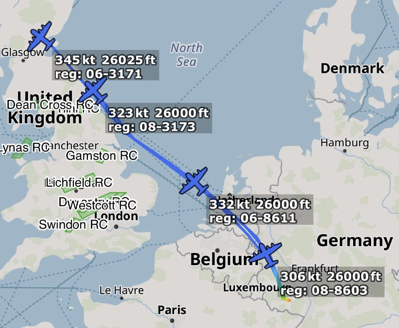
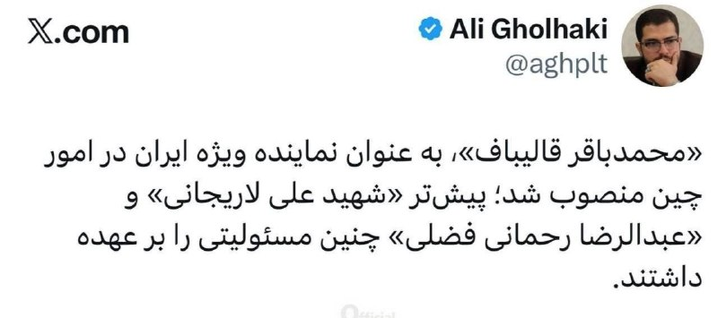
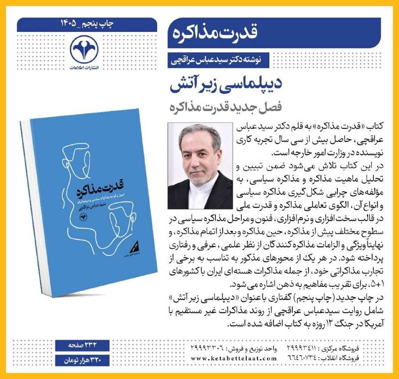
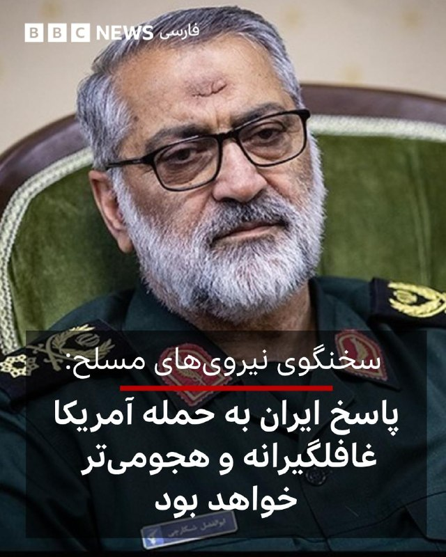

# خواننده تلگرام

<!-- TOP_NAV START -->

<!-- TOP_NAV END -->

<!-- MSG START -->

---
📅 بروزرسانی: 1405/02/27 14:19
---

## VahidOOnLine — post 240606

  

دفتر رسانه‌ای ابوظبی اعلام کرد که در پی حمله پهپادی به محوطه نیروگاه هسته‌ای براکه در الظفره، ژنراتور برق در خارج از محوطه داخلی نیروگاه دچار آتش‌سوزی شده است. این نهاد افزود که این حادثه آسیب جانی نداشته است.
‌🏁 🇬🇧 IranintlTV

🤖 @VahidOOnLine

## VahidOOnLine — post 240605

  

دفتر رسانه‌ای ابوظبی اعلام کرد که در پی حمله پهپادی به محوطه نیروگاه هسته‌ای براکه در الظفره، ژنراتور برق در خارج از محوطه داخلی نیروگاه دچار آتش‌سوزی شده است. این نهاد افزود که این حادثه آسیب جانی نداشته است.
‌🏁 🇬🇧 IranintlTV

🤖 @VahidOOnLine

## VahidOOnLine — post 240604

  

♦️خبرگزاری فارس، نزدیک به سپاه پاسداران، روز یک‌شنبه ۲۷ اردیبهشت گزارش داد که محمدباقر قالیباف، رئیس مجلس شورای اسلامی به عنوان نماینده ویژه ایران در امور چین تعیین شده است.

فارس بدون توضیح دیگری نوشته است:‌ «پیشتر علی لاریجانی و عبدالرضا رحمانی‌ فضلی چنین مسئولیتی را برعهده داشتند.»

اعلام تعیین قالیباف، عضو سابق سپاه پاسداران به عنوان نماینده ویژه در امور چین دو روز پس از دیدار رسمی دونالد ترامپ، رئیس جمهوری آمریکا از کشور چین صورت گرفته است.

دونالد ترامپ، رئیس‌جمهوری آمریکا، روز جمعه اعلام کرد شی جین‌پینگ، رئیس‌جمهوری چین، «قویا» معتقد است که ایران نباید به سلاح هسته‌ای دست پیدا کند. او همچنین افزود که همتای چینی‌اش خواهان بازگشایی تنگه هرمز است.

محمدباقر قالیباف، رئیس مجلس شورای اسلامی پیشتر به عنوان مذاکره کننده ارشد جمهوری اسلامی با آمریکا در مذاکرات پاکستان حاضر شده بود.
‌🇸🇦 Indypersian

🤖 @VahidOOnLine

## VahidOOnLine — post 240603

  

حمیدرضا حاجی‌بابایی، نایب‌رییس مجلس، گفت: «اگر قرار شد نفت ما را بزنند، باید نفت منطقه را بزنیم. چه آن‌که ادعای دوستی می‌کند، چه آن‌که دشمنی می‌کند.»

او گفت: «به نفت ما آسیب برسد، کاری می‌کنیم که آمریکا و تمام جهان تا مدت قابل توجهی از این منطقه نفت به دست نیاورد. اگر انرژی ما را بزنند، باید انرژی منطقه را بزنیم.»
‌🏁 🇬🇧 IranintlTV

🤖 @VahidOOnLine

## VahidOOnLine — post 240602

  

♦️امیر قلعه‌نویی، سرمربی تیم ملی فوتبال ایران روز شنبه ۲۶ اردیبهشت لیست ۳۰ نفره خود برای جام جهانی ۲۰۲۶ را اعلام کرد و گفت: «خدا را گواه می‌گیرم در انتخاب بازیکنان چیزی جز معیارهای فنی موضوع دیگری دخیل نبوده و من تنها بر اساس این معیار ٣٠ بازیکن را انتخاب کردم.»

این درحالیست که در این لیست، نام سردار آزمون،‌ مهاجم شناخته شده ایرانی دیده نمی‌شود. آزمون پس از موضع‌گیری‌های اخیرش در مخالفت با جمهوری اسلامی، ‌از تیم ملی خط خورد.

این اسامی در حالی اعلام شده است که هنوز تکلیف ویزای تیم ملی مشخص نیست.

دروازه‌بان‌ها: علیرضا بیرانوند، حسین حسینی، پیام نیازمند، محمد خلیفه،
مدافعان: احسان حاج صفی، میلاد محمدی، امید نورافکن، شجاع خلیل زاده، علی نعمتی، حسین کنعانی، دانیال ایری، رامین رضاییان، صالح حردانی
هافبک‌ها: سامان قدوس، روزبه چشمی، امیرمحمد رزاق نیا، سعید عزت‌اللهی، محمد قربانی،علیرضا جهانبخش، آریا یوسفی، محمد محبی، مهدی قائدی، مهدی ترابی
مهاجمان: مهدی طارمی، هادی حبیبی‌نژاد، امیرحسین حسین‌زاده، امیرحسین محمودی، دنیس درگاهی، کسری طاهری و علی علیپور
بازیکنان دعوت شده به اردوی تیم ملی در ترکیه هستند.
‌🇸🇦 Indypersian

🤖 @VahidOOnLine

## VahidOOnLine — post 240601

  <a href="telegram/content/VahidOOnLine_240601_1779015000.mp4" target="_blank">🎬 Download video</a>

اعتراض به سانسور، قطعی اینترنت، سرکوب و حبس معترضان در تجمع ایرانیان قبرس جنوبی، شنبه ۲۶ اردیبهشت
‌🏁 🇬🇧 ManotoTV

🤖 @VahidOOnLine

## VahidOOnLine — post 240600

  

♦️خبرگزاری میزان، رسانه قوه قضاییه جمهوری اسلامی، روز یکشنبه ۲۷ اردیبهشت از برگزاری نخستین جلسه دادگاه رسیدگی به اتهامات صادق ساعدی‌نیا، مدیرعامل مجموعه «املاک و صنایع غذایی ساعدی‌نیا» در دادگاه انقلاب قم خبر داد.
بنا بر اعلام قوه قضائیه، ساعدی‌نیا با اتهاماتی از جمله «فعالیت تبلیغی یا رسانه‌ای برخلاف امنیت کشور»، «اقدام عملیاتی در راستای فراخوان‌های گروه‌های معاند برای برهم زدن امنیت کشور» و «فعالیت تبلیغی علیه نظام» به دلیل حمایت از اعتصاب‌ها و اعتراضات دی‌ماه روبه‌رو است.
«انتشار استوری»، «فعالیت در فضای مجازی»، «حضور در تجمعات اعتراضی»، «تعطیل کردن کافه‌ها و مغازه‌ها» و تشویق برخی کارکنانش به حضور در اعتراضات از مصادیق اتهامات مطرح‌شده علیه صادق ساعدی‌نیا عنوان شده است.
‌🇸🇦 Indypersian

🤖 @VahidOOnLine

## WithYashar — post 11471

تایمز: انگلیس برای جنگ آماده می‌شود
 
این رسانه انگلیسی از افزایش بودجه دفاعی انگلیس خبر داد و هدف از آن را آماده شدن برای جنگ های آینده اعلام کرد
@withyashar

## WithYashar — post 11470

مشاور سابق پنتاگون:تحرکات سطح بالای نیروی هوایی آمریکا در خاورمیانه شدت گرفته آماده باشید
@withyashar

## WithYashar — post 11469

دارم میرم یات تولد ، شاید دایرکت ها رو درست نبینم کم اختلال داریم ولی من هستم 😬🙌🏾

## WithYashar — post 11468

سی‌ان‌ان: ایران به کابل‌های اینترنتی تنگه هرمز چشم دوخته
@withyashar

## mwarmonitor — post 9194

🔴فوری | دفتر رسانه‌ای ابوظبی:
این آتش‌سوزی ناشی از هدف قرار گرفتن با یک پهپاد بوده است و هیچ مصدومی نداشته و همچنین هیچ تأثیری بر سطح ایمنی تشعشعات نداشته است.

@mwarmonitor

## mwarmonitor — post 9193

🔴فوری | دفتر رسانه‌ای ابوظبی:
مقامات مربوطه با یک آتش‌سوزی در یک ژنراتور برق که خارج از محدوده نیروگاه هسته‌ای براکه رخ داده بود، برخورد کرده‌اند.

@mwarmonitor

## mwarmonitor — post 9192

هدف قرار دادن نیروگاه هسته‌ای براکه

## mwarmonitor — post 9191

انفجار در امارات

## mwarmonitor — post 9190

🇮🇷اسماعیل بقائی:
دروغ بزرگ بعدی که برای توجیه «جنگِ انتخابی» و غیرقانونی مطرح می‌شود، این ادعاست که آنان «در حال حفظ صلح و ثبات در بازارهای جهانی انرژی» هستند.

🔸در حالی‌که در واقعیت، این جنگ‌افروزیِ بی‌پروای نظام‌های آمریکا و اسرائیل بوده که روندهای دیپلماتیک امیدبخش را نابود کرده و با تجاوز نظامیِ بی‌دلیل علیه ایران، عمداً ناامنی را به مسیرهای حیاتی انرژی تزریق کرده‌اند؛ سپس همان ایران را به بی‌ثبات‌سازی متهم می‌کنند تا گفته بدنام یوزف گوبلز را به اجرا بگذارند:
«دیگران را به همان کاری متهم کن که خودت انجام می‌دهی.»

🔸این همان کتاب قواعد آشنا و ریاکارانه است: بحران و جنگ می‌سازند و سپس زیر پرچم‌های به‌ظاهر شریفِ «بازگرداندن ثبات» و «دفاع از صلح»، بیشتر تشدید می‌کنند.

ویرانی می‌آفرینند و نامش را صلح می‌گذارند.

@mwarmonitor

## mwarmonitor — post 9189

  

USAF نیروی هوایی ایالات متحده امریکا ✈️

لاکهید مارتین C-130J سوپر هرکولس (۴ فروند)
AE29DB 06-3171 – REACH ???
AE29DD 08-3173 – REACH 458
AE18ED 06-8611 – REACH 584
AE220A 08-8603 – REACH ???

✈️🔸چهار فروند C-130J پس از یک مأموریت موقت (TDY) که از ماه مارس آغاز شده بود، در حال حرکت به سمت پایگاه هوایی کفلاویک در جنوب غربی ایسلند هستند. این مأموریت از پایگاه هوایی رامشتاین در آلمان و پایگاه هوایی آویانو در ایتالیا انجام شده است.

@mwarmonitor

## mwarmonitor — post 9188

🇮🇷 رسانه‌های ایرانی:
۵ شرط اصلی در پاسخ واشنگتن به پیشنهاد توافق:

🔹 عدم پرداخت هرگونه غرامت یا خسارت از سوی آمریکا
🔹 خروج و تحویل ۴۰۰ کیلوگرم اورانیوم از ایران به آمریکا
🔹 فعال ماندن تنها یک مجموعه از تأسیسات هسته‌ای ایران
🔹 عدم پرداخت حتی ۲۵ درصد از دارایی‌های مسدودشده ایران
🔹 مشروط کردن آتش‌بس در همه مناطق به مذاکرات

🔹 این گزارش تأکید می‌کند که حتی در صورت پذیرش این شروط از سوی ایران، خطر تجاوز آمریکا و رژیم صهیونیستی همچنان باقی خواهد ماند.

🔹 کارشناسان معتقدند پیشنهاد آمریکا به‌جای حل مشکل، در پی تحقق اهدافی است که ایران نتوانسته در جریان جنگ به آن‌ها دست یابد.

🔹 در مقابل، ایران هرگونه مذاکره را به تحقق پنج شرط پیشینی برای اعتمادسازی مشروط کرده است:

🔹 پایان جنگ در همه جبهه‌ها، به‌ویژه لبنان
🔹 لغو تحریم‌های اعمال‌شده علیه ایران
🔹 آزادسازی دارایی‌های مسدودشده ایران
🔹 جبران خسارات ناشی از جنگ
🔹 به‌رسمیت شناختن حاکمیت ایران بر تنگه هرمز

@mwarmonitor

## mwarmonitor — post 9187

  <a href="telegram/content/mwarmonitor_9187_1779015004.mp4" target="_blank">🎬 Download video</a>

📝 تا حالا به این تناقضِ هالیوودی دقت کردید؟ با جریانی طرفیم که وقایع ۱۴۰۰ سال پیش رو طوری با کیفیت 4K و افکت‌های ویژه بازسازی می‌کنه که انگار کارگردانش همون موقع با پهپاد تو صحنه بوده!

🔸اما بمبِ خنده‌اش اینجاست ، همین پروپاگاندا رسانه‌ای، وقتی به سوژه زنده و حاضرش یعنی «مجتبی» می‌رسه، دستانش خالیِ خالیه. منطق می‌گه اگه چنین مهره‌ای با اون وزن سیاسی واقعاً وجود داشت، تا الان شش فصل سریال نتفلیکسی از پیاده‌روی‌ها و نبوغش رندر کرده بودن.

🔸واقعیت اینه که سیستم این‌ها فقط روی اموات و تاریخِ بی‌سند جواب میده و تو دنیای واقعی کلاً ارور میده! وقتی کل خروجی‌شون از این آدم، خلاصه میشه به یه تعارف ناشیانه و ماست‌مالی‌شده پشت آنتن صداوسیما، یعنی کفگیر واقعیت بدجور به تهِ دیگ خورده. ترجیح میدن سوژه‌شون مثل یه روح نامرئی بمونه، چون می‌دونن دوربین‌های مدرن، فانتزیِ ساختگی‌شون رو یه شبه هوا می‌بره!

@mwarmonitor

## FoxNewsTwitter — post 341829

  <a href="telegram/content/FoxNewsTwitter_341829_1779015006.mp4" target="_blank">🎬 Download video</a>

Fox News (Twitter/X)

"You haven't just met the standard of excellence, you have redefined it for the next generation of American warfighters."

War Secretary Pete Hegseth proudly celebrates the return of more than 4,500 American warriors from the USS Gerald R. Ford Carrier Strike Group after they completed a 326-day deployment overseas, reuniting with loved ones in Virginia.

## pm_afshaa — post 90892

  <a href="telegram/content/pm_afshaa_90892_1779015010.webm" target="_blank">🎬 Download video</a>

🔴سازمان رادیو و تلویزیون اسرائیل:
نتانیاهو عصر امروز نشست امنیتی با توجه به احتمال از سرگیری جنگ با ایران برگزار میکنه.

💧 Rainbet.com the #1 Non-KYC Crypto Casino & Sportsbook @rainbetcom

😁 @Pm_Afshaa

## pm_afshaa — post 90891

🔴دفتر رسانه‌ای ابوظبی از حمله پهپادی و آتش‌سوزی در یک ژنراتور برق در خارج از محدوده داخلی نیروگاه هسته‌ای براکه در منطقه الظفره خبر داد

💧 Rainbet.com the #1 Non-KYC Crypto Casino & Sportsbook @rainbetcom

😁 @Pm_Afshaa

## pm_afshaa — post 90890

🔴مشاور سابق پنتاگون:تحرکات سطح بالای نیروی هوایی آمریکا در خاورمیانه شدت گرفته آماده باشید

💧 Rainbet.com the #1 Non-KYC Crypto Casino & Sportsbook @rainbetcom

😁 @Pm_Afshaa

## pm_afshaa — post 90889

🔴تو اصفهان برای زنای بی حجابی که رفتن خایه مالی و راهپیمایی براشون احضاریه دادگاه ارسال شده

💧 Rainbet.com the #1 Non-KYC Crypto Casino & Sportsbook @rainbetcom

😁 @Pm_Afshaa

## pm_afshaa — post 90888

🔴ونزوئلا : الکس صائب از نزدیکان رئیس جمهور سابق نیکولاس مادورو و رابط حزب الله و سپاه پاسداران جمهوری اسلامی رو دستگیر کردیم و به ایالات متحده تحویل دادیم

💧 Rainbet.com the #1 Non-KYC Crypto Casino & Sportsbook @rainbetcom

😁 @Pm_Afshaa

## mamlekate — post 103547

📞 یه قهوه‌خونه هست هر روز رد میشم شلوغه. خودمم هر چند ماه یکبار دوستی کاری چیزی میگن میریم میشینیم حرف میزنیم. قیمتاش تو تهران خیلی مناسبه و کیفیت بالا و بخاطر همین هم همیشه شلوغ بود. باورت میشه این هفته رفتیم تو هیشکی نبود؟ مطلقا هیچ کس. حتی گرون هم نکرده قیمت همون قبل جنگه. باور نکردنی بود برام چند ساعت نشستیم یه نفر نیومد. هیچ وقت اونجارو اینجوری ندیده بودم.

موقع حساب کردن پرسیدم پس مشتری ها کجان؟ یعنی کرده بود داشت میترکید. میگفت چند وقته که نیستن. هیشکی نیست. نه اینکه پیش من نیان. کلا نیستن. پول نیست.

@mamlekate

## mamlekate — post 103546

📝 رقابت موسیقی یوروویژن ۲۰۲۶؛ «دارا» از بلغارستان به مقام اول رسید

شامگاه شنبه رقابت‌های موسیقی یوروویژن ۲۰۲۶، که امسال در وین برگزار شد، به پایان رسید و «دارا» خواننده زن اهل بلغارستان با آهنگ شاد «بانگارانگا» (Bangaranga)  توانست پیروز این رقابت هنری باشد.

@mamlekate

## kianmeli1 — post 87449

‏🔴دفتر رسانه‌ای ابوظبی از حمله پهپادی و آتش‌سوزی در یک ژنراتور برق در خارج از محدوده داخلی نیروگاه هسته‌ای براکه در منطقه الظفره خبر داد

‏بر اساس این گزارش، این آتش‌سوزی تاثیری بر ایمنی نیروگاه نداشته و همه واحدها به‌طور عادی در حال فعالیت هستند. هیچ فردی نیز مجروح نشده است
https://t.me/kianmeli1

## kianmeli1 — post 87448

  <a href="telegram/content/kianmeli1_87448_1779015011.mp4" target="_blank">🎬 Download video</a>

🔴تحركات سطح بالاي امريكا در خاورميانه

راشاتودی با انتشار فیلمی از ویرانه‌های تل آویو ناشی از اصابت موشک‌های ایرانی، پست داگلاس مک گریگور، از افسران ارشد پنتاگون را نمایش داد: «تحرکات سطح بالای نیروی هوایی ایالات متحده در خاورمیانه. آماده باشید!»
https://t.me/kianmeli1

## kianmeli1 — post 87447

  

🔴تا چند سال پيش با ٣٠ ميليون تومان مي تونستيم ماشين بخريم حالا يه سه چرخه براي نوزاد
https://t.me/kianmeli1

## kianmeli1 — post 87446

  

🔴محمدباقر قالیباف،به عنوان نماینده ویژه ایران در امور چین منصوب شد؛ پیش‌تر علی لاریجانی چنین مسئولیتی را بر عهده داشتند.
https://t.me/kianmeli1

## kianmeli1 — post 87445

  

🔴از چند ساعت گذشته بیش از دوازده فروند هواپیمای ترابری راهبردی C-17A گلوبمستر III نیروی هوایی آمریکا در حال ترک خاورمیانه و حرکت به سمت اروپا هستند.
https://t.me/kianmeli1

## kianmeli1 — post 87444

  

🔴قلهکی: یکی از کشورهای منطقه هشدار شروع جنگ را برای دورماندن از تیررسِ ایران، به تهران منتقل کرده است
https://t.me/kianmeli1

## kianmeli1 — post 87443

  <a href="telegram/content/kianmeli1_87443_1779015015.mp4" target="_blank">🎬 Download video</a>

‏🔴ابطحی:
‏اگر ‌خامنه‌ای دوم انتخاب نمی‌شد جنگ داخلی قطعی بو‌د
https://t.me/kianmeli1

## kianmeli1 — post 87442

  

🔴اولیانوف نماینده دائم روسیه در سازمان‌های بین‌المللی:

به نظر کارشناسان غربی،آمریکا و اسرائیل ممکن است در روزهای آینده، اگه نگوییم ساعت‌های آینده، دوباره حمله نظامی به ایران رو از سر بگیرند. اگه این حرف درسته، یعنی این آمریکا و اسرائیل هنوز از اشتباهات استراتژیک قبلی خود درس نگرفته‌اند.
https://t.me/kianmeli1

## kianmeli1 — post 87441

  <a href="telegram/content/kianmeli1_87441_1779015018.mp4" target="_blank">🎬 Download video</a>

🔴حاجی بابایی، نائب رئیس مجلس

اگر به تاسیسات نفتی ایران حمله شود به تمام تاسیسات نفتی کشورهای دوست و دشمن در منطقه حمله می کنیم.
https://t.me/kianmeli1

## IranIntlTV — post 337604

  <a href="telegram/content/IranIntlTV_337604_1779015020.mp4" target="_blank">🎬 Download video</a>

اقتصادنیوز گزارش داد اینترنت پرو برای بسیاری از کاربران کارآمد نبوده است. بر اساس این گزارش، کاربران با پرداخت حدود دو میلیون تومان تنها ۵۰ گیگابایت اینترنت دریافت می‌کنند.

گفت‌وگو با سحر تحویلی، پژوهشگر در حوزه فناوری اطلاعات و هوش مصنوعی
@iranintltv

## IranIntlTV — post 337603

  <a href="telegram/content/IranIntlTV_337603_1779015023.mp4" target="_blank">🎬 Download video</a>

سرخط خبرهای یکشنبه ۲۷ اردیبهشت
@iranintltv

## IranIntlTV — post 337602

  <a href="telegram/content/IranIntlTV_337602_1779015025.mp4" target="_blank">🎬 Download video</a>

سرخط خبرهای یکشنبه ۲۷ اردیبهشت
@iranintltv

## IranIntlTV — post 337601

  

دفتر رسانه‌ای ابوظبی اعلام کرد که در پی حمله پهپادی به محوطه نیروگاه هسته‌ای براکه در الظفره، ژنراتور برق در خارج از محوطه داخلی نیروگاه دچار آتش‌سوزی شده است. این نهاد افزود که این حادثه آسیب جانی نداشته است.
https://iranintl.com/202605173331

## IranIntlTV — post 337600

  

دفتر رسانه‌ای ابوظبی اعلام کرد که در پی حمله پهپادی به محوطه نیروگاه هسته‌ای براکه در الظفره، ژنراتور برق در خارج از محوطه داخلی نیروگاه دچار آتش‌سوزی شده است. این نهاد افزود که این حادثه آسیب جانی نداشته است.
https://iranintl.com/202605173331

## IranIntlTV — post 337599

  <a href="telegram/content/IranIntlTV_337599_1779015028.mp4" target="_blank">🎬 Download video</a>

امیر قلعه‌نویی، سرمربی تیم فوتبال ایران، فهرست ۳۰ نفره اعزامی به جام جهانی ۲۰۲۶ آمریکا را اعلام کرد. در این فهرست نام سردار آزمون دیده نمی‌شود. اگرچه قلعه‌نویی تاکید کرده سردار آزمون به دلایل فنی از لیست کنار گذاشته شده است، اما پیش‌تر او به‌دلیل انتشار عکسی با حاکم دبی، از اردوهای تیم ملی کنار گذاشته شده و گزارش‌هایی از مصادره اموالش منتشر شده بود.
گفت‌وگو با کوروش بازیار، مربی فوتبال
@iranintltv

## IranIntlTV — post 337598

  

حمیدرضا حاجی‌بابایی، نایب‌رییس مجلس، گفت: «اگر قرار شد نفت ما را بزنند، باید نفت منطقه را بزنیم. چه آن‌که ادعای دوستی می‌کند، چه آن‌که دشمنی می‌کند.»

او گفت: «به نفت ما آسیب برسد، کاری می‌کنیم که آمریکا و تمام جهان تا مدت قابل توجهی از این منطقه نفت به دست نیاورد. اگر انرژی ما را بزنند، باید انرژی منطقه را بزنیم.»
https://iranintl.com/202605170342

## IranIntlTV — post 337597

  <a href="telegram/content/IranIntlTV_337597_1779015031.mp4" target="_blank">🎬 Download video</a>

تصاویر ارسالی به ایران‌اینترنشنال، از کمبود بنزین و اعمال محدودیت در برخی جایگاه‌های سوخت با هدف «مقابله با قاچاق» خبر می‌دهد. یک شهروند از بندرعباس می‌گوید بیش از چهار ساعت در صف بنزین منتظر بوده است.
جزییات بیشتر با مهدی تاجیک، عضو تحریریه ایران‌اینترنشنال
@iranintltv

## IranIntlTV — post 337596

  <a href="telegram/content/IranIntlTV_337596_1779015033.mp4" target="_blank">🎬 Download video</a>

یک شهروند با ارسال پیام به ایران‌اینترنشنال می‌گوید: «نان سنگک ساده شده ۱۷ هزار تومان، کنجدی هم شده ۲۵ هزار تومان. نانوایی‌ها ترفندی زده‌اند؛ نان بزرگ‌تری را با کنجد زیاد درست کرده و ۸۰ هزار تومان می‌فروشند. کسانی که حوصله صف ندارند، مجبورند همان نان گران را بخرند.»
پیام این شهروند با هوش مصنوعی بازخوانی شده است.

## Shin_Persian — post 6045

مكتب أبوظبي الإعلامي @ADMediaOffice
Sun, 17 May 2026 10:08:11 UTC

Authorities in Abu Dhabi responded to a fire incident that broke out in an electrical generator outside the inner perimeter of the Barakah Nuclear Power Plant in the Al Dhafra Region, caused by a drone strike. No injuries were reported, and there was no impact on radiological safety levels.

All precautionary measures have been taken, and further updates will be provided as they become available.

The Federal Authority for Nuclear Regulation (FANR) confirmed that the fire did not affect the safety of the power plant or the readiness of its essential systems, and that all units are operating as normal.

The public is reminded to obtain information from official sources only, and to avoid spreading rumours or unverified information.

فارسی

مقامات در ابوظبی به حادثه آتش‌سوزی در یک ژنراتور برق در خارج از محیط داخلی نیروگاه هسته‌ای برکه در منطقه الظفره که در پی یک حمله پهپادی رخ داد، رسیدگی کردند. هیچ گزارشی مبنی بر مصدومیت منتشر نشده است و این حادثه هیچ تأثیری بر سطح ایمنی رادیولوژیک نداشته است.

تمامی اقدامات پیشگیرانه اتخاذ شده است و به‌روزرسانی‌های تکمیلی به محض دردسترس بودن ارائه خواهد شد.

سازمان فدرال نظارت هسته‌ای (FANR) تأیید کرد که این آتش‌سوزی تأثیری بر ایمنی نیروگاه یا آمادگی سیستم‌های حیاتی آن نداشته و تمامی واحدها به صورت عادی در حال فعالیت هستند.

به عموم مردم یادآوری می‌شود که اطلاعات را تنها از منابع رسمی دریافت کرده و از انتشار شایعات یا اطلاعات تأیید نشده خودداری کنند.

𝕏 · @shin_persian

## ManotoTV — post 105551

  <a href="telegram/content/ManotoTV_105551_1779015035.mp4" target="_blank">🎬 Download video</a>

اعتراض به سانسور، قطعی اینترنت، سرکوب و حبس معترضان در تجمع ایرانیان قبرس جنوبی، شنبه ۲۶ اردیبهشت

## FarsiVOA — post 217956

  

شرکت اطلاعات کالا، کپلر، از عبور غیرمعمول یک سوپر نفتکش ایرانی با دو میلیون بشکه محموله نفتی از تنگه لومبوک برای رسیدن به چین خبر داده است.

این گزارش می‌افزاید نفتکش «هیوج» شرکت ملی نفت ایران اوایل ماه جاری سیستم شناسایی خودکار را خاموش کرده بود و اکنون ظاهراً برای دور زدن خطرات فزاینده ناشی از تشدید نظارت و اجرای تحریم‌ها در تنگه مالاکا، از تنگه لومبوک عبور کرده و احتمالاً به هنگ‌کنگ خواهد رفت.

کپلر می‌گوید نخستین بار نیز نفتکش «دریا» اخیراً برای گریز از نظارت‌های تحریمی، به‌جای مسیر سنتی تنگه مالاکا، از تنگه لومبوک عبور کرده بود.
@FarsiVOA

## FarsiVOA — post 217955

🔺قالیباف نماینده ویژه جمهوری اسلامی در امور چین شد

▪️رسانه‌های داخلی در ایران گزارش دادند که محمدباقر قالیباف رئیس مجلس شورای اسلامی، به عنوان نماینده ویژه جمهوری اسلامی در امور چین منصوب شده است.

▪️پیشتر و از خرداد ۱۴۰۴، عبدالرضا رحمانی فضلی، سفیر کنونی جمهوری اسلامی در پکن، در حکمی که به امضای پزشکیان رسیده بود، «نماینده ویژه رئیس‌جمهور و تام‌الاختیار ایران در چین» بود.

▪️قبل از آن نیز، علی لاریجانی به عنوان «نماینده ویژه رهبر جمهوری اسلامی در امور چین» فعال بود. لاریجانی در جریان جنگ اخیر کشته شد.

▪️قالیباف که تاکنون رسماً سمت دیپلماتیکی نداشته، پیشتر به عنوان رئیس هیئت مذاکره‌کننده جمهوری اسلامی در مذاکرات با آمریکا در اسلام‌آباد شرکت کرد.

⬇️ بیشتر بخوانید:
https://ir.voanews.com/a/8150871.html

## FarsiVOA — post 217954

🔺سی‌ان‌ان: جمهوری اسلامی چشم به کابل‌های اینترنت تنگه هرمز دوخته است

▪️سی‌ان‌ان گزارش داد جمهوری اسلامی، پس از استفاده از تنگه هرمز به‌عنوان اهرم فشار در حوزه انرژی و کشتیرانی، حالا به سراغ یکی از شریان‌های پنهان اقتصاد جهانی رفته است: کابل‌های اینترنت زیردریایی که از زیر خلیج فارس و تنگه هرمز عبور می‌کنند و حجم بزرگی از ترافیک داده، ارتباطات مالی و اتصال دیجیتال میان اروپا، آسیا و کشورهای خلیج فارس را منتقل می‌کنند.

▪️بر اساس این گزارش، جمهوری اسلامی می‌خواهد از بزرگ‌ترین شرکت‌های فناوری جهان برای استفاده از کابل‌های اینترنتی زیر تنگه هرمز پول بگیرد.

▪️کابل‌های عبوری از تنگه هرمز در سال ۲۰۲۵ کمتر از یک درصد پهنای باند بین‌المللی جهان را تشکیل می‌دادند.

⬇️ بیشتر بخوانید:
https://ir.voanews.com/a/8150870.html

## FarsiVOA — post 217953

  <a href="telegram/content/FarsiVOA_217953_1779015039.mp4" target="_blank">🎬 Download video</a>

جشن بزرگ موسیقی اروپا که به آن مسابقه یوروویژن گفته می‌شود، امسال در پایتخت اتریش، وین، برگزار شد.

نوعام بیتان که نماینده اسرائیل در مسابقات آواز یوروویژن امسال بود، برنده مقام دوم شد. صفحه رسمی وزارت امور خارجه اسرائیل به فارسی در ایکس، ضمن تبریک به او، از ایرانیان حامی نوعام نیز تشکر کرد و نوشت: «سپاس از حمایت شما ایرانیان دوست‌داشتنی».

دارا، خواننده بلغار مقام اول را کسب کرد. دور بعدی این مسابقات به میزبانی بلغارستان برگزار خواهد شد.
@FarsiVOA

## DW_Farsi — post 124790

🔶 اعلام وضعیت اضطراری بین‌المللی در پی شیوع بیماری ابولا

سازمان جهانی بهداشت (WHO) به دلیل شیوع بیماری ابولا در جمهوری دموکراتیک کنگو و اوگاندا، "وضعیت اضطراری بهداشت عمومی با اهمیت بین‌المللی" اعلام کرده است. این نهاد وابسته به سازمان ملل متحد در ژنو، با این اقدام قصد دارد از جمله کشورهای همسایه را در وضعیت هشدار بالا قرار داده و حمایت‌های جامعه بین‌المللی را بسیج کند. با این حال، سازمان جهانی بهداشت تصریح کرد که این یک "هشدار همه‌گیری جهانی" (پاندمی) نیست.

گزارش شده است که تاکنون ۸ مورد تاییدشده و ۲۴۶ مورد مشکوک به این بیماری تب‌دار و خطرناک در استان "ایتوری" در شمال شرقی کنگو شناسایی شده است. علاوه بر این، یک مورد ابتلا نیز در شهر "کینشاسا"، پایتخت کنگو که فاصله زیادی با کانون بیماری دارد، تایید شده است. همچنین دو فرد مبتلا از کنگو به اوگاندا سفر کرده‌اند. سازمان جهانی بهداشت از مرگ ۸۰ فرد مشکوک به ابولا در استان ایتوری تا این لحظه خبر داده است.

@dw_farsi

## Persian_Trend_Official — post 14320

  

🔴انفجار در امارات 💢منابع عربی اعلام کردند که انفجارهایی خیابان فاطمه بنت مبارک در ابوظبی را لرزاند. 🫆:Tony 📌 @persian_trend_official پرشین ترند | متفاوت‌ترین کانال نظامی

## Persian_Trend_Official — post 14319

  <a href="telegram/content/Persian_Trend_Official_14319_1779015043.webm" target="_blank">🎬 Download video</a>

🔴انفجار در امارات

💢منابع عربی اعلام کردند که انفجارهایی خیابان فاطمه بنت مبارک در ابوظبی را لرزاند.

🫆:Tony

📌 @persian_trend_official
پرشین ترند | متفاوت‌ترین کانال نظامی

## Persian_Trend_Official — post 14318

  

بقائی: آمریکا و اسرائیل خود عامل بی‌ثباتی در بازار انرژی هستند

اسماعیل بقائی، سخنگوی وزارت خارجه، ادعاهای آمریکا و اسرائیل درباره «حفظ ثبات بازار جهانی انرژی» را رد کرد و آن را «دروغی بزرگ» توصیف کرد.

بقائی گفت:

▪️ جنگی که آمریکا و اسرائیل آغاز کردند، روند دیپلماسی را نابود کرد
▪️ حمله نظامی به ایران باعث ناامنی در مسیرهای حیاتی انرژی شد
▪️ سپس ایران را به بی‌ثبات‌سازی متهم کردند

او با اشاره به آنچه «تاکتیک تبلیغاتی گوبلز» خواند، افزود:

▪️ «دیگران را به همان کاری متهم می‌کنند که خودشان انجام می‌دهند»

سخنگوی وزارت خارجه همچنین تأکید کرد:

▪️ آمریکا و اسرائیل ابتدا بحران و جنگ ایجاد می‌کنند
▪️ سپس با شعار «بازگرداندن ثبات» و «دفاع از صلح» به تشدید درگیری‌ها ادامه می‌دهند

بقائی در پایان گفت:

▪️ «آن‌ها ویرانی ایجاد می‌کنند و نامش را صلح می‌گذارند»

🫆:Tony

📌 @persian_trend_official
پرشین ترند | متفاوت‌ترین کانال نظامی

## Persian_Trend_Official — post 14317

  

📌انتشار چاپ پنجم کتاب «قدرت مذاکره» همراه با فصل جدید «دیپلماسی زیر آتش» 🔹کتاب قدرت مذاکره به قلم دکتر سید عباس عراقچی حاصل بیش از سی سال تجربه کاری نویسنده در وزارت امور خارجه است. 🔹در این کتاب تلاش میشود ضمن تبیین و تحلیل ماهیت مذاکره و مذاکره سیاسی،…

## Persian_Trend_Official — post 14316

🔴 رسانه‌های ایرانی جزئیات پاسخ واشینگتن به پیشنهاد توافق را منتشر کردند

رسانه‌های ایرانی مدعی شدند پاسخ آمریکا به پیشنهاد توافق با ایران شامل ۵ شرط اصلی بوده است:

▪️ آمریکا هیچ‌گونه غرامت یا خسارتی پرداخت نخواهد کرد

▪️ ۴۰۰ کیلوگرم اورانیوم از ایران خارج و به آمریکا تحویل داده شود

▪️ فقط یک مجموعه از تأسیسات هسته‌ای ایران فعال باقی بماند

▪️ حتی ۲۵ درصد از دارایی‌های بلوکه‌شده ایران نیز آزاد نخواهد شد
▪️ آتش‌بس در همه جبهه‌ها به روند مذاکرات گره بخورد

در این گزارش آمده است:

▪️ حتی در صورت پذیرش این شروط از سوی ایران، خطر حمله آمریکا و اسرائیل همچنان باقی خواهد ماند
▪️ برخی تحلیلگران ایرانی معتقدند واشینگتن به‌دنبال تحقق اهدافی است که در جنگ به آن نرسیده است

در مقابل، گزارش‌ها می‌گویند ایران نیز ۵ پیش‌شرط برای آغاز مذاکرات مطرح کرده است:

▪️ پایان جنگ در تمامی جبهه‌ها، به‌ویژه لبنان

▪️ رفع تحریم‌های ایران

▪️ آزادسازی دارایی‌های بلوکه‌شده ایران

▪️ پرداخت غرامت خسارات جنگ

▪️ به‌رسمیت شناختن حاکمیت ایران بر تنگه هرمز

تاکنون هیچ‌یک از این جزئیات به‌صورت رسمی از سوی تهران یا واشینگتن تأیید نشده‌اند.

🫆:Tony

📌 @persian_trend_official
پرشین ترند | متفاوت‌ترین کانال نظامی

## RadioFarda — post 157285

  

🔸رسانه‌های حکومتی در ایران روز یک‌شنبه ۲۷ اردیبهشت از برگزاری دادگاه صادق ساعدی‌نیا، مدیرعامل شرکت صنعت غذایی و مدیر کافه‌های زنجیره‌ای ساعدی‌نیا خبر دادند.

🔸آقای ساعدی‌نیا در پی اعتراضات دی‌ماه سال گذشته که در روزهای ۱۸ و ۱۹ دی به کشتار گسترده معترضان ختم شد بازداشت و به تحریک مردم برای شرکت در این اعتراضات متهم شد.

🔸نماینده دادستان در این دادگاه ساعدی‌نیا را به «فعالیت تبلیغی یا رسانه‌ای برخلاف امنیت کشور، اقدام عملیاتی برای گروه‌های معاند نظام و در راستای فراخوان‌های منتشر شده توسط این گروه‌ها، جهت برهم زدن امنیت و برخلاف امنیت کشور و فعالیت تبلیغی علیه نظام» متهم کرد.

🔸او در دفاع از خود گفته است:‌ «من هیچ یک از کارکنانم را برای شرکت در اغتشاشات ترغیب نکردم، از کرده خود پشیمانم و از دادگاه می‌خواهم به من فرصتی برای جبران بدهد.»

@RadioFarda

## IranianMinds — post 20274

🔴 دوباره به امارات حمله ی پهپادی کردن @IranianMinds

## IranianMinds — post 20273

  

🔴 دوباره به امارات حمله ی پهپادی کردن

@IranianMinds

## IranianMinds — post 20272

  

🔴 ونزوئلا :

الکس صائب از نزدیکان رئیس جمهور سابق نیکولاس مادورو و رابط حزب الله و سپاه پاسداران جمهوری اسلامی رو دستگیر کردیم و به ایالات متحده تحویل دادیم !

@IranianMinds

## BBCPersian — post 281293

🔻سازمان مدیریت بحران تهران: ۵۱ هزار واحد در جریان جنگ در پایتخت آسیب دیدند

🔻رئیس سازمان پیشگیری و مدیریت بحران تهران اعلام کرد در جریان جنگ «۵۱ هزار واحد» آسیب‌دیده در پایتخت شناسایی شده است.

علی نصیری گفت که از این تعداد، «۶۹۱ واحد نیاز به مقاوم‌سازی دارند و ۱۷۹۱ واحد نیز باید به‌طور کامل تخریب و نوسازی شوند.»

او افزود ارزیابی میزان خسارت‌ها توسط کارشناسان رسمی دادگستری انجام می‌شود و در مواردی که خسارت تا سقف ۵۰۰ میلیون تومان باشد، کارت‌های الکترونیکی از سوی بانک شهر به مالکان پرداخت خواهد شد.

به گفته آقای نصیری، در خسارت‌های بالاتر از این رقم نیز شهرداری‌های مناطق موظف‌ هستند از طریق پیمانکار، عملیات بازسازی را به‌صورت مستقیم اجرا کنند.

او همچنین اعلام کرد بیش از «۱۲ هزار خودرو و موتورسیکلت» هم در جریان جنگ دچار آسیب شده‌اند.

https://bbc.in/43egGtC
@BBCPersian

## BBCPersian — post 281292

🔻امارات از حمله پهپادی و آتش‌سوزی در بیرون نیروگاه هسته‌ایش خبر داد

🔻مقام‌های ابوظبی می‌گویند آتش‌سوزی ناشی از حمله یک پهپاد به یک ژنراتور برق در بیرون محدوده نیروگاه هسته‌ای براکه کنترل شده است.

دفتر رسانه‌ای ابوظبی گفت در این حادثه کسی آسیب ندیده است و سطح ایمنی پرتوهای رادیواکتور نیز تغییری نکرده است.

سازمان تنظیم مقررات هسته‌ای امارات هم با تایید این خبر اعلام کرد که نیروگاه به کار عادی خود ادامه می‌دهد.

نیروگاه هسته‌ای براکه در منطقه ظفره امارات اولین نیروگاه هسته‌ای در جهان عرب است و از چهار رآکتور تشکیل شده است.

ایران امارات را در حملات آمریکا و اسرائیل شریک فعال می‌داند.

https://bbc.in/4wBwOTv
@BBCPersian

## BBCPersian — post 281291

  

🔻سخنگوی نیروی‌های مسلح ایران درباره ازسرگیری حملات آمریکا گفت که پاسخ ایران این بار «هجومی‌تر» و «غافلگیرکننده» خواهد بود.
ابوالفضل شکارچی گفت: «تکرار هرگونه حماقت برای جبران بی‌آبرویی آمریکا در جنگ تحمیلی سوم علیه ایران، پیامدی جز دریافت ضربات کوبنده‌تر و شدیدتر برای آن کشور به‌دنبال نخواهد داشت.»
او تهدید کرد که «در صورت عملی شدن تهدیدها»، پاسخ ایران «هجومی، غافلگیرکننده و طوفانی» خواهد بود.
ساعاتی پیش دونالد ترامپ در شبکه اجتماعی تروث سوشال تصویر گرافیکی از خود در کنار یک فرمانده نظامی آمریکا منتشر کرد و نوشت: «آرامش پیش از طوفان»
در دو روز گذشته برخی رسانه‌های آمریکا و اسرائیل از قریب‌الوقوع بودن حملات به ایران خبر داده‌اند.

📸Erfan Kouchari/Tasnim
https://bbc.in/4dw4TMb
@BBCPersian

## BBCPersian — post 281290

🔻گزارش‌هایی از رد و بدل پیام و شروط ایران و آمریکا برای از سرگیری مذاکرات

🔻خبرگزاری فارس می‌گوید که آمریکا در پاسخ به پیشنهاد ایران پنج شرط تعیین کرده است. به گزارش این خبرگزاری که به نهادهای نظامی و امنیتی نزدیک است این پنج شرط عبارتند از:

-نپرداختن غرامت جنگی به ایران
-تحویل اورانیوم غنی‌شده
-حفظ تنها یک مرکز هسته‌ای
-نپراختن حتی ۲۵ درصد از دارایی‌های بلوکه شده ایران
-توقف جنگ در همه جبهه‌ها مشروط به مذاکرات خواهد بود

فارس نوشت «حتی در صورت تحقق این شرایط از سوی ایران، تهدید» حمله آمریکا و اسرائیل «همچنان پابرجا خواهد بود.»

فارس همچنین شروط پنج گانه ایران را چنین عنوان کرد:

-پایان جنگ در همه جبهه‌ها به‌ویژه لبنان
-رفع تحریم‌ها
-آزادسازی پول‌های بلوکه‌شده ایران
-جبران خسارات جنگ
-پذیرش حق حاکمیت ایران بر تنگه هرمز

در همین حال برخی رسانه‌های ایران گزارش دادند که تهران «بعد از دریافت مجموعه‌ای از پیشنهادهای طرف آمریکایی از سوی میانجی پاکستانی، شب گذشته دیدگاه‌های خود را به طرف پاکستانی منعکس کرده است.»

این گزارش‌های یک روز پس از سفر محسن نقوی، وزیر کشور پاکستان، به تهران منتشر می‌شود. گفته شد سفر او به تهران برای انتقال پیام بوده است.

https://bbc.in/4ukgfKi
@BBCPersian

## BBCPersian — post 281289

🔻سخنگوی نیروی‌های مسلح: پاسخ ایران به حمله آمریکا غافلگیرانه و هجومی‌تر خواهد بود

🔻سخنگوی نیروی‌های مسلح ایران درباره ازسرگیری حملات آمریکا گفت که پاسخ ایران این بار «هجومی‌تر» و «غافلگیرکننده» خواهد بود.

ابوالفضل شکارچی گفت: «تکرار هرگونه حماقت برای جبران بی‌آبرویی آمریکا در جنگ تحمیلی سوم علیه ایران، پیامدی جز دریافت ضربات کوبنده‌تر و شدیدتر برای آن کشور به‌دنبال نخواهد داشت.»

او تهدید کرد که «در صورت عملی شدن تهدیدها»، پاسخ ایران «هجومی، غافلگیرکننده و طوفانی» خواهد بود.

ساعاتی پیش دونالد ترامپ در شبکه اجتماعی تروث سوشال تصویر گرافیکی از خود در کنار یک فرمانده نظامی آمریکا منتشر کرد و نوشت: «آرامش پیش از طوفان»

در دو روز گذشته برخی رسانه‌های آمریکا و اسرائیل از قریب‌الوقوع بودن حملات به ایران خبر داده‌اند.

https://bbc.in/4drWKIr
@BBCPersian

## BBCPersian — post 281288

  

🔻خبرگزاری تسنیم می‌گوید که محمد باقر قالیباف با پیشنهاد رئیس‌جمهور و تایید رهبر جمهوری اسلامی «نماینده ویژه ایران در امور چین» شده است.

این خبرگزاری که به نهادهای نظامی و امنیتی نزدیک است نوشت رئیس مجلس «هماهنگ‌کننده بخش‌های مختلف این کشور در ارتباط با چین» خواهد بود و سطح اختیارات آقای قالیباف با نمایندگان قبلی در امور چین «متفاوت» است.

بنابر این گزارش‌، پیش از این علی لاریجانی به عنوان نماینده ویژه رهبر ایران و عبدالرضا رحمانی فضلی به عنوان نماینده رئیس‌جمهور در امور‌ چین فعالیت می‌کردند.

آقای لاریجانی از طرف آیت‌الله علی خامنه‌ای نقش ویژه‌ای «در مدیریت قرارداد راهبری» ایران و چین به عهده داشت.

سال گذشته مسعود پزشکیان حسن رحمانی فضلی، سفیر ایران در پکن را همزمان به‌عنوان نماینده ویژه رئیس جمهور و تام‌الاختیار جمهوری اسلامی در چین منصوب کرد.

علی لاریجانی، دبیر شورای عالی امنیت ملی، در ۱۷ مارس (۲۶ اسفند) در حملات آمریکا و اسرائیل به ایران کشته شد.

📸Morteza Nikoubazl/NurPhoto via Getty Images
https://bbc.in/3PHjWut
@BBCPersian

## Dirty_Kids — post 389603

  <a href="telegram/content/Dirty_Kids_389603_1779015049.mp4" target="_blank">🎬 Download video</a>

یه مشت پیرزن پیرمرد چروک گوزو و بچه‌ چاقال مسجدی جمع کردن توی مساجد،یکی یه آرپی‌جی و کلاش دادن دستشون که یعنی آموزش ببینند،واسه چی؟مثلآ جنگ با آمریکا و اسرائیل، آخه احمقا با این سیرک شماها جنگجو شدید؟خیر
رژیم روزای آخر بد به دریوزگی افتاده

@Dirty_Kids 👻

## Dirty_Kids — post 389602

  <a href="telegram/content/Dirty_Kids_389602_1779015051.mp4" target="_blank">🎬 Download video</a>

جان تراولتای هفتاد و دو ساله یا اکسیر جوونی رو پیدا کرده یا کار دکترش خیلی درسته، ولی چیزی که خیلی جالبه اکت و تیز بودنشه، حرکاتش یه جوریه انگار چهل سالشه.

@Dirty_Kids 👻

## Dirty_Kids — post 389601

  

🌪وقتی اینترنت طوفانیه... کافیه بادبان ها رو بکشی تا

⚫️با بالاترین کیفیت ممکن
⚡️ 

⚫️100 هزار تومان شارژ هدیه 
🎁

⚫️پایین ترین قیمت گیگی 250
🌐 

⚫️و ارائه پورسانت %10 در ازای هر معرفی
💼

بتونی یه اتصال پایدار با پشتیبانی 24 ساعته داشته باشی
🚀

بادبان راهتو باز می‌کنه
⛵️

R27

🛡@BadBan_VPN | کانال 

🤖@BadBan_VPNBot | ربات 

📞@BadBan_VPNSupport | پشتیبانی

## Hranews — post 112984

امروز یکشنبه ۲۷ اردیبهشت‌ماه، شماری از بازنشستگان تامین اجتماعی در مقابل ساختمان این سازمان در شوش دست به #تجمع اعتراضی زدند.

این تجمع در اعتراض به تاخیر بیش از دو ماهه در افزایش حقوق سالانه موضوع ماده ۹۶، بی‌تفاوتی نسبت به تعیین و ابلاغ حق مسکن و همچنین عدم اجرای قانون الزام در بخش درمان صورت گرفته است.

↘️
@hranews_bot تماس ✉️ -  @Hranews  کانال هرانا 🆑

## Hranews — post 112983

  

رئیس دانشکده علوم اجتماعی، ارتباطات و رسانه، نسبت به پیامدهای اجرای طرح «#اینترنت_پرو» هشدار داد و آن را عاملی در جهت تشدید #شکاف_اجتماعی دانست. وی در گفت‌وگو با ایسنا، با انتقاد از نحوه اجرای این طرح، اعلام کرد که شکل فعلی آن بدون شفاف‌سازی، به نمادی از تبعیض، رانت و بی‌عدالتی تبدیل شده و می‌تواند اعتماد عمومی و سرمایه اجتماعی را تضعیف کند.

اکبر نصراللهی اعلام کرد که تداوم محدودیت‌های اینترنتی در حالی که دسترسی مشابه در قبال پرداخت هزینه برای برخی افراد فراهم است، نوعی تناقض در سیاست‌گذاری محسوب می‌شود که در صورت عدم تبیین، می‌تواند به افزایش نارضایتی عمومی و تضعیف انسجام اجتماعی منجر شود. وی همچنین تاکید کرد که اینترنت به عنوان بخشی از زیرساخت حیاتی کشور، نقش مهمی در حوزه‌هایی چون آموزش، سلامت و اقتصاد دارد و تداوم محدودیت‌ها آثار گسترده‌ای بر زندگی روزمره شهروندان خواهد داشت.

↘️
@hranews_bot تماس ✉️ -  @Hranews  کانال هرانا 🆑

## Hranews — post 112982

اردبیل؛ یک محیط‌بان در پی درگیری با متخلف محیط زیستی مجروح شد

❗️
❗️
❗️
❗️
❗️ – یک #محیط_بان در منطقه حفاظت شده نئور استان اردبیل در جریان درگیری با یک صیاد متخلف زخمی شد.

ادامه مطلب

↘️
@hranews_bot تماس ✉️ -  @Hranews  کانال هرانا 🆑

## Hranews — post 112981

اعتراضات ۱۴۰۴؛ جلسه دادگاه رسیدگی به اتهامات صادق ساعدی‌نیا برگزار شد

❗️
❗️
❗️
❗️
❗️ – مرکز رسانه قوه قضاییه از برگزاری جلسه دادگاه رسیدگی به اتهامات صادق ساعدی‌نیا، یکی از بازداشت شدگان مرتبط با اعتراضات سراسری ۱۴۰۴، در دادگاه انقلاب قم خبر داد.

ادامه مطلب

#صادق_ساعدی‌نیا

↘️
@hranews_bot تماس ✉️ -  @Hranews  کانال هرانا 🆑

## manototv — post 105551

  <a href="telegram/content/manototv_105551_1779015054.mp4" target="_blank">🎬 Download video</a>

اعتراض به سانسور، قطعی اینترنت، سرکوب و حبس معترضان در تجمع ایرانیان قبرس جنوبی، شنبه ۲۶ اردیبهشت

## alonews — post 120575

  <a href="telegram/content/alonews_120575_1779015057.webm" target="_blank">🎬 Download video</a>

👈روزنامه Dawn پاکستان به نقل از منابع دیپلماتیک در اسلام‌آباد: سفر اعلام‌نشده وزیر کشور پاکستان به تهران در چارچوب دیپلماسی مستمر اسلام‌آباد برای احیای روند متوقف‌شده صلح میان آمریکا و ایران انجام می‌شود.

🔴این سفر برنامه‌ریزی‌نشده با هدف جلوگیری از فروپاشی کامل مذاکرات صورت گرفته؛ به‌ویژه پس از آنکه شتاب حاصل از دورهای پیشین گفت‌وگوها در پایتخت پاکستان به‌شدت کاهش یافته است.

🔴انتظار می‌رود وزیر کشور پاکستان، در جریان این سفر با مقام‌های ارشد ایرانی دیدار و گفت‌وگو کند.

✅ @AloNews خبر جنگ

## alonews — post 120574

  <a href="telegram/content/alonews_120574_1779015057.webm" target="_blank">🎬 Download video</a>

👈رئیس‌جمهور در شبکه اجتماعی ایکس نوشت: ‏در روزهای جنگ، فرزندان ما در ارتباطات و فناوری اطلاعات، شبانه‌روز ایستادند تا ارتباطات و خدمات حیاتی کشور پایدار بماند. دسترسی باکیفیت و پایدار مردم به خدمات دیجیتال، بخشی از آرامش، پیشرفت و حق زندگی شایسته مردم عزیز ایران است.

🔴روز جهانی ارتباطات را تبریک می‌گویم.

✅ @AloNews خبر جنگ

## alonews — post 120573

👈اقتصاد اسرائیل در سه ماهه اول سال ۲۰۲۶ به دلیل جنگ با ایران ۳.۳٪ کوچک شد، طبق گزارش کانال ۱۲ اسرائیل

✅ @AloNews خبر جنگ

## alonews — post 120572

  <a href="telegram/content/alonews_120572_1779015057.webm" target="_blank">🎬 Download video</a>

👈گزارش سی ان ان از کابل هایی که زیر تنگه هرمز خوابیده!

🔴 مدیر تحقیقات شرکت تحقیقاتی TeleGeography، گفت که دو مورد از این کابل‌ها، فالکون و گلف بریج اینترنشنال (GBI)، از آب‌های سرزمینی ایران عبور می‌کنند. این شرکت اعلام کرده:کابل‌هایی که از تنگه هرمز عبور می‌کنند، تا سال 2025 کمتر از 1 درصد از پهنای باند بین‌المللی جهانی را تشکیل می‌دهند."

✅ @AloNews خبر جنگ

## alonews — post 120571

  <a href="telegram/content/alonews_120571_1779015058.webm" target="_blank">🎬 Download video</a>

👈دفتر رسانه ای ابوظبی : یه پهپاد نیروگاه هسته ای برکه تو منطقه الظفره رو هدف قرار داد 
✅ @AloNews خبر جنگ

## alonews — post 120570

  <a href="telegram/content/alonews_120570_1779015058.webm" target="_blank">🎬 Download video</a>

👈امارات اعلام کرد: آتش‌سوزی ناشی از حمله پهپادی به یک ژنراتور برق در نزدیکی تاسیسات هسته‌ای براکه

✅ @AloNews خبر جنگ

## alonews — post 120569

  <a href="telegram/content/alonews_120569_1779015058.webm" target="_blank">🎬 Download video</a>

🔴جلیلی سوم!

🔴پس از سعید جلیلی در سیاست خارجی و تحریم و قطعنامه؛ پس از وحید جلیلی در صداوسیما و سقوط مخاطب و مرجعیت؛ یک جلیلی دیگر هم چند سالی است بر زندگی شهروندان سایه انداخته.

🔴رسول جلیلی، عضو شورای عالی فضای مجازی و مدافع فیلترینگ؛ کسی که اینستاگرام و تلگرام را اف-۳۵ و اف-۱۵ می‌بیند.

✅@AloNews

## alonews — post 120568

  <a href="telegram/content/alonews_120568_1779015059.webm" target="_blank">🎬 Download video</a>

👈دفتر رسانه ای ابوظبی : یه پهپاد نیروگاه هسته ای برکه تو منطقه الظفره رو هدف قرار داد

✅ @AloNews خبر جنگ

## alonews — post 120567

  <a href="telegram/content/alonews_120567_1779015059.webm" target="_blank">🎬 Download video</a>

👈پزشکیان: نباید با آمار غیرواقعی جامعه را ناامید یا شرایط را عادی جلوه داد؛ اگر اینگونه القا شود که دولت عامدانه در مسیر افزایش قیمت‌ها حرکت می‌کند، ناجوانمردانه است

✅ @AloNews خبر جنگ

## alonews — post 120566

  <a href="telegram/content/alonews_120566_1779015059.webm" target="_blank">🎬 Download video</a>

👈برخی منابع خبری از انفجارهای مهیب در پایتخت امارات خبر دادند ولی علت انفجارها مشخص نیست

✅ @AloNews خبر جنگ

## alonews — post 120565

  <a href="telegram/content/alonews_120565_1779015059.webm" target="_blank">🎬 Download video</a>

👈نروژ مرفه ترین کشور جهان تو سال ۲۰۲۶ شد نروژ این جایگاه رو بخاطر درآمد عالی،وضعیت خوب مردم،آموزش،ثبات اقتصادی و اعتماد عمومی بدست آورد.

✅ @AloNews خبر جنگ

## alonews — post 120564

  <a href="telegram/content/alonews_120564_1779015060.webm" target="_blank">🎬 Download video</a>

👈حدود ۳۰ هزار نفر در فورتزهایم آلمان پس از کشف یک بمب ۱.۸ تنی منفجر نشده مربوط به جنگ جهانی دوم توسط کارگران در حین کار ساختمانی، تخلیه شده‌اند.

🔴مقامات یک منطقه ممنوعه ۱.۵ کیلومتری ایجاد کردند زیرا تیم‌های خنثی‌سازی بمب آماده خنثی‌سازی بمبی بودند که طبق گزارش‌ها حاوی حدود ۱.۳۵ تن مواد منفجره است.

✅ @AloNews خبر جنگ

## alonews — post 120563

  <a href="telegram/content/alonews_120563_1779015060.webm" target="_blank">🎬 Download video</a>

👈نتانیاهو قراره ساعت ۶ عصر به وقت محلی یه جلسه امنیتی محدود برگزار کنه

✅ @AloNews خبر جنگ

## alonews — post 120562

  <a href="telegram/content/alonews_120562_1779015060.webm" target="_blank">🎬 Download video</a>

🔴این حاج خانوم که تو خرابه های غزه داره قدم میزنه اينترنت پر سرعت داره ولی من ایرانی نه

✅@AloNews

## alonews — post 120561

  <a href="telegram/content/alonews_120561_1779015061.webm" target="_blank">🎬 Download video</a>

👈وزارت کره جنوبی : کره جنوبی و ایران به گفت‌وگوها برای تضمین امنیت تنگه هرمز ادامه میدن

✅ @AloNews خبر جنگ

## alonews — post 120560

  <a href="telegram/content/alonews_120560_1779015061.mp4" target="_blank">🎬 Download video</a>

👈حاجی بابایی، نائب رئیس مجلس: اگر قرار باشد به نفت ما آسیبی برسد، کاری می‌کنیم که آمریکا و دنیا تا مدت قابل توجهی، از این منطقه نفتی گیرشان نیاید

✅ @AloNews خبر جنگ

## alonews — post 120559

  <a href="telegram/content/alonews_120559_1779015064.mp4" target="_blank">🎬 Download video</a>

👈پارسا تاجیک، مهندس شرکت «ایکس ای‌آی»، درباره روند تغییر پرچم جمهوری اسلامی به شیروخورشید در شبکه اجتماعی ایکس، توییتر سابق، توضیح داد.

✅@AloNews

## alonews — post 120558

  <a href="telegram/content/alonews_120558_1779015067.webm" target="_blank">🎬 Download video</a>

👈وزارت نیرو: تغییر ساعت رسمی بیش از هزار مگاوات صرفه‌جویی در مصرف برق به همراه دارد

✅ @AloNews خبر جنگ

<!-- MSG END -->

<!-- NAV START -->

<!-- NAV END -->
