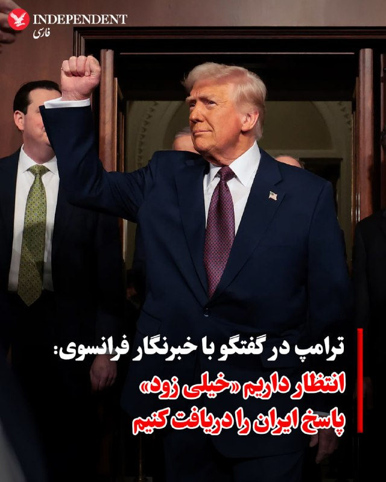

# خواننده تلگرام

<!-- TOP_NAV START -->

<a href="https://github.com/ProAlit/aio-downloader/blob/main/telegram/content/archive_1.md" style="display:inline-block; padding:6px 12px; margin:0 4px; background-color:#2ea44f; color:white; text-decoration:none; border-radius:4px; font-weight:bold;">صفحه بعد</a>

<!-- TOP_NAV END -->

<!-- MSG START -->

---
📅 بروزرسانی: 1405/02/19 21:23
---

## VahidOOnLine — post 239138

  

♦️ دونالد ترامپ، رئیس‌جمهوری ایالات متحده، روز شنبه ۱۹ اردیبهشت در تماسی تلفنی با مارگو حداد، خبرنگار شبکه تلویزیونی LCI فرانسه، اعلام کرد که انتظار دارد «خیلی زود» پاسخ مقام‌های جمهوری اسلامی را در رابطه با آخرین طرح صلح ایالات متحده دریافت کند.

رئیس‌جمهوری آمریکا در این تماس گفت که ایرانی‌ها همچنان «بسیار زیاد» خواهان دستیابی به یک توافق صلح پایدار هستند. اگرچه ترامپ تاکید کرد که انتظار دارد این پاسخ به‌زودی ارسال شود، اما او پیش از این در شامگاه جمعه نیز گفته بود که همان شب منتظر دریافت پاسخ بوده است.

ترامپ در جریان حضور در زمین گلف خود در ویرجینیا به رسانه‌ها گفت: «قرار است ظاهرا امشب نامه‌ای [از سوی ایران] دریافت کنیم؛ باید ببینیم چه می‌شود». او در پاسخ به این سوال که آیا فکر می‌کند ایران عمدا در حال طولانی کردن فرآیند است، گفت: «نمی‌دانم؛ به‌زودی متوجه خواهیم شد»»

رئیس‌جمهوری آمریکا قرار است روز شنبه در مسابقات گلف LIV که در باشگاه ملی گلف ترامپ در استرلینگِ ویرجینیا برگزار می‌شود، شرکت کند.
‌🇸🇦 Indypersian

🤖 @VahidOOnLine

## mwarmonitor — post 8763

🇺🇸رئیس‌جمهور ترامپ به یک خبرنگار فرانسوی گفت که انتظار دارد «خیلی زود» از ایران خبری دریافت کند. CBS

@mwarmonitor

## pm_afshaa — post 90426

هعی بی پولی
😫

## pm_afshaa — post 90425

🔴شبکه 14 اسرائیل : مصر یه اسکادران جنگنده رافال داده امارات، تا مقابل تهدیدهای ایران توان دفاعی امارات تقویت بشه

💧 Rainbet.com the #1 Non-KYC Crypto Casino & Sportsbook @rainbetcom

😁 @Pm_Afshaa

## IranIntlTV — post 336340

  <a href="telegram/content/IranIntlTV_336340_1778349186.mp4" target="_blank">🎬 Download video</a>

سی‌ان‌ان با اشاره به رقابت جناح‌های سیاسی در ایران گزارش داد سپاه پاسداران نفوذ بیشتری در ساختار قدرت به دست آورده و جریان‌های تندرو کارزار علیه توافق با آمریکا را تشدید کرده‌اند.
گفت‌وگو با جمشید برزگر، روزنامه‌نگار و تحلیل‌گر سیاسی
@iranintltv

## Persian_Trend_Official — post 13775

## RadioFarda — post 157014

نهاد قدرت در جمهوری اسلامی، پس از علی خامنه‌ای، در دست کیست؟

🔸در ایرانِ امروز، قدرت دیگر چهره‌ای واحد ندارد؛ نه می‌توان آن را فقط در اتاق رهبر جمهوری اسلامی جست‌وجو کرد، نه در دولت، و نه حتی فقط در ستاد فرماندهی سپاه پاسداران.

🔸جمهوری اسلامی پس از جنگ آمریکا و اسرائیل علیه ایران، کشته‌شدن علی خامنه‌ای، حذف شماری از فرماندهان اصلی سپاه و مقام‌های ارشد امنیتی و نیز مجروح‌شدن مجتبی خامنه‌ای وارد مرحله‌ای از آرایش چندلایه و بی‌ثبات قدرت شده است؛ وضعیتی که در آن هر نهاد بخشی از قدرت را در اختیار دارد، اما هیچ‌یک به‌تنهایی تجسم کامل قدرت نیست.

🔸بخشی از دشواری فهم سازوکار قدرت در ایران به همین ساختار چندلایه و پراکندهٔ تصمیم‌گیری بازمی‌گردد؛ نکته‌ای که مقام‌های آمریکایی نیز به آن اشاره کرده‌اند.

🔸گزارش کامل وحید پوراستاد را در وب‌سایت رادیوفردا بخوانید.

@RadioFarda

## IranianMinds — post 19844

یه دو ماهه منتظر جوابی چخبره

🔴 ترامپ : انتظار داریم جمهوری اسلامی بزودی پاسخشو به ما بده

@IranianMinds

## BBCPersian — post 280591

🔺واکنش کاخ سفید به انتشار تصویری که ترامپ را در قبر نشان می‌داد: مارک همیل «فردی بیمار» است

انتشار تصویری از دونالد ترامپ که با هوش مصنوعی ساخته شده بود و رئیس‌جمهور آمریکا را به صورت دراز کشیده با چشمان بسته در قبر نشان می‌داد، انتقاد کاخ سفید را برانگیخت.

در این تصویر که مارک همیل، بازیگر جنگ ستارگان، آنرا در شبکه اجتماعی بلواسکای به اشتراک گذاشته بود، سنگ قبری دیده می‌شد که روی آن نوشته شده بود: «دونالد جی. ترامپ ۱۹۴۶-۲۰۲۴».

کاخ سفید در واکنش به انتشار این تصویر که با زیرنویس « ای کاش» منتشر شده بود، مارک هامیل را «فردی بیمار» توصیف کرد.

آقای همیل که از سال ۱۹۷۷ به بعد نقش لوک اسکای‌واکر را در مجموعه فیلم‌های اصلی جنگ ستارگان بازی می‌کرد، بعداً این پست را حذف و عذرخواهی کرد. او نوشت: «در واقع، آرزوی من برای او برعکس مرگ بود، اما اگر به‌ نظرتان این تصویر نامناسب بود، عذرخواهی می‌کنم.»

https://bbc.in/42ql3kY
@BBCPersian

## alonews — post 118925

  <a href="telegram/content/alonews_118925_1778349188.webm" target="_blank">🎬 Download video</a>

👈سالار آبنوش(ولایتمدار): موساد با جن‌ها دنبال آقا مجتبی هست

✅ @AloNews خبر جنگ

---
📅 بروزرسانی: 1405/02/19 21:12
---

## VahidOOnLine — post 239137

  

♦️ طبق گزارش بلومبرگ، ذخایر جهانی نفت با سرعتی بی‌سابقه در حال کاهش است؛ چرا که جنگ ایالات متحده و اسرائیل علیه جمهوری اسلامی باعث اختلال در جریان صادرات نفت از خلیج‌فارس شده و یکی از سپرهای اصلی در برابر شوک‌های عرضه را از میان برده است.

موسسه «مورگان استنلی» برآورد می‌کند که ذخایر جهانی نفت تنها در فاصله اول مارس تا ۲۵ آوریل، نزدیک به ۲۷۰ میلیون بشکه کاهش یافته است.

این کاهش شدید ذخایر به این معناست که دولت‌ها و صنایع، دیگر توان چندانی برای جذب پیامدهای ناشی از اختلال در عرضه بیش از یک میلیارد بشکه نفت ندارند؛ اختلالی که از زمان شروع درگیری‌ها در ۲۸ فوریه آغاز شده و همچنان ادامه دارد.
‌🇸🇦 Indypersian

🤖 @VahidOOnLine

## pm_afshaa — post 90424

🔴مجری فاکس نیوز:ترامپ همین الان رژیم رو مجبور کرد میلیون‌ها بشکه نفت خودش رو تخلیه کنه؛ این دیوانه‌کننده است و آنها دیوانه شده‌اند.
جمهوری اسلامی میلیون‌ها بشکه نفت خام را به خلیج فارس می‌ریزد. تصاویر ماهواره‌ای نشان می‌دهد که یک لکه نفتی عظیم در آب‌های جزیره خارک در حال گسترش است

💧 Rainbet.com the #1 Non-KYC Crypto Casino & Sportsbook @rainbetcom

😁 @Pm_Afshaa

## IranIntlTV — post 336339

  <a href="telegram/content/IranIntlTV_336339_1778348568.mp4" target="_blank">🎬 Download video</a>

تصاویر ماهواره‌ای از شکل‌گیری یک لکه نفتی حدود ۷۰ کیلومتر مربعی در نزدیکی جزیره خارک خبر می‌دهند. آسوشیتدپرس گزارش داده این آلودگی از بخش غربی جزیره در حال گسترش است و نگرانی‌ها درباره آسیب‌های زیست‌محیطی و امنیت انرژی در شرایط جنگی را افزایش داده است.
گفت‌وگو با احسان دانشور، کارشناس ارشد انرژی و محیط زیست
@iranintltv

## IranIntlTV — post 336338

  <a href="telegram/content/IranIntlTV_336338_1778348570.mp4" target="_blank">🎬 Download video</a>

تنش‌ها در خلیج فارس بالا گرفته و محاصره بنادر ایران از سوی آمریکا ادامه دارد. اقدامی که در پاسخ به مسدودسازی تنگه هرمز توسط سپاه پاسداران انجام شده است. سی‌ان‌ان این وضعیت را نمونه‌ای از جنگ چریکی دریایی بر پایه استراتژی جنگ نامتقارن توصیف کرد.
گفت‌وگو با فرزین ندیمی، پژوهشگر ارشد امور دفاعی و امنیتی در موسسه واشینگتن
@iranintltv

## DW_Farsi — post 124487

  

🔶 مجلس شورای اسلامی پس از حدود سه ماه به‌صورت آنلاین تشکیل جلسه می‌دهد

مجلس شورای اسلامی ایران در حالی که نزدیک به سه ماه تعطیلی جلسات را در پیش گرفت، حالا با وجود آتش‌بس قرار است نخستین جلسه علنی خود را به‌صورت آنلاین برگزار کند.

این خبر را سخنگوی هیات رئیسه مجلس شورای اسلامی اعلام کرد و گفت، نخستین جلسه مجلس پس از جنگ ۴۰ روزه برای بررسی گرانی‌ها و به صورت آنلاین برگزار خواهد شد.

عباس گودرزی، سخنگوی هیات رئیسه مجلس به خبرگزاری ایرنا گفت: «جلسه صحن مجلس در روز یکشنبه ۲۰ اردیبهشت به دلیل تدابیر اعلامی و مبتنی بر شرایط موجود به صورت ویدئوکنفرانس برگزار خواهد شد و نمایندگان به بررسی ابعاد مختلف التهابات اخیر بازار، نگرانی‌های معیشتی مردم و گرانی‌های اخیر خواهند پرداخت.»

آخرین جلسه علنی مجلس پیش از آغاز جنگ ۴۰ روزه در ۲۸ بهمن ماه ۱۴۰۴ برگزار شده بود.
@dw_farsi

## Hranews — post 112850

مصدومیت ۴ کارگر از جمله یک آتش‌نشان در سایه فقدان ایمنی کار

❗️
❗️
❗️
❗️
❗️– در سایه فقدان ایمنی محیط و شرایط نامناسب کار، چهار #کارگر از جمله یک آتش‌نشان در شهرهای مشهد، خرم‌آباد، مارگون و پاکدشت، طی حوادثی حین انجام کار مصدوم شدند.

ادامه مطلب

↘️
@hranews_bot تماس ✉️ - @Hranews کانال هرانا 🆑

## alonews — post 118923

  <a href="telegram/content/alonews_118923_1778348573.mp4" target="_blank">🎬 Download video</a>

👈چندین پهپاد حزب‌الله که از لبنان به سمت غرب جلیل در شمال اسرائیل پرتاب شده بودند، چند لحظه پیش رهگیری شدند

✅ @AloNews خبر جنگ

## alonews — post 118922

  <a href="telegram/content/alonews_118922_1778348574.webm" target="_blank">🎬 Download video</a>

👈فارس: وقوع چند انفجار در اربیل عراق

✅ @AloNews خبر جنگ

---
📅 بروزرسانی: 1405/02/19 21:02
---

## VahidOOnLine — post 239136

  

علی صفری، مشاور سخنگوی وزارت خارجه جمهوری اسلامی گفت که اولویت ما توقف جنگ، باز کردن تنگه هرمز و جلوگیری از «دزدی دریایی» آمریکا است.

او افزود: «به همه اقدامات تحریک‌آمیز آمریکا در تنگه هرمز پاسخ داده است.»

صفری همچنین گفت که پاسخ آمریکا به پیشنهاد جمهوری اسلامی دریافت شده و در حال بررسی است، اما نسبت به اقدامات «تحریک‌آمیز» واشینگتن در تنگه هرمز بدبینی وجود دارد.
‌🏁 🇬🇧 IranintlTV

🤖 @VahidOOnLine

## pm_afshaa — post 90423

  <a href="telegram/content/pm_afshaa_90423_1778347974.webm" target="_blank">🎬 Download video</a>

🔴ترامپ در مصاحبه با شبکه LCI:
مقامات ایرانی همچنان به‌شدت خواهان دستیابی به توافق هستن و انتظار دارم خیلی زود از جمهوری اسلامی پاسخ دریافت کنم.

💧 Rainbet.com the #1 Non-KYC Crypto Casino & Sportsbook @rainbetcom

😁 @Pm_Afshaa

## pm_afshaa — post 90422

  <a href="telegram/content/pm_afshaa_90422_1778347975.webm" target="_blank">🎬 Download video</a>

🔴سنتکام: محاصره دریایی آمریکا علیه ایران همچنان به‌طور کامل در حال اجراست.

از 13 آوریل تاکنون، نیروهای سنتکام 58 کشتی تجاری رو تغییر مسیر داده و 4 شناور رو از کار انداختن تا مانع ورود یا خروج کشتی‌ها از بنادر ایران بشن.

💧 Rainbet.com the #1 Non-KYC Crypto Casino & Sportsbook @rainbetcom

😁 @Pm_Afshaa

## VahidOnline — post 75365

  <a href="telegram/content/VahidOnline_75365_1778347975.mp4" target="_blank">🎬 Download video</a>

ویدیویی از تجمعات شبانه طرفداران جمهوری اسلامی منتشر شده که در آن فرد خواننده می‌گوید زنان «کم حجابی» که در تجمع طرفداری از حکومت شرکت می‌کنند «نور چشم» آن‌ها هستند و ظاهر افراد ملاک نیست.
نظام جمهوری اسلامی پیش از این زنان بدون حجاب اجباری را بازداشت کرده و طی لایحه‌ای به نام «حجاب و عفاف» قصد ابلاغ جریمه‌های و محرومیت‌های سنگین علیه آنان را داشت.
با این حال، در هفته‌های گذشته حکومت سعی کرده با انتشار ویدیوها و مصاحبه‌هایی از تعدادی زن بی‌حجاب در تجمعات حکومتی، پایگاه اجتماعی خود را گسترده نشان دهد.
@VahidHeadline

📡 @VahidOnline

## IranIntlTV — post 336337

  

علی صفری، مشاور سخنگوی وزارت خارجه جمهوری اسلامی گفت که اولویت ما توقف جنگ، باز کردن تنگه هرمز و جلوگیری از «دزدی دریایی» آمریکا است.

او افزود: «به همه اقدامات تحریک‌آمیز آمریکا در تنگه هرمز پاسخ داده است.»

صفری همچنین گفت که پاسخ آمریکا به پیشنهاد جمهوری اسلامی دریافت شده و در حال بررسی است، اما نسبت به اقدامات «تحریک‌آمیز» واشینگتن در تنگه هرمز بدبینی وجود دارد.
https://iranintl.com/202605097479

## Persian_Trend_Official — post 13774

  <a href="telegram/content/Persian_Trend_Official_13774_1778347976.mp4" target="_blank">🎬 Download video</a>

🔴نظر روح الله خمینی در مورد اقتصاد کشور

🫆:Tony

📌 @persian_trend_official
پرشین ترند | متفاوت‌ترین کانال نظامی

## BBCPersian — post 280590

🔻لکه نفتی نزدیک جزیره خارگ «از نظر بصری با نفت سازگار به نظر می‌رسد»

یک موسسه زیست‌محیطی غیردولتی در بریتانیا اعلام کرد که زیرساخت‌های نفتی ایران ممکن است منشاء لکه نفتی مشکوکی در نزدیکی جزیره مهم خارگ باشد که پایانه اصلی صادرات نفت ایران است.

هرچند تصاویر ماهواره‌ای نشان می‌دهد این لکه تا روز شنبه «به‌طور قابل توجهی کاهش یافته است» اما پیش‌تر، این لکه در حال گسترش به نظر می رسید.

هنوز مشخص نیست چه عاملی باعث این نشت احتمالی در سواحل غربی این جزیره کوچک در خلیج فارس شده است.

موسسه «رصد درگیری‌ها و وضعیت محیط زیست» به خبرگزاری فرانسه گفت: «علت و منشاء این لکه همچنان نامشخص است و فقط بر اساس تصاویر موجود نمی‌توان با قطعیت درباره آن اظهار نظر کرد.»

لئون مورلند از این موسسه گفت: «اگرچه زیرساخت‌های فراساحلی در منطقه می‌توانند یکی از منابع احتمالی باشند، اما در حال حاضر نمی‌توان نقطه دقیق آغاز نشت یا علت مشخص آن را تعیین کرد.»

او در عین حال گفت که بر اساس تحلیل برخی تصاویر ماهواره‌ای، این لکه «از نظر بصری با نفت سازگار به نظر می‌رسد.»

برخی رسانه‌ها، از جمله فاکس‌نیوز، گزارش داده‌اند که تأسیسات ذخیره‌سازی نفت ایران ممکن است تحت فشار قرار گرفته باشند، چرا که محاصره دریایی آمریکا توانایی ایران برای صادرات یا ذخیره نفت خام را مختل کرده است.

موسی احمدی، رئیس کمیسیون انرژی مجلس ایران امروز به خبرگزاری ایسنا گفت: «تا این لحظه هیچ گزارش رسمی‌ای مبنی بر نشت از تأسیسات نفتی ایران به دلیل فشار بر مخازن ذخیره‌سازی تأیید نشده است.»

https://bbc.in/49lVpSe
@BBCPersian

## alonews — post 118921

  <a href="telegram/content/alonews_118921_1778347978.webm" target="_blank">🎬 Download video</a>

👈بلومبرگ: یک کشتی قطری در حال عبور از تنگه هرمز است 
✅ @AloNews خبر جنگ

## alonews — post 118920

  <a href="telegram/content/alonews_118920_1778347978.webm" target="_blank">🎬 Download video</a>

👈ترامپ: تمدید آتش‌بس بین روسیه و اوکراین کار خوبی خواهد بود

🔴گزارش‌های مربوط به نقض آتش‌بس از سوی روسیه را نخوانده‌ام و در وقوع آن تردید دارم

✅ @AloNews خبر جنگ

## alonews — post 118919

  <a href="telegram/content/alonews_118919_1778347978.webm" target="_blank">🎬 Download video</a>

👈معاون وزیر ارتباطات: قطع اینترنت در بلندمدت خود به یک تهدید امنیتی برای زیرساخت‌های کشور تبدیل خواهد شد. تبدیل اینترنت ایران مثل چین، ممکن نیست.

✅ @AloNews خبر جنگ

---
📅 بروزرسانی: 1405/02/19 20:52
---

## Shin_Persian — post 5907

  

Shin ✓ @hey_itsmyturn
Sat, 09 May 2026 17:14:56 UTC

Today -
TEL movement,
Shokuhiyeh Town,
Qom Province, #Iran .

(Do not watermark)

فارسی

امروز -
تحرک پرتابگرهای موشک (TEL)،
شهرک شکوهیه،
استان قم، #Iran .

(واترنمارک نکنید)

𝕏 · @shin_persian

## FarsiVOA — post 217286

سیاست راهبردی آمریکا برای مهار گروه‌های مسلح وابسته به جمهوری اسلامی در عراق

## Persian_Trend_Official — post 13772

  

🔴 فعال شدن هشدار قرمز در شمال اسرائیل در پی رهگیری پهپاد حزب‌الله

رسانه‌های عبری گزارش می‌دهند هشدارهای قرمز در نزدیکی شهر «شلومی» در شمال اسرائیل، به‌دلیل تلاش برای رهگیری یک پهپاد وابسته به حزب‌الله فعال شده است.

🫆:Tony

📌 @persian_trend_official
پرشین ترند | متفاوت‌ترین کانال نظامی

## BBCPersian — post 280589

  <a href="https://t.me/bbcpersian/280589" target="_blank">📎 Download file</a>

پادکست رادیویی جام جهان‌نما شنبه ۱۹ اردیبهشت ۱۴۰۵
در پی تحولات اخیر ایران و قطع و اختلال در اینترنت که امکان دسترسی مخاطبان در ایران به رسانه‌ها را با مشکل مواجه کرده است، بی‌بی‌سی فارسی از ۱۵ بهمن پخش رادیویی برنامه‌های خود را دوباره آغاز کرده است.

برنامه‌ جام جهان‌نما از این پس همه روزه از ساعت ۱۶:۳۰ گرینویچ (۲۰:۰۰ ایران) روی موج متوسط ۷۰۲ کیلوهرتز و موج کوتاه ۹۴۶۵ کیلوهرتز پخش می‌شود.

تکرار این برنامه از ساعت ۱۸:۰۰ گرینویچ (۲۱:۳۰ ایران) روی موج متوسط ۷۰۲ کیلوهرتز و موج کوتاه ۵۹۳۵ کیلوهرتز پخش می‌شود.
@BBCPersian

## alonews — post 118918

  <a href="telegram/content/alonews_118918_1778347375.webm" target="_blank">🎬 Download video</a>

👈ترامپ به شبکه LCI:
ایران واقعا میخواهد به توافق برسد‌‌

🔴انتظار داریم خیلی زود پاسخ ایران داده شود‌‌

✅ @AloNews خبر جنگ

## alonews — post 118917

  <a href="telegram/content/alonews_118917_1778347376.webm" target="_blank">🎬 Download video</a>

👈روس‌اتم: نیروگاه بوشهر علی‌رغم تنش نظامی بین ایران و آمریکا، به فعالیت خود ادامه می‌دهد

✅ @AloNews خبر جنگ

---
📅 بروزرسانی: 1405/02/19 20:43
---

## VahidOOnLine — post 239135

  

بر اساس داده‌های شرکت ردیابی کشتی‌ها ال اس ای جی، نفتکش حامل گاز طبیعی مایع «الخرایطیات» پس از ترک بندر رأس‌لفان قطر و در مسیر بندر قاسم پاکستان، به‌سمت تنگه هرمز حرکت می‌کند.در صورت عبور موفق، این نخستین عبور یک نفتکش گاز طبیعی مایع قطری از تنگه هرمز از زمان آغاز جنگ خواهد بود.شرکت «قطر انرژی» هنوز واکنشی به این خبر نشان نداده است.
‌🏁 🇬🇧 ManotoTV

🤖 @VahidOOnLine

## ManotoTV — post 105207

  <a href="telegram/content/ManotoTV_105207_1778346815.mp4" target="_blank">🎬 Download video</a>

ایرانیان مقیم دوسلدورف آلمان، روز شنبه ۱۹ اردیبهشت برابر با ۹ مه ۲۰۲۶، بار دیگر با حضور در خیابان‌های این شهر تجمع اعتراضی برگزار کردند.

شرکت‌کنندگان در این تجمع با سر دادن شعارهایی، صدای اعتراض ایرانیان گروگان‌گرفته‌شده توسط جمهوری اسلامی را به گوش جهانیان رساندند و حمایت خود را از شاهزاده رضا پهلوی اعلام کردند.

## ManotoTV — post 105206

  

بر اساس داده‌های شرکت ردیابی کشتی‌ها ال اس ای جی، نفتکش حامل گاز طبیعی مایع «الخرایطیات» پس از ترک بندر رأس‌لفان قطر و در مسیر بندر قاسم پاکستان، به‌سمت تنگه هرمز حرکت می‌کند.در صورت عبور موفق، این نخستین عبور یک نفتکش گاز طبیعی مایع قطری از تنگه هرمز از زمان آغاز جنگ خواهد بود.شرکت «قطر انرژی» هنوز واکنشی به این خبر نشان نداده است.

## FarsiVOA — post 217285

آتش‌بس سه روزه روسیه و اوکراین؛ توافقی با ابتکار پرزیدنت ترامپ و تردید درباره دوام آن

## Persian_Trend_Official — post 13769

🔴 انتشار تصاویر پهپاد انتحاری «گران-۵»

💢تصاویر تازه‌ای از پهپاد انتحاری Geran-5 منتشر شده؛ پهپادی که گفته می‌شود بسیاری از ویژگی‌های «گران-۲» را حفظ کرده اما به سامانه اپتیکی مجهز شده است.

▪️ افزوده شدن سامانه اپتیکی، امکان شناسایی و اصلاح مسیر تا لحظه برخورد را فراهم می‌کند
▪️ قابلیت هدایت مستقیم می‌تواند دقت حمله و توان مقابله با اهداف متحرک را افزایش دهد
▪️ این تغییرات، پهپاد را نسبت به نسخه‌های قبلی خطرناک‌تر و انعطاف‌پذیرتر کرده است

🫆:Tony

📌 @persian_trend_official
پرشین ترند | متفاوت‌ترین کانال نظامی

## BBCPersian — post 280588

🔻مجمع تشخیص مصلحت نظام در ایران برای دبیرخانه خود سرپرست تعیین کرد

مجمع تشخیص مصلحت نظام در ایران اعلام کرده است که برای دبیرخانه خود سرپرست تعیین کرده است.

سخنگوی این مجمع گفته است که با حکم صادق لاریجانی، رئیس مجمع، عباسعلی کدخدایی به عنوان سرپرست دبیرخانه منصوب شده است.

محمدباقر ذوالقدر، دبیر پیشین مجمع، در پی کشته شدن علی لاریجانی، دبیر وقت شورای عالی امنیت ملی در حملات اسرائیل، به جای او منصوب شد.

خبرگزاری‌های ایران می‌گویند مراسم معارفه آقای کدخدایی امروز در تهران برگزار شده است.

او پیش از این عضو شورای نگهبان بود.

https://bbc.in/4tnFD0s
@BBCPersian

## manototv — post 105207

  <a href="telegram/content/manototv_105207_1778346819.mp4" target="_blank">🎬 Download video</a>

ایرانیان مقیم دوسلدورف آلمان، روز شنبه ۱۹ اردیبهشت برابر با ۹ مه ۲۰۲۶، بار دیگر با حضور در خیابان‌های این شهر تجمع اعتراضی برگزار کردند.

شرکت‌کنندگان در این تجمع با سر دادن شعارهایی، صدای اعتراض ایرانیان گروگان‌گرفته‌شده توسط جمهوری اسلامی را به گوش جهانیان رساندند و حمایت خود را از شاهزاده رضا پهلوی اعلام کردند.

---
📅 بروزرسانی: 1405/02/19 20:33
---

## VahidOOnLine — post 239134

  

دونالد ترامپ در مصاحبه تلفنی با شبکه ال‌سی‌آی گفت که مقام‌های ایرانی همچنان به‌شدت خواهان دستیابی به توافق هستند و او انتظار دارد خیلی زود از جمهوری اسلامی پاسخ دریافت کند.

پیش‌تر اعلام شده بود واشینگتن همچنان در انتظار پاسخ تهران به پیشنهاد آمریکا برای پایان رسمی جنگ است.
‌🏁 🇬🇧 IranintlTV

🤖 @VahidOOnLine

## VahidOOnLine — post 239133

  

♦️ خبرگزاری رویترز بر اساس داده‌های کشتیرانی موسسه LSEG، اعلام کرد که نفتکش حامل گاز طبیعی مایع (LNG) قطری با نام «الخریطیات» (Al Kharaitiyat)، روز شنبه ۱۹ اردیبهشت پس از ترک بندر رأس‌لفان، به سمت تنگه هرمز حرکت کرد تا مسیر خود را به مقصد بندر قاسم در پاکستان ادامه دهد.

اگر این شناور بتواند با موفقیت عبور کند، این اولین تردد یک نفتکش ال‌ان‌جی قطری از تنگه هرمز از زمان آغاز جنگ با ایران خواهد بود. شرکت «قطر انرژی» تا این لحظه واکنشی رسمی به این خبر نشان نداده است.
‌🇸🇦 Indypersian

🤖 @VahidOOnLine

## VahidOnline — post 75364

  

مقام‌های لبنانی روز شنبه اعلام کردند که در حملات هوایی اسرائیل به جنوب لبنان، هشت نفر کشته شده‌اند. همچنین بزرگراهی در جنوب بیروت هدف حمله هوایی قرار گرفت.

این حملات تازه با وجود آتش‌بس سه‌هفته‌ای میان اسرائیل و حزب‌الله، گروه مورد حمایت ایران، انجام شد؛ آتش‌بسی که تأثیر چندانی در توقف تبادل روزانه آتش، عمدتاً در جنوب لبنان، نداشته است.

حزب‌الله روز شنبه اعلام کرد که در واکنش به ادامه حملات، نیروهای اسرائیلی در شمال این کشور را با پهپاد هدف قرار داده است.
@VahidHeadline

📡 @VahidOnline

## IranIntlTV — post 336336

  

دونالد ترامپ در مصاحبه تلفنی با شبکه ال‌سی‌آی گفت که مقام‌های ایرانی همچنان به‌شدت خواهان دستیابی به توافق هستند و او انتظار دارد خیلی زود از جمهوری اسلامی پاسخ دریافت کند.

پیش‌تر اعلام شده بود واشینگتن همچنان در انتظار پاسخ تهران به پیشنهاد آمریکا برای پایان رسمی جنگ است.
https://iranintl.com/202605090761

## DW_Farsi — post 124486

  

🔶 اعزام ناوشکن بریتانیایی به منطقه خلیج فارس

ارتش بریتانیا ناوشکن "اچ‌ام‌اس دراگون" (HMS Dragon) را از دریای مدیترانه به منطقه خلیج فارس اعزام خواهد کرد.
وزارت دفاع بریتانیا روز شنبه ۹ مه (۱۹ اردیبهشت) اعلام کرد، "این ناو می‌تواند در یک ماموریت بین‌المللی احتمالی برای تامین امنیت تردد کشتی‌ها در تنگه هرمز مشارکت کند."

سخنگوی وزارت دفاع بریتانیا به خبرگزاری فرانسه گفت، "استقرار این ناوشکن بخشی از برنامه‌ریزی محتاطانه‌ای است که تضمین می‌کند، این کشور به‌عنوان بخشی از یک ائتلاف چندملیتی تحت رهبری مشترک بریتانیا و فرانسه آماده است، در صورت فراهم بودن شرایط، این تنگه را ایمن‌سازی کند."

به گفته این مقام مسئول، پس از پایان درگیری‌ها در منطقه، این کشتی می‌تواند از جمله در عملیات مین‌روبی نیز کمک کند.

بریتانیا و فرانسه در نشستی در ماه آوریل سال جاری در لندن با تامین امنیت نظامی تردد کشتی‌ها در تنگه هرمز موافقت کرده بودند.

آلمان نیز از دیگر کشورهایی است که از این اقدام حمایت کرده و در حال حاضر نیز یک کشتی مین‌روب نیروی دریایی این کشور به سمت منطقه در حال حرکت است.
@dw_farsi

## Persian_Trend_Official — post 13768

  

🔴 آژیر خطر در خارکیف؛ پهپاد روسی در نزدیکی شهر شناسایی شد

💢هم‌زمان با ادامه وضعیت آتش‌بس شکننده در جنگ اوکراین، آژیرهای هشدار در شهر خارکیو به صدا درآمده است.

💢گزارش‌ها حاکی است یک پهپاد روسی با مدل نامشخص در منطقه «پرودیانکا» در نزدیکی خارکیف شناسایی شده و وارد محدوده عملیاتی پدافند شده است.

🫆:Tony

📌 @persian_trend_official
پرشین ترند | متفاوت‌ترین کانال نظامی

## Persian_Trend_Official — post 13767

  

🔴 فعال شدن آژیرهای هشدار در شمال‌شرق اسرائیل

منابع عبری از فعال شدن آژیرهای هشدار حمله راکتی در مناطق شمال‌شرقی اسرائیل خبر می‌دهند.

🫆:Tony

📌 @persian_trend_official
پرشین ترند | متفاوت‌ترین کانال نظامی

## RadioFarda — post 157013

  

🔸فرماندهی مرکزی ایالات متحده، سنتکام، روز شنبه خبر داد از ابتدای محاصره دریایی علیه بنادر ایران تاکنون، ۵۸ کشتی تجاری را وادار به «تغییر مسیر» کرده است.

🔸در اطلاعیه سنتکام که در حساب شبکه ایکس آن منتشر شده است، آمده که نیروهای نظامی آمریکا در خاورمیانه چهار کشتی ایرانی را «از کار انداخته‌اند تا مانع ورود یا خروج آن‌ها از بنادر ایران شوند».

🔸ارتش آمریکا جمعه از شلیک به دو نفتکش ایرانی «ام‌تی سی استار» و «ام‌تی سودا» و از کار انداختن آنها خبر داد و روز چهارشنبه نیز نفتکش «ام‌تی حسنا» با پرچم ایران هدف قرار گرفته بود.

🔸ماه گذشته نیز نیروهای آمریکایی یک کشتی باری ایرانی را توقیف کرده بودند.

🔸محاصره دریایی ایران در حالی ادامه دارد که ایران هنوز به طرح پیشنهادی آمریکا برای رسیدن به توافق پایان جنگ پاسخ نداده است. به گفته مقام‌های آمریکایی، این پاسخ قرار بود روز جمعه به واشینگتن تحویل داده شود.

🔸از سوی دیگر جمهوری اسلامی رفع محاصره دریایی را پیش‌شرط باز شدن تنگه هرمز خوانده است.

@RadioFarda

## manototv — post 105206

  

بر اساس داده‌های شرکت ردیابی کشتی‌ها ال اس ای جی، نفتکش حامل گاز طبیعی مایع «الخرایطیات» پس از ترک بندر رأس‌لفان قطر و در مسیر بندر قاسم پاکستان، به‌سمت تنگه هرمز حرکت می‌کند.در صورت عبور موفق، این نخستین عبور یک نفتکش گاز طبیعی مایع قطری از تنگه هرمز از زمان آغاز جنگ خواهد بود.شرکت «قطر انرژی» هنوز واکنشی به این خبر نشان نداده است.

---
📅 بروزرسانی: 1405/02/19 20:23
---

## VahidOOnLine — post 239132

  

عبدالرضا محمدی طامه، رییس اتحادیه دارندگان اتوسرویس، تعمیرگاه، پارکینگ و کارواش خودرو به سایت دیده‌بان ایران گفت: «با توجه به شرایط اقتصادی و تورم، نرخ خدمات کارواش نسبت به سال گذشته حدود ۶۰ درصد افزایش داشته است.»

او از کاهش چشمگیر مشتریان خبر داد و افزود: «با این وجود مراجعه به کارواش همچنان انجام می‌شود چرا که تعداد کارواش در سطح تهران آنچنان بالا نیست.»
‌🏁 🇬🇧 IranintlTV

🤖 @VahidOOnLine

## VahidOOnLine — post 239131

  <a href="telegram/content/VahidOOnLine_239131_1778345603.mp4" target="_blank">🎬 Download video</a>

لندن؛ تجمع ایرانیان در هاید پارک
‌🏁 🇬🇧 ManotoTV

🤖 @VahidOOnLine

## VahidOOnLine — post 239130

  

ونالد ترامپ، رئیس‌جمهور آمریکا، در گفت‌وگویی با روزنامه ایتالیایی «کوریره دلاسرا» گفت فعلا نمی‌خواهد درباره نامه پاسخ جمهوری اسلامی اظهار نظر کند. این نامه، به نوشته کوریره دلاسرا، قرار بود شب گذشته به آمریکا برسد.

ترامپ در این گفت‌وگوی تلفنی که روز شنبه ۱۹ اردیبهشت انجام شد، درباره احتمال جابه‌جایی نیروهای آمریکایی از آلمان نیز اظهار نظر نکرد، اما تایید کرد که همچنان در حال بررسی انتقال نیروهای آمریکا از پایگاه‌های ایتالیا است. او گفت: «هنوز در حال بررسی آن هستم.»

رئیس‌جمهور آمریکا بار دیگر از موضع ایتالیا در جنگ ایران انتقاد کرد و گفت: «ایتالیا وقتی ما به آن نیاز داشتیم، آنجا نبود. من و کشورم همیشه برای ایتالیا بوده‌ایم.» به نوشته کوریره دلاسرا، وقتی خبرنگار این روزنامه به احتمال اعزام مین‌روب‌های ایتالیایی پس از آتش‌بس در ایران اشاره کرد، ترامپ سخن او را قطع کرد و دوباره گفت ایتالیا در زمان نیاز آمریکا حاضر نبوده است.
‌🏁 🇬🇧 ManotoTV

🤖 @VahidOOnLine

## IranIntlTV — post 336335

  

عبدالرضا محمدی طامه، رییس اتحادیه دارندگان اتوسرویس، تعمیرگاه، پارکینگ و کارواش خودرو به سایت دیده‌بان ایران گفت: «با توجه به شرایط اقتصادی و تورم، نرخ خدمات کارواش نسبت به سال گذشته حدود ۶۰ درصد افزایش داشته است.»

او از کاهش چشمگیر مشتریان خبر داد و افزود: «با این وجود مراجعه به کارواش همچنان انجام می‌شود چرا که تعداد کارواش در سطح تهران آنچنان بالا نیست.»
https://iranintl.com/202605098991

## IranIntlTV — post 336334

  <a href="https://t.me/IranintlTV/336334" target="_blank">📎 Download file</a>

🎧نسخه صوتی اخبار شبانگاهی | شنبه ۱۹ اردیبهشت
@iranintlTV

## ManotoTV — post 105205

  <a href="telegram/content/ManotoTV_105205_1778345608.mp4" target="_blank">🎬 Download video</a>

لندن؛ تجمع ایرانیان در هاید پارک

## ManotoTV — post 105204

  

ونالد ترامپ، رئیس‌جمهور آمریکا، در گفت‌وگویی با روزنامه ایتالیایی «کوریره دلاسرا» گفت فعلا نمی‌خواهد درباره نامه پاسخ جمهوری اسلامی اظهار نظر کند. این نامه، به نوشته کوریره دلاسرا، قرار بود شب گذشته به آمریکا برسد.

ترامپ در این گفت‌وگوی تلفنی که روز شنبه ۱۹ اردیبهشت انجام شد، درباره احتمال جابه‌جایی نیروهای آمریکایی از آلمان نیز اظهار نظر نکرد، اما تایید کرد که همچنان در حال بررسی انتقال نیروهای آمریکا از پایگاه‌های ایتالیا است. او گفت: «هنوز در حال بررسی آن هستم.»

رئیس‌جمهور آمریکا بار دیگر از موضع ایتالیا در جنگ ایران انتقاد کرد و گفت: «ایتالیا وقتی ما به آن نیاز داشتیم، آنجا نبود. من و کشورم همیشه برای ایتالیا بوده‌ایم.» به نوشته کوریره دلاسرا، وقتی خبرنگار این روزنامه به احتمال اعزام مین‌روب‌های ایتالیایی پس از آتش‌بس در ایران اشاره کرد، ترامپ سخن او را قطع کرد و دوباره گفت ایتالیا در زمان نیاز آمریکا حاضر نبوده است.

## FarsiVOA — post 217284

  <a href="telegram/content/FarsiVOA_217284_1778345611.mp4" target="_blank">🎬 Download video</a>

ارتش اسرائیل از حملات هوایی به سکوهای پرتاب پهپاد، انبارهای تسلیحاتی و لانچرهای آماده شلیک حزب‌الله در جنوب لبنان خبر داد.

ارتش اسرائیل همچنین اعلام کرد امروز، ۱۹ اردیبهشت، دو پرتابگر موشک آماده و مسلح را در جنوب لبنان هدف قرار داد که پیش‌تر راکت‌هایی به سمت اسرائیل شلیک کرده بود.

## DW_Farsi — post 124485

  

🔶 قطع سراسری اینترنت در ایران وارد یازدهمین هفته شد

نت بلاکس، نهاد ناظر بر وضعیت دسترسی به اینترنت در جهان اعلام کرد، قطع سراسری اینترنت در ایران وارد یازدهمین هفته شده است.

این نهاد با اعلام اینکه ۱۶۸۰ ساعت از قطع ارتباط کامل اینترنت ایران با جهان گذشته است، در پیامی در شبکه ایکس نوشت: «این اقدام سدی فوق‌العاده بزرگ در برابر دانش، اطلاعات و ارتباطات برای ایرانیانی است که در تلاش‌اند به امورات زندگی روزمره خود بپردازند.»

این نهاد پیش‌تر اعلام کرده بود، "این شدیدترین و طولانی‌ترین قطع دسترسی کاربران به اینترنت بین‌المللی از سوی یک حکومت محسوب می‌شود که تاکنون صورت گرفته است".

مسدودسازی اینترنت اواخر فوریه و با آغاز جنگ آمریکا و اسرائیل علیه جمهوری اسلامی ایران آغاز شد. پیش‌تر نیز در جریان اعتراضات دی‌ماه ۱۴۰۴ اینترنت برای مدتی قطع شده بود.
@dw_farsi

## RadioFarda — post 157012

🔸مسعود پزشکیان، رئیس‌جمهور ایران، همزمان با افزایش دمای هوا در کشور خواستار دخالت «مساجد و پایگاه‌های بسیج» برای بررسی «میزان مصرف کولرهای آبی» شد. 🔸رسانه‌های ایران روز شنبه ۱۹ اردیبهشت به نقل از او نوشتند: «مساجد و پایگاه‌های بسیج می‌توانند مسئولیت ارزیابی…

## RadioFarda — post 157011

  

🔸مسعود پزشکیان، رئیس‌جمهور ایران، همزمان با افزایش دمای هوا در کشور خواستار دخالت «مساجد و پایگاه‌های بسیج» برای بررسی «میزان مصرف کولرهای آبی» شد.

🔸رسانه‌های ایران روز شنبه ۱۹ اردیبهشت به نقل از او نوشتند: «مساجد و پایگاه‌های بسیج می‌توانند مسئولیت ارزیابی میزان مصرف کولرهای آبی در هر محله را برعهده بگیرند و با مشارکت مردم، روند اصلاح و بهینه‌سازی مصرف انرژی را دنبال کنند.»

🔸او توضیح بیشتری نداد که این نهادها چگونه و با استناد به چه سازوکاری می‌توانند مصرف دستگاه‌های خنک‌کننده منازل را ارزیابی کنند.

🔸این اظهارات در حالی صورت می‌گیرد که ایران در سال‌های اخیر و حتی پیش از جنگ ۱۲ روزه و جنگ اخیر، با نزدیک شدن به فصل گرما با بحران کمبود برق مواجه بود.

🔸بخش قابل توجهی از نیروگاه‌های برق ایران با سوزاندن گاز فعالیت می‌کنند و کمبود گاز علاوه بر کاهش تولید برق و خاموشی‌های برنامه‌ریزی‌شده، در این سال‌ها باعث «مازوت‌سوزی» در نیروگاه‌ها و افزایش شدید آلودگی هوا نیز شده است.

@RadioFarda

## BBCPersian — post 280586

  <a href="telegram/content/BBCPersian_280586_1778345615.mp4" target="_blank">🎬 Download video</a>

🔻مسئول دیدارهای دفتر علی خامنه‌ای، رهبر سابق جمهوری اسلامی، می‌گوید که مجتبی خامنه‌ای بر اثر «موج انفجار» مجروح شده بود و اکنون بهبود یافته و در «سلامت کامل» است.

مظاهر حسینی در گردهمایی شبانه حامیان حکومت گفت که در حمله آمریکا و اسرائیل، خانه مجتبی خامنه‌ای هم هدف قرار گرفت که منجر به کشته شدن همسرش، زهرا حداد عادل شد.
به گفته آقای حسینی، زمانی که مجتبی خامنه‌ای در حال بالا رفتن از پله‌ها بوده، بر اثر شلیک موشک «بین راه به زمین می‌افتد و کشکک پا و کمرش آسیب می‌بیند. کمر او در این ایام خوب شده و پا هم به زودی خوب خواهد شد.»

آقای حسینی، روایتی که از آسیب دیدن پیشانی مجتبی خامنه‌ای مطرح شده را رد کرد و گفت: «تنها ترکی پشت گوش او خورده که زیر عمامه قرار می‌گیرد و اصلا مشخص نیست و آن هم مداوا شده است.»
@BBCPersian

## Hranews — post 112849

به دلیل فروش فیلترشکن؛ ۲ شهروند در اسلامشهر بازداشت شدند
 

❗️
❗️
❗️
❗️
❗️ – بنا بر اعلام فرمانده انتظامی اسلامشهر، دو شهروند در این شهرستان به دلیل فروش فیلترشکن توسط ماموران پلیس امنیت و فتا #بازداشت شدند.
 
ادامه مطلب

↘️
@hranews_bot تماس ✉️ -  @Hranews  کانال هرانا 🆑

## manototv — post 105205

  <a href="telegram/content/manototv_105205_1778345618.mp4" target="_blank">🎬 Download video</a>

لندن؛ تجمع ایرانیان در هاید پارک

## alonews — post 118916

  <a href="telegram/content/alonews_118916_1778345620.webm" target="_blank">🎬 Download video</a>

👈بلومبرگ: یک کشتی قطری در حال عبور از تنگه هرمز است

✅ @AloNews خبر جنگ

---
📅 بروزرسانی: 1405/02/19 20:12
---

## VahidOOnLine — post 239129

  

♦️ حسن‌علی اخلاقی امیری، عضو کمیسیون فرهنگی مجلس، در گفتگو با رسانه‌ها اعلام کرد که علت برگزار نشدن جلسات علنی مجلس در بیش از دو ماه اخیر، مصوبه مستقیم شورای عالی امنیت ملی بوده است. او با اشاره به اینکه وضعیت تهران از نظر این شورا «قرمز» توصیف شده، گفت که برای حفظ امنیتِ یکی از قوای سه‌گانه، صلاح بر این بوده که نمایندگان در یک مکان جمع نشوند.

این نماینده مجلس در پاسخ به انتقادات درباره تفاوت رویکرد مجلس نسبت به درگیری‌های پیشین تاکید کرد که نمایندگان ابایی از حضور ندارند، اما تاکنون مجوزی برای تشکیل صحن علنی صادر نشده است. اخلاقی امیری همچنین تایید کرد که تا این لحظه هیچ جلسه‌ای میان روسای کمیسیون‌ها و محمدباقر قالیباف، رئیس مجلس شورای اسلامی برگزار نشده است.
‌🇸🇦 Indypersian

🤖 @VahidOOnLine

## VahidOOnLine — post 239128

  

داود رنگی، نایب‌رییس کمیسیون مدیریت واردات اتاق بازرگانی گفت که ما چاره‌ای نداریم جز اینکه تنگه هرمز را به نحوی باز کرده و تجارت را روان کنیم.

او افزود: «اگر ارزش این تنگه برای ما اکنون ۱۰۰ باشد، تا دو ماه دیگر به ۸۰ و تا یک سال دیگر به ۲۰ یا ۳۰ می‌رسد.»

او ادامه داد: «کشورهای حاشیه برای تجارت و صادرات نفت خود مسیرهای دیگری را انتخاب می‌کنند.»

نایب‌رییس کمیسیون مدیریت واردات اتاق بازرگانی گفت: «تنگه هرمز فقط برای ما می‌تواند ارزش داشته باشد و بستن آن به این معنی است که با دست خودمان تجارت خود را در آن منطقه می‌بندیم و خسارت بزرگی به کشور وارد می‌کنیم.»
‌🏁 🇬🇧 IranintlTV

🤖 @VahidOOnLine

## IranIntlTV — post 336333

  <a href="telegram/content/IranIntlTV_336333_1778344975.mp4" target="_blank">🎬 Download video</a>

تیتر اول با نیوشا صارمی، شنبه ۱۹ اردیبهشت
@iranintltv

## FarsiVOA — post 217283

🔺همکاری جدید بریتانیا با کشورهای عرب خاورمیانه برای دفع حملات پهپادی رژیم ایران

▪️ارتش بریتانیا روز شنبه ۱۹ اردیبهشت از آزمایش موفقیت‌آمیز موشک‌های رهگیر و پرتابگرهای جدید «اسکای‌همر» ساخت بریتانیا در اردن خبر داد و اعلام کرد با کمک این فناوری، کشورهای هم‌پیمان بریتانیا در خاورمیانه، در برابر حملات پهپادی جمهوری اسلامی مصونیت بیشتری خواهند یافت.

⬇️ بیشتر بخوانید:

https://ir.voanews.com/a/uk-expands-arab-alliance-against-iranian-drone-threats/8148300.html?withmediaplayer=1%2F%3Fnocach%3D1

## DW_Farsi — post 124484

  

🔶وزیر خارجه روسیه بر "حمایت از مذاکرات آمریکا و ایران" تاکید کرد

سرگئی لاوروف، وزیر امور خارجه روسیه در گفت‌وگوی تلفنی با عبدالله بن زاید آل نهیان، همتای خود در امارات متحده عربی گفت، "گفت‌وگوهای میان ایالات متحده آمریکا و ایران باید مورد حمایت قرار گیرد تا از سرگیری درگیری‌های خصمانه در خاورمیانه جلوگیری شود".

در بیانیه وزارت امور خارجه روسیه درباره این گفت‌و‌گو آمده است: «طرف روسی بر ضرورت تمرکز بر حمایت از مذاکرات جاری میان ایران و ایالات متحده تاکید کرد.»

روسیه همچنین تاکید کرده است، "نمی‌خواهد با از سرگیری درگیری‌ها، چشم‌اندازهای ثبات را به خطر بیندازد".

در هفته های اخیر ولادیمیر پوتین، رئیس‌جمهور روسیه در دیدار با عباس عراقچی، وزیر امور خارجه ایران در سن‌پترزبورگ، جمهوری اسلامی را مطمئن کرد، "حمایت مسکو از ایران ادامه خواهد یافت".

پوتین در این دیدار گفته بود: «ما می‌بینیم که مردم ایران چگونه شجاعانه و قهرمانانه برای استقلال و حاکمیت خود مبارزه می‌کنند. ما هر کاری که در راستای منافع آنها و همه مردم منطقه باشد انجام خواهیم داد تا صلح هرچه سریع‌تر برقرار شود.»
@dw_farsi

## manototv — post 105204

  

ونالد ترامپ، رئیس‌جمهور آمریکا، در گفت‌وگویی با روزنامه ایتالیایی «کوریره دلاسرا» گفت فعلا نمی‌خواهد درباره نامه پاسخ جمهوری اسلامی اظهار نظر کند. این نامه، به نوشته کوریره دلاسرا، قرار بود شب گذشته به آمریکا برسد.

ترامپ در این گفت‌وگوی تلفنی که روز شنبه ۱۹ اردیبهشت انجام شد، درباره احتمال جابه‌جایی نیروهای آمریکایی از آلمان نیز اظهار نظر نکرد، اما تایید کرد که همچنان در حال بررسی انتقال نیروهای آمریکا از پایگاه‌های ایتالیا است. او گفت: «هنوز در حال بررسی آن هستم.»

رئیس‌جمهور آمریکا بار دیگر از موضع ایتالیا در جنگ ایران انتقاد کرد و گفت: «ایتالیا وقتی ما به آن نیاز داشتیم، آنجا نبود. من و کشورم همیشه برای ایتالیا بوده‌ایم.» به نوشته کوریره دلاسرا، وقتی خبرنگار این روزنامه به احتمال اعزام مین‌روب‌های ایتالیایی پس از آتش‌بس در ایران اشاره کرد، ترامپ سخن او را قطع کرد و دوباره گفت ایتالیا در زمان نیاز آمریکا حاضر نبوده است.

## alonews — post 118915

  <a href="telegram/content/alonews_118915_1778344977.mp4" target="_blank">🎬 Download video</a>

👈صحنه‌هایی از بدیاس، جنوب لبنان، پس از حمله اسرائیل

✅ @AloNews خبر جنگ

---
📅 بروزرسانی: 1405/02/19 20:02
---

## VahidOOnLine — post 239127

  

بر اساس داده‌های کشتیرانی LSEG، یک نفتکش گاز طبیعی مایع قطر شنبه پس از ترک راس لفانبه‌سوی تنگه هرمز در حال حرکت است و قرار است به بندر قاسم پاکستان برسد.

عبور احتمالی این کشتی از تنگه هرمز، نخستین عبور یک نفتکش گاز طبیعی مایع قطر از این تنگه از زمان آغاز جنگ علیه جمهوری اسلامی خواهد بود.

هنوز شرکت قطرانرژی اظهارنظری در این زمینه نکرده است.
‌🏁 🇬🇧 IranintlTV

🤖 @VahidOOnLine

## VahidOOnLine — post 239126

  

بر اساس داده‌های کشتیرانی LSEG، یک نفتکش گاز طبیعی مایع قطر شنبه پس از ترک راس لفانبه‌سوی تنگه هرمز در حال حرکت است و قرار است به بندر قاسم پاکستان برسد.

عبور احتمالی این کشتی از تنگه هرمز، نخستین عبور یک نفتکش گاز طبیعی مایع قطر از این تنگه از زمان آغاز جنگ علیه جمهوری اسلامی خواهد بود.

هنوز شرکت قطرانرژی اظهارنظری در این زمینه نکرده است.
‌🏁 🇬🇧 IranintlTV

🤖 @VahidOOnLine

## pm_afshaa — post 90421

  <a href="telegram/content/pm_afshaa_90421_1778344370.webm" target="_blank">🎬 Download video</a>

🔴سفیر آمریکا در ناتو: دوران پرداخت هزینه‌های سنگین از سوی آمریکا برای دفاع از اروپا به پایان رسیده و از متحدان میخوایم به‌جای حرف، اقدام کنن.

💧 Rainbet.com the #1 Non-KYC Crypto Casino & Sportsbook @rainbetcom

😁 @Pm_Afshaa

## IranIntlTV — post 336332

  

داود رنگی، نایب‌رییس کمیسیون مدیریت واردات اتاق بازرگانی گفت که ما چاره‌ای نداریم جز اینکه تنگه هرمز را به نحوی باز کرده و تجارت را روان کنیم.

او افزود: «اگر ارزش این تنگه برای ما اکنون ۱۰۰ باشد، تا دو ماه دیگر به ۸۰ و تا یک سال دیگر به ۲۰ یا ۳۰ می‌رسد.»

او ادامه داد: «کشورهای حاشیه برای تجارت و صادرات نفت خود مسیرهای دیگری را انتخاب می‌کنند.»

نایب‌رییس کمیسیون مدیریت واردات اتاق بازرگانی گفت: «تنگه هرمز فقط برای ما می‌تواند ارزش داشته باشد و بستن آن به این معنی است که با دست خودمان تجارت خود را در آن منطقه می‌بندیم و خسارت بزرگی به کشور وارد می‌کنیم.»
https://iranintl.com/202605091986

## IranIntlTV — post 336330

  

بر اساس داده‌های کشتیرانی LSEG، یک نفتکش گاز طبیعی مایع قطر شنبه پس از ترک راس لفانبه‌سوی تنگه هرمز در حال حرکت است و قرار است به بندر قاسم پاکستان برسد.

عبور احتمالی این کشتی از تنگه هرمز، نخستین عبور یک نفتکش گاز طبیعی مایع قطر از این تنگه از زمان آغاز جنگ علیه جمهوری اسلامی خواهد بود.

هنوز شرکت قطرانرژی اظهارنظری در این زمینه نکرده است.
https://iranintl.com/202605093990

## Persian_Trend_Official — post 13766

  <a href="telegram/content/Persian_Trend_Official_13766_1778344372.webm" target="_blank">🎬 Download video</a>

🔴 نگاهی به کشتی مستقر شده در دیگو گارسیا «اوشن تریدر» آمریکا

🔹کشتی «اوشن تریدر» یکی از مرموزترین شناورهای پشتیبانی عملیات ویژه ارتش آمریکاست که تحت مدیریت فرماندهی ترابری دریایی این کشور فعالیت می‌کند.

▪️ این شناور در اصل یک کشتی تجاری حمل خودرو و تجهیزات بوده که برای مأموریت‌های نیروهای ویژه بازطراحی شده است.
▪️ توانایی حمل نیروهای عملیات ویژه، بالگرد، قایق‌های تندرو و تجهیزات اطلاعاتی و ارتباطی را دارد.
▪️ گفته می‌شود ظرفیت استقرار حدود ۲۰۰ نیروی ویژه را دارد.

🔹از مهم‌ترین ویژگی‌های این کشتی:

▪️ ظاهر غیرنظامی برای جلب نکردن توجه
▪️ سامانه‌های پیشرفته ارتباطی و اطلاعاتی
▪️ توان اجرای عملیات مخفی دریایی
▪️ پشتیبانی مستقیم از نیروهای ویژه آمریکا

🔹در سال‌های اخیر حضور این کشتی در مناطق حساسی مانند دریای سرخ، مدیترانه و اقیانوس هند بارها گزارش شده است.

🫆:Tony

📌 @persian_trend_official
پرشین ترند | متفاوت‌ترین کانال نظامی

## alonews — post 118914

  <a href="telegram/content/alonews_118914_1778344372.webm" target="_blank">🎬 Download video</a>

👈سی‌ان‌بی‌سی : با استناد به رؤسای شرکت‌های بزرگ نفت و گاز: سیستم انرژی جهانی به طور چشمگیری در نتیجه جنگ با ایران تغییر خواهد کرد.

🔴اختلال ناشی از بسته شدن تنگه هرمز، شکنندگی سیستم انرژی جهانی را آشکار کرده است.

✅ @AloNews خبر جنگ

---
📅 بروزرسانی: 1405/02/19 19:52
---

## VahidOOnLine — post 239125

  <a href="telegram/content/VahidOOnLine_239125_1778343759.mp4" target="_blank">🎬 Download video</a>

گردهمایی ایرانیان هامبورگ
‌🏁 🇬🇧 ManotoTV

🤖 @VahidOOnLine

## VahidOOnLine — post 239124

  

مسعود پزشکیان، رییس دولت جمهوری اسلامی گفت که هدف اصلی دولت اصلاح «فرهنگ عمومی» در حوزه صرفه‌جویی و مدیریت مصرف است تا این رویکرد به‌تدریج از طریق مساجد، مدارس، مراکز بهداشت، اصناف و مجموعه‌های محلی نهادینه شود و افزود نیروهای داوطلب طرح «جان‌فدا» می‌توانند در بهینه‌سازی مصرف انرژی مشارکت کنند.

او ادامه داد: «در شرایط فعلی باید با مشارکت عمومی و مدیریت مصرف، از فشار بر شبکه انرژی کشور جلوگیری شود.»
‌🏁 🇬🇧 IranintlTV

🤖 @VahidOOnLine

## mwarmonitor — post 8762

🔸بخش اول: پاسخ دونالد ترامپ به خبرنگاران

🔹خبرنگار: آیا خبری از ایران شده است؟
🔸ترامپ: احتمالاً امشب نامه‌ای خواهند داد، پس خواهیم دید چه می‌شود.
🔹خبرنگار: آیا فکر می‌کنید آن‌ها دارند وقت‌کشی می‌کنند؟ فکر می‌کنید عمداً روند را طولانی می‌کنند؟
🔹ترامپ: به زودی متوجه خواهیم شد.

🔴بخش دوم: تحلیل در استودیو فاکس نیوز

🔰مجری: جو، به برنامه خوش آمدی. خبر خیلی خوبی است که می‌شنویم رئیس‌جمهور معتقد است ممکن است بالاخره شاهد مذاکرات صلح و نوعی توافق بین ایران و کشورمان باشیم. آیا ایده‌ای داری که چرا تا الان خبری نشده؟ ساعت ۷:۳۰ صبح است، آیا این تأخیر عادی است یا ممکن است دیرتر در طول صبح خبری برسد؟

🔴سرهنگ جو بوچینو (او پیش از این مدیر ارتباطات فرماندهی مرکزی ایالات متحده (CENTCOM) بوده است.): نه، من پیش‌بینی می‌کنم که امروز، شاید اواخر صبح یا اواسط بعدازظهر به وقت ما در آمریکا، خبری دریافت کنیم. اما می‌دانید، ایران سعی خواهد کرد این موضوع را تا جایی که می‌تواند به تأخیر بیندازد. هر پاسخی که بدهند، بخشی از یک تاکتیک تأخیر خواهد بود.
مذاکرات با ایران به طرز بدنامی بسیار دشوار است. رفت و برگشت با ایران همیشه یک چالش است. در حال حاضر چالش‌ها و پیچیدگی‌های بیشتری وجود دارد چون شما با یک رهبری چندپاره طرف هستید؛ بین مجلس، سپاه پاسداران (IRGC) و روحانیون.
ما مطمئن نیستیم که مجلس با چه کسی در ارتباط است، مطمئن نیستیم کدام یک از روحانیون در قید حیات هستند و [رهبر] در مخفیگاه است و فقط از طریق تبادل یادداشت ارتباط برقرار می‌کند. بنابراین، تلاش برای به نتیجه رساندن این موضوع پیچیدگی‌های زیادی دارد.

بخش سوم: بررسی شکاف در حاکمیت ایران

🔸مجری: و جو، به نظر می‌رسد این پیچیدگی وجود دارد که از یک طرف افرادی مثل قالیباف (رئیس مجلس) و عراقچی را دارید که به نظر می‌رسد تمایل دارند در اسلام‌آباد با حسن نیت بر سر میز مذاکره بنشینند، اما از طرف دیگر احمد وحیدی، فرمانده سپاه را دارید که سابقه طولانی به عنوان اولین فرمانده نیروی قدس زیر نظر علی خامنه‌ای دارد و ظاهراً اوست که مقاومت می‌کند. اگر او همچنان مانع‌تراشی کند، چگونه می‌توانیم به پیشرفتی در این زمینه برسیم؟
🔴سرهنگ جو بوچینو: بله، این دقیقاً یکی از نکات حیاتی است. شما با تندروهایی طرف هستید که پس از کشته شدن دو رده اول رهبران ایران در اوایل این جنگ (۲۸ فوریه امسال)، پست‌ها و قدرت را در دست گرفته‌اند. بسیاری از این تندروها که اکنون قدرت را در دست دارند، بازماندگان جنگ ایران و عراق هستند و نیروها را در آن جنگ رهبری کرده‌اند. توافق صلحی که سازمان ملل در پایان آن جنگ میانجی‌گری کرد برای ایران بسیار تحقیرآمیز بود و آن‌ها این را به خاطر دارند. آن‌ها مدام به این موضوع فکر می‌کنند. بنابراین، در حال حاضر تمایلی به پذیرش هیچ نوع توافقی ندارند که منجر به بازگشایی تنگه هرمز شود؛ زیرا آن‌ها به خوبی از اهرم فشاری که بر ایالات متحده، اروپا و در واقع بر اقتصاد جهانی دارند، آگاه هستند.»
🔸مجری (ریچل): «سرهنگ، آیا این احتمال وجود دارد که ما میانه‌روها را از میان برداشته باشیم و حالا فقط تندروها باقی مانده باشند؟ آیا این بخشی از مشکل است؟»
🔴سرهنگ جو بوچینو: «دقیقاً همین اتفاق افتاده ریچل. ما نسلی از رهبران را از دست دادیم که شاید می‌توانستند راه را برای توافق با ایالات متحده هموار کنند؛ کسانی که فروپاشی واقعی اقتصادی را در صورت تداوم این وضعیت تا تابستان و ادامه محاصره درک می‌کردند. و حالا تندروهایی جایگزین آن‌ها شده‌اند که واقعاً اهمیت چندانی به این نمی‌دهند که اوضاع تا تابستان به همین شکل باقی بماند.»
سرهنگ در ادامه: «بنابراین، شما در حال تلاش برای عبور از سد این تندروها هستید. همچنین سعی دارید از میان لایه‌های متعدد رهبری که قبلاً به آن‌ها اشاره کردم، عبور کنید. شما تلاش می‌کنید با افرادی ارتباط برقرار کنید که از هیچ نوع دستگاه ارتباطی استفاده نمی‌کنند؛ زیرا می‌ترسند هر دستگاهی که قابل ردیابی باشد مورد استفاده قرار گیرد. بنابراین، همه این‌ها یک فرآیند بسیار کند است. علاوه بر این، موضع سنتی ایران همیشه بر پایه تأخیر و انتظار بوده است و در حال حاضر آن‌ها سعی دارند زمان بخرند و از هرگونه حملات نظامی بیشتر آمریکا به ایران جلوگیری کنند. به همین دلیل است که همه این‌ها زمان زیادی می‌برد.»

🔸مجری: «سرهنگ بوچینو، از وقتی که امروز در اختیار ما گذاشتید سپاسگزاریم.»
🔴سرهنگ جو بوچینو: «ممنون جو، از دعوت شما متشکرم.»
🔸مجری: «خیلی ممنون، موفق باشید.»

@mwarmonitor

## mwarmonitor — post 8761

  <a href="telegram/content/mwarmonitor_8761_1778343761.mp4" target="_blank">🎬 Download video</a>

🎬 Video

## IranIntlTV — post 336329

  <a href="telegram/content/IranIntlTV_336329_1778343763.mp4" target="_blank">🎬 Download video</a>

العربیه گزارش داد اسرائیل به آمریکا هشدار داده زمان به نفع جمهوری اسلامی در جریان است و هرگونه وقت‌کشی در مذاکرات و طولانی شدن آن، امنیت کل منطقه را به خطر می‌اندازد.

گزارش اشکان صفایی، خبرنگار ایران‌اینترنشنال
@iranintltv

## IranIntlTV — post 336328

  

مسعود پزشکیان، رییس دولت جمهوری اسلامی گفت که هدف اصلی دولت اصلاح «فرهنگ عمومی» در حوزه صرفه‌جویی و مدیریت مصرف است تا این رویکرد به‌تدریج از طریق مساجد، مدارس، مراکز بهداشت، اصناف و مجموعه‌های محلی نهادینه شود و افزود نیروهای داوطلب طرح «جان‌فدا» می‌توانند در بهینه‌سازی مصرف انرژی مشارکت کنند.

او ادامه داد: «در شرایط فعلی باید با مشارکت عمومی و مدیریت مصرف، از فشار بر شبکه انرژی کشور جلوگیری شود.»
https://iranintl.com/202605092419

## ManotoTV — post 105202

  <a href="telegram/content/ManotoTV_105202_1778343765.mp4" target="_blank">🎬 Download video</a>

گردهمایی ایرانیان هامبورگ

## RadioFarda — post 157010

🔸مقام‌های لبنانی روز شنبه اعلام کردند که در حملات هوایی اسرائیل به جنوب لبنان، هشت نفر کشته شده‌اند. همچنین بزرگراهی در جنوب بیروت هدف حمله هوایی قرار گرفت. 🔸این حملات تازه با وجود آتش‌بس سه‌هفته‌ای میان اسرائیل و حزب‌الله، گروه مورد حمایت ایران، انجام شد؛…

## RadioFarda — post 157009

  

🔸مقام‌های لبنانی روز شنبه اعلام کردند که در حملات هوایی اسرائیل به جنوب لبنان، هشت نفر کشته شده‌اند. همچنین بزرگراهی در جنوب بیروت هدف حمله هوایی قرار گرفت.

🔸این حملات تازه با وجود آتش‌بس سه‌هفته‌ای میان اسرائیل و حزب‌الله، گروه مورد حمایت ایران، انجام شد؛ آتش‌بسی که تأثیر چندانی در توقف تبادل روزانه آتش، عمدتاً در جنوب لبنان، نداشته است.

🔸حزب‌الله روز شنبه اعلام کرد که در واکنش به ادامه حملات، نیروهای اسرائیلی در شمال این کشور را با پهپاد هدف قرار داده است.

🔸ارتش اسرائیل اعلام کرد «چندین» پهپاد انفجاری به سوی خاک اسرائیل پرتاب شده‌اند که در یکی از این حملات، یک نیروی ذخیره ارتش به‌شدت زخمی و دو نفر دیگر نیز دچار جراحت شدند.

🔸خبرگزاری دولتی لبنان نیز از مجموعه‌ای از حملات اسرائیل در جنوب کشور، از جمله حمله به شهر سکسکیه، خبر داد.

@RadioFarda

## IranianMinds — post 19843

  <a href="telegram/content/IranianMinds_19843_1778343768.mp4" target="_blank">🎬 Download video</a>

🔴 ترامپ:

من هشت جنگ را حل و فصل کرده ام و در واقع نه و اکنون به نظر می رسد که می توانیم 10 جنگ داشته باشیم که تمومش کردم.

@IranianMinds

## IranianMinds — post 19842

  <a href="https://t.me/IranianMinds/19842" target="_blank">📎 Download file</a>

📲#اپلیکیشن اندروید سایت جهانی دربی بت

👍اسپانسر لیگ انگلیس
👍
🔥امکان شارژ امن از طریق کارت بانکی
➖➖➖➖➖➖➖➖➖

🪙همین حالا عضو شوید 👇
https://t.me/+aCbq7yy8QY80NzQ0

## IranianMinds — post 19841

  

😤دنبال یه سایت شرط بندی بین المللی بودی که به ایرانیا خدمات بده؟!
⛔

👍دربی بت همون انتخاب  100%

💎ویژگی های سایت جهانی Derby Bet:

⬅️امکان شارژ امن با کارت بانکی

⬅️واریز اول دوبل شارژ می شوید(بونوس۱۰۰٪)

⬅️پر اپشن ترین سایت فعال در ایران

⬅️تسویه حساب کمتر از 5 دقیقه

⬅️برگشت بخشی از باخت به صورت هفتگی

🚨کد هدیه ثبت نام:GG007

⚠️برای دانلود اپلکیشن کلیک کنید
👉
ge19

🔔کانال دربی بت :

🪙https://t.me/+aCbq7yy8QY80NzQ0

## Dirty_Kids — post 389174

  <a href="telegram/content/Dirty_Kids_389174_1778343770.mp4" target="_blank">🎬 Download video</a>

اگه صدر اسلام هم مثل جمهوری اسلامی بود. 😂

@Dirty_Kids 👻

## Dirty_Kids — post 389173

  

نصف کونش را انداخته بیرون که فیری فیری پالستاین کنه…. هاها
بنظرتون میدونه که اگه با همین شورتک جلوی همین ها که براشون جیغ میزنه راه بره، همین دو تا دنبه‌ها را از بیخ میکنند و جلوی سگ گرسنه میندازند؟

@Dirty_Kids 👻

## Dirty_Kids — post 389172

بچه ها اسم این بازی عبور مرغ از خیابون  هست ویدئو نگاه کنید خیلی راحت 8 میلیون ازش سود گرفتیم😍 
😤اگ توم دوس داری خیلی راحت از بازی های انلاین پول در بیاری حتما عضو کازینو شبانه شو
✅ توی کازینو شبانه بهت اموزش میدیم از بازی های انلاین پول دربیاری👌 کانال کازینو…

## Dirty_Kids — post 389171

  <a href="telegram/content/Dirty_Kids_389171_1778343772.mp4" target="_blank">🎬 Download video</a>

بچه ها اسم این بازی عبور مرغ از خیابون  هست ویدئو نگاه کنید خیلی راحت 8 میلیون ازش سود گرفتیم😍

😤اگ توم دوس داری خیلی راحت از بازی های انلاین پول در بیاری حتما عضو کازینو شبانه شو
✅

توی کازینو شبانه بهت اموزش میدیم از بازی های انلاین پول دربیاری👌

کانال کازینو شبانه راهی برای چند برابر کردن سرمایت 🤷‍♂

کسب درامد انلاین با یه ادم حرفه ای یاد بگیر و‌ پول دربیار 
💵
G19
🎯همین حالا عضو شو و شروع کن👇N
https://t.me/+6ckCmywafrxiYzk0
https://t.me/+6ckCmywafrxiYzk0

## manototv — post 105202

  <a href="telegram/content/manototv_105202_1778343774.mp4" target="_blank">🎬 Download video</a>

گردهمایی ایرانیان هامبورگ

## alonews — post 118913

  <a href="telegram/content/alonews_118913_1778343776.webm" target="_blank">🎬 Download video</a>

👈کرملین : پوتین به زودی سخنرانی میکنه

✅ @AloNews خبر جنگ

---
📅 بروزرسانی: 1405/02/19 19:42
---

## VahidOOnLine — post 239123

  

♦️ فرماندهی مرکزی ایالات متحده (سنتکام)، روز شنبه ۱۹ اردیبهشت اعلام کرد که محاصره دریایی بنادر ایران همچنان با قدرت در حال اجرا است. طبق آخرین آمار منتشر شده، نیروهای سنتکام از تاریخ ۱۳ آوریل تاکنون، مسیر ۵۸ کشتی تجاری را جهت جلوگیری از ورود به بنادر ایران یا خروج از آن‌ها تغییر داده‌اند.

علاوه بر تغییر مسیر این شناورها، سنتکام تأیید کرد که ۴ کشتی دیگر نیز به دلیل پیروی نکردن از دستورات و تلاش برای شکستن محاصره، توسط نیروهای آمریکایی از کار افتاده‌اند. مقامات سنتکام بر پایبندی کامل به اجرای این محدودیت‌ها تا زمان دستیابی به اهداف مورد نظر تأکید کرده‌اند.
‌🇸🇦 Indypersian

🤖 @VahidOOnLine

## VahidOOnLine — post 239122

  

کامران غضنفری، نماینده تهران در مجلس، در شبکه ایکس نوشت: «باید کشورهایی که در شورای امنیت به قطعنامه آمریکا و شیخ‌نشین‌های مفت‌خور خلیج‌فارس درباره تنگه هرمز رای موافق می‌دهند را به‌خاطر داشته باشیم و برای کشتی‌های متعلق به آنها، ممنوعیت تردد یا اخذ عوارض چندبرابری اعمال کنیم.»
‌🏁 🇬🇧 IranintlTV

🤖 @VahidOOnLine

## VahidOnline — post 75363

  

فرماندهی مرکزی آمریکا، سنتکام، روز ۱۹ اردیبهشت ۱۴۰۵ اعلام کرد محاصره دریایی آمریکا علیه جمهوری اسلامی همچنان به‌طور کامل اجرا می‌شود و نیروهای این فرماندهی تاکنون ۵۸ کشتی تجاری را تغییر مسیر داده و چهار شناور را از کار انداخته‌اند تا از ورود یا خروج آن‌ها به بنادر ایران جلوگیری شود.
@VahidHeadline

📡 @VahidOnline

## IranIntlTV — post 336327

  <a href="telegram/content/IranIntlTV_336327_1778343177.mp4" target="_blank">🎬 Download video</a>

بلومبرگ گزارش داد جمهوری اسلامی هنوز به طرح پیشنهادی دونالد ترامپ برای بازگشایی تنگه هرمز و پایان محاصره بنادر ایران پاسخ نداده است.
اردوان روزبه، خبرنگار ایران‌اینترنشنال، گزارش می‌دهد
@iranintltv

## IranIntlTV — post 336326

  

کامران غضنفری، نماینده تهران در مجلس، در شبکه ایکس نوشت: «باید کشورهایی که در شورای امنیت به قطعنامه آمریکا و شیخ‌نشین‌های مفت‌خور خلیج‌فارس درباره تنگه هرمز رای موافق می‌دهند را به‌خاطر داشته باشیم و برای کشتی‌های متعلق به آنها، ممنوعیت تردد یا اخذ عوارض چندبرابری اعمال کنیم.»
https://iranintl.com/202605091369

## BBCPersian — post 280585

  <a href="telegram/content/BBCPersian_280585_1778343181.mp4" target="_blank">🎬 Download video</a>

🔻‌‌گروهی از مخالفان حکومت جمهوری اسلامی ایران، شنبه، ۲۹ اردیبهشت در شهرهای مختلف جهان مانند بریزبن استرالیا و هامبورگ آلمان در اعتراض به قطع اینترنت و اعدام معترضان در ایران تجمع کردند.

آنها با اشاره به اینکه امروز هفتاد و یکمین روز از قطع اینترنت در ایران می‌گذرد می‌گویند: «۷۱ روز بریدن یک ملت از جهان، از کار، از آموزش، از زندگی، فقط یک تصمیم فنی نیست. این نشانه‌ ترس از شفافیت و  پاسخ‌گویی است. وقتی ارتباط قطع می‌شود، حقیقت هم هدف قرار می‌گیرد. قطع اینترنت یعنی فشار مستقیم بر مردم، کسب‌وکارهایی که فرو می‌ریزند، دانش‌آموزانی که درخانه می‌مانند، بیمارانی که دسترسی‌شان مختل می‌شود. هیچ حکومتی با خاموش کردن صداها قوی‌تر نمی‌شود. قدرت واقعی از اعتماد می‌آید، از پاسخ‌گویی، از شنیدن.»

با گذشت بیش از دو ماه که ایران در تاریکی دیجیتال به سر می‌برد، حکومت ایران همچنان یکی از طولانی‌ترین قطعی‌های سراسری اینترنت را که تاکنون در جهان ثبت شده، ادامه می‌دهد.

https://bbc.in/4waEADA
@BBCPersian

## alonews — post 118912

  <a href="telegram/content/alonews_118912_1778343183.webm" target="_blank">🎬 Download video</a>

👈اردوغان: مخالف گسترش جنگ در منطقه هستیم

🔴ترکیه نمی‌خواهد جنگ آمریکا علیه ایران در منطقه گسترش یابد

✅ @AloNews خبر جنگ

## alonews — post 118911

  <a href="telegram/content/alonews_118911_1778343184.webm" target="_blank">🎬 Download video</a>

👈بلومبرگ: ذخایر جهانی نفت روزانه حدود ۴.۸ میلیون بشکه کاهش یافته است

✅ @AloNews خبر جنگ

---
📅 بروزرسانی: 1405/02/19 19:33
---

## VahidOOnLine — post 239121

  

حسنعلی اخلاقی امیری، عضو کمیسیون فرهنگی مجلس، درباره تعطیلی صحن علنی با وجود اعلام آتش‌بس، گفت: «وضعیت امنیتی کشور را شورای عالی امنیت ملی تعیین می‌کند که چه اتفاقی بیفتد یا نیفتد و تاکنون این شورا مجوزی برای برگزاری صحن مجلس با حضور همه نمایندگان صادر نکرده است.»

او ادامه داد: «شورای عالی امنیت ملی مواردی را به‌عنوان مصوبه گذرانده و یکی از این موارد نیز همین عدم برگزاری صحن علنی است.»

این نماینده مجلس ادامه داد: «طبق نظر شورای عالی امنیت ملی تهران در وضعیت قرمز قرار داشته و صلاح نبوده که جلسات مجلس برگزار شود.»
‌🏁 🇬🇧 IranintlTV

🤖 @VahidOOnLine

## mwarmonitor — post 8760

✈️ساعت ۱۶:۵۷ به وقت زرلو ویس ۲۶، یک فروند بمب‌افکن استراتژیک B-1B از پایگاه فیرفورد برخاست و در حال کار با فرکانس 231.950 مربوط به برایز نورتن است.

@mwarmonitor

## pm_afshaa — post 90420

🔴آمریکا شرکت‌های ماهواره‌ای چین رو بخاطر کمک اطلاعاتی به ایران تحریم کرد

💧 Rainbet.com the #1 Non-KYC Crypto Casino & Sportsbook @rainbetcom

😁 @Pm_Afshaa

## IranIntlTV — post 336325

  

حسنعلی اخلاقی امیری، عضو کمیسیون فرهنگی مجلس، درباره تعطیلی صحن علنی با وجود اعلام آتش‌بس، گفت: «وضعیت امنیتی کشور را شورای عالی امنیت ملی تعیین می‌کند که چه اتفاقی بیفتد یا نیفتد و تاکنون این شورا مجوزی برای برگزاری صحن مجلس با حضور همه نمایندگان صادر نکرده است.»

او ادامه داد: «شورای عالی امنیت ملی مواردی را به‌عنوان مصوبه گذرانده و یکی از این موارد نیز همین عدم برگزاری صحن علنی است.»

این نماینده مجلس ادامه داد: «طبق نظر شورای عالی امنیت ملی تهران در وضعیت قرمز قرار داشته و صلاح نبوده که جلسات مجلس برگزار شود.»
https://iranintl.com/202605094877

## IranIntlTV — post 336324

  <a href="telegram/content/IranIntlTV_336324_1778342602.mp4" target="_blank">🎬 Download video</a>

ساعاتی مانده به پایان ضرب‌الاجل ترامپ برای پاسخ جمهوری اسلامی به پیشنهاد توافق، سخنگوی وزارت خارجه گفت تهران عجله‌ای ندارد. همزمان العربیه خبر داد نتانیاهو به دولت آمریکا اعلام کرده توافقی که منجر به برچیدن کامل برنامه هسته‌ای ایران نشود قابل قبول نیست.

گزارشی از مجتبا پورمحسن
@iranintltv

## DW_Farsi — post 124483

🔶 جنگ ایران و درس‌های پکن از ضعف آمریکا، به روایت پولیتیکو

در حالی که دونالد ترامپ، رئیس جمهور آمریکا و همتای چینی‌اش، شی جین‌پینگ، خود را برای دیداری حساس در هفته آینده آماده می‌کنند، مجله آمریکایی "پولیتیکو" در گزارشی که روز جمعه ۸ مه (۱۸ اردیبهشت) منتشر کرد، نوشت که جنگ فرسایشی و پیچیده میان آمریکا و ایران، همزمان با آشکار کردن محدودیت‌های قدرت واشنگتن، به منبعی ارزشمند برای دستگاه نظامی و اطلاعاتی چین تبدیل شده است.

به نوشته پولیتیکو، پکن اکنون با دقت می‌بیند که آمریکا نتوانسته محاصره ایران در تنگه هرمز را بشکند، برای مهار حملات تهران مجبور به استفاده گسترده از آتش سنگین شده، و همزمان دولت ترامپ برای خروج از جنگی که در داخل آمریکا محبوبیت اندکی دارد، با دشواری روبه‌روست. افزون بر این، افزایش شدید قیمت جهانی نفت و گاز و تغییر اولویت‌های راهبردی پنتاگون نیز از نگاه چین دور نمانده است.

پولیتیکو می‌نویسد اسناد راهبردی جدید وزارت دفاع آمریکا نشان می‌دهند که مهار چین دیگر اولویت نخست واشنگتن نیست؛ موضوعی که به گفته مقام‌های کنونی و پیشین دفاعی آمریکا، می‌تواند به پکن این تصور را بدهد که آمریکا تمرکز و منابع لازم برای رقابت بلندمدت در منطقه هند-اقیانوس آرام را از دست می‌دهد.

مجله آمریکایی در این گزارش به نقل از یکی از مقام‌های پیشین دفاعی آمریکا می‌نویسد: «چینی‌ها کاملاً حق دارند بپرسند: "دیگر با چه چیزی می‌خواهید بازدارندگی ایجاد کنید؟"» این مقام افزوده است: «برای اینکه یک معامله بزرگ جواب بدهد، باید پشت آن قدرت واقعی وجود داشته باشد. در این مسئله نمی‌شود بلوف زد.»

پولیتیکو یادآوری می‌کند که دیدار پیش روی ترامپ و شی، دو ماه پس از آن برگزار می‌شود که رئیس جمهور آمریکا نشست اولیه در پکن را به دلیل تمرکز بر جنگ ایران به تعویق انداخت. اما به نوشته این رسانه، آنچه قرار بود کارزاری سریع برای نابودی برنامه هسته‌ای ایران باشد، اکنون به جنگی طولانی‌تر و پیچیده‌تر بر سر کنترل تنگه هرمز تبدیل شده است؛ گذرگاهی که حدود ۲۰ درصد نفت جهان از آن عبور می‌کند.

به نوشته پولیتیکو، مقام‌های دفاعی آمریکا معتقدند ارتش چین با دقتی بسیار بالا، جزئیات عملیات نظامی واشنگتن علیه ایران را مطالعه می‌کند. یکی از مقام‌های دفاعی آمریکا به این رسانه گفته است: «ارتش چین بدون تردید عملیات ما علیه ایران را با دقت زیر نظر دارد تا آسیب‌پذیری‌هایی را که در صورت درگیری با آمریکا می‌تواند از آنها بهره ببرد، شناسایی کند.»

او افزوده است که پکن نه فقط نتایج عملیات، بلکه شیوه طراحی و اجرای آنها را نیز، از سرعت حملات موشکی گرفته تا فرآیند جمع‌آوری اطلاعات، بررسی می‌کند. پولیتیکو می‌نویسد سفارت چین، پنتاگون و کاخ سفید به درخواست این رسانه برای اظهار نظر پاسخی نداده‌اند.

به باور نویسندگان گزارش، چین که در سال‌های اخیر سرمایه‌گذاری عظیمی روی موشک‌های دوربرد و پهپادها انجام داده، اکنون می‌بیند که آمریکا برای بازگشایی تنگه هرمز و جلوگیری از حملات ایران به کشتی‌های جنگی و متحدانش در منطقه، با مشکلات جدی روبه‌روست. همچنین انتقال کشتی‌ها، سامانه‌های دفاع هوایی و نیروها از اقیانوس آرام به خاورمیانه، به نوشته پولیتیکو، نشانه‌ای است از اینکه ذخایر تسلیحاتی آمریکا نامحدود نیست.

یکی دیگر از مقام‌های دفاعی آمریکا به پولیتیکو گفته است: «پنتاگون هنوز در سطح تاکتیکی عملکرد قدرتمندی از خود نشان می‌دهد. اما بدون سیاست و استراتژی روشن، ما در سطح عملیاتی جنگ دچار مشکل هستیم.» او افزوده است: «پرسشی که باید پاسخ داده شود این است که آیا این مسئله منحصر به دولت کنونی است، یا مشکلی گسترده‌تر در شیوه جنگ‌آوری آمریکا است.»

در مقابل، مقام‌های رسمی پنتاگون تأکید کرده‌اند که انتقال تجهیزات به خاورمیانه، آمادگی آمریکا در منطقه اقیانوس آرام را تضعیف نکرده است. پولیتیکو به نقل از ساموئل پاپارو، فرمانده نیروهای آمریکایی در منطقه هند-اقیانوس آرام، می‌نویسد او ماه گذشته به قانون‌گذاران آمریکایی گفته بود: «من هیچ هزینه واقعی‌ای برای توانایی ما در بازدارندگی در برابر چین نمی‌بینم.»

آدمیرال پاپارو همچنین استدلال کرده که تجربه عملیاتی به‌دست‌آمده از جنگ ایران، برای نیروهای آمریکایی، به‌ویژه در مقایسه با ارتش چین که تجربه عملیاتی محدودی دارد، از ارزش بالایی برخوردار است.
@dw_farsi

## alonews — post 118910

  <a href="telegram/content/alonews_118910_1778342604.webm" target="_blank">🎬 Download video</a>

👈یک حمله هوایی اسرائیل چند لحظه پیش به بیدیا در جنوب لبنان هدف گرفت

✅ @AloNews خبر جنگ

## alonews — post 118909

  <a href="telegram/content/alonews_118909_1778342605.webm" target="_blank">🎬 Download video</a>

👈سخنگوی یونیفل به الجزیره می‌گوید که این نیرو از همه طرف‌ها در اجرای قطعنامه ۱۷۰۱ شورای امنیت سازمان ملل در لبنان حمایت می‌کند.

🔴 قطعنامه ۱۷۰۱ جنگ اسرائیل و حزب‌الله در سال ۲۰۰۶ را پایان داد و خواستار آتش‌بس، خلع سلاح شبه‌نظامیان در جنوب رودخانه لیتانی و استقرار ارتش لبنان در کنار نیروهای یونیفل در جنوب لبنان شد.

✅ @AloNews خبر جنگ

---
📅 بروزرسانی: 1405/02/19 19:22
---

## DEJradio — post 4537

  <a href="telegram/content/DEJradio_4537_1778341978.webm" target="_blank">🎬 Download video</a>

🔺🎥 پشتیبانی از شاهزاده رضا پهلوی و اعتراض به قطعی اینترنت در ایران

#قطعی_اینترنت #شاهزاده_رضا_پهلوی
@DEJradio

## mamlekate — post 103488

📝 اذعان وزارت ارتباطات به «شوک اقتصادی» قطع سراسری اینترنت

وزارت ارتباطات می‌گوید بخش ارتباطات و فناوری اطلاعات در جریان جنگ اخیر ۳۳۵ میلیون دلار خسارت مستقیم دیده است؛ عددی که فقط خسارت زیرساختی جنگ است و زیان ناشی از تصمیم‌های مربوط به قطع اینترنت را شامل نمی‌شود.

@mamlekate

## mamlekate — post 103487

  

📝 بریتانیا ناو جنگی خود را به ماموریت احتمالی در تنگه هرمز اعزام می‌کند

وزارت دفاع بریتانیا اعلام کرد ناو جنگی اچ‌ام‌اس دراگون برای پیوستن به ماموریت احتمالی حفاظت از کشتیرانی در تنگه هرمز به خاورمیانه اعزام می‌شود. بر اساس این اعلام، این ناو نیروی دریایی سلطنتی به منطقه اعزام شده است تا آماده پیوستن به ابتکار مشترک بریتانیا و فرانسه باشد.

@mamlekate

## IranIntlTV — post 336323

  <a href="telegram/content/IranIntlTV_336323_1778341979.mp4" target="_blank">🎬 Download video</a>

مهدی تاج، رییس فدراسیون فوتبال ایران، اعلام کرد برای حضور در جام جهانی آمریکا ۱۰ شرط به فیفا ارائه شده است و صدور ویزا برای تمامی بازیکنان و اعضای تیم فوتبال که سابقه خدمت در سپاه پاسداران دارند، از جمله این شروط است.
گفت‌وگو با مزدک میرزایی، عضو تحریریه ایران‌اینترنشنال
@iranintltv

## FarsiVOA — post 217278

📷فرماندهی مرکزی ایالات متحده، سنتکام، اعلام کرد در ادامه عملیات محاصره دریایی ایران تاکنون ۵۸ کشتی تجاری تغییر مسیر داده شده و چهار شناور متوقف شده است.

عملیات محاصره دریایی جمهوری اسلامی به دستور رئیس جمهوری آمریکا پس از آن اجرا شد که جمهوری اسلامی با وجود برقراری آتش‌بس در جنگ، از بازگشایی تنگه هرمز خودداری کرد.

## DW_Farsi — post 124482

🔶 "ویروس هانتا تهدید جدی برای اروپا محسوب نمی‌شود"

روبرت کراوزه (Robert Krause) متخصص برجسته اهل اتریش در زمینه بیماری‌های عفونی به سوالات سرویس خبری آنلاین شبکه دوم تلویزیون آلمان، ZDFheute پاسخ داده و آنچه تاکنون درباره ویروس هانتا باید دانست را شرح داده است.

این متخصص بیماری‌های عفونی با بیان اینکه ویروس هانتای آند (Andes-Hantavirus) یک نوع خاص از ویروس هانتا است که در آمریکای جنوبی، به‌ویژه در آرژانتین و شیلی وجود دارد، تاکید کرد، " این ویروس در اروپا وجود ندارد".

سازمان بهداشت جهانی نیز پیش‌تر اعلام کرد، "منشا اولیه آلودگی احتمالا از سفرهای قبلی مسافران به آرژانتین و شیلی بوده و سپس در داخل کشتی تقریحی گسترش یافته است".

کراوزه می‌گوید: «در اینجا با یک ویروس هانتا از نوع موسوم به "دنیای جدید" سروکار داریم. برای مثال در آمریکای شمالی نیز چنین ویروس‌های هانتای متعلق به دنیای جدید وجود دارند که به آنها ویروس‌های "سین نومبره" (Sin-Nombre) گفته می‌شود.»

ویژگی این ویروس‌های هانتا این است که در مقایسه با ویروس‌های هانتایی که در اروپا وجود دارد، دوره‌های بیماری شدیدتری ایجاد می‌کند و خطرناکتر است.

سازمان جهانی بهداشت از احتمال انتقال انسان به انسان این ویروس خبر داده که نگرانی‌ها درباره شیوع این ویروس در فضاهای بسته را بیشتر کرده است.

روبرت کراوزه در این باره می‌گوید: «در صورت ابتلا به این ویروس‌، بیماری‌ای ایجاد می‌شود که "سندرم قلبی-ریوی ویروس هانتا" نام دارد. این یک اصطلاح پزشکی و توصیف‌گر این است که اختلالی در عملکرد ریه ایجاد می‌شود. این وضعیت منجر به نارسایی ریوی و همچنین نارسایی قلبی می‌شود؛ یعنی از کار افتادن دو ارگان حیاتی بدن.»

به گفته کراوزه "اگر چنین بیماری‌ای رخ دهد، باید نارسایی ریوی به‌صورت مکانیکی درمان یا با دستگاه تنفس مصنوعی پشتیبانی شود تا این مرحله دشوار بیماری عفونی حاد پشت سر گذاشته و امکان زنده ماندن فراهم شود".

به گزارش رویترز، تاکنون در پی شیوع ویروس هانتا در کشتی تقریحی کروز، ابتلای شش نفر به طور قطعی تایید شده و دو مورد مشکوک دیگر نیز تحت نظر هستند؛ این در حالی است که تاکنون سه نفر از مبتلایان جان خود را از دست داده‌اند.

ابتلای این افراد به ویروس هانتا در حالی است که برای این عفونت ویروسی هیچ داروی مستقیمی که علیه خود ویروس‌ها موثر باشد، وجود ندارد.
بنا به گفته روبرت کراوزه، متخصص برجسته اهل اتریش، آزمایش‌هایی تاکنون با چندین دارو انجام شده که می‌توانند بیماری را مهار کنند اما اینها، داروهایی هستند که تنها می‌توانند مانع از خروج مایعات به درون ریه شده یا بر آن تاثیر بگذارند.

کراوزه توضیح می‌دهد: «با این داروها می‌توان روند بیماری را تا حدی تضعیف کرد؛ ما نیز گاهی اوقات در موارد شدید عفونت‌های ویروس هانتا که در اروپا یافت می‌شود و در مقایسه با عفونت‌های ویروس هانتا در آمریکا نادر است، این کار را انجام می‌دهیم اما متاسفانه در حال حاضر هیچ درمانی که مستقیما علیه این ویروس‌ موثر باشد وجود ندارد و تنها تسکین علائم امکان‌پذیر است.»

این متخصص بیماری‌های عفونی همچنین درباره احتمال گسترش این گونه از ویروس هانتا در اروپا گفت: «این ویروس در اروپا اصلا گسترش نخواهد یافت زیرا در مورد افرادی که از قبل مشخص شده به آن مبتلا هستند، می‌توان اقدامات احتیاطی انجام داد. برای این منظور، در بیمارستان‌ها پروتکل‌های مشخصی وجود دارد تا از انتقال چنین عفونت‌هایی به کارکنان یا افرادی که از این بیماران مراقبت می‌کنند، جلوگیری شود.»

با وجود اینکه این ویروس همراه با این کشتی تفریحی به اروپا وارد شده است اما بنا به گفته کراوزه "ناقل این نوع از ویروس‌ هانتا در اروپا وجود ندارد، چرا که این ناقل، گونه خاصی از جوندگان یعنی موش برنج (Reisratte) است که در اروپا یافت نمی‌شود و به همین دلیل، ویروس نمی‌تواند در اروپا بیشتر گسترش یابد".
@dw_farsi

## IranianMinds — post 19840

  

🔴وزیر خارجه آمریکا:
تا پایان امروز، جواب ایران را باید دریافت کنیم.

@IranianMinds

## alonews — post 118908

  <a href="telegram/content/alonews_118908_1778341981.webm" target="_blank">🎬 Download video</a>

👈صدراعظم آلمان فریدریش مرز: همه ما می‌دانیم که امنیت در اروپا در سال‌های اخیر به‌طور بنیادین تغییر کرده است. واضح است که روسیه تهدیدی قریب‌الوقوع برای ما محسوب می‌شود.

🔴در این دوران عدم قطعیت ژئوپولیتیکی و چالش‌های رو به رشد امنیتی، آلمان مسئولیت ویژه‌ای بر عهده دارد، نه تنها برای آینده خود، بلکه برای وحدت کل اروپا

🔴آلمان دیگر مقصد اصلی مهاجرت غیرقانونی در اروپا نیست.

🔴ما توانسته‌ایم مهاجرت غیرقانونی را، همکاران و دوستان عزیز، تا ۷۰٪ نسبت به سال ۲۰۲۳ کاهش دهیم. برای اولین بار از سال ۲۰۱۵، آلمان دیگر کشوری با بیشترین تعداد پناهجویان در اروپا نیست.

🔴ما در حال تبدیل ارتش خود، بوندس‌ور، به «قوی‌ترین ارتش متعارف در اروپا» هستیم.

✅ @AloNews خبر جنگ

## alonews — post 118907

  <a href="telegram/content/alonews_118907_1778341982.webm" target="_blank">🎬 Download video</a>

👈 خبرگزاری فارس یه کارزار با عنوان «قطع اینترنت بین‌الملل خبرگزاری فارس و تسنیم» رو تایید کرده و روی سایتش قرار داده و مردم میتونن امضاش کنن

✅ @AloNews خبر جنگ

## alonews — post 118906

  <a href="telegram/content/alonews_118906_1778341982.webm" target="_blank">🎬 Download video</a>

👈بلومبرگ: جهان به دلیل جنگ علیه ایران، با سرعتی بی‌سابقه ذخایر نفتی را سوزانده و سپری که در برابر شوک‌ها در عرضه، ایجاد محافظت می‌کند را تضعیف کرده است.

🔴کاهش سریع ذخایر به این معناست که خطر افزایش شدید قیمت و کمبودها نزدیک‌تر می‌شود و دولت‌ها و صنایع گزینه‌های کمتری برای کاهش اثر این شوک دارند.

🔴ذخایر قابل مشاهده نفت در جهان در حال حاضر نزدیک به پایین‌ترین سطح خود از سال ۲۰۱۸ است

✅ @AloNews خبر جنگ

---
📅 بروزرسانی: 1405/02/19 19:13
---

## VahidOOnLine — post 239120

  

فرماندهی مرکزی ارتش آمریکا، سنتکام، اعلام کرد انسداد دریایی آمریکا علیه ایران همچنان به‌طور کامل اجرا می‌شود.

سنتکام روز شنبه ۱۹ اردیبهشت در شبکه اجتماعی ایکس نوشت نیروهای این فرماندهی از زمان آغاز این عملیات در ۲۴ فروردین تاکنون، ۵۸ کشتی تجاری را تغییر مسیر داده و چهار کشتی دیگر را از کار انداخته‌اند تا مانع ورود آن‌ها به بنادر ایران یا خروج آن‌ها از این بنادر شوند.
‌🏁 🇬🇧 ManotoTV

🤖 @VahidOOnLine

## VahidOOnLine — post 239119

  

لیندسی گراهام، سناتور جمهوری‌خواه، در حساب ایکس خود نوشت که هرگونه توافق با جمهوری اسلامی باید پایان حمایت از تروریسم و ​​حزب‌الله را تضمین کند.

او اضافه کرد که توافق باید به‌روشنی تصریح کند که ادامه حمایت جمهوری اسلامی از نیروهای نیابتی خود با شدیدترین پیامدها روبه‌رو خواهد شد.
‌🏁 🇬🇧 IranintlTV

🤖 @VahidOOnLine

## IranIntlTV — post 336322

  <a href="telegram/content/IranIntlTV_336322_1778341389.mp4" target="_blank">🎬 Download video</a>

وزارت دفاع آمریکا ده‌ها تصویر، ویدیو و فایل صوتی مربوط به مشاهده اشیای ناشناس پرنده و پدیده‌های غیرعادی را از حالت محرمانه خارج کرده است. این اسناد شامل گزارش‌های عملیاتی ارتش، داده‌های راداری و پرونده‌های اف‌بی‌آی و ناساست و نشان می‌دهد ارتش آمریکا سال‌ها با پدیده‌هایی مواجه بوده که توضیح روشنی برای آن‌ها ارائه نشده است.
فرشاد متقی، عضو تحریریه ایران‌اینترنشنال، در «پیوست» به این موضوع می‌پردازد
@iranintltv

## IranIntlTV — post 336321

  

لیندسی گراهام، سناتور جمهوری‌خواه، در حساب ایکس خود نوشت که هرگونه توافق با جمهوری اسلامی باید پایان حمایت از تروریسم و ​​حزب‌الله را تضمین کند.

او اضافه کرد که توافق باید به‌روشنی تصریح کند که ادامه حمایت جمهوری اسلامی از نیروهای نیابتی خود با شدیدترین پیامدها روبه‌رو خواهد شد.
https://iranintl.com/202605097885

## ManotoTV — post 105201

  

فرماندهی مرکزی ارتش آمریکا، سنتکام، اعلام کرد انسداد دریایی آمریکا علیه ایران همچنان به‌طور کامل اجرا می‌شود.

سنتکام روز شنبه ۱۹ اردیبهشت در شبکه اجتماعی ایکس نوشت نیروهای این فرماندهی از زمان آغاز این عملیات در ۲۴ فروردین تاکنون، ۵۸ کشتی تجاری را تغییر مسیر داده و چهار کشتی دیگر را از کار انداخته‌اند تا مانع ورود آن‌ها به بنادر ایران یا خروج آن‌ها از این بنادر شوند.

## Persian_Trend_Official — post 13765

🔴 کویت از بحرین در پرونده «شبکه مرتبط با سپاه» حمایت کرد

💢وزارت خارجه کویت در بیانیه‌ای حمایت و همبستگی خود را با بحرین اعلام کرد؛ پس از آنکه منامه از کشف و بازداشت یک «تشکیلات مرتبط با سپاه پاسداران ایران» خبر داد.

💢در این بیانیه که در X منتشر شد، وزارت خارجه کویت از «کارآمدی و هوشیاری دستگاه امنیتی بحرین در مقابله با طرح‌هایی که امنیت پادشاهی را هدف قرار می‌دهند» تمجید کرد.

🫆:Tony

📌 @persian_trend_official
پرشین ترند | متفاوت‌ترین کانال نظامی

## Dirty_Kids — post 389170

‏این رکبی که پزشکیان به سپاه زد و مجتبیِ مُرده رو از انحصار سپاه در آورد، بیشتر شبیه کارهای روحانی و ظریفه تا مسعود شصت‌چی‌ نظام!

داره شبیه اون قضیه میشه که؛
دیشب خواب اون مرحوم را دیدم میشه

@Dirty_Kids 👻

## Dirty_Kids — post 389169

‏شغلهای باقیمانده در ایران
اسنپ،کانفیگ فروشی،عرق‌ فروشی
بقیه مشاغل هم اون گوشه ها با هم دودول بازی میکنن

@Dirty_Kids 👻

## Dirty_Kids — post 389168

  <a href="telegram/content/Dirty_Kids_389168_1778341393.mp4" target="_blank">🎬 Download video</a>

جام‌جهانی پیشِ‌رو، چهارمین جام‌جهانی‌ایه که دلبند عزیزتون شکیرا خواننده‌ی آهنگ رسمیشه و جا داره فلش‌بکی بزنیم به دل جام‌جهانی‌های قبلی و تیزرهای بانو برای هر دوره رو ببینیم؛

@Dirty_Kids 👻

## manototv — post 105201

  

فرماندهی مرکزی ارتش آمریکا، سنتکام، اعلام کرد انسداد دریایی آمریکا علیه ایران همچنان به‌طور کامل اجرا می‌شود.

سنتکام روز شنبه ۱۹ اردیبهشت در شبکه اجتماعی ایکس نوشت نیروهای این فرماندهی از زمان آغاز این عملیات در ۲۴ فروردین تاکنون، ۵۸ کشتی تجاری را تغییر مسیر داده و چهار کشتی دیگر را از کار انداخته‌اند تا مانع ورود آن‌ها به بنادر ایران یا خروج آن‌ها از این بنادر شوند.

## alonews — post 118905

  <a href="telegram/content/alonews_118905_1778341397.webm" target="_blank">🎬 Download video</a>

👈دیدار نواف سلام و احمد الشرع در دمشق

✅ @AloNews خبر جنگ

---
📅 بروزرسانی: 1405/02/19 19:02
---

## VahidOOnLine — post 239118

  

حساب سنتکام در ایکس اعلام کرد که از زمان آغاز محاصره بنادر ایران تاکنون، ۵۸ کشتی تجاری تغییر مسیر داده‌اند و نیروهای آمریکایی چهار کشتی را از کار انداخته‌اند تا از ورود یا خروج آنها از این بنادر جلوگیری کنند.

با وجود تعلیق موقت «پروژه آزادی» از سوی ترامپ، محاصره دریایی بنادر جنوب ایران از سوی ارتش ایالات متحده همچنان ادامه دارد.
‌🏁 🇬🇧 IranintlTV

🤖 @VahidOOnLine

## VahidOOnLine — post 239117

  <a href="telegram/content/VahidOOnLine_239117_1778340780.mp4" target="_blank">🎬 Download video</a>

رالی موتور در راهپیمایی ایرانیان لندن
‌🏁 🇬🇧 ManotoTV

🤖 @VahidOOnLine

## VahidOOnLine — post 239116

  <a href="telegram/content/VahidOOnLine_239116_1778340782.mp4" target="_blank">🎬 Download video</a>

⭕️هفتادمین ضیافت اپرای وینی در نیویورک؛ شبی برای موتزارت و ۲۵۰ سالگی آمریکا

📌از مهم‌ترین بخش‌های مراسم، سنت قدیمی دبوتانت در ضیافت‌های اروپایی است که در آن دختران جوان برای نخستین بار به جامعه اشرافی و محافل اجتماعی معرفی می‌شوند

♦️هفتادمین بزرگداشت ضیافت فاخر «رقص اوپرای وینی» با نقاب که یک میراث ماندگار اتریشی است، جمعه شب در نیویورک برگزار شد. موسیقی کلاسیک والس، پیراهن‌های فاخر و سنت‌های قدیمی اشرافیت اروپایی، آن چیزی است که همچنان در قرن ۲۱ و جهان مدرن امروز، جلوه‌ای ویژه دارد. ضیافت «اوپرای وین» که در هفت دهه گذشته به یکی از پیوندهای فرهنگی اتریش و آمریکا در شهر نیویورک تبدیل شده است.

ضیافت با شکوه رقص در سالن تاریخی چیپریانی در خیابان ۴۲ برگزار شد؛ ساختمانی باشکوه در قلب منهتن که با معماری رومی ایتالیایی، ستون‌های مرمر، سقف‌های بلند و فضای مجللش، یکی از مشهورترین سالن‌های تشریفاتی نیویورک است و شامگاه جمعه ۸ مه میزبان هیات دیپلماتیک اتریش و نیویورکی‌های دوستدار هنر اپرا بود.

بیشتر بخوانید...
‌🇸🇦 Indypersian

🤖 @VahidOOnLine

## IranIntlTV — post 336320

  

حساب سنتکام در ایکس اعلام کرد که از زمان آغاز محاصره بنادر ایران تاکنون، ۵۸ کشتی تجاری تغییر مسیر داده‌اند و نیروهای آمریکایی چهار کشتی را از کار انداخته‌اند تا از ورود یا خروج آنها از این بنادر جلوگیری کنند.

با وجود تعلیق موقت «پروژه آزادی» از سوی ترامپ، محاصره دریایی بنادر جنوب ایران از سوی ارتش ایالات متحده همچنان ادامه دارد.
https://iranintl.com/202605096339

## ManotoTV — post 105200

  <a href="telegram/content/ManotoTV_105200_1778340783.mp4" target="_blank">🎬 Download video</a>

رالی موتور در راهپیمایی ایرانیان لندن

## FarsiVOA — post 217273

در گفت‌وگو با امیر چاهکی، کارشناس روابط بین‌الملل، سناریوهای احتمالی لکه نفتی ۴۵ کیلومتر مربعی در نزدیکی جزیره خارک را برشمردیم. از فرضیه نشت عمدی و پیامدهای حقوقی و غرامت بین‌المللی تا سکوت معنادار نهادهای رسمی گفتیم و احتمال استفاده ابزاری از فاجعه زیست‌محیطی را در شرایط محاصره دریایی بررسی کردیم.

## FarsiVOA — post 217272

در گفت‌وگو با شاهین مدرس، تحلیلگر مطالعات امنیتی، به سناریوی «پروژه آزادی پلاس»، منطق تهدیدهای تازه پرزیدنت ترامپ علیه رژیم ایران، واکنش جمهوری اسلامی و چشم‌انداز ازسرگیری برخوردهای نظامی در تنگه هرمز پرداختیم و بررسی کردیم این تحولات بر آینده مذاکرات و توافق برای پایان جنگ چه تأثیری خواهد داشت.

## BBCPersian — post 280584

🔺اعزام یک ناوشکن بریتانیا به خاورمیانه

وزارت دفاع بریتانیا اعلام کرد ناوشکن اچ‌ام‌اس دراگون نیروی دریایی بریتانیا به خاورمیانه اعزام خواهد شد.

بنابر گزارش آسوشیتدپرس، این اقدام ممکن است در قالب یک ماموریت بین‌المللی برای حفاظت از کشتیرانی در تنگه هرمز، پس از پایان درگیری‌ها باشد.

این ناوشکن در شرایطی به منطقه اعزام می‌شود که با بروز تنش‌های اخیر، کشورهای اروپایی ایده‌هایی درباره چگونگی تامین امنیت مسیرهای دریایی در تنگه هرمز مطرح کردند.

کشورهای اروپایی دخالت در این ماموریت را به پایان جنگ موکول کرده‌اند.

https://bbc.in/3QYfIPq
@BBCPersian

## manototv — post 105200

  <a href="telegram/content/manototv_105200_1778340784.mp4" target="_blank">🎬 Download video</a>

رالی موتور در راهپیمایی ایرانیان لندن

---
📅 بروزرسانی: 1405/02/19 18:53
---

## VahidOOnLine — post 239115

  

روزنامه اعتماد در گزارشی نوشت که محدود شدن منابع ارزشی دولت به معنی کاهش امکان اختصاص یارانه به تولید و عرضه دارو است که منجر به افزایش قیمت بین ۳۰ تا ۳۰۰ درصدی قیمت دارو شده است.

این روزنامه افزود: «نگرانی از باز نشدن مسیر واردات در کنار کمبود مواد اولیه مورد نیاز برای تولید دارو، کاهش ارزش پول ملی ایران و کاهش ذخایر ارزی دولت در بسیاری از حوزه‌های اقتصادی و زندگی روزمره مردم ایران موثر بوده، اما در مورد قیمت و در دسترس بودن دارو به شکل قابل ملاحظه‌ای اوضاع از حوزه‌های دیگر بدتر است.»
‌🏁 🇬🇧 IranintlTV

🤖 @VahidOOnLine

## pm_afshaa — post 90419

  <a href="telegram/content/pm_afshaa_90419_1778340188.webm" target="_blank">🎬 Download video</a>

🔴نیویورک تایمز: روسیه داره قطعات پهپاد رو از طریق دریای خزر به ایران میفرسته؛ این کار واسه اینه که به ایران کمک کنن تا توان تهاجمی خودش رو بازسازی کنه؛ چون ایران تو درگیری‌های اخیر، حدود 60 درصد زرادخانه پهپادیش رو از دست داده.

💧 Rainbet.com the #1 Non-KYC Crypto Casino & Sportsbook @rainbetcom

😁 @Pm_Afshaa

## pm_afshaa — post 90418

  <a href="telegram/content/pm_afshaa_90418_1778340189.webm" target="_blank">🎬 Download video</a>

🔴ترامپ به روزنامه ایتالیایی: در حال حاضر تمایلی به اظهار نظر در مورد پاسخ ایران ندارم.

ایتالیا زمانی که به او نیاز داشتیم، حضور نداشت؛ در حالی که من و کشورم همیشه در کنارش بوده‌ایم.

💧 Rainbet.com the #1 Non-KYC Crypto Casino & Sportsbook @rainbetcom

😁 @Pm_Afshaa

## VahidOnline — post 75358

گذشت

‌ عبدالله امیدوار، یکی از دو برادر امیدوار که اولین نزدیک به ۷۰ سال پیش با موتورسیکلت دور جهان را گشتند، در سانتياگو، پايتخت شيلی درگذشت.

عبدالله، برادر کوچکتر پس از پایان سفرشان به شيلی رفت و در آنجا ازدواج کرد و شرکت فیلم‌سازی در شيلی تاسيس کرد.

عبدالله۲۱ ساله و عیسی ۲۳ ساله، در سال ۱۹۵۴

## VahidOnline — post 75357

  

وزارت دفاع بریتانیا روز شنبه اعلام کرد که پیش از هرگونه مأموریت بین‌المللی برای کمک به حفاظت از کشتیرانی در تنگه هرمز، یک ناوشکن به خاورمیانه اعزام خواهد کرد.

سخنگوی این وزارتخانه به خبرگزاری فرانسه گفت: «استقرار پیشاپیش ناوشکن «اچ‌ام‌اس دراگون» بخشی از برنامه‌ریزی محتاطانه‌ای است که تضمین می‌کند بریتانیا به‌عنوان بخشی از یک ائتلاف چندملیتی به رهبری مشترک بریتانیا و فرانسه، در زمان مناسب آماده تأمین امنیت تنگه باشد.»
لندن و پاریس چند هفته پیش اعلام کردند که طرح‌های نظامی برای تأمین امنیت تنگه هرمز در حال شکل‌گیری است و در بازگرداندن جریان تجارت از طریق این گذرگاه حیاتی موفق خواهد بود.
@VahidHeadline

📡 @VahidOnline

## kianmeli1 — post 87298

  

🔴جمهوری اسلامی تهدید کرد ممکن است کابل های اینترنت جهانی زیر تنگه هرمز را قطع کند

غول‌های فناوری جهان مانند گوگل، متا و مایکروسافت. اهمیت این شبکه تا جایی است که اختلال چندروزه در آنها می‌تواند ده‌ها تا صدها میلیون دلار خسارت به اقتصاد منطقه و جهان وارد کند.‏
https://t.me/kianmeli1

## kianmeli1 — post 87297

  

🔴کارشناس صداوسیما: آرایش نیروهای آمریکایی خبر از یک جنگ بزرگ می‌ دهد
https://t.me/kianmeli1

## IranIntlTV — post 336319

  

روزنامه اعتماد در گزارشی نوشت که محدود شدن منابع ارزشی دولت به معنی کاهش امکان اختصاص یارانه به تولید و عرضه دارو است که منجر به افزایش قیمت بین ۳۰ تا ۳۰۰ درصدی قیمت دارو شده است.

این روزنامه افزود: «نگرانی از باز نشدن مسیر واردات در کنار کمبود مواد اولیه مورد نیاز برای تولید دارو، کاهش ارزش پول ملی ایران و کاهش ذخایر ارزی دولت در بسیاری از حوزه‌های اقتصادی و زندگی روزمره مردم ایران موثر بوده، اما در مورد قیمت و در دسترس بودن دارو به شکل قابل ملاحظه‌ای اوضاع از حوزه‌های دیگر بدتر است.»
https://iranintl.com/202605092126

## DW_Farsi — post 124481

پارادوکس هرمز؛اهرم صعود به قدرت جهانی یا قمار بر کارت سوخته؟

🔻 گزارشی از الینا فرهادی

در فضای غبارآلود پساجنگ ۳۸ روزه ایالات متحده و اسرائیل علیه ایران، تنگه هرمز بار دیگر از یک گذرگاه تجاری صرف به "مرکز ثقل" رقابت‌های ژئوپولیتیک قرن بیست‌ و یکم بدل شده است.

این شریان حیاتی که نبض یک‌پنجم تجارت نفت جهان در آن می‌تپد، اکنون فراتر از یک مسیر ترانزیتی، به مثابه ابزاری برای جراحی موازنه قدرت در خاورمیانه و بازتعریف قواعد بازی در سطحی جهانی نگریسته می‌شود.

علیرغم استقرار یک آتش‌بس لرزان میان تهران و واشنگتن، تداوم فرسایشی درگیری‌های دریایی، حملات جراحی‌شده به زیرساخت‌های کلان انرژی و دیپلماسی سایه، نشان از آن دارد که بحران تنها از فاز "تخریب سخت" به فاز "فشار ساختاری" منتقل شده و جمهوری اسلامی ایران با وقوف بر وزن استراتژیک خود، در پی آن است تا اقتدار بر هرمز را از یک "سپر بازدارنده" به یک "اهرم تثبیت‌کننده" در معماری نظم نوین جهانی ارتقا دهد.

با این حال، یک پرسش بنیادین سایه خود را بر این راهبرد افکنده است: آیا تسلط بر این گلوگاه استراتژیک می‌تواند کاتالیزور تبدیل ایران به یک قدرت بزرگ جهانی باشد، یا این اهرم نیز به سرنوشت "دکترین هسته‌ای" دچار شده و با استفاده نامتقارن، به ابزاری فرسایشی و تهدیدی وجودی علیه منافع ملی ایران بدل خواهد شد؟

دویچه‌ وله فارسی در گفت‌وگو با دو صاحب‌نظر، به کالبدشکافی دو سناریوی متضاد پرداخته است؛ علی واعظ، مدیر پروژه ایران در گروه بین‌المللی بحران، با نگاهی واقع‌گرایانه بر محدودیت‌های ساختاری قدرت ملی و ضرورت گذار به امنیت دسته‌جمعی منطقه‌ای تأکید دارد.

در مقابل، دامون گلریز، تحلیلگر امور بین‌الملل و پژوهشگر انستیتوی ژئوپولیتیک لاهه، بر ظهور پارادایم "قدرت ساختاری دریایی" تمرکز می‌کند؛ پدیده‌ای که به زعم او، قادر است هژمونی سنتی ایالات متحده را در آب‌های آزاد به چالش بکشد.

گزارش تازه شبکه آمریکایی سی‌ان‌ان درباره ایجاد مرجع تنگه خلیج فارس (PGSA) و اعمال مقررات جدید بر کشتی‌های عبوری از هرمز، نشانه‌ای از تلاش ایران برای نهادینه‌سازی اقتدار خود بر این آبراه تلقی می‌شود.

بر اساس سندی که سی‌ان‌ان منتشر کرده، تمام کشتی‌های عبوری از هرمز اکنون موظف شده‌اند فرمی بیش از ۴۰ پرسشی را تکمیل کنند؛ فرمی که جزئیات گسترده‌ای از جمله مالکیت کشتی، ملیت خدمه، مسیر حرکت و سوابق شناور را طلب می‌کند. ریچارد مید، سردبیر "لویدز لیست"، به سی‌ان‌ان گفته است که این اقدام "حرکتی از سوی ایران برای عادی‌سازی اقتدار خود بر رفت‌وآمدهای دریایی" به شمار می‌رود.

این نخستین‌بار است که تهران تلاش می‌کند نوعی چارچوب اداری و شبه‌حقوقی رسمی برای مدیریت تردد در هرمز ایجاد کند؛ اقدامی که پس از دور دوم حملات اسرائیل و آمریکا به ایران و محدود شدن عبور کشتی‌های مرتبط با این دو کشور انجام شده است.
این تحول در حالی رخ می‌دهد که همزمان، آمریکا و متحدان اروپایی‌اش در تلاش‌اند مفهوم "آزادی کشتیرانی" را به محور اصلی راهبرد پساجنگ تبدیل کنند.
مارکو روبیو، وزیر خارجه آمریکا، اخیرا اعلام کرد: «ما نمی‌توانیم در جهانی زندگی کنیم که در آن یک کشور تصمیم بگیرد بگوید اکنون این مسیر بین‌المللی کشتیرانی متعلق به ماست.»

برخلاف موضع تهاجمی واشنگتن، اروپا در قبال گزینه نظامی محتاط‌تر ظاهر شده است. امانوئل مکرون، رئیس‌جمهور فرانسه، بازگشایی اجباری تنگه هرمز را "غیرواقع‌بینانه" خوانده و تاکید کرده که چنین اقدامی "تنها با همکاری ایران" ممکن است.

علی واعظ، مدیر پروژه ایران در گروه بین‌المللی بحران در این زمینه معتقد است: «جنگ باعث شد که ایران توانایی جدیدی به دست بیاورد: ایجاد اخلال در اقتصاد جهانی از طریق اعمال کنترل بر تنگه هرمز. این، به‌عنوان یک ابزار بازدارندگی برای ایران موثر است، اما نه به این معنا که بتواند ایران را به یک قدرت جهانی تبدیل کند؛ زیرا قدرت، مؤلفه‌های مختلفی دارد: قدرت اقتصادی، قدرت نظامی، قدرت نرم و قدرت فرهنگی، و کنترل بر تنگه هرمز هیچ‌یک از این مؤلفه‌ها را برای ایران فراهم نخواهد کرد.»

در مقابل این نگاه، دامون گلریز، تحلیلگر مسائل ژئوپولیتیک، تحولات اخیر را خروج از "لاک دفاعی" و ورود به عصر "قدرت ساختاری" می‌بیند.

او با اشاره به بن‌بست راهبردی واشنگتن معتقد است: «واشنگتن سرانجام بر سر یک راهبرد جنگی در چارچوب محاصره نظامی و محاصره دریایی ایران به جمع‌بندی رسیده است: بازگرداندن آزادی عبور و مرور بین‌المللی از تنگه هرمز و در نتیجه حفظ نظم جهانی پیش از جنگ. تهران نیز، از سوی خود اراده سیاسی لازم را برای پاسخ نظامی به ایالات متحده و متحدان منطقه‌ای آن، به‌ویژه امارات متحده عربی، نشان داده است.»

متن کامل گزارش را در وب سایت دویچه وله فارسی بخوانید.
@dw_farsi

## Persian_Trend_Official — post 13764

🔴 ارتش و شاباک اسرائیل: کارگاه تولید سلاح جهاد اسلامی در شمال غزه هدف قرار گرفت

💢ارتش اسرائیل و سازمان امنیت داخلی اسرائیل اعلام کردند در یک حمله دقیق، یک مرکز تولید سلاح و انبار تسلیحات وابسته به سازمان جهاد اسلامی در شمال را منهدم کرده‌اند.

طبق این بیانیه:

▪️ این مرکز اخیراً توسط واحد تولید تسلیحات جهاد اسلامی و همچنین حماس برای ساخت مواد منفجره و نگهداری سلاح استفاده می‌شده
▪️ تسلیحات موجود در این محل برای حمله به غیرنظامیان اسرائیلی و نیروهای ارتش در نزدیکی «خط زرد» در نظر گرفته شده بود
▪️ پیش از حمله، اقداماتی برای کاهش آسیب به غیرنظامیان انجام شده؛ از جمله تخلیه محل، استفاده از مهمات دقیق و نظارت هوایی

💢ارتش اسرائیل همچنین اعلام کرد نیروهای فرماندهی جنوبی مطابق توافق آتش‌بس همچنان در منطقه مستقر هستند و برای رفع «هرگونه تهدید فوری» به عملیات ادامه خواهند داد.

🫆:Tony

📌 @persian_trend_official
پرشین ترند | متفاوت‌ترین کانال نظامی

## Hranews — post 112848

  

داروهای کمیاب، قیمت‌های نجومی؛ روایت بیماران از بازار غیررسمی دارو پس از جنگ
 

❗️
❗️
❗️
❗️
❗️ – گزارش میدانی پیش‌رو به بحران #کمبود_دارو در ایران پس از جنگ و گسترش بازار غیررسمی فروش دارو می‌پردازد؛ بحرانی که بیماران را از صف داروخانه‌ها به کانال‌ها و گروه‌های تلگرامی کشانده است.
 
گزارش حاضر بر پایه روایت بیماران، خانواده‌ها و کارکنان داروخانه‌ها، تصویری از دشواری روزانه تهیه دارو، افزایش قیمت‌ها، نگرانی درباره اصالت داروهای بازار آزاد و شکل‌گیری شبکه‌های غیررسمی تأمین دارو ارائه می‌کند:
 
بعد از ساعت ۹ شب است اما صف مقابل داروخانه شبانه‌روزی خیابان طالقانی هنوز تمام نشده. بعضی بیماران نسخه‌های کاغذی را در دست دارند و بعضی دیگر عکس جعبه دارو را روی تلفن همراهشان نشان می‌دهند. زن میانسالی هر چند دقیقه یک بار نام داروی همسرش را زیر لب تکرار می‌کند؛ مرد جوانی کنار در ورودی مدام با چند داروخانه دیگر تماس می‌گیرد و پاسخ همه تقریباً یکسان است: «نداریم.»
 
ادامه مطلب

↘️
@hranews_bot تماس ✉️ -  @Hranews  کانال هرانا 🆑

## alonews — post 118904

  <a href="telegram/content/alonews_118904_1778340194.webm" target="_blank">🎬 Download video</a>

👈آمریکا شرکت‌های ماهواره‌ای چین رو بخاطر کمک اطلاعاتی به ایران تحریم کرد

✅ @AloNews خبر جنگ

---
📅 بروزرسانی: 1405/02/19 18:42
---

## VahidOOnLine — post 239114

  

ترامپ در مصاحبه با روزنامه ایتالیایی کوریره دلا سرا، بار دیگر از حمایت نکردن این کشور از آمریکا در جنگ ایران انتقاد کرد.

او گفت: «من همیشه کنار ایتالیا بوده‌ام اما زمانی که به آن نیاز داشتیم، کنار ما نبود.»

ترامپ درباره خروج نیروهای آمریکایی از پایگاه‌های ایتالیا گفت: «هنوز در حال فکر کردن به آن هستم.»
‌🏁 🇬🇧 IranintlTV

🤖 @VahidOOnLine

## VahidOOnLine — post 239113

  

⭕️توافقی که توان غنی‌سازی جمهوری اسلامی را حفظ کند، خطرناک است

📌در حالی که برخی از مقام‌های آمریکایی نسبت به احتمال دستیابی به توافق با جمهوری اسلامی ابراز خوش‌بینی می‌کنند، اسرائیل تاکید دارد که اختلافات اساسی میان تهران و واشنگتن هنوز پابرجاست

♦️مقام‌های ارشد اسرائیلی می‌گویند همچنان شکاف‌های قابل‌توجهی میان واشنگتن و تهران وجود دارد و پرسش اصلی برای اسرائیل فقط این نیست که جمهوری اسلامی برای دستیابی به توافق و پایان دادن به تنش‌ها حاضر است چه امتیازهایی بدهد، بلکه این است که دونالد ترامپ، رئیس‌جمهوری آمریکا، تا چه اندازه حاضر است برای دستیابی به یک موفقیت دیپلماتیک عقب‌نشینی کند.

منابع اسرائیلی در گفتگوهای خصوصی اظهار کرده‌اند «اگرچه تحرکاتی دیده می‌شود، اما لزوما به معنای نزدیک شدن به پیشرفتی اساسی نیست. این روند عمدتا ناشی از وجود فشارها است. هر روز که می‌گذرد فشار بیشتری بر اقتصاد ایران وارد می‌شود، اما در عین حال بر ترامپ هم تاثیرگذار است. قیمت سوخت در آمریکا همچنان بالاست و مردم این فشار را در زندگی روزمره احساس می‌کنند.

بیشتر بخوانید...
‌🇸🇦 Indypersian

🤖 @VahidOOnLine

## VahidOOnLine — post 239112

  

مجید موافق قدیری، عضو هیئت نمایندگان اتاق بازرگانی ایران، در خصوص وضعیت تولید و واردات ذرت و سویا گفت: «به دلیل ابرچالش بحران آب، تولید داخلی این ذرات بسیار محدود است. نیاز ما به ذرت ۱۲ میلیون تن است که بیش از ۹۰ درصد آن وارد می‌شود و ۹۵ درصد نیاز سویا را وارد می‌کنیم.»

او افزود: «نیاز داخلی به سویا، سه میلیون تن است که تولید داخلی ما سالانه حداکثر ۱۵۰ هزار تن است. در خصوص جو هم نیمی از نیاز شش میلیون تنی ما باید از خارج تامین شود.»
‌🏁 🇬🇧 IranintlTV

🤖 @VahidOOnLine

## VahidOOnLine — post 239111

  <a href="telegram/content/VahidOOnLine_239111_1778339577.mp4" target="_blank">🎬 Download video</a>

گردهمایی ایرانیان نیوکاسل
‌🏁 🇬🇧 ManotoTV

🤖 @VahidOOnLine

## VahidOOnLine — post 239110

  <a href="telegram/content/VahidOOnLine_239110_1778339578.mp4" target="_blank">🎬 Download video</a>

مسرور بارزانی، نخست‌وزیر اقلیم کردستان عراق، روز شنبه ۱۹ اردیبهشت با رجب طیب اردوغان، رئیس‌جمهوری ترکیه، در کاخ دلمه‌باغچه استانبول دیدار کرد.

بر اساس بیانیه ریاست‌جمهوری ترکیه، اردوغان در این دیدار از هدف قرار گرفتن خاک عراق، از جمله اربیل، در جریان جنگ اخیر میان آمریکا و جمهوری اسلامی ابراز تاسف کرد و گفت ترکیه خواهان گسترش درگیری‌ها به کشورهای دیگر منطقه نیست.

بارزانی همچنین حمایت خود را از روند خلع سلاح حزب کارگران کردستان و روند صلح در ترکیه اعلام کرد. گزارش‌ها می‌گویند این نخستین سفر او به ترکیه از دی‌ماه ۱۴۰۳ بوده است.
‌🏁 🇬🇧 ManotoTV

🤖 @VahidOOnLine

## VahidOOnLine — post 239109

  <a href="telegram/content/VahidOOnLine_239109_1778339579.mp4" target="_blank">🎬 Download video</a>

راهپیمایی ایرانیان لندن
‌🏁 🇬🇧 ManotoTV

🤖 @VahidOOnLine

## VahidOnline — post 75354

وزارت کشور بحرین روز شنبه ۱۹ اردیبهشت اعلام کرد که ۴۱ نفر را که به گفته این وزارتخانه با سپاه پاسداران ایران مرتبط بوده‌اند، دستگیر کرده است.
خبرگزاری دولتی بحرین به نقل از این وزارتخانه گزارش داد که مقامات امنیتی گروهی مرتبط با سپاه پاسداران ایران را شناسایی کرده است و افزود که تحقیقات برای شناسایی و برخورد با هر فردی که در این تشکیلات فعالیت داشته ادامه دارد.
@VahidHeadline
ابراهیم عزیزی، رئیس کمیسیون امنیت ملی مجلس شورای اسلامی، روز شنبه ۱۹ اردیبهشت، با انتشار پیامی در شبکه اجتماعی ایکس کشورهای منطقه از جمله بحرین را تهدید کرد که در صورت همراهی با قطعنامه پیشنهادی آمریکا در شورای امنیت سازمان ملل، با «پیامدهای جدی» مواجه خواهد شد.
عزیزی بحرین را «کشور ذره‌بینی» خواند و نوشت: «به دولت‌هایی همچون کشور ذره‌بینی بحرین که در حال همراهی با قطعنامه آمریکایی هستند، درباره پیامدهای جدی این اقدام هشدار می‌دهیم. درهای تنگه هرمز را برای همیشه به روی خود نبندید!»
قطعنامه مذکور که با حمایت آمریکا و کشورهای حوزه خلیج فارس به شورای امنیت سازمان ملل ارائه شده، از ایران می‌خواهد که ضمن توقف حملات علیه شناورهایی که قصد عبور از تنگه هرمز را دارند، محل دقیق مین‌های کارگذاری شده را اعلام کند و از دریافت هرگونه عوارض عبور از شناورهای عبوری خودداری کند.
@VahidOOnLine
وزارت خارجه عربستان سعودی در بیانیه‌ای حمایت کامل ریاض را از اقداماتی اعلام کرد که پادشاهی بحرین برای مقابله با آنچه «اقدام‌های صادرشده از سوی ایران» خوانده، اتخاذ کرده است.
در این بیانیه آمده است این اقدام‌ها به گفته مقام‌های سعودی، امنیت ملی بحرین را تحت تاثیر قرار می‌دهد و با هدف بی‌ثبات کردن امنیت و ثبات این کشور انجام می‌شود.
@VahidOOnLine

📡 @VahidOnline

## kianmeli1 — post 87296

‏🔴شرکت هواپیمایی ویزایر پروازهای خود به اسرائیل را تا تاریخ پنج خرداد لغو کرد
https://t.me/kianmeli1

## kianmeli1 — post 87295

‏🔴آسوشیتدپرس خبر داد که حدود ۲۰ هزار ملوان از دو ماه پیش در خلیج فارس گرفتار شده‌اند
https://t.me/kianmeli1

## kianmeli1 — post 87294

🔴وزیر خارجه آمریکا:
تا پایان امروز پاسخ ایران را باید دریافت کنیم.
https://t.me/kianmeli1

## IranIntlTV — post 336318

  

ترامپ در مصاحبه با روزنامه ایتالیایی کوریره دلا سرا، بار دیگر از حمایت نکردن این کشور از آمریکا در جنگ ایران انتقاد کرد.

او گفت: «من همیشه کنار ایتالیا بوده‌ام اما زمانی که به آن نیاز داشتیم، کنار ما نبود.»

ترامپ درباره خروج نیروهای آمریکایی از پایگاه‌های ایتالیا گفت: «هنوز در حال فکر کردن به آن هستم.»
https://iranintl.com/202605094671

## IranIntlTV — post 336317

  <a href="telegram/content/IranIntlTV_336317_1778339581.mp4" target="_blank">🎬 Download video</a>

🔻مهدی تاج، رییس فدراسیون فوتبال شب گذشته در یک برنامه تلویزیونی گفت که امیر قلعه‌نویی، سرمربی تیم ملی فوتبال وعده داده است تیم ملی تا مرحله سوم جام جهانی ۲۰۲۶، صعود کند.

🔹او همچنین گفت که قلعه‌نویی در جام قهرمانی ۲۰۲۷ آسیا هم سرمربی تیم ملی خواهد بود.

@iranintltvsport

## IranIntlTV — post 336316

  

🔻روزنامه جوان،‌ وابسته به سپاه پاسداران در یادداشتی با حمله به امیر قلعه‌نویی به دلیل مصاحبه با سایت فیفا و اظهارات اخیر مهدی تاج نوشت که اگر مدیران فدراسیون، کار فنی و بازیکنان تیم ملی از «آرمان‌های ایران اسلامی» گامی به عقب بردارند، «ما نه فوتبال می‌خواهیم و نه جام جهانی را».

🔹این روزنامه حکومتی اظهارات قلعه‌نویی در مصاحبه با فیفا را «خوش‌خیالی فدراسیون‌نشینان» دانسته و با اشاره به جلسه مدیران فدراسیون فوتبال با مقامات ارشد فیفا نوشته است: «تیم مدیریتی اعزامی به این جلسه چگونه قرار است از عزت و شوکت «ایران اسلامی»، مردم کف خیابان، نیرو‌های مقتدر مسلح و دیپلماسی قوی کشور دفاع کند؟»

🔹این رسانه وابسته به سپاه پاسداران نوشته که حرف‌های مهدی تاج، رییس فدراسیون فوتبال و امیر قلعه‌نویی موجب «شادی جهانیان» و شرمندگی هواداران حکومت می‌شود و «رؤیاپردازی‌ها و حرف‌های سطحی مسئولان» فوتبال را موجب نگرانی دانسته است.

🔹روزنامه جوان می‌نویسد: «نگرانیم آقایان بروند و با چند وعده توخالی در دام فیفا، اینفانتینو و ترامپ بیفتند»

🔹جزییات بیشتر را در سایت بخوانید.

@iranintltvsport

## FarsiVOA — post 217271

🔺انتشار تماس‌های محرمانه رهبران حماس و حزب‌الله درباره حمله ۷ اکتبر؛ رژیم ایران از قبل اطلاع داشت

▪️با انتشار اسناد تماس‌های محرمانه رهبران کشته شده گروه‌های تروریستی حماس و حزب‌الله‌ در روز شنبه ۱۹ اردبیهشت در رسانه‌های منطقه، ابعاد تازه‌ای از حمله تروریستی ۷ اکتبر به اسرائیل و زوایای پنهان مشارکت جمهوری اسلامی و حزب‌الله لبنان در آن آشکار شده است.

⬇️ بیشتر بخوانید:

https://ir.voanews.com/a/documents-reveal-iranian-regime-knew-october-terror-attack/8148283.html/?nocach=1

## Persian_Trend_Official — post 13760

🔴 سنتکام: محاصره دریایی ایران به‌طور کامل ادامه دارد

فرماندهی مرکزی United States Central Command اعلام کرد عملیات محاصره دریایی ایران همچنان به‌طور کامل در حال اجراست.

طبق این بیانیه:

▪️ از ۱۳ آوریل تاکنون، نیروهای آمریکایی مسیر ۵۸ کشتی تجاری را تغییر داده‌اند
▪️ ۴ کشتی نیز برای جلوگیری از ورود یا خروج به بنادر ایران متوقف شده‌اند

تصاویر منتشرشده همراه این بیانیه شامل:

▪️ هدایت جنگنده‌ها توسط خدمه عرشه پرواز در زمان غروب

▪️ یک ناوشکن کلاس Arleigh Burke-class destroyer

▪️ بالگرد Sikorsky MH-60 Seahawk روی عرشه ناو هواپیمابر

▪️ تصویر شبانه از بالگرد AH-64 Apache

🫆:Tony

📌 @persian_trend_official
پرشین ترند | متفاوت‌ترین کانال نظامی

## Persian_Trend_Official — post 13759

  <a href="telegram/content/Persian_Trend_Official_13759_1778339583.webm" target="_blank">🎬 Download video</a>

⭕️ حزب چپ کارگر انگلیس بیش از ۱۳۰۰ کرسی خود را در انتخابات باخته است و کیر استامر به پایان خود رسیده است.

📝 Nick

📌 @persian_trend_official
پرشین ترند | متفاوت‌ترین کانال نظامی

## alonews — post 118903

  <a href="telegram/content/alonews_118903_1778339583.webm" target="_blank">🎬 Download video</a>

👈در حالی که آمریکا ایران را محاصره کرده است، نفت آن همچنان به صورت کشتی به کشتی در اقیانوس‌ها جاری است.

🔴کارشناسان می‌گویند انتقال‌های مخفیانه در دریا برای پنهان کردن منشأ نفتی استفاده می‌شود که پیش از اعمال محاصره، بنادر ایران و خلیج عمان را ترک کرده است.

🔴شبکه‌ای گسترده از نفتکش‌ها با استفاده از روش‌های پیچیده نظیر خاموش‌کردن سیستم‌های ردیابی و انتقال کشتی‌به‌کشتی در آب‌های دوردست، موفق شده‌اند نظارت‌های دقیق دریایی را دور بزنند.

🔴تصاویر ماهواره‌ای و داده‌های ردیابی نشان می‌دهند که ده‌ها فروند شناور در اقیانوس‌های هند و آرام در حال جابه‌جایی محموله‌های سوخت هستند تا شناسایی مبدأ اصلی بار غیرممکن شود.

✅ @AloNews خبر جنگ

## alonews — post 118902

  <a href="telegram/content/alonews_118902_1778339584.webm" target="_blank">🎬 Download video</a>

👈سه نظامی ذخیره ارتش اسرائیل زخمی شدند که یکی از آنها به شدت مجروح شده است، پس از آنکه یک پهپاد FPV که توسط حزب‌الله پرتاب شده بود، در شمال اسرائیل نزدیک مرز با لبنان اصابت کرد.

🔴 ارتش همچنین اعلام کرد چندین راکت که توسط حزب‌الله به سمت نیروهای اسرائیلی در جنوب لبنان شلیک شده بود، توسط سامانه‌های دفاع هوایی رهگیری شدند.

✅ @AloNews خبر جنگ

---
📅 بروزرسانی: 1405/02/19 18:33
---

## VahidOnline — post 75353

  

همزمان با شرایط پرتنش منطقه، رویداد «در امارات بسازید» در ابوظبی برگزار شد و شرکت‌های تجاری نزدیک به ۴۶ میلیارد دلار در امارات سرمایه‌گذاری کردند.

بر اساس اعلام اوپک، این رقم بیش از مجموع درآمد نفتی جمهوری اسلامی، ۴۵.۳ میلیارد دلار، در سال ۲۰۲۵ میلادی است.

النهار گزارش کرد این سرمایه‌گذاری شامل صنایع دفاعی و تکنولوژیک، دارویی، شیمیایی و انرژی است. این رویداد چهارروزه حتی در شرایط جنگی تعطیل نشد و توانست جایگاه امارات را به عنوان یک قطب صنعتی در منطقه تقویت کند.
@VahidOOnLine

📡 @VahidOnline

## VahidOnline — post 75348

در آغاز یازدهمین هفته از قطعی سراسری اینترنت بین‌المللی در ایران، یک مقام دولتی هشدار داد که این اقدام حکومت در درازمدت خود به «تهدید امنیتی» برای جمهوری اسلامی بدل خواهد شد.
احسان چیت‌ساز، معاون وزیر ارتباطات در دولت مسعود پزشکیان، گفت: «قطع اینترنت فقط در بازه‌های زمانی کوتاه می‌تواند کمک کند و در بلندمدت تهدید امنیتی است.»
قطعی اینترنت در ایران روز شنبه، ۱۹ اردیبهشت، یازدهمین هفته خود را آغاز کرد، در حالی که مردم عادی در کشور تنها با صرف هزینه‌های گزاف می‌توانند به اینترنت بین‌المللی دسترسی داشته باشند و مقام‌های حکومتی و عده‌ای از حامیان جمهوری اسلامی با مانعی در دسترسی مواجه نیستند.
@VahidHeadline
معاون وزیر ارتباطات ایران خسارت‌های ناشی از قطع اینترنت برای اقتصاد دیجیتال ایران، در پلتفرم‌های بزرگ را ۵۵ هزار میلیارد تومان اعلام کرد.
او گفته است: «مجموع عدم‌النفع (کاهش درآمد) این حوزه نزدیک به ۱۶/۳۲ هزار میلیارد تومان برآورد می‌شود.»
معاون وزیر ارتباطات ایران همچنین گفته است قطعی اینترنت در حوزه مخابرات و ارتباطات حدود ۶/۴ هزار میلیارد تومان کاهش درآمد مستقیم کسب‌وکارها را در بر داشته است.
آقای چیت‌ساز گفته است: «قطع اینترنت برای کسب‌وکار اقتصاد دیجیتال ممکن است برای چند ساعت قابل تحمل باشد، اما قطع گسترده و سراسری آن عملا یک شوک اقتصادی ایجاد می‌کند.»
یازده هفته از قطع سراسری اینترنت در ایران می‌گذرد.
افشین کلاهی، ازاعضای اتاق بازرگانی ایران، پیش از این گفته بود که خسارت مستقیم قطع اینترنت در ایران ۳۰ تا ۴۰ میلیون دلار در روز است و خسارت مستقیم و غیرمستقیم این محدودیت تا۸۰ میلیون دلار در روز می‌رسد.
@VahidHeadline
خبرگزاری دولتی ایرنا در گزارشی میدانی از تهران، عملاً تأیید کرده است که قطع اینترنت بخشی از فروشگاه‌های مجازی را از فضای آنلاین بیرون رانده و به خیابان و پیاده‌رو کشانده است.
ایرنا نوشته پررنگ شدن دستفروشی فقط محدود به نقاط مرکزی تهران نیست و از بازار امامزاده حسن در جنوب غرب تهران تا شهرک اندیشه شهریار نیز دیده می‌شود.
به گزارش این خبرگزاری، مدارای شهرداری و «دستور آگاهانه» برای برخورد نکردن با دستفروشان، این روند را آشکارتر کرده و بخش‌هایی از شهر را به ویترین بساط‌گرانی تبدیل کرده است که به‌اجبار از اینستاگرام به خیابان کوچ کرده‌اند.
ایرنا نوشته فروشندگانی که تا چند ماه پیش با صفحه اینستاگرامی، پرداخت آنلاین و ارسال سفارش فعالیت می‌کردند، حالا در نبود اینترنت آزاد و پایدار، ناچار شده‌اند در خیابان بساط کنند.
@VahidHeadline

📡 @VahidOnline

## IranIntlTV — post 336315

  

مجید موافق قدیری، عضو هیئت نمایندگان اتاق بازرگانی ایران، در خصوص وضعیت تولید و واردات ذرت و سویا گفت: «به دلیل ابرچالش بحران آب، تولید داخلی این ذرات بسیار محدود است. نیاز ما به ذرت ۱۲ میلیون تن است که بیش از ۹۰ درصد آن وارد می‌شود و ۹۵ درصد نیاز سویا را وارد می‌کنیم.»

او افزود: «نیاز داخلی به سویا، سه میلیون تن است که تولید داخلی ما سالانه حداکثر ۱۵۰ هزار تن است. در خصوص جو هم نیمی از نیاز شش میلیون تنی ما باید از خارج تامین شود.»
https://iranintl.com/202605095276

## ManotoTV — post 105199

  <a href="telegram/content/ManotoTV_105199_1778338983.mp4" target="_blank">🎬 Download video</a>

گردهمایی ایرانیان نیوکاسل

## ManotoTV — post 105198

  <a href="telegram/content/ManotoTV_105198_1778338985.mp4" target="_blank">🎬 Download video</a>

مسرور بارزانی، نخست‌وزیر اقلیم کردستان عراق، روز شنبه ۱۹ اردیبهشت با رجب طیب اردوغان، رئیس‌جمهوری ترکیه، در کاخ دلمه‌باغچه استانبول دیدار کرد.

بر اساس بیانیه ریاست‌جمهوری ترکیه، اردوغان در این دیدار از هدف قرار گرفتن خاک عراق، از جمله اربیل، در جریان جنگ اخیر میان آمریکا و جمهوری اسلامی ابراز تاسف کرد و گفت ترکیه خواهان گسترش درگیری‌ها به کشورهای دیگر منطقه نیست.

بارزانی همچنین حمایت خود را از روند خلع سلاح حزب کارگران کردستان و روند صلح در ترکیه اعلام کرد. گزارش‌ها می‌گویند این نخستین سفر او به ترکیه از دی‌ماه ۱۴۰۳ بوده است.

## ManotoTV — post 105197

  <a href="telegram/content/ManotoTV_105197_1778338985.mp4" target="_blank">🎬 Download video</a>

راهپیمایی ایرانیان لندن

## FarsiVOA — post 217270

  <a href="telegram/content/FarsiVOA_217270_1778338987.mp4" target="_blank">🎬 Download video</a>

به گزارش رسانه‌های داخل ایران، ۵:۲۰ بامداد امروز ۱۹ اردیبهشت، برخورد دو خودروی پژو پارس و پژو ۴۰۵ در محور بهبهان ـ رامهرمز، شش کشته به دنبال داشت.

علت این تصادف انحراف ناگهانی پژو پارس به سمت چپ اعلام شده است که احتمالا «ناشی از خستگی و خواب‌آلودگی راننده» بود.

این ویدیو بی‌صدا است.

## BBCPersian — post 280583

⚽️فدراسیون فوتبال ایران شرکت این تیم در جام جهانی آمریکا را «قطعی» دانسته و می‌گوید تیم ملی فوتبال این کشور در جام‌جهانی ۲۰۲۶ آمریکا شرکت خواهد کرد.

با این حال این فدراسیون می‌گوید ایران خواستار ملاحظاتی از سوی میزبان شده است.

خبرگزاری‌های ایران می‌گویند مهدی تاج، رئیس فدراسیون فوتبال ۱۰ شرط برای حضور تیم ایران در مسابقات به فیفا ارائه کرده است، از جمله اینکه بازیکنان و کادر فنی، به ویژه کسانی که در سپاه پاسداران خدمت سربازی کرده‌اند «بدون مشکل» ویزا دریافت کنند؛ مهدی طارمی و احسان حاج‌صفی از حمله بازیکنانی هستند که دوره سربازی خود را در سپاه گذرانده‌اند. مهدی تاج هم سابقه فرماندهی در سپاه را دارد.

از دیگر درخواست‌های مطرح شده، خودداری پلیس مهاجرت آمریکا از «سوال و جواب» بازیکنان و کادرفنی است.

«حفظ بالاترین سطح پروتکل‌های حفاظتی و امنیتی» از دیگر درخواست‌های مطرح شده است.

یکی دیگر از شرط‌ها مربوط به سرود جمهوری اسلامی است که مهدی تاج خواسته «پخش صحیح وبدون اختلال آن تضمین شود.»

آقای تاج از فیفا خواسته سوال‌های خبرنگاران در نشست‌های خبری «صرفا مربوط به مباحث تکنیکی باشد.»

آقای تاج همچنین از برگزار‌کنندگان خواسته که به هواداران هر دو تیم فقط مجوز پرچم رسمی‌ دو کشور را بدهند؛ او گفته «ورود هرگونه پرچمی به جز پرچم رسمی جمهوری اسلامی ایران به ورزشگاه ممنوع باشد.»

مسئولان جمهوری اسلامی نگرانند با توجه به شمار زیاد ایرانی‌های مقیم آمریکا، پرچم شیروخورشید در سطح گسترده‌ای در ورزشگاه‌ها نمایش داده شود.

https://bbc.in/4nmUpTM
@BBCPersian

## manototv — post 105199

  <a href="telegram/content/manototv_105199_1778338989.mp4" target="_blank">🎬 Download video</a>

گردهمایی ایرانیان نیوکاسل

## manototv — post 105198

  <a href="telegram/content/manototv_105198_1778338991.mp4" target="_blank">🎬 Download video</a>

مسرور بارزانی، نخست‌وزیر اقلیم کردستان عراق، روز شنبه ۱۹ اردیبهشت با رجب طیب اردوغان، رئیس‌جمهوری ترکیه، در کاخ دلمه‌باغچه استانبول دیدار کرد.

بر اساس بیانیه ریاست‌جمهوری ترکیه، اردوغان در این دیدار از هدف قرار گرفتن خاک عراق، از جمله اربیل، در جریان جنگ اخیر میان آمریکا و جمهوری اسلامی ابراز تاسف کرد و گفت ترکیه خواهان گسترش درگیری‌ها به کشورهای دیگر منطقه نیست.

بارزانی همچنین حمایت خود را از روند خلع سلاح حزب کارگران کردستان و روند صلح در ترکیه اعلام کرد. گزارش‌ها می‌گویند این نخستین سفر او به ترکیه از دی‌ماه ۱۴۰۳ بوده است.

## manototv — post 105197

  <a href="telegram/content/manototv_105197_1778338992.mp4" target="_blank">🎬 Download video</a>

راهپیمایی ایرانیان لندن

---
📅 بروزرسانی: 1405/02/19 18:29
---

## pm_afshaa — post 90417

🔴وزارت انرژی آمریکا اعلام کرد تحت رهبری دونالد ترامپ، 13.5 کیلوگرم اورانیوم غنی‌شده با درجه خلوص بالا را از یک رآکتور تحقیقاتی در ونزوئلا خارج و به ایالات متحده منتقل کرده

💧 Rainbet.com the #1 Non-KYC Crypto Casino & Sportsbook @rainbetcom

😁 @Pm_Afshaa

## Persian_Trend_Official — post 13758

افغانستان تست خدمات اینترنت 5G رو در کابل استارت زده، عراق تلگرام رو رفع فیلتر کرده؛ اما جمهوری اسلامی تا آخرین لحظات حیات خود درحال آزار و اذیت میلیون‌ها ایرانیه!

📝 Nick

📌 @persian_trend_official
پرشین ترند | متفاوت‌ترین کانال نظامی

## Persian_Trend_Official — post 13757

  <a href="telegram/content/Persian_Trend_Official_13757_1778338788.webm" target="_blank">🎬 Download video</a>

🔴 عراق یک بالن حامل محموله بزرگ کپتاگون را ضبط کرد

نیروهای مرزبانی عراق اعلام کردند یک بالن هوایی که از سمت سوریه وارد خاک عراق شده بود را رهگیری و ضبط کرده‌اند.

طبق بیانیه منتشرشده:

▪️ این بالن حامل بیش از ۳۴ کیلوگرم قرص مخدر بوده

▪️ تعداد قرص‌های کشف‌شده بیش از ۱۹۸ هزار عدد کپتاگون اعلام شده است

قاچاق کپتاگون در سال‌های اخیر به یکی از مهم‌ترین چالش‌های امنیتی منطقه، به‌ویژه در مرزهای سوریه، عراق و کشورهای عربی تبدیل شده است/نایا

🫆:Tony

📌 @persian_trend_official
پرشین ترند | متفاوت‌ترین کانال نظامی

## IranianMinds — post 19839

  

🔴توییت اتاق جنگ اسرائیل:

🦁ایران را از اشغالگران تروریستش آزاد کنید.

@IranianMinds

## alonews — post 118901

  <a href="telegram/content/alonews_118901_1778338789.webm" target="_blank">🎬 Download video</a>

👈ستاد فرماندهی نیروهای آمریکا مدعی شد: تعداد کشتی‌هایی که مسیرشان را تغییر دادیم به ۵۸ کشتی و تعداد کشتی‌هایی که از ۱۳ آوریل هدف قرار دادیم به ۴ کشتی افزایش یافته است

✅ @AloNews خبر جنگ

## alonews — post 118900

  <a href="telegram/content/alonews_118900_1778338789.webm" target="_blank">🎬 Download video</a>

👈یوری اوشاکوف، دستیار رئیس جمهور روسیه: پوتین بارها تاکید کرده است که اگر زلنسکی خواهان دیدار باشد، مسکو آماده پذیرایی از او است.

✅ @AloNews خبر جنگ

---
📅 بروزرسانی: 1405/02/19 18:22
---

## VahidOOnLine — post 239108

  

مجید دوستعلی، عضو کمیسیون برنامه و بودجه مجلس گفت: «امروز دشمن به دنبال جنگ اقتصادی است و مردم یک رسالت مهم دارند که آن هم مسئله صرفه‌جویی است. صرفه‌جویی تنها یک توصیه اقتصادی نیست، بلکه ریشه در آموزه‌های دینی و اخلاقی دارد.»

او افزود: «دشمن می‌خواهد از مسیر مشکلاتی مانند کمبود برق، آب یا سوخت، مردم را تحت فشار قرار دهد و نارضایتی ایجاد کند، اما هر میزان صرفه‌جویی مردم، در حقیقت مقابله مستقیم با این توطئه اقتصادی دشمن است.»
‌🏁 🇬🇧 IranintlTV

🤖 @VahidOOnLine

## mwarmonitor — post 8759

🔴 ترامپ به روزنامه ایتالیایی «کوریره دلا سرا» (Corriere della Sera): در حال حاضر تمایلی ندارم درباره پاسخ ایران اظهارنظری کنم.

@mwarmonitor

## mwarmonitor — post 8758

  

🇺🇸محاصره دریایی نیروی دریایی آمریکا علیه ایران همچنان به‌طور کامل در حال اجراست. از ۱۳ آوریل تاکنون، نیروهای سنتکام ۵۸ کشتی تجاری را منحرف کرده و ۴ فروند را از کار انداخته‌اند تا از ورود یا خروج این کشتی‌ها به بنادر ایران جلوگیری کنند.

@mwarmonitor

## mwarmonitor — post 8757

🇺🇸ترامپ ؛ «ما مسیر متفاوتی نسبت به بقیه رفتیم تا همه‌چیز امضا و قطعی شود. این بهترین مسیر ممکن بود. از ما خواسته شد که آن کار را توسط دادستان کل ویلیام بار و بقیه انجام ندهیم؛ آن‌ها نمی‌خواستند همزمان با معامله با بار، از پروژه آزادی (Project Freedom) هم استفاده…

## mwarmonitor — post 8756

  <a href="telegram/content/mwarmonitor_8756_1778338372.mp4" target="_blank">🎬 Download video</a>

🇺🇸ترامپ ؛ «ما مسیر متفاوتی نسبت به بقیه رفتیم تا همه‌چیز امضا و قطعی شود. این بهترین مسیر ممکن بود. از ما خواسته شد که آن کار را توسط دادستان کل ویلیام بار و بقیه انجام ندهیم؛ آن‌ها نمی‌خواستند همزمان با معامله با بار، از پروژه آزادی (Project Freedom) هم استفاده کنند.
اما من فکر می‌کنم پروژه آزادی خوب بود، هرچند فکر می‌کنم در حال حاضر راه‌های دیگری هم برای انجام آن داریم. ممکن است دوباره به پروژه آزادی برگردیم، مگر اینکه اتفاقات دیگری بیفتد. اما آن موقع نامش «پروژه آزادی پلاس» خواهد بود، یعنی پروژه آزادی به‌علاوه موارد بیشتر.»

@mwarmonitor

## pm_afshaa — post 90416

علم‌الگدا: گرانی ها ، کار پیاده‌نظام‌های دشمنه 
💧 Rainbet.com the #1 Non-KYC Crypto Casino & Sportsbook @rainbetcom 
😁 @Pm_Afshaa

## pm_afshaa — post 90415

🔴اکونومیست : روسیه می‌خواد 5000 پهپاد برای حمله به نیروهای آمریکا به ایران بده که با جنگ الکترونیک هم نمی‌شه جلوشون وایساد

💧 Rainbet.com the #1 Non-KYC Crypto Casino & Sportsbook @rainbetcom

😁 @Pm_Afshaa

## pm_afshaa — post 90414

علم‌الگدا: گرانی ها ، کار پیاده‌نظام‌های دشمنه 
💧 Rainbet.com the #1 Non-KYC Crypto Casino & Sportsbook @rainbetcom 
😁 @Pm_Afshaa

## VahidOnline — post 75346

تازه‌ترین داده‌های مرکز آمار ایران نشان می‌دهد قیمت برخی کالاهای اساسی خوراکی در فروردین ۱۴۰۵ نسبت به مدت مشابه سال قبل جهش کم‌سابقه‌ای داشته است.

بنابر این گزارش، روغن جامد با تورم نقطه‌ای ۳۷۵ درصدی، بیشترین افزایش قیمت را در میان اقلام خوراکی ثبت کرده و قیمت آن از حدود ۸۱ هزار تومان در فروردین ۱۴۰۴ به بیش از ۳۸۵ هزار تومان رسیده است. روغن مایع نیز با افزایش ۳۰۸ درصدی، از حدود ۷۴ هزار تومان به بیش از ۳۰۰ هزار تومان رسیده است.
برنج خارجی درجه یک با رشد ۲۰۹ درصدی، مرغ ماشینی با ۱۹۱ درصد، سس مایونز با ۱۹۰ درصد و تخم‌مرغ با ۱۷۰ درصد افزایش قیمت، از دیگر اقلام پرتورم بوده‌اند.

این جهش قیمت‌ها در حالی رخ داده که فعالان کارگری سبد معیشت خانوار کارگری را بیش از ۷۱ میلیون تومان برآورد کرده‌اند، اما حداقل مزد پایه ماهانه کارگران در سال ۱۴۰۵ حدود ۱۶ میلیون و ۶۰۰ هزار تومان است؛ شکافی که نشان می‌دهد حتی درآمد رسمی کارگران فاصله‌ای چندبرابری با هزینه حداقلی زندگی دارد.
@VahidHeadline
خبرآنلاین در گزارشی نوشته اثر افزایش ۶۰ درصدی حداقل مزد سال ۱۴۰۵ تنها در ۴۵ روز از بین رفته و قدرت خرید کارگران دوباره به سطح پیش از افزایش مزد بازگشته است.
بر اساس این گزارش، حداقل مزد پایه ماهانه امسال ۱۶ میلیون و ۶۲۵ هزار تومان تعیین شد؛ رقمی که در روز تصویب، با دلار ۱۴۳ هزار و ۷۰۰ تومانی حدود ۱۱۶ دلار ارزش داشت. اما با رسیدن دلار به حدود ۱۹۰ هزار تومان در نیمه اردیبهشت، ارزش دلاری مزد به حدود ۸۷.۵ دلار سقوط کرده است.
خبرآنلاین نوشته قدرت خرید مزد بر اساس طلا هم افت کرده؛ حداقل حقوق که در اسفند معادل حدود یک گرم طلای ۱۸ عیار بود، حالا به ۰.۸۱ گرم رسیده است.
این یعنی افزایش اسمی دستمزد، زیر فشار سقوط ریال، تورم و سیاست‌های اقتصادی جمهوری اسلامی عملاً خنثی شده و کارگران دوباره با شکافی عمیق میان درآمد و هزینه زندگی روبه‌رو شده‌اند.
@VahidHeadline

📡 @VahidOnline

## VahidOnline — post 75345

  

روز جمعه،‌ ۱۸ اردیبهشت، یک خبرنگار در کاخ سفید از دونالد ترامپ درباره نتیجه تحقیقات دولت آمریکا درباره حمله به مدرسه میناب پرسید.

او در پاسخ گفت که این مسئله هم‌چنان در حال بررسی است و نتیجه تحقیقات «به محض آماده شدن» در اختیار خبرنگاران و رسانه‌ها قرار خواهد گرفت.

در جریان حمله به مدرسه‌ای دخترانه و پسرانه در شهر میناب در جنوب کشور که در روز آغازین جنگ مشترک آمریکا و اسرائیل با ایران رخ داد دست‌کم ۱۲۰ دانش‌آموز و ۲۶ معلم کشته شدند.

چند روز پس از حمله، تحقیقات رسانه‌ها نشان داد که این مدرسه که در نزدیکی یک پایگاه دریایی سپاه قرار داشت با موشک‌های آمریکایی هدف قرار گرفته است.
از آن زمان تاکنون هفته‌هاست که پنتاگون اعلام کرده است در حال تحقیق درباره چگونگی رخ دادن این حمله است.
@VahidHeadline

📡 @VahidOnline

## IranIntlTV — post 336314

  <a href="telegram/content/IranIntlTV_336314_1778338374.mp4" target="_blank">🎬 Download video</a>

دونالد ترامپ با بازنشر یک نظرسنجی، جلوگیری از دستیابی تهران به سلاح هسته‌ای را مهم‌تر از پایان‌دادن به جنگ دانست.

گفت‌وگو با شهرام خلدی، پژوهشگر تاریخ خاورمیانه و روابط بین‌الملل
@iranintltv

## IranIntlTV — post 336313

  

مجید دوستعلی، عضو کمیسیون برنامه و بودجه مجلس گفت: «امروز دشمن به دنبال جنگ اقتصادی است و مردم یک رسالت مهم دارند که آن هم مسئله صرفه‌جویی است. صرفه‌جویی تنها یک توصیه اقتصادی نیست، بلکه ریشه در آموزه‌های دینی و اخلاقی دارد.»

او افزود: «دشمن می‌خواهد از مسیر مشکلاتی مانند کمبود برق، آب یا سوخت، مردم را تحت فشار قرار دهد و نارضایتی ایجاد کند، اما هر میزان صرفه‌جویی مردم، در حقیقت مقابله مستقیم با این توطئه اقتصادی دشمن است.»
https://iranintl.com/202605097748

## FarsiVOA — post 217269

🔺ارتش اسرائیل: بیش از ۸۵ زیرساخت حزب‌الله را هدف قرار دادیم

▪️ارتش اسرائیل روز شنبه ۱۹ اردیبهشت با انتشار بیانیه‌ای اعلام کرد که «در ۲۴ ساعت گذشته» با اجرای حملات هوایی و زمینی، بیش از ۸۵ زیرساخت متعلق به سازمان تروریستی حزب‌الله در جنوب لبنان را هدف قرار داده است.

⬇️ بیشتر بخوانید:

https://ir.voanews.com/a/israel-hezbollah-lebanon-attack-terrorist-army/8148291.html/?nocach=1

## FarsiVOA — post 217268

  

⚡️وزارت ‌ امور خارجه عربستان سعودی روز شنبه ۱۹ اردبیهشت با صدور بیانیه‌ای اعلام کرد که از اقدامات امنیتی دولت بحرین در بازداشت یک گروه مرتبط با سپاه پاسداران به طور کامل حمایت می‌کند.

در این بیانیه، وزارت‌ امور خارجه سعودی از عملکرد دستگاه‌های امنیتی بحرین و اقدامات آنها در شناسایی و کشف زودهنگام فعالیت ضد امنیتی این شبکه ستایش کرده است.

وزارت کشور بحرین صبح شنبه اعلام کرد که ۴۱ تن اعضای یک شبکه مرتبط با سپاه پاسداران جمهوری اسلامی را بازداشت کرده است.

## RadioFarda — post 157008

  <a href="https://t.me/radiofarda/157008" target="_blank">📎 Download file</a>

پاراگراف اول؛ وقتی اجرای موسیقی در روزهای بحرانی و جنگ مسئله می‌شود

🔸در تاریخ کمتر ثبت شده که هنرمندان به‌واسطه فشار، ترس یا هزینه‌های اجتماعی، سازهای خود را زمین گذاشته باشند. آن‌چه بر سر موسیقی آمده، یا در سایهٔ حکومت‌های خودکامه شکل گرفته یا در دل تغییرات سیاسی رادیکال و گاه در نتیجهٔ اعتراض‌های صنفی.

🔸اما در ایران از دی‌ماه ۱۴۰۴ به این سو گویی «جدالی بی‌صدا با ساز و آواز» در جریان است.

🔸در برنامهٔ رادیویی پاراگراف اول به میزبانی محمد ضرغامی، شهیار قنبری ترانه‌سرا به همراه صادق نوجوکی آهنگساز، هر دو ساکن لس‌آنجلس، از فشارهای اجتماعی برای جلوگیری از اجرای صحنه‌ای برنامه‌های هنری در بحران‌های سیاسی گفته‌اند.

🔸متن این گفت‌وگو را در وب‌سایت رادیوفردا بخوانید یا به فایل صوتی آن گوش دهید.

@RadioFarda

## alonews — post 118899

  <a href="telegram/content/alonews_118899_1778338377.webm" target="_blank">🎬 Download video</a>

👈ترامپ به روزنامه ایتالیایی کوریره دلا سرا گفت: ایتالیا زمانی که ما به آن نیاز داشتیم، آنجا نبود و من در حال بررسی انتقال نیروهایمان از پایگاه‌های ایتالیا هستم.

🔴در حال حاضر تمایلی به اظهار نظر در مورد پاسخ ایران ندارم

✅ @AloNews خبر جنگ

## alonews — post 118898

  <a href="telegram/content/alonews_118898_1778338377.webm" target="_blank">🎬 Download video</a>

👈نشریه آتلانتیک: پنج تن از دستیاران ترامپ و مشاوران بیرون از کاخ سفید گفتند که رئیس‌جمهور متقاعد شده است که می‌تواند هر نوع توافقی را به عنوان یک پیروزی بفروشد. اما حداقل در حال حاضر، مردی که کتاب «هنر معامله» را نوشته است، حتی نمی‌تواند ایران را پای میز مذاکره بیاورد.

🔴امروز، واشنگتن هنوز منتظر پاسخ ایران به آخرین پیشنهاد است، یک یادداشت تفاهم یک صفحه‌ای که بسیار بیشتر تمدید آتش‌بس است تا معاهده‌ای برای پایان درگیری

✅ @AloNews خبر جنگ

## alonews — post 118897

  <a href="telegram/content/alonews_118897_1778338377.webm" target="_blank">🎬 Download video</a>

👈نورالدین الدغیر خبرنگار الجزیره در تهران: بازتعریف قواعد درگیری حتی در مذاکرات دارد رخ می دهد

🔴احتمال دارد تهران ارسال پاسخ خود را به جای پیروی از زمان‌بندی واشنگتن، تا پایان هفته به تأخیر بیندازد، زیرا تهران بر اساس فضای عمومی، نه خواهان تسلیم شدن در برابر زمان‌بندی‌های آمریکایی است و نه می‌خواهد بازار انرژی اسیر مواضع آمریکا باشد.

✅ @AloNews خبر جنگ

## alonews — post 118896

  <a href="telegram/content/alonews_118896_1778338377.webm" target="_blank">🎬 Download video</a>

👈گلدمن ساکس تخمین می‌زند که ذخایر جهانی نفت به پایین‌ترین سطح خود از سال ۲۰۱۸ نزدیک شده‌اند، بلومبرگ گزارش می‌دهد.

✅ @AloNews خبر جنگ

---
📅 بروزرسانی: 1405/02/19 18:12
---

## VahidOOnLine — post 239107

  

♦️ ابراهیم عزیزی، رئیس کمیسیون امنیت ملی مجلس شورای اسلامی، روز شنبه ۱۹ اردیبهشت، با انتشار پیامی در شبکه اجتماعی ایکس کشورهای منطقه از جمله بحرین را تهدید کرد که در صورت همراهی با قطعنامه پیشنهادی آمریکا در شورای امنیت سازمان ملل، با «پیامدهای جدی» مواجه خواهد شد.

عزیزی بحرین را «کشور ذره‌بینی» خواند و نوشت: «به دولت‌هایی همچون کشور ذره‌بینی بحرین که در حال همراهی با قطعنامه آمریکایی هستند، درباره پیامدهای جدی این اقدام هشدار می‌دهیم. درهای تنگه هرمز را برای همیشه به روی خود نبندید!»

قطعنامه مذکور که با حمایت آمریکا و کشورهای حوزه خلیج فارس به شورای امنیت سازمان ملل ارائه شده، از ایران می‌خواهد که ضمن توقف حملات علیه شناورهایی که قصد عبور از تنگه هرمز را دارند، محل دقیق مین‌های کارگذاری شده را اعلام کند و از دریافت هرگونه عوارض عبور از شناورهای عبوری خودداری کند.
‌🇸🇦 Indypersian

🤖 @VahidOOnLine

## VahidOOnLine — post 239106

  

وزارت خارجه عربستان سعودی در بیانیه‌ای حمایت کامل ریاض را از اقداماتی اعلام کرد که پادشاهی بحرین برای مقابله با آنچه «اقدام‌های صادرشده از سوی ایران» خوانده، اتخاذ کرده است.

در این بیانیه آمده است این اقدام‌ها به گفته مقام‌های سعودی، امنیت ملی بحرین را تحت تاثیر قرار می‌دهد و با هدف بی‌ثبات کردن امنیت و ثبات این کشور انجام می‌شود.
‌🏁 🇬🇧 ManotoTV

🤖 @VahidOOnLine

## VahidOOnLine — post 239105

  <a href="telegram/content/VahidOOnLine_239105_1778337776.mp4" target="_blank">🎬 Download video</a>

دانمارک؛ «پاینده ایران، جاوید شاه
‌🏁 🇬🇧 ManotoTV

🤖 @VahidOOnLine

## pm_afshaa — post 90413

علم‌الگدا: گرانی ها ، کار پیاده‌نظام‌های
دشمنه

💧 Rainbet.com the #1 Non-KYC Crypto Casino & Sportsbook @rainbetcom

😁 @Pm_Afshaa

## pm_afshaa — post 90412

💰تعرفه
💰

1 گیگ    
⬆️ 295 ت

500 مگ 
⬆️ 185 ت

100 مگ 
⬆️ 55 ت

⭐️ اتصال پایدار در نت ملی

⭐️ مناسب اینستاگرام و تلگرام و یوتیوب

⭐️ دارای سایت استعلام باقی حجم

⭐️ بدون محدودیت کاربر و بدون انقضا

⭐️ ضمانت بازگشت وجه درصورت عدم رضایت

🌟 تست هم موجود میباشد 
🌟

جهت خرید به آیدی زیر پیام دهید 
⬆️

Admin : @Four_Support 
👨‍💻

Channel : @Four_Vpn_4 
🩵

🎇داخل گروه زیر هر شب قرعه کشی ۱۰ اشتراک رایگان انجام میشود 
⬆️
https://t.me/+v8GFmLXjHa5jNDZk

## pm_afshaa — post 90411

  <a href="telegram/content/pm_afshaa_90411_1778337778.webm" target="_blank">🎬 Download video</a>

🔴رئیس کمیسیون آموزش مجلس: به آسیب‌دیدگان جنگ سهمیهٔ کنکور تعلق میگیره.

💧 Rainbet.com the #1 Non-KYC Crypto Casino & Sportsbook @rainbetcom

😁 @Pm_Afshaa

## IranIntlTV — post 336312

  <a href="telegram/content/IranIntlTV_336312_1778337779.mp4" target="_blank">🎬 Download video</a>

سرخط خبرهای شنبه ۱۹ اردیبهشت
@iranintltv

## IranIntlTV — post 336311

  <a href="telegram/content/IranIntlTV_336311_1778337780.mp4" target="_blank">🎬 Download video</a>

ایرانیان مقیم لندن در حمایت از انقلاب ملی و در پاسخ به فراخوان شاهزاده رضا پهلوی در این شهر تجمع کردند.

گفت‌وگوی تاج‌الدین سروش، خبرنگار ایران‌اینترنشنال، با شرکت‌کنندگان در این تجمع
@iranintltv

## ManotoTV — post 105196

  

وزارت خارجه عربستان سعودی در بیانیه‌ای حمایت کامل ریاض را از اقداماتی اعلام کرد که پادشاهی بحرین برای مقابله با آنچه «اقدام‌های صادرشده از سوی ایران» خوانده، اتخاذ کرده است.

در این بیانیه آمده است این اقدام‌ها به گفته مقام‌های سعودی، امنیت ملی بحرین را تحت تاثیر قرار می‌دهد و با هدف بی‌ثبات کردن امنیت و ثبات این کشور انجام می‌شود.

## FarsiVOA — post 217267

🔺طرح اتهام علیه دو مظنون به تهیه «محتوای یهودستیزانه» در بریتانیا

▪️بریتانیا می‌گوید دو مرد پس از ضبط ویدیوهایی یهودستیزانه برای انتشار شبکه اجتماعی تیک‌تاک، به «آزار شهروندان با انگیزه مذهبی» متهم شدند.

⬇️ بیشتر بخوانید:

https://ir.voanews.com/a/britain-antisemitic-london-police-/8148287.html/?nocach=1

## Persian_Trend_Official — post 13756

  <a href="telegram/content/Persian_Trend_Official_13756_1778337783.mp4" target="_blank">🎬 Download video</a>

🔴یکی از دلایل قطع بودن اینترنت تلاش برای القا روایت مورد پسند حاکمیت به فضای درونی جامعه است

🫆:Tony

📌 @persian_trend_official
پرشین ترند | متفاوت‌ترین کانال نظامی

## IranianMinds — post 19838

🔴دونالد ترامپ:

اگر همه چیز امضاء و نهایی نشود، مسیر متفاوتی را پیش خواهیم گرفت.
اگر اتفاقی حاصل نشود، ممکن است به پروژه آزادسازی تنگه هرمز بازگردیم، اما آن پروژه آزادی پلاس خواهد بود.
پروژه آزادی به اضافه موارد دیگر.

@IranianMinds

## Dirty_Kids — post 389167

  <a href="telegram/content/Dirty_Kids_389167_1778337785.mp4" target="_blank">🎬 Download video</a>

ویدئویی که تو این روزهای بی‌نِتی وایرال شده؛

دختره پشت فرمون داره مشروب میخوره و با افتخار فیلم هم می‌گیره! کاش اگه تصادف کردی حداقل فقط خودت آسیب ببینب و به بقیه آسیب نزنی...

اینا همینایی هستن که بی‌حجاب میرن تجمعات عرزشیا

@Dirty_Kids 👻

## alonews — post 118895

  <a href="telegram/content/alonews_118895_1778337787.webm" target="_blank">🎬 Download video</a>

👈وزارت دفاع هند از آزمایش موفق موشک پیشرفته «آگنی» مجهز به سامانه‌های مستقل هدف‌گیری‌شده چندگانه از جزیره خبر داد.
 

🔴بنابر اعلام وزارت دفاع هند، این موشک به اهداف از پیش تعیین شده در منطقه اقیانوس هند با موفقیت برخورد کرد.

✅ @AloNews خبر جنگ

---
📅 بروزرسانی: 1405/02/19 18:02
---

## VahidOOnLine — post 239104

  

رجب طیب اردوغان، رییس‌جمهور ترکیه در دیدار با مسرور بارزانی، نخست‌وزیر اقلیم کردستان عراق گفت که ترکیه از هدف قرار گرفتن اربیل در جریان جنگ ایران متاسف شده و به هیچ وجه نمی‌خواهد درگیری به دیگر کشورهای منطقه گسترش یابد.

اربیل عراق و مقرهای احزاب کرد ایرانی در این منطقه، از زمان آغاز جنگ میان جمهوری اسلامی و آمریکا و اسرائیل، بارها از سوی حکومت ایران هدف حملات موشکی و پهپادی قرار گرفت.
‌🏁 🇬🇧 IranintlTV

🤖 @VahidOOnLine

## VahidOOnLine — post 239103

  

ویدیویی از معاون جمعیت هلال احمر منتشر شده که در آن می‌گوید در روز نخست حمله آمریکا و اسرائیل به «بیت رهبری»، علی لاریجانی، عباس عراقچی و علی‌اکبر صالحی در محل حضور داشتند. بر پایه این گفتگو آن‌ها زمان حملات در بیت بودن و به صورت «خاک و خلی» مشاهده شده‌اند.
‌🏁 🇬🇧 ManotoTV

🤖 @VahidOOnLine

## VahidOOnLine — post 239102

  

به دنبال فراخوان شاهزاده رضا پهلوی، ایرانیان روز یک‌شنبه، ۲۰ اردیبهشت در شهرهای مختلف جهان در اعتراض به خاموشی اینترنت، بازداشت‌های گسترده و احکام اعدام تجمع و راهپیمایی برگزار می‌کنند.
عنوان فراخوان «یک ملت در گروگان» اعلام شده و هدف از برگزاری، اعتراض به خاموشی اینترنت، بازداشت‌های گسترده و ادامه اعدام شهروندان عنوان شده است.

تجمع سیدنی در استرالیا ساعت ۱۵:۰۰ به وقت محلی آغاز می‌شود و شرکت‌کنندگان مسیر «نورث هاید پارک» تا «مارتین پلیس» را راهپیمایی خواهند کرد. تجمع سئول در کره جنوبی ساعت ۱۶:۰۰ به وقت محلی مقابل ساختمان وزارت خارجه برگزار می‌شود.

تجمع استکهلم در سوئد ساعت ۱۳:۰۰ به وقت محلی در میدان «نورا بانتوریه» برگزار خواهد شد. معترضان در برلین ساعت ۱۵:۰۰ به وقت محلی از «پوتسدامر پلاتس» به سمت «براندنبورگ تور» راهپیمایی می‌کنند و تجمع فرانکفورت ساعت ۱۶:۰۰ به وقت محلی در مرکز شهر برگزار می‌شود.

بر اساس این فراخوان، تجمع تورنتو در کانادا ساعت ۱۳:۰۰ به وقت محلی در مقابل کتابخانه «ریچموند هیل» برگزار خواهد شد و ایرانیان در لس‌آنجلس نیز ساعت ۱۶:۰۰ به وقت محلی در «ویلسایر بولوار» گرد هم می‌آیند.
https://ira
‌🏁 🇬🇧 IranintlTV

🤖 @VahidOOnLine

## IranIntlTV — post 336310

  

رجب طیب اردوغان، رییس‌جمهور ترکیه در دیدار با مسرور بارزانی، نخست‌وزیر اقلیم کردستان عراق گفت که ترکیه از هدف قرار گرفتن اربیل در جریان جنگ ایران متاسف شده و به هیچ وجه نمی‌خواهد درگیری به دیگر کشورهای منطقه گسترش یابد.

اربیل عراق و مقرهای احزاب کرد ایرانی در این منطقه، از زمان آغاز جنگ میان جمهوری اسلامی و آمریکا و اسرائیل، بارها از سوی حکومت ایران هدف حملات موشکی و پهپادی قرار گرفت.
https://iranintl.com/202605098953

## IranIntlTV — post 336309

  <a href="telegram/content/IranIntlTV_336309_1778337164.mp4" target="_blank">🎬 Download video</a>

رییس انجمن اهدای عضو ایران از کاهش شدید اهدای عضو در شرایط جنگی خبر داد. کتایون نجف‌زاده با اشاره به کاهش ۵۰ تا ۷۰ درصدی اهدای عضو گفت روزانه ۷ تا ۱۰ نفر در کشور به همین دلیل جان خود را از دست می دهند.

گفت‌وگو با مازیار صدری، فوق تخصص مراقبت‌های ویژه
@iranintltv

## IranIntlTV — post 336308

  <a href="telegram/content/IranIntlTV_336308_1778337166.mp4" target="_blank">🎬 Download video</a>

بنا بر اطلاعات رسیده به ایران‌اینترنشنال، به بازیکنان شاغل در لیگ‌های داخلی فوتبال ایران وعده داده شده در صورت حضور در تجمعات شبانه، چهار درصد کسر شده از قراردادشان به آن‌ها بازگردانده خواهد شد.

جزییات بیشتر در گفت‌وگو با رها پوربخش، عضو تحریریه ایران‌اینترنشنال
@iranintltv

## IranIntlTV — post 336307

  

به دنبال فراخوان شاهزاده رضا پهلوی، ایرانیان روز یک‌شنبه، ۲۰ اردیبهشت در شهرهای مختلف جهان در اعتراض به خاموشی اینترنت، بازداشت‌های گسترده و احکام اعدام تجمع و راهپیمایی برگزار می‌کنند.
عنوان فراخوان «یک ملت در گروگان» اعلام شده و هدف از برگزاری، اعتراض به خاموشی اینترنت، بازداشت‌های گسترده و ادامه اعدام شهروندان عنوان شده است.

تجمع سیدنی در استرالیا ساعت ۱۵:۰۰ به وقت محلی آغاز می‌شود و شرکت‌کنندگان مسیر «نورث هاید پارک» تا «مارتین پلیس» را راهپیمایی خواهند کرد. تجمع سئول در کره جنوبی ساعت ۱۶:۰۰ به وقت محلی مقابل ساختمان وزارت خارجه برگزار می‌شود.

تجمع استکهلم در سوئد ساعت ۱۳:۰۰ به وقت محلی در میدان «نورا بانتوریه» برگزار خواهد شد. معترضان در برلین ساعت ۱۵:۰۰ به وقت محلی از «پوتسدامر پلاتس» به سمت «براندنبورگ تور» راهپیمایی می‌کنند و تجمع فرانکفورت ساعت ۱۶:۰۰ به وقت محلی در مرکز شهر برگزار می‌شود.

بر اساس این فراخوان، تجمع تورنتو در کانادا ساعت ۱۳:۰۰ به وقت محلی در مقابل کتابخانه «ریچموند هیل» برگزار خواهد شد و ایرانیان در لس‌آنجلس نیز ساعت ۱۶:۰۰ به وقت محلی در «ویلسایر بولوار» گرد هم می‌آیند.

## ManotoTV — post 105195

  <a href="telegram/content/ManotoTV_105195_1778337168.mp4" target="_blank">🎬 Download video</a>

دانمارک؛ «پاینده ایران، جاوید شاه

## ManotoTV — post 105194

  

ویدیویی از معاون جمعیت هلال احمر منتشر شده که در آن می‌گوید در روز نخست حمله آمریکا و اسرائیل به «بیت رهبری»، علی لاریجانی، عباس عراقچی و علی‌اکبر صالحی در محل حضور داشتند. بر پایه این گفتگو آن‌ها زمان حملات در بیت بودن و به صورت «خاک و خلی» مشاهده شده‌اند.

## BBCPersian — post 280582

🔻لبنان: یک نفر بر اثر حملات امروز اسرائیل کشته شد

لبنان اعلام کرد که با وجود آتش‌بس با حزب‌الله، در حملات امروز اسرائیل به جنوب این کشور دست‌کم یک نفر کشته شده است.

این حملات پس از صدور هشدار تخلیه برای چندین روستا از سوی ارتش اسرائیل انجام شد.

نیروهای اسرائیلی و حزب‌الله مورد حمایت ایران، از زمان اجرایی شدن توافق آتش‌بس در لبنان در ۱۷ آوریل، تقریباً هر روز و عمدتاً در جنوب لبنان با یکدیگر تبادل آتش داشته‌اند.

ارتش اسرائیل از ساکنان ۹ روستا خواسته بود منطقه را تخلیه کنند و هشدار داده بود که در واکنش به «نقض توافق آتش‌بس» از سوی حزب‌الله، «با قدرت» اقدام خواهد کرد.

خبرگزاری رسمی لبنان گزارش داد که جنگنده‌های اسرائیلی یک شهرک در جنوب و چند منطقه دیگر را که در هشدار تخلیه ذکر شده بودند، هدف قرار دادند.

https://bbc.in/3Pf13yO
@BBCPersian

## BBCPersian — post 280581

  <a href="https://t.me/bbcpersian/280581" target="_blank">📎 Download file</a>

📻این هفته در پرگار: شکل نظام سیاسی، موضوعی فرعی؟

🔻آیا شکل یک نظام سیاسی مهم نیست و آنچه اهمیت دارد مضمون آن است؟ آیا مفهوم مشروطه جواب این سوال را می‌دهد؟

میهمان‌ها:
فرزانه بذرپور، تحلیل‌گر سیاسی
دامون گلریز، تحلیل‌گر سیاسی
 
@BBCPersian

## Dirty_Kids — post 389166

  <a href="telegram/content/Dirty_Kids_389166_1778337171.mp4" target="_blank">🎬 Download video</a>

ویدیو وایرال شده از پیرسگی ولایی در هنگام فرار از دست مردم

قیافه‌هارو ببینید!! همه عرب فلسطینی لبنانی عراقی افغانین.. پول ما صرف چه چیزایی میشه

@Dirty_Kids 👻

## Dirty_Kids — post 389165

‏یعنی من شک نداشتم اینا مخازن پر بشه سر شیلنگ رو میگیرن سمت خلیج فارس. اونی که ۴۰ هزار معترض رو میکشه مگه از نابود کردن اکولوژی ابایی داره؟

@Dirty_Kids 👻

## manototv — post 105196

  

وزارت خارجه عربستان سعودی در بیانیه‌ای حمایت کامل ریاض را از اقداماتی اعلام کرد که پادشاهی بحرین برای مقابله با آنچه «اقدام‌های صادرشده از سوی ایران» خوانده، اتخاذ کرده است.

در این بیانیه آمده است این اقدام‌ها به گفته مقام‌های سعودی، امنیت ملی بحرین را تحت تاثیر قرار می‌دهد و با هدف بی‌ثبات کردن امنیت و ثبات این کشور انجام می‌شود.

## manototv — post 105195

  <a href="telegram/content/manototv_105195_1778337174.mp4" target="_blank">🎬 Download video</a>

دانمارک؛ «پاینده ایران، جاوید شاه

## manototv — post 105194

  

ویدیویی از معاون جمعیت هلال احمر منتشر شده که در آن می‌گوید در روز نخست حمله آمریکا و اسرائیل به «بیت رهبری»، علی لاریجانی، عباس عراقچی و علی‌اکبر صالحی در محل حضور داشتند. بر پایه این گفتگو آن‌ها زمان حملات در بیت بودن و به صورت «خاک و خلی» مشاهده شده‌اند.

## alonews — post 118894

  <a href="telegram/content/alonews_118894_1778337175.mp4" target="_blank">🎬 Download video</a>

یک روحانی:اگه تو بهشت زمین بخواهید باید هرمتر ۱۷۰۰دلار بدید بیاد

[@AloTweet]

## alonews — post 118893

  <a href="telegram/content/alonews_118893_1778337177.webm" target="_blank">🎬 Download video</a>

👈نشریه نشنال امارات: انتظار می‌رود روز دوشنبه (به صورت احتمالی)، شورای امنیت سازمان ملل به پیش‌نویس قطعنامه تغییر یافته آمریکا و شورای همکاری خلیج فارس درباره تنگه هرمز رأی دهد

🔴در پیش‌نویس جدید: فصل هفتم (اقدام نظامی) حذف شده است.

🔴 سطح اجرا به امکان بررسی تحریم‌ها در آینده کاهش یافته است.

🔴عبارت‌هایی درباره گفتگو، کاهش تنش و «صلح پایدار» اضافه شده است.

🔴خواسته‌های اصلی از ایران از جمله پایان حملات، پاک‌سازی مین و توقف اخذ عوارض، تا حد زیادی بدون تغییر باقی مانده است

✅ @AloNews خبر جنگ

## alonews — post 118892

  <a href="telegram/content/alonews_118892_1778337177.webm" target="_blank">🎬 Download video</a>

👈اکونومیست : روسیه می‌خواد 5000 پهپاد برای حمله به نیروهای آمریکا به ایران بده که با جنگ الکترونیک هم نمی‌شه جلوشون وایساد

✅ @AloNews خبر جنگ

---
📅 بروزرسانی: 1405/02/19 17:52
---

## kianmeli1 — post 87293

  

🔴اقلام رکورددار در تورم/ روغن جامد با ۳۸۵درصد افزایش در صدر
https://t.me/kianmeli1

## IranIntlTV — post 336306

  <a href="telegram/content/IranIntlTV_336306_1778336564.mp4" target="_blank">🎬 Download video</a>

روزنامه دنیای اقتصاد گزارش داد حذف امارات از شرکای تجاری ایران می‌تواند زنجیره تامین کالا در ایران را به‌سرعت تحت تاثیر قرار دهد؛ چرا که بیش از ۳۰ درصد واردات و بخش عمده تامین ارز کالاها از طریق بازار امارات انجام می‌شود.
گفت‌وگو با اشکان نظام‌آبادی، روزنامه‌نگار اقتصادی
@iranintltv

## DW_Farsi — post 124480

  <a href="telegram/content/DW_Farsi_124480_1778336565.mp4" target="_blank">🎬 Download video</a>

🎥 احتمال قطع پخش جام جهانی در چین

چین با حدود ۲۰۰ میلیون هوادار فوتبال، یکی از بزرگ‌ترین بازارهای فوتبالی جهان به حساب می‌آید.
اما اختلاف میان فیفا و شبکه دولتی چین بر سر حق پخش، حالا این احتمال را ایجاد کرده که میلیون‌ها نفر در چین نتوانند جام جهانی را تماشا کنند.
@dw_farsi

## IranianMinds — post 19837

🔴علم‌الهدی هم گفته که گرانی، کار پیاده‌نظام‌های دشمن است.

@IranianMinds

## alonews — post 118891

  <a href="telegram/content/alonews_118891_1778336567.webm" target="_blank">🎬 Download video</a>

👈یک منبع دیپلماتیک ایرانی به الجزیره عربی گفت که تصاویر مربوط به بازدید رئیس جمهور مصر و رئیس امارات از نیروهای نظامی در امارات، اطلاعات جدیدی برای تهران محسوب نمی‌شود و اشاره کرد که ایران از حمایت مصر از کشورهای حاشیه خلیج فارس آگاه است و ماهیت روابط قاهره با شرکای عرب خود را درک می‌کند.

🔴این منبع ایرانی گفت که نگرانی ایران معطوف به حمایت از آمریکا و اسرائیل در جنگ علیه تهران است و تأکید کرد که ایران، مصر را به دنبال رویارویی یا ارائه هرگونه حمایت برای حمله به ایران نمی‌بیند و بنابراین مصر را طرفدار چنین اقداماتی محسوب نمی‌کند.

🔴لازم به ذکر است که اخیرا یک اسکادران از جنگنده‌های رافال نیروی هوایی مصر در امارات متحده عربی مستقر شد.

✅ @AloNews خبر جنگ

---
📅 بروزرسانی: 1405/02/19 17:42
---

## VahidOOnLine — post 239101

  

روح‌الله متفکر آزاد، عضو هیات‌ رییسه مجلس گفت: «اگر امارات متحده عربی از عقلانیت استراتژیک برخوردار باشد، هرگز به‌خاطر منافع اسرائیل و آمریکا که در این میدان ناکام مانده‌اند، خود را در مهلکه‌ای بزرگ‌تر از توان و ظرفیت خود قرار نخواهد داد.»

او افزود: «امارات برای جمهوری اسلامی عددی محسوب نمی‌شود.»

این نماینده مجلس ادامه داد: «توصیه می‌شود اماراتی‌ها با درک قواعد این جنگ، از ورود به عرصه‌ای که فراتر از ظرفیت و اندازه آن‌هاست، خودداری کنند.»
‌🏁 🇬🇧 IranintlTV

🤖 @VahidOOnLine

## VahidOOnLine — post 239100

  

♦️ دولت ایالات متحده در حال برنامه‌ریزی برای تخلیه مسافران آمریکایی از یک کشتی تفریحی است که با شیوع مرگبار ویروس هانتا (Hantavirus) مرتبط است.
 
به گزارش فاکس‌نیوز، تیمی از مرکز کنترل و پیشگیری از بیماری‌ها (CDC) در جزایر قناری مستقر شده است تا میزان قرارگیری در معرض آلودگی و نیازهای نظارتی را ارزیابی کند.
 
مسافران با یک پرواز اختصاصیِ پزشکی به «مرکز ملی قرنطینه» در دانشگاه نبراسکا منتقل خواهند شد تا تحت مراقبت‌های پزشکی قرار بگیرند.
 
همچنین، متخصصان بیشتری از CDC جهت پشتیبانی از ارزیابی‌های سلامت در پایگاه هوایی «آف‌ات» (Offutt) در همان نزدیکی مستقر خواهند شد.
‌🇸🇦 Indypersian

🤖 @VahidOOnLine

## IranIntlTV — post 336305

  

روح‌الله متفکر آزاد، عضو هیات‌ رییسه مجلس گفت: «اگر امارات متحده عربی از عقلانیت استراتژیک برخوردار باشد، هرگز به‌خاطر منافع اسرائیل و آمریکا که در این میدان ناکام مانده‌اند، خود را در مهلکه‌ای بزرگ‌تر از توان و ظرفیت خود قرار نخواهد داد.»

او افزود: «امارات برای جمهوری اسلامی عددی محسوب نمی‌شود.»

این نماینده مجلس ادامه داد: «توصیه می‌شود اماراتی‌ها با درک قواعد این جنگ، از ورود به عرصه‌ای که فراتر از ظرفیت و اندازه آن‌هاست، خودداری کنند.»
https://iranintl.com/202605097571

## IranIntlTV — post 336304

  <a href="telegram/content/IranIntlTV_336304_1778335957.mp4" target="_blank">🎬 Download video</a>

ایرانیان آلمان روز شنبه در دوسلدورف تجمع کرده و ضمن حمایت از انقلاب ملی فریاد پشتیبانی از شاهزاده رضا پهلوی سر دادند.

@iranintltv

## Persian_Trend_Official — post 13755

  <a href="telegram/content/Persian_Trend_Official_13755_1778335958.mp4" target="_blank">🎬 Download video</a>

🔴ویدیویی منتشر شده سنتکام از هدف قرار دادن لانچرهای موشکی جمهوری اسلامی در زمان قبل از آتش بس

🫆:Tony

📌 @persian_trend_official
پرشین ترند | متفاوت‌ترین کانال نظامی

## IranianMinds — post 19836

  

🔴ترامپ مقاله‌ی یک ماهه را منتشر کرد که ادعا می‌کند بیشتر آمریکایی‌ها معتقدند جلوگیری از دستیابی ایران به سلاح هسته‌ای مهم‌تر از پایان دادن به جنگ است، با عنوان بسیار مهم. این موضع کشور ما است.

@IranianMinds

## BBCPersian — post 280580

  <a href="telegram/content/BBCPersian_280580_1778335960.mp4" target="_blank">🎬 Download video</a>

⭕️سرخط خبرها، شنبه ۱۹ اردیبهشت ۱۴۰۵
@BBCPersian

## alonews — post 118890

  <a href="telegram/content/alonews_118890_1778335962.webm" target="_blank">🎬 Download video</a>

👈خسارت قطع اینترنت تاکنون

511,200,000,000,000تومان

🔴اما این حجم خسارت برای مسئولان جزو بیت المال نیست اما شکستن شیشه خودرو بیت المال است

✅ @AloNews خبر جنگ

## alonews — post 118889

  <a href="telegram/content/alonews_118889_1778335962.webm" target="_blank">🎬 Download video</a>

👈نیویورک‌تایمز: پهپادهای ایران، حضور‌گستردهٔ آمریکا در غرب آسیا را به نقطه‌ضعف تبدیل کرده‌اند

✅ @AloNews خبر جنگ

## alonews — post 118888

  <a href="telegram/content/alonews_118888_1778335962.webm" target="_blank">🎬 Download video</a>

👈احتمال شنیدن صدای انفجارهای کنترل‌شده مهمات در بندرعباس

✅ @AloNews خبر جنگ

---
📅 بروزرسانی: 1405/02/19 17:33
---

## mwarmonitor — post 8755

  <a href="telegram/content/mwarmonitor_8755_1778335383.mp4" target="_blank">🎬 Download video</a>

📝اوضاع جوری شده که باید آرزو کرد درد و بلای مارک لوین مستقیم بخوره تو سر هرچی مثلاً ایرانیه که این روزها رگ غیرتش خشک شده و افتاده دنبال عادی‌سازی. کافیه فقط یه دور تو این اینستاگرام فارسی بزنید تا عمق فاجعه رو با چشمای خودتون ببینید؛ جوری که انگار نه انگار خون کسی به زمین ریخته.
🔸یه مشت حرامزاده‌ پرچم به دست که توی میدان‌ها نقش بازی می‌کنن و نون رو به نرخ روز می‌خورن، از یه طرف؛ و از اونا حرومی‌تر اونایی هستن که توی کافه‌ها و رستوران‌ها جوری غرق در خوش‌گذرونی و استوری گذاشتن هستن که انگار حافظه‌شون کلاً پاک شده.
🔸این جماعتِ بی‌هویت، با هر لبخند مصنوعی و هر میز چیده‌شده‌شون، دارن روی زخم‌های باز نمک می‌پاشن. برای این نون به نرخ روز خورها، نه وطن معنی داره و نه شرف؛ فقط کافیه بساط عیش و نوش‌شون به راه باشه تا روی هر جنایتی چشم ببندن. واقعاً که این حجم از وقاحت و بی‌عاری، خودش یه هنرِ کثیفه که فقط از عهده این "ایرانی‌نماها" برمی‌آید.

@mwarmonitor

## BBCPersian — post 280579

🔻پوتین در رژه روز پیروزی ناتو را تقبیح کرد

ولادیمیر پوتین، رئیس‌جمهور روسیه، از سخنرانی سالانه خود به مناسبت «روز پیروزی» در میدان سرخ مسکو برای توجیه جنگ در اوکراین و محکوم کردن ناتو استفاده کرد.

رئیس‌جمهور روسیه در حضور صدها پرسنل نظامی و در کنار چند نفر از رهبران جهان، گفت که در حال جنگی «موجه» است؛ او اوکراین را «نیرویی متجاوز» خواند که «از سوی ناتو مسلح و حمایت می‌شود».

«روز پیروزی» یادبود پیروزی اتحاد جماهیر شوروی بر آلمان نازی و بزرگترین تعطیلی سراسری در روسیه است؛ اما امسال جشن‌های این مراسم کم‌سر‌وصداتر از معمول برگزار می‌شود.

https://bbc.in/4d9CJ9q
@BBCPersian

---
📅 بروزرسانی: 1405/02/19 17:26
---

## Persian_Trend_Official — post 13754

  <a href="telegram/content/Persian_Trend_Official_13754_1778334990.mp4" target="_blank">🎬 Download video</a>

🔴 ارسال محموله جدید تانک‌های روسی به خطوط مقدم جنگ

💢منابع روسی گزارش می‌دهند محموله جدیدی از تانک‌های اصلی میدان نبرد T-90M، T-72B3M و T-80BVM از کارخانه‌های تولیدی به خطوط مقدم جنگ اعزام شده‌اند.

💢این اقدام در حالی انجام می‌شود که روسیه همچنان در حال افزایش تولید و نوسازی تجهیزات زرهی خود برای ادامه جنگ با اوکراین است.

🫆:Tony

📌 @persian_trend_official
پرشین ترند | متفاوت‌ترین کانال نظامی

## Hranews — post 112847

  

در یازدهمین هفته از قطع اینترنت در ایران، رئیس دانشگاه صنعتی امیرکبیر از «آغاز دسترسی دانشجویان تحصیلات تکمیلی به اینترنت همراه در ساعات مشخص از روز» خبر داده است. عباس سروش همچنین ادعا کرد که در حال حاضر ۹۵٪ اساتید این دانشگاه به اینترنت دسترسی دارند.

↘️
@hranews_bot تماس ✉️ -  @Hranews  کانال هرانا 🆑

---
📅 بروزرسانی: 1405/02/19 17:22
---

## VahidOOnLine — post 239099

  

ابراهیم عزیزی، رییس کمیسیون امنیت ملی مجلس، با اشاره به پیش‌نویس قطعنامه بحرین علیه جمهوری اسلامی در شورای امنیت، در شبکه ایکس نوشت: «به دولت‌هایی همچون کشور ذره‌بینی بحرین که در حال همراهی با قطعنامه آمریکایی هستند، درباره پیامدهای جدی این اقدام هشدار می‌دهیم.»

او افزود: «درهای تنگه هرمز را برای همیشه به روی خود نبندید.»
‌🏁 🇬🇧 IranintlTV

🤖 @VahidOOnLine

## IranIntlTV — post 336303

  

ابراهیم عزیزی، رییس کمیسیون امنیت ملی مجلس، با اشاره به پیش‌نویس قطعنامه بحرین علیه جمهوری اسلامی در شورای امنیت، در شبکه ایکس نوشت: «به دولت‌هایی همچون کشور ذره‌بینی بحرین که در حال همراهی با قطعنامه آمریکایی هستند، درباره پیامدهای جدی این اقدام هشدار می‌دهیم.»

او افزود: «درهای تنگه هرمز را برای همیشه به روی خود نبندید.»
https://iranintl.com/202605099666

## alonews — post 118887

  <a href="telegram/content/alonews_118887_1778334754.webm" target="_blank">🎬 Download video</a>

👈سخنگوی وزارت دفاع بریتانیا: ما یک ناو جنگی بریتانیا به خاورمیانه اعزام می‌شود تا برای پیوستن به مأموریتی بین‌المللی برای رفع انسداد تنگه هرمز آماده باشد.

🔴این سخنگو افزود: «ما میتوانیم تأیید کنیم که اچاماس دراگون به خاورمیانه اعزام خواهد شد تا پیش از هر مأموریت چندملیتی آینده، در موقعیتی مستقر شود که از کشتیرانی بین‌المللی محافظت کند، زمانی که شرایط به کشتیها اجازه عبور از تنگه هرمز را بدهد.»

🔴 «استقرار پیشگیرانه اچاماس دراگون بخشی از برنامه‌ریزی محتاطانه‌ای است که تضمین میکند بریتانیا، به عنوان بخشی از ائتلاف چندملیتی تحت رهبری مشترک بریتانیا و فرانسه، آماده تأمین امنیت تنگه باشد، آن‌گاه که شرایط اجازه دهد.»

✅ @AloNews خبر جنگ

## alonews — post 118886

  <a href="telegram/content/alonews_118886_1778334755.webm" target="_blank">🎬 Download video</a>

👈گفتگوی مقامات ارشد قطر و مصر درباره آتش‌بس ایران

✅ @AloNews خبر جنگ

## alonews — post 118885

  <a href="telegram/content/alonews_118885_1778334755.webm" target="_blank">🎬 Download video</a>

👈رئیس کمیسیون امنیت ملی مجلس، ابراهیم عزیزی : به دولت‌هایی مثل بحرین هشدار میدیم که طرف قطعنامه‌ای که آمریکا هلش میده نرن

🔴وگرنه تاوان سنگینی داره،تنگه هرمز شاهرگ دنیاست، کاری نکنین خودتون باعث بسته شدنش بشین

✅ @AloNews خبر جنگ

---
📅 بروزرسانی: 1405/02/19 17:12
---

## VahidOOnLine — post 239098

ایرانیان دانمارک در کپنهاگ روز شنبه با تشکیل تجمعی در حمایت از انقلاب ملی علیه جمهوری اسلامی شعار «پاینده ایران» سر دادند.
‌🏁 🇬🇧 IranintlTV

🤖 @VahidOOnLine

## VahidOOnLine — post 239097

  

دونالد ترامپ، رییس‌جمهوری آمریکا، گزارشی درباره نتایج یک نظرسنجی را که نشان می‌دهد اکثریت رای‌دهندگان آمریکایی جلوگیری از دستیابی جمهوری اسلامی به سلاح هسته‌ای را مهم‌تر از پایان سریع جنگ می‌دانند، در شبکه تروت سوشال بازنشر کرد و نوشت: «این بسیار مهم است، این جایگاه ملت ماست.»

این نظرسنجی که یک ماه پیش از سوی ناپولیتان نیوز منتشر شده، نشان می‌دهد ۵۳ درصد از رای‌دهندگان گفته‌اند جلوگیری از دستیابی جمهوری اسلامی به سلاح هسته‌ای مهم‌تر از پایان دادن به درگیری است.
‌🏁 🇬🇧 IranintlTV

🤖 @VahidOOnLine

## mwarmonitor — post 8754

🇮🇷🇺🇸«ایران هنوز هیچ نشانه‌ای نداده است که آیا طرح رئیس‌جمهور دونالد ترامپ را که روز چهارشنبه ارسال شده و پیشنهاد می‌کند جمهوری اسلامی طی یک ماه آینده آبراه را دوباره بازگشایی کند و در مقابل، آمریکا محاصره بنادر ایران را پایان دهد، خواهد پذیرفت یا نه.» Bloomberg

@mwarmonitor

## pm_afshaa — post 90410

🔴وال استریت ژورنال: بیش از 20 هزار ملوان در صدها کشتی در تنگه هرمز گیر افتاده‌اند و بسیاری از کشتی‌ها با کمبود شدید غذا، آب، سوخت و دارو روبه‌رو شده‌اند

💧 Rainbet.com the #1 Non-KYC Crypto Casino & Sportsbook @rainbetcom

😁 @Pm_Afshaa

## pm_afshaa — post 90409

🔴نت‌بلاکس:قطعی اینترنت در ایران، وارد یازدهمین هفته شد

💧 Rainbet.com the #1 Non-KYC Crypto Casino & Sportsbook @rainbetcom

😁 @Pm_Afshaa

## DEJradio — post 4536

  <a href="telegram/content/DEJradio_4536_1778334171.mp4" target="_blank">🎬 Download video</a>

🚨🎥 حال‌‌وش گزارش داد شامگاه جمعه ۱۸ اردیبهشت‌ماه ۱۴۰۵، چندین فروند پهپاد در آسمان و خیابان‌های خیام و خرمشهر در نزدیکی مسجد مکی زاهدان مشاهده شده که باعث نگرانی شماری از شهروندان ساکن این مناطق شده است.

بر اساس ویدئوی ارسالی به حال‌‌وش، چراغ و پرواز یکی از این پهپادها در آسمان منطقه به‌وضوح قابل مشاهده بوده و از آن فیلم‌برداری شده است.
به گفته منابع محلی، علاوه بر این پهپاد، چراغ چند پهپاد دیگر نیز در فاصله‌ای دورتر دیده شده و صدای پرواز آن‌ها در آسمان منطقه شنیده می‌شده است.

به گفته منابع حال‌‌وش: «پهپادها برای مدتی بر فراز مناطق مسکونی اطراف مسجد مکی و خیابان‌های مجاور در حال پرواز و گشت‌زنی بودند و صدای ممتد آن‌ها در سطح منطقه شنیده می‌شد.»

#پهباد #زاهدان
@DEJradio

## IranIntlTV — post 336302

ایرانیان دانمارک در کپنهاگ روز شنبه با تشکیل تجمعی در حمایت از انقلاب ملی علیه جمهوری اسلامی شعار «پاینده ایران» سر دادند.

## IranIntlTV — post 336301

  

دونالد ترامپ، رییس‌جمهوری آمریکا، گزارشی درباره نتایج یک نظرسنجی را که نشان می‌دهد اکثریت رای‌دهندگان آمریکایی جلوگیری از دستیابی جمهوری اسلامی به سلاح هسته‌ای را مهم‌تر از پایان سریع جنگ می‌دانند، در شبکه تروت سوشال بازنشر کرد و نوشت: «این بسیار مهم است، این جایگاه ملت ماست.»

این نظرسنجی که یک ماه پیش از سوی ناپولیتان نیوز منتشر شده، نشان می‌دهد ۵۳ درصد از رای‌دهندگان گفته‌اند جلوگیری از دستیابی جمهوری اسلامی به سلاح هسته‌ای مهم‌تر از پایان دادن به درگیری است.
https://iranintl.com/202605091217

## FarsiVOA — post 217266

وزارت دفاع آمریکا برای نخستین بار بخشی از اسناد مربوط به پدیده‌های ناشناس پرنده را منتشر کرد.

این اسناد شامل عکس‌ها، ویدیوها، و گزارش‌هایی است که پیش‌تر در دسترس عموم قرار نداشتند و انتشار آن‌ها در راستای افزایش شفافیت انجام شده است.

@FarsiVOA

## FarsiVOA — post 217265

لکه‌های نفتی خارک؛ شواهد ماهواره‌ای چه می‌گویند و چرا سکوت ادامه دارد

## DW_Farsi — post 124479

🔶 سفر روبیو به ایتالیا؛ آدم ترامپ برای "مهار خسارت"

برای مارکو روبیو، وزیر خارجه آمریکا سفر به ایتالیا نوعی بازگشت به ریشه‌های خانوادگی‌اش نیز بود؛ بخشی از خانواده او از منطقه پیمونت ایتالیا می‌آیند. در وزارت خارجه ایتالیا در رم، حتی بخش ایتالیایی شجره‌نامه خانوادگی‌اش به‌طور رسمی به او اهدا شد.

روبیو که فرزند مهاجران تبعیدی کوبایی است و به اسپانیایی روان صحبت می‌کند، از شباهت زیاد زبان اسپانیایی و ایتالیایی ابراز شگفتی کرد. او همچنین گفت که مدتی با یک اپلیکیشن آموزش زبان در حال یادگیری ایتالیایی بوده است.

او گفت: «اشتراک بابِل (Babbel) [اپ آموزش زبان] من تمام شده و هنوز تمدیدش نکرده‌ام؛ باید دوباره تمدیدش کنم تا دفعه بعد که به اینجا آمدم ادامه بدهم. اما واقعاً جالب است. من تقریباً همه چیز را می‌فهمم. در جلسات حتی هدفون ترجمه هم نگذاشتم، چون همه حرف‌های او را مستقیم متوجه می‌شدم.»

اما هدف اصلی گفت‌وگوهای روبیو در ایتالیا، مسائل خانوادگی نبود، بلکه سیاست جهانی بود. هرچند روابط شخصی نیز در این سفر نقش داشت؛ زیرا رابطه میان جورجیا ملونی، نخست‌وزیر ایتالیا، و دونالد ترامپ زمانی بسیار خوب بود، اما حالا دچار تنش شده است.

ملونی انتقادهای تند ترامپ از پاپ لئو چهاردهم را غیرقابل قبول دانسته بود. علاوه بر آن، ایتالیا حاضر نشده در جنگ علیه ایران مشارکت کند.
پس از دیدار روبیو و ملونی، وزارت خارجه آمریکا اعلام کرد که روبیو برای «تقویت شراکت راهبردی پایدار میان آمریکا و ایتالیا» با ملونی دیدار کرده است.

طبق اعلام رسمی، موضوعات دیدار شامل چالش‌های امنیتی، همکاری فراآتلانتیکی و هماهنگی نزدیک درباره اولویت‌های مشترک بوده است؛ یعنی تلاشی برای یافتن زمینه مشترک بیشتر در میان بحران‌های جهانی.

جنگ با ایران نیز از جمله این مسائل بود. امیدها برای پایان سریع جنگ فعلاً کاهش یافته، هرچند ایران در حال بررسی پیشنهاد مذاکره آمریکا است.
روبیو پس از دیدار با ملونی در روز جمعه ۸ مه (۱۸ اردیبهشت) در رم گفت: «ما هنوز امروز منتظر پاسخ ایران هستیم. خواهیم دید این پاسخ چیست و امیدواریم بتواند مذاکرات را به‌طور جدی پیش ببرد.»

روبیو همچنین با همتای ایتالیایی خود، آنتونیو تایانی، دیدار مفصلی داشت. موضوع گفت‌وگوها شامل همکاری‌های دوجانبه در حوزه اقتصاد و امنیت بود.

تایانی پس از این دیدار موضع ایتالیا را چنین بیان کرد: «اروپا به آمریکا نیاز دارد، ایتالیا به آمریکا نیاز دارد، اما ایالات متحده نیز به اروپا و ایتالیا نیازمند است. وحدت غرب بسیار اساسی است. به همین دلیل، من مثبت می‌بینم که دیدار با پدر مقدس خوب پیش رفت.»
@dw_farsi

## Persian_Trend_Official — post 13753

  <a href="telegram/content/Persian_Trend_Official_13753_1778334174.mp4" target="_blank">🎬 Download video</a>

وضعیت اصلا به نفع حزب دموکرات نیست!

پس از اجرای طرح باز توزیع حوزه‌های انتخابی ایالت ها که موجب شده هردو حزب به تکاپو برای گرفتن حداکثر ظرفیت برای خود باشند و تبلیغات خود را گسترش دهند بر اساس نظرسنجی های برگزار شده و پیشبینی از افزایش میزان رای‌های هر حزب در برخی از ایالت های آمریکا نسبت به انتخاب پیشین! (قرمز جمهوری خواهان و آبی دموکرات‌ها)

🔴در تگزاس 5 کرسی بیشتر
🔴در فلوریدا 4 کرسی بیشتر
🔴در تنسی یک کرسی بیشتر و حذف آخرین کرسی دموکرات‌های این ایالت
🔴در اوهایو دو کرسی بیشتر
🔴در میزوری 1 کرسی بیشتر
🔴در کارولینای شمالی یک کرسی بیشتر
🔴در آلاباما کسب یک کرسی بیشتر
🔵در کالیفرنیا کسب پنج کرسی بیشتر
🔵در ویرجینیا کسب چهار کرسی جدید
🔵در یوتا کسب اولین کرسی دموکرات‌ها

نتیجه تغییرات تاکنون: 15 نفر جمهوری خواهان و 10 نفر و دستکم پنج نفر بیشتر نسبت به انتخابات سابق

📝 Nick

📌 @persian_trend_official
پرشین ترند | متفاوت‌ترین کانال نظامی

## RadioFarda — post 157007

🔸وزارت دفاع بریتانیا روز شنبه اعلام کرد که پیش از هرگونه مأموریت بین‌المللی برای کمک به حفاظت از کشتیرانی در تنگه هرمز، یک ناوشکن به خاورمیانه اعزام خواهد کرد. 🔸سخنگوی این وزارتخانه به خبرگزاری فرانسه گفت: «استقرار پیشاپیش ناوشکن «اچ‌ام‌اس دراگون» بخشی از…

## RadioFarda — post 157006

  

🔸وزارت دفاع بریتانیا روز شنبه اعلام کرد که پیش از هرگونه مأموریت بین‌المللی برای کمک به حفاظت از کشتیرانی در تنگه هرمز، یک ناوشکن به خاورمیانه اعزام خواهد کرد.

🔸سخنگوی این وزارتخانه به خبرگزاری فرانسه گفت: «استقرار پیشاپیش ناوشکن «اچ‌ام‌اس دراگون» بخشی از برنامه‌ریزی محتاطانه‌ای است که تضمین می‌کند بریتانیا به‌عنوان بخشی از یک ائتلاف چندملیتی به رهبری مشترک بریتانیا و فرانسه، در زمان مناسب آماده تأمین امنیت تنگه باشد.»

🔸لندن و پاریس چند هفته پیش اعلام کردند که طرح‌های نظامی برای تأمین امنیت تنگه هرمز در حال شکل‌گیری است و در بازگرداندن جریان تجارت از طریق این گذرگاه حیاتی موفق خواهد بود.

@RadioFarda

## RadioFarda — post 157005

  

🔸فدراسیون فوتبال ایران روز شنبه با اعلام این که تیم ملی کشور قطعا در جام جهانی فوتبال شرکت خواهد کرد، شرط‌هایی برای این حضور اعلام کرد.

🔸در میان شرط‌هایی که این فدراسیون به آنها اشاره کرده است، لزوم صدور ویزای آمریکا برای «تمامی بازیکنان و کادر فنی، به ویژه کسانی که در سپاه خدمت کرده‌اند» آمده است.

🔸فدراسیون نام مهدی طارمی و احسان حاج‌صفی، دو بازیکن باسابقه تیم ملی، را قید کرده که دوران سربازی را در سپاه پاسداران گذرانده‌اند.

🔸فدراسیون فوتبال ایران همچنین خواستار «بالاترین سطح پروتکل‌های حفاظتی و امنیتی» توسط پلیس آمریکا شد تا به گفته آن، از «حواشی و مشکلات احتمالی (مانند آنچه در استرالیا رخ داد) جلوگیری شود».

🔸اشاره فدراسیون به اتفاقاتی است که در جریان حضور تیم ملی فوتبال زنان ایران در جام ملت‌های آسیا در استرالیا در روزهای ابتدایی جنگ اخیر رخ داد و در نهایت به پناهندگی تعدادی از اعضای این تیم به کشور میزبان ختم شد.

🔸ایران همچنین خواستار ممنوع شدن ورود هرگونه پرچم به جز «پرچم رسمی جمهوری اسلامی» به ورزشگاه‌های محل بازی تیم ایران شده است.

@RadioFarda

## Dirty_Kids — post 389164

نت بلاکس فقط میشمره ما چند روزه قطعیم؟
خب یه گوهییی بخور شمردن رو منم بلدم.

@Dirty_Kids 👻

## Dirty_Kids — post 389163

  <a href="telegram/content/Dirty_Kids_389163_1778334178.mp4" target="_blank">🎬 Download video</a>

برای حکومتی‌های بی‌حجاب نوحه ساختن!

«هرکسی که چادریه تاج‌سرمونه و مث خواهرمونه، کم‌حجابیم که اومده میون میدون، نور چشممون و دختر کشورمونه. آخه کی میگه ظاهر آدما ملاکه؟ در اصل ملاک آدمیت دلِ پاکه.»

تو تجمعات شبانه‌شون فعک کنم کافور میدن، چون همینا معتقد بود موی زن تحریک کنندس باعث راست کردن میشود و گناه است

@Dirty_Kids 👻

## Dirty_Kids — post 389162

  <a href="telegram/content/Dirty_Kids_389162_1778334180.mp4" target="_blank">🎬 Download video</a>

توی محور بهبهان-رامهرمز یه پژو پارس با یه پژو ۴۰۵ به این شکل شاخ به شاخ شد و باعث شد ۶ نفر کشته بشن! 🔞

+ رانندگی تو جاده‌های غیراستاندارد ایران تا این حد خطرناکه که حتی ممکنه توی یه جاده خلوت وقتی داری مسیرتو میری یهو یکی باهات شاخ به شاخ شه!

@Dirty_Kids 👻

## alonews — post 118884

  <a href="telegram/content/alonews_118884_1778334183.webm" target="_blank">🎬 Download video</a>

👈مینو محرز متخصص بیماری‌های عفونی:
ویروس «هانتا» که شایع شده مرگباره ولی در ایران هنوز موردی گزارش نشده.
ویروس هانتا مثل کووید نیست که فوری جهانگیر بشه و مردم نگران باشن چرا که سرایت انسان به انسان در این ویروس خیلی نادره.
معمولا بخاطر تماس با جوندگان مثل فضله جوندگان بهش مبتلا میشن.
این بیماری میتونه سخت و کشنده باشه و درصورت ابتلا درصد مرگ بسیار زیاده.
علایم این بیماری مثل آنفولانزاست و شامل تب؛ سرفه و بدن درده.

✅ @AloNews خبر جنگ

## alonews — post 118883

  <a href="telegram/content/alonews_118883_1778334183.webm" target="_blank">🎬 Download video</a>

👈آغاز تست خدمات اینترنت 5G در کابل افغانستان...

✅ @AloNews خبر جنگ

## alonews — post 118881

  <a href="telegram/content/alonews_118881_1778334184.webm" target="_blank">🎬 Download video</a>

👈وال استریت ژورنال: بیش از ۲۰ هزار ملوان در صدها کشتی در تنگه هرمز گیر افتاده‌اند و بسیاری از کشتی‌ها با کمبود شدید غذا، آب، سوخت و دارو روبه‌رو شده‌اند.

🔴گفته می‌شود بیش از ۸۰۰ کشتی منتظر خروج هستند.

🔴از زمان آغاز بحران، دست‌کم ۱۰ ملوان کشته شده‌اند و بیش از ۳۰ کشتی هدف پهپادها یا موشک‌های ایرانی قرار گرفته‌اند.

🔴خدمه کشتی‌ها گفته‌اند دائماً در ترس از حملات موشکی، پهپادی، مین‌های دریایی و گشت‌های دریایی ایران زندگی می‌کنند؛ در حالی که هزینه بیمه هم به‌شدت افزایش یافته و کمبود تجهیزات بدتر شده است.

🔴برخی کشتی‌ها برای جلوگیری از درگیری:

ردیاب‌های خود را خاموش کرده‌اند
پرچم کشورشان را تغییر داده‌اند
یا خود را «چینی» معرفی کرده‌اند
تا شاید بتوانند از تنش‌ها دور بمانند و منتظر بازگشایی مسیر بمانند.

✅ @AloNews خبر جنگ

---
📅 بروزرسانی: 1405/02/19 17:02
---

## VahidOOnLine — post 239096

  

بر اساس اطلاعات رسیده به ایران‌اینترنشنال، پیام افخمی، شهروند ساکن تهران، ۲۵ اسفند ۱۴۰۴ در منزل خود از سوی ماموران وزارت اطلاعات بازداشت شده و تاکنون خبری از وضعیت، محل نگهداری و اتهام‌های او در دست نیست.

افخمی از زمان بازداشت تنها یک تماس کوتاه با خانواده داشته است.
‌🏁 🇬🇧 IranintlTV

🤖 @VahidOOnLine

## VahidOOnLine — post 239095

  

معاون وزیر ارتباطات اعلام کرد برآوردهای اولیه نشان می‌دهد کسب‌وکارهای دیجیتال و تجارت الکترونیک در جریان جنگ و محدودیت‌های اینترنتی اخیر، حدود ۲.۴ همت خسارت دیده‌اند.به گفته چیت‌ساز، در ۴۰ روز گذشته با نهادها و تشکل‌های مختلف برای جمع‌آوری مستندات مربوط به خسارت‌های فیزیکی، کاهش درآمد و تعدیل نیرو مکاتبه شده است. او گفت هنوز آمار دقیقی از میزان خسارت واردشده به فریلنسرها وجود ندارد، چون نهاد مشخصی برای ثبت و جمع‌آوری اطلاعات این بخش تعریف نشده است.معاون وزیر ارتباطات همچنین گفت تماس‌های تلفنی بین‌المللی از ابتدای دوره محدودیت‌ها برقرار بوده و اختلالی در این زمینه گزارش نشده است.
‌🏁 🇬🇧 ManotoTV

🤖 @VahidOOnLine

## VahidOOnLine — post 239094

  <a href="telegram/content/VahidOOnLine_239094_1778333551.mp4" target="_blank">🎬 Download video</a>

«تجمع ایرانیان در دانمارک»
‌🏁 🇬🇧 ManotoTV

🤖 @VahidOOnLine

## VahidOOnLine — post 239093

  <a href="telegram/content/VahidOOnLine_239093_1778333553.mp4" target="_blank">🎬 Download video</a>

♦️رژه روز پیروزی روسیه در میدان سرخ مسکو امسال با مدت‌زمان کوتاه‌تر و تغییراتی در ساختار برگزاری همراه بود.
بر اساس گزارش‌ها، این مراسم حدود ۴۵ دقیقه به طول انجامید و برخلاف برخی سال‌های گذشته، نمایش گسترده‌ای از تجهیزات نظامی در آن دیده نشد. همچنین تعداد یگان‌های شرکت‌کننده کاهش یافته و تنها ۱۲ واحد رژه در میدان سرخ حضور داشتند که نسبت به سال ۲۰۲۴ کمتر بوده است.
در بخشی از این مراسم، ویدیویی چند دقیقه‌ای درباره تجهیزات نظامی جدید روسیه پخش شد. همچنین حضور نیروهایی از کره شمالی در رژه توجه‌ها را به خود جلب کرد.
در این رویداد، رهبرانی از کشورهایی مانند بلاروس، قزاقستان، ازبکستان، مالزی و لائوس حضور داشتند، در حالی که کیم جونگ اون، رهبر کره شمالی، در این مراسم شرکت نکرد و تنها پیام تبریکی ارسال کرد.
این مراسم در شرایطی برگزار شد که تحلیلگران به تغییرات در نحوه برگزاری رژه امسال و پیام‌های سیاسی آن توجه ویژه‌ای نشان داده‌اند.
‌🇸🇦 Indypersian

🤖 @VahidOOnLine

## mwarmonitor — post 8753

  

🇺🇸رئیس‌جمهور ترامپ مقاله‌ای مربوط به حدود یک ماه پیش را بازنشر کرد که در آن ادعا شده اکثر آمریکایی‌ها معتقدند جلوگیری از دستیابی ایران به سلاح هسته‌ای، مهم‌تر از پایان دادن به جنگ است.

او در توضیح این مطلب نوشت:
«بسیار مهم. این موضع کشور ماست.»

@mwarmonitor

## mwarmonitor — post 8748

🚢سه نفتکش بزرگ حامل نفت خام ایران که هدف حمله آمریکا 🇺🇸 قرار گرفته‌اند، امروز در خلیج جاسک شرقی در مختصات زیر در حال سوختن مشاهده شدند:

25.6139, 57.9483

🚢یک نفتکش از نوع Suezmax به‌شدت در حال آتش‌سوزی است.
یک شناور آتش‌نشانی در نزدیکی یک VLCC که دود می‌کند حضور دارد و از یک VLCC دیگر که هنوز در حال سوختن است، نشت سوخت مشاهده می‌شود.

🚨این حادثه دقیقاً مقابل پایگاه دریایی سپاه پاسداران انقلاب اسلامی رخ داده است.

@mwarmonitor

## IranIntlTV — post 336300

  

بر اساس اطلاعات رسیده به ایران‌اینترنشنال، پیام افخمی، شهروند ساکن تهران، ۲۵ اسفند ۱۴۰۴ در منزل خود از سوی ماموران وزارت اطلاعات بازداشت شده و تاکنون خبری از وضعیت، محل نگهداری و اتهام‌های او در دست نیست.

افخمی از زمان بازداشت تنها یک تماس کوتاه با خانواده داشته است.
https://iranintl.com/202605094577

## IranIntlTV — post 336299

  <a href="telegram/content/IranIntlTV_336299_1778333555.mp4" target="_blank">🎬 Download video</a>

یکی از شرکت‌کنندگان در تجمع کپنهاگن، به مهران عباسیان، خبرنگار ایران‌اینترنشنال، گفت: «امروز جمع شده‌ایم تا صدای مردمی باشیم که صدایشان قطع شده تا بگوییم می‌خواهیم ایران را از غاصبان پس بگیریم.»
@iranintltv

## ManotoTV — post 105193

  

معاون وزیر ارتباطات اعلام کرد برآوردهای اولیه نشان می‌دهد کسب‌وکارهای دیجیتال و تجارت الکترونیک در جریان جنگ و محدودیت‌های اینترنتی اخیر، حدود ۲.۴ همت خسارت دیده‌اند.به گفته چیت‌ساز، در ۴۰ روز گذشته با نهادها و تشکل‌های مختلف برای جمع‌آوری مستندات مربوط به خسارت‌های فیزیکی، کاهش درآمد و تعدیل نیرو مکاتبه شده است. او گفت هنوز آمار دقیقی از میزان خسارت واردشده به فریلنسرها وجود ندارد، چون نهاد مشخصی برای ثبت و جمع‌آوری اطلاعات این بخش تعریف نشده است.معاون وزیر ارتباطات همچنین گفت تماس‌های تلفنی بین‌المللی از ابتدای دوره محدودیت‌ها برقرار بوده و اختلالی در این زمینه گزارش نشده است.

## ManotoTV — post 105192

  <a href="telegram/content/ManotoTV_105192_1778333557.mp4" target="_blank">🎬 Download video</a>

«تجمع ایرانیان در دانمارک»

## FarsiVOA — post 217264

  <a href="telegram/content/FarsiVOA_217264_1778333559.mp4" target="_blank">🎬 Download video</a>

ارتش اسرائیل با انتشار این ویدیو اعلام کرد در ۲۴ ساعت گذشته بیش از ۸۵ زیرساخت متعلق به حزب‌الله را در چند منطقه در لبنان هدف قرار داد. این زیرساخت‌ها شامل انبارهای تسلیحاتی، سکوی پرتاب و ساختمان‌های مورد استفاده نظامی حزب‌الله است.

ارتش اسرائیل همچنین اعلام کرد یک سایت زیرزمینی برای تولید سلاح متعلق به حزب‌الله را در منطقه بقاع هدف قرار داده است.

این ویدیو بی‌صدا است.

## RadioFarda — post 157004

آیا کشاورزی ایران زیر فشار محاصره خارجی و با «آمارسازی داخلی» دوام می‌آورد؟

🔸دولت جمهوری اسلامی ایران می‌گوید اغلب نیازهای کشاورزی کشور در داخل تولید می‌شود و ایران پس از بسته شدن عملی تنگه هرمز و همچنین محاصره دریایی بنادر جنوبی‌ توسط آمریکا، مشکلی در وضعیت کشاورزی، به‌ویژه دسترسی کشاورزان به کودهای شیمیایی، ندارد.

🔸اما گزارش‌های رسانه‌ای و ارزیابی کارشناسان حاکی است که وضعیت تولید کشاورزی ایران در سال‌های اخیر روند نزولی داشته و کمبود و گرانی کودهای شیمیایی می‌تواند این وضعیت را وخیم‌تر کند.

🔸شرایط به‌گونه‌ای است که یکی از رسانه‌های ایران این پرسش را مطرح کرده که آیا وضعیت کنونی منجر به «فلج شدن کشاورزی ایران خواهد شد؟»

🔸وضعیت واقعی تولید کشاورزی در ایران چیست، افزایش قیمت کود به چه میزان بوده و تأثیراتش چیست، و محاصرهٔ بنادر ایران چه نتایجی در حوزهٔ کشاورزی دارد؟

🔸گزارش کامل را در وب‌سایت رادیوفردا بخوانید.

@RadioFarda

## manototv — post 105193

  

معاون وزیر ارتباطات اعلام کرد برآوردهای اولیه نشان می‌دهد کسب‌وکارهای دیجیتال و تجارت الکترونیک در جریان جنگ و محدودیت‌های اینترنتی اخیر، حدود ۲.۴ همت خسارت دیده‌اند.به گفته چیت‌ساز، در ۴۰ روز گذشته با نهادها و تشکل‌های مختلف برای جمع‌آوری مستندات مربوط به خسارت‌های فیزیکی، کاهش درآمد و تعدیل نیرو مکاتبه شده است. او گفت هنوز آمار دقیقی از میزان خسارت واردشده به فریلنسرها وجود ندارد، چون نهاد مشخصی برای ثبت و جمع‌آوری اطلاعات این بخش تعریف نشده است.معاون وزیر ارتباطات همچنین گفت تماس‌های تلفنی بین‌المللی از ابتدای دوره محدودیت‌ها برقرار بوده و اختلالی در این زمینه گزارش نشده است.

## manototv — post 105192

  <a href="telegram/content/manototv_105192_1778333561.mp4" target="_blank">🎬 Download video</a>

«تجمع ایرانیان در دانمارک»

## alonews — post 118880

  <a href="telegram/content/alonews_118880_1778333562.webm" target="_blank">🎬 Download video</a>

👈طبقاتی شدن اینترنت با سرعت ادامه دارد

🔴اطلاعیه دانشگاه امیرکبیر: دسترسی دانشجویان تحصیلات تکمیلی به اینترنت همراه را از هفته گذشته آغاز کردیم تا این افراد بتوانند در ساعات مشخصی از روز به آن دسترسی داشته باشند.

✅ @AloNews خبر جنگ

---
📅 بروزرسانی: 1405/02/19 16:52
---

## VahidOOnLine — post 239092

  

احسان چیت‌ساز، معاون وزیر ارتباطات گفت که در طول جنگ اخیر، بیش از ۵۰۰ سایت ارتباطی مورد حمله دشمنان قرار گرفت و به‌طور مرتب «ارتباط جزایر ما با سرزمین اصلی قطع می‌شد و در مواردی شهید هم دادیم و خسارت‌های زیادی متحمل شدیم.»

او افزود: «بخشی از این خسارت‌ها ناشی از حملات موشکی مستقیم بود که منجر به تخریب دارایی‌ها و سرمایه‌های ثابت در حوزه اقتصاد دیجیتال شد و چالش اساسی ایجاد کرد.»
‌🏁 🇬🇧 IranintlTV

🤖 @VahidOOnLine

## VahidOOnLine — post 239091

  

وزارت دفاع بریتانیا اعلام کرد ناو جنگی اچ‌ام‌اس دراگون برای پیوستن به ماموریت احتمالی حفاظت از کشتیرانی در تنگه هرمز به خاورمیانه اعزام می‌شود.

بر اساس این اعلام، این ناو نیروی دریایی سلطنتی به منطقه اعزام شده است تا آماده پیوستن به ابتکار مشترک بریتانیا و فرانسه باشد.

در حالی که آتش‌بس شکننده‌ای برقرار است، حملات روز جمعه ادامه یافت و نیروهای آمریکا دو نفتکش جمهوری اسلامی را که به گفته آن‌ها در تلاش برای نقض محاصره اعمال‌شده از سوی دونالد ترامپ، رییس‌جمهوری آمریکا، بودند، هدف قرار دادند.
‌🏁 🇬🇧 IranintlTV

🤖 @VahidOOnLine

## IranIntlTV — post 336298

  

احسان چیت‌ساز، معاون وزیر ارتباطات گفت که در طول جنگ اخیر، بیش از ۵۰۰ سایت ارتباطی مورد حمله دشمنان قرار گرفت و به‌طور مرتب «ارتباط جزایر ما با سرزمین اصلی قطع می‌شد و در مواردی شهید هم دادیم و خسارت‌های زیادی متحمل شدیم.»

او افزود: «بخشی از این خسارت‌ها ناشی از حملات موشکی مستقیم بود که منجر به تخریب دارایی‌ها و سرمایه‌های ثابت در حوزه اقتصاد دیجیتال شد و چالش اساسی ایجاد کرد.»
https://iranintl.com/202605099835

## IranIntlTV — post 336297

  

وزارت دفاع بریتانیا اعلام کرد ناو جنگی اچ‌ام‌اس دراگون برای پیوستن به ماموریت احتمالی حفاظت از کشتیرانی در تنگه هرمز به خاورمیانه اعزام می‌شود.

بر اساس این اعلام، این ناو نیروی دریایی سلطنتی به منطقه اعزام شده است تا آماده پیوستن به ابتکار مشترک بریتانیا و فرانسه باشد.

در حالی که آتش‌بس شکننده‌ای برقرار است، حملات روز جمعه ادامه یافت و نیروهای آمریکا دو نفتکش جمهوری اسلامی را که به گفته آن‌ها در تلاش برای نقض محاصره اعمال‌شده از سوی دونالد ترامپ، رییس‌جمهوری آمریکا، بودند، هدف قرار دادند.
https://iranintl.com/202605091928

## DW_Farsi — post 124478

  

🔶 روبیو: چند نهاد چین که تصاویر ماهواره‌ای به ایران می‌دادند تحریم شدند

مارکو روبیو، وزیر امور خارجه آمریکا اعلام کرد، هدف تحریم‌های تازه کشورش چندین نهاد مستقر در چین است که تصاویر ماهواره‌ای به ایران می‌دادند تا این کشور را در حملات نظامی علیه نیروهای ایالات متحده در خاورمیانه توانمند سازند.

طبق بیانیه مندرج در وب‌سایت وزارت امور خارجه ایالات متحده، دولت دونالد ترامپ روز جمعه ۸ مه (۱۸ اردیبهشت) همچنین اعلام کرد که در حال اعمال تحریم‌هایی علیه ۱۱ نهاد و سه فرد مستقر در ایران، چین، بلاروس و امارات متحده عربی است که در تلاش‌های ایران برای دستیابی یا استفاده از تسلیحات و تجهیزات مرتبط با آن مشارکت داشته‌اند.

ایالات متحده می‌گوید که از تمام اقدامات لازم و ابزارهایی که در اختیار دارد برای هدف قرار دادن نهادها و افراد در کشورهای ثالث که به ارتش و صنایع دفاعی جمهوری اسلامی ایران کمک می‌کنند، استفاده خواهد کرد.
@dw_farsi

## IranianMinds — post 19835

  <a href="telegram/content/IranianMinds_19835_1778332967.mp4" target="_blank">🎬 Download video</a>

🔴نوحه برای بی‌حجاب‌ها هم خوانده شد.
کم حجابی‌هم که اومده نور چشممونه.

قذافی هم یه گردان فاحشه داشت و بهشون پول می‌داد در مراسم‌ها شرکت کنن.
چی شدن؟

@IranianMinds

## alonews — post 118879

  <a href="telegram/content/alonews_118879_1778332970.webm" target="_blank">🎬 Download video</a>

👈عارف،معاون اول دولت: درست میشه

✅ @AloNews خبر جنگ

---
📅 بروزرسانی: 1405/02/19 16:43
---

## VahidOOnLine — post 239090

  

علیرضا منادی سفیدان، رئیس کمیسیون آموزش مجلس شورای اسلامی اعلام کرده به «آسیب‌دیدگان جدی جنگ» سهمیه کنکور تعلق می‌گیرد.
‌🏁 🇬🇧 ManotoTV

🤖 @VahidOOnLine

## VahidOOnLine — post 239089

  

♦️ سخنگوی وزارت دفاع بریتانیا روز شنبه اعلام کرد که ناو «اچ‌ام‌اس دراگون» (HMS Dragon)، متعلق به ناوگان سلطنتی این کشور، جهت «استقرار پیش‌دستانه برای هرگونه ماموریت چندملیتی آتی جهت حفاظت از کشتیرانی بین‌المللی در تنگه هرمز» به منطقه خاورمیانه اعزام می‌شود.

این سخنگو افزود: «استقرار ناو دراگون بخشی از یک برنامه‌ریزی هوشمندانه است تا اطمینان حاصل شود که بریتانیا، به عنوان بخشی از یک ائتلاف چندملیتی به رهبری مشترک لندن و پاریس، آمادگی کامل را برای تامین امنیت تنگه هرمز در زمان مقتضی داراست.»

به گفته این وزارتخانه، اعزام مذکور در راستای تعهد بریتانیا به یک ماموریت دفاعی و چندملیتی با هدف تقویت اعتماد کشتیرانی تجاری در این آبراه حیاتی صورت می‌گیرد. بریتانیا و فرانسه تاکنون نشست‌های برنامه‌ریزی متعددی را با حضور ده‌ها کشور برای تشکیل ائتلافی جهت بازگرداندن «آزادی ناوبری» در تنگه هرمز رهبری کرده‌اند. با این حال، آن‌ها تاکید دارند که این ماموریت تنها زمانی آغاز خواهد شد که یک آتش‌بس پایدار برقرار شده و صنعت دریانوردی از امنیت کامل تردد کشتی‌ها اطمینان حاصل کند.
‌🇸🇦 Indypersian

🤖 @VahidOOnLine

## VahidOOnLine — post 239088

  

وام، خبرگزاری رسمی امارات متحده عربی گزارش داد محمد بن زاید آل نهیان، رئیس امارات متحده عربی، در تماس تلفنی با ژوزف عون، رئیس‌جمهوری لبنان، گفت‌وگو کرد.در این تماس، عون بار دیگر حملات «تروریستی» جمهوری‌اسلامی علیه غیرنظامیان و تأسیسات غیرنظامی در امارات را محکوم کرد و بر همبستگی لبنان با امارات و حمایت از تمامی اقدام‌های این کشور برای حفظ امنیت، حاکمیت و سلامت سرزمین و شهروندانش تأکید کرد.
‌🏁 🇬🇧 ManotoTV

🤖 @VahidOOnLine

## VahidOOnLine — post 239087

  

فریدریش مرتس، صدراعظم آلمان، با اشاره به اختلاف‌ها میان اروپا و آمریکا تاکید کرد هدف نهایی دو طرف پایان دادن به درگیری و جلوگیری از دستیابی جمهوری اسلامی به سلاح هسته‌ای است. او گفت: «هدف نهایی ما پایان دادن به این درگیری و تضمین این است که ایران نتواند سلاح هسته‌ای تولید کند.» مرتس افزود: «این هدف، هدفی مشترک میان آمریکا و اروپا است.»
‌🏁 🇬🇧 IranintlTV

🤖 @VahidOOnLine

## pm_afshaa — post 90408

  <a href="telegram/content/pm_afshaa_90408_1778332386.webm" target="_blank">🎬 Download video</a>

🔥 ربات فروشگاه مردمی وینستون در خدمت شماست 
🔥

فروش کانفیگ ویتوری 
🏳

گیگی 220.000 تومان
☄️
گیگی 250.000 تومان 
☄️
گیگی 280.000 تومان 
☄️

🔥 سرعت موشکی

💎 ( پنل مشاهده حجم در ربات )
لوکیشن بلغارستان و آلمان و ترکیه 
🇧🇬
🇩🇪
🇹🇷

‼️ برای خرید ربات رو استارت کنید 
‼️

BOT 
📎 @WinstonLite_bot

PV 
✉️ @mosadeveloper

CH 
📣 https://t.me/winstonservice

## pm_afshaa — post 90407

  <a href="telegram/content/pm_afshaa_90407_1778332387.webm" target="_blank">🎬 Download video</a>

🔴ترامپ مقاله‌ای رو منتشر کرد که ادعا میکنه بیشتر آمریکایی‌ها معتقدن جلوگیری از دستیابی ایران به سلاح هسته‌ای مهم‌تر از پایان دادن به جنگه؛ با عنوان «بسیار مهم. این موضع کشور ما است.

💧 Rainbet.com the #1 Non-KYC Crypto Casino & Sportsbook @rainbetcom

😁 @Pm_Afshaa

## IranIntlTV — post 336296

🔻دریای خزر، مسیر پنهان تجارت و همکاری نظامی تهران و مسکو در سایه جنگ

نیویورک‌تایمز گزارش داد روسیه از طریق دریای خزر کالاهای نظامی و تجاری به ایران ارسال می‌کند تا توان جمهوری اسلامی را برای مقاومت در برابر حملات آمریکا تقویت کند. این رسانه به نقل از مقام‌های آمریکایی نوشت روسیه از مسیر دریای خزر قطعات پهپاد به ایران منتقل می‌کند.

بر اساس این گزارش، روسیه همچنین کالاهایی را تامین می‌کند که پیش‌تر معمولا از تنگه هرمز عبور می‌کردند.

آمارهای تجاری روسیه نشان می‌دهند حمل‌ونقل از طریق دریای خزر در ماه‌های اخیر افزایش یافته است.

ویتالی چرنوف، مدیر بخش تحلیل در گروه رسانه‌ای پورت‌نیوز، گفت سالانه دو میلیون تن گندم روسیه که پیش‌تر از دریای سیاه به ایران ارسال می‌شد، اکنون از مسیر خزر منتقل می‌شود.

او افزود: «در سایه بی‌ثباتی در خاورمیانه، مسیرهای خزر به ایران بسیار جذاب‌تر به نظر می‌رسند.»

الکساندر شاروف، رییس موسسه روس‌ایران‌اکسپو که به صادرکنندگان روسیه برای یافتن خریداران ایرانی کمک می‌کند، نیز برآورد کرد حجم بار عبوری از خزر ممکن است امسال دو برابر شود.

نیویورک‌تایمز نوشت که حمله جنگنده‌های اسرائیلی به مرکز فرماندهی نیروی دریایی جمهوری اسلامی در بندر انزلی در اسفند ۱۴۰۴، بار دیگر نگاه‌ها را به دریای خزر جلب کرد. جایی که در ماه‌های اخیر به یکی از مهم‌ترین مسیرهای تجاری و لجستیکی میان ایران و روسیه تبدیل شده است و نقشی فزاینده در تجارت آشکار و پنهان میان تهران و مسکو پیدا کرده است.
مسیر جایگزین

به نوشته نیویورک‌تایمز، برای ایران و روسیه - دو کشوری که هم‌زمان درگیر جنگ و تحت تحریم‌های گسترده غرب هستند - دریای خزر به مسیر مهمی برای انتقال کالا و همکاری‌های اقتصادی و نظامی تبدیل شده است.

مقام‌های آمریکایی گفتند روسیه از طریق دریای خزر قطعات پهپاد برای حکومت ایران ارسال می‌کند تا تهران بتواند توان پهپادی خود را که در جنگ اخیر حدود ۶۰ درصد آن از دست رفته است، بازسازی کند.

این مقام‌ها که نخواستند نامشان فاش شود، گفتند مسکو همچنین بخشی از کالاهایی را که پیش‌تر از مسیر تنگه هرمز وارد ایران می‌شد، اکنون از طریق دریای خزر منتقل می‌کند. به‌ویژه پس از آن که تنگه هرمز با محاصره نیروی دریایی آمریکا روبه‌رو شد.

مقام‌های حکومت ایران نیز اعلام کرده‌اند توسعه مسیرهای جایگزین تجاری با سرعت در حال انجام است و چهار بندر ایران در ساحل خزر به‌صورت شبانه‌روزی در حال دریافت گندم، ذرت، خوراک دام، روغن آفتابگردان و دیگر کالاهای اساسی هستند.

محمدرضا مرتضوی، رییس انجمن صنایع غذایی ایران، به صداوسیمای جمهوری اسلامی گفت ایران در حال انتقال مسیر واردات کالاهای اساسی به دریای خزر است.
مسیر دشوار برای رصد غرب

آمارهای بنادر روسیه نیز نشان‌دهنده رشد سریع حمل‌ونقل در دریای خزر است.

چرنوف گفت دو میلیون تن گندم روسیه اکنون از مسیر خزر منتقل می‌شود، زیرا مسیر دریای سیاه در معرض حملات اوکراین قرار دارد.

دریای خزر که بزرگ‌تر از ژاپن و بزرگ‌ترین دریاچه جهان محسوب می‌شود، به نوشته نیویورک‌تایمز به مسیر دشواری برای رصد غرب تبدیل شده است.

گروه‌های ردیابی دریایی می‌گویند کشتی‌هایی که میان بنادر ایران و روسیه رفت‌وآمد می‌کنند، اغلب سامانه‌های ردیابی خود را خاموش می‌کنند.

بر خلاف خلیج فارس، آمریکا نیز امکان توقیف یا بازرسی کشتی‌ها در خزر را ندارد، زیرا تنها پنج کشور ساحلی به این آبراه دسترسی دارند.

نیکول گراجفسکی، پژوهشگر حوزه ایران و روسیه در موسسه مطالعات سیاسی پاریس، گفت: «اگر به‌دنبال مسیر ایده‌آل برای دور زدن تحریم‌ها و انتقال تجهیزات نظامی باشید، دریای خزر همان‌جاست.»
همکاری پهپادی تهران و مسکو

این گزارش تاکید کرد همکاری نظامی جمهوری اسلامی و روسیه در زمینه پهپادها، نمونه‌ای از نزدیکی دفاعی دو کشور است.

به گفته مقام‌های آمریکایی، در حالی که روسیه در سال‌های گذشته برای جنگ اوکراین از ایران پهپاد دریافت می‌کرد، هم‌زمان قطعات و فناوری به ایران می‌فرستاد.

اما پس از آن که این کشور از تیر ۱۴۰۲ تولید نسخه بومی پهپاد شاهد را در کارخانه‌ای در تاتارستان آغاز کرد، نیازش به واردات مستقیم از ایران کاهش یافت.

اوکراین در مرداد ۱۴۰۴ اعلام کرد یک کشتی روسی را در بندر اولیا در شمال غرب خزر هدف قرار داده که به گفته کی‌یف در حال انتقال قطعات پهپاد شاهد از ایران بوده است.

وزارت خزانه‌داری آمریکا نیز پیش‌تر این کشتی و مالک روس آن را تحریم کرده و گفته بود در انتقال موشک‌های بالستیک کوتاه‌برد از ایران به روسیه نقش داشته‌اند.
خزر، نقطه کور برای آمریکا

به نوشته نیویورک‌تایمز، اهمیت راهبردی دریای خزر برای ایران و روسیه سال‌هاست روشن بوده است.
🔗ادامه این گزارش را اینجا بخوانید
@iranintltv

## IranIntlTV — post 336295

  

فریدریش مرتس، صدراعظم آلمان، با اشاره به اختلاف‌ها میان اروپا و آمریکا تاکید کرد هدف نهایی دو طرف پایان دادن به درگیری و جلوگیری از دستیابی جمهوری اسلامی به سلاح هسته‌ای است. او گفت: «هدف نهایی ما پایان دادن به این درگیری و تضمین این است که ایران نتواند سلاح هسته‌ای تولید کند.» مرتس افزود: «این هدف، هدفی مشترک میان آمریکا و اروپا است.»
https://iranintl.com/202605094061

## ManotoTV — post 105191

  

علیرضا منادی سفیدان، رئیس کمیسیون آموزش مجلس شورای اسلامی اعلام کرده به «آسیب‌دیدگان جدی جنگ» سهمیه کنکور تعلق می‌گیرد.

## ManotoTV — post 105190

  

وام، خبرگزاری رسمی امارات متحده عربی گزارش داد محمد بن زاید آل نهیان، رئیس امارات متحده عربی، در تماس تلفنی با ژوزف عون، رئیس‌جمهوری لبنان، گفت‌وگو کرد.در این تماس، عون بار دیگر حملات «تروریستی» جمهوری‌اسلامی علیه غیرنظامیان و تأسیسات غیرنظامی در امارات را محکوم کرد و بر همبستگی لبنان با امارات و حمایت از تمامی اقدام‌های این کشور برای حفظ امنیت، حاکمیت و سلامت سرزمین و شهروندانش تأکید کرد.

## Persian_Trend_Official — post 13752

  

🔴 پرواز مداوم هواپیمای ارتباطی ارتش آمریکا بر فراز عراق

💢هواپیمای E-11A متعلق به ارتش آمریکا از روز قبل به‌طور مداوم بر فراز مناطق جنوب‌غربی Iraq در حال پرواز است.

💢این هواپیما که برای ایجاد و حفظ ارتباطات رادیویی میان واحدهای عملیاتی ارتش آمریکا استفاده می‌شود، طبق داده‌های فلایت‌رادار از ریاض عربستان به پرواز درآمده است.

💢حضور مداوم E-11A معمولاً در شرایطی دیده می‌شود که نیروهای آمریکایی نیاز به پوشش ارتباطی گسترده برای عملیات‌های هوایی و زمینی داشته باشند.

🫆:Tony

📌 @persian_trend_official
پرشین ترند | متفاوت‌ترین کانال نظامی

## IranianMinds — post 19834

🔴وزارت دفاع بریتانیا اعلام کرد که ناوشکن دراگون در چار‌چوب اجرای مأموریتی تنگه هرمز، راهی خاورمیانه شده است.

@IranianMinds

## manototv — post 105191

  

علیرضا منادی سفیدان، رئیس کمیسیون آموزش مجلس شورای اسلامی اعلام کرده به «آسیب‌دیدگان جدی جنگ» سهمیه کنکور تعلق می‌گیرد.

## manototv — post 105190

  

وام، خبرگزاری رسمی امارات متحده عربی گزارش داد محمد بن زاید آل نهیان، رئیس امارات متحده عربی، در تماس تلفنی با ژوزف عون، رئیس‌جمهوری لبنان، گفت‌وگو کرد.در این تماس، عون بار دیگر حملات «تروریستی» جمهوری‌اسلامی علیه غیرنظامیان و تأسیسات غیرنظامی در امارات را محکوم کرد و بر همبستگی لبنان با امارات و حمایت از تمامی اقدام‌های این کشور برای حفظ امنیت، حاکمیت و سلامت سرزمین و شهروندانش تأکید کرد.

## alonews — post 118878

  <a href="telegram/content/alonews_118878_1778332393.mp4" target="_blank">🎬 Download video</a>

👈رئیس کمیسیون آموزش مجلس: به آسیب‌دیدگان جنگ سهمیهٔ کنکور تعلق می‌گیرد تا مثل ما دکتر شوند

✅ @AloNews خبر جنگ

<!-- MSG END -->

<!-- NAV START -->

<a href="https://github.com/ProAlit/aio-downloader/blob/main/telegram/content/archive_1.md" style="display:inline-block; padding:6px 12px; margin:0 4px; background-color:#2ea44f; color:white; text-decoration:none; border-radius:4px; font-weight:bold;">صفحه بعد</a>

<!-- NAV END -->
