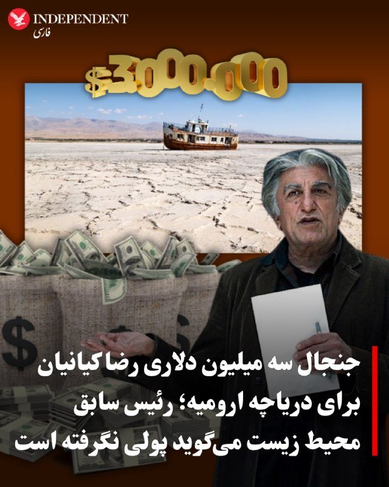
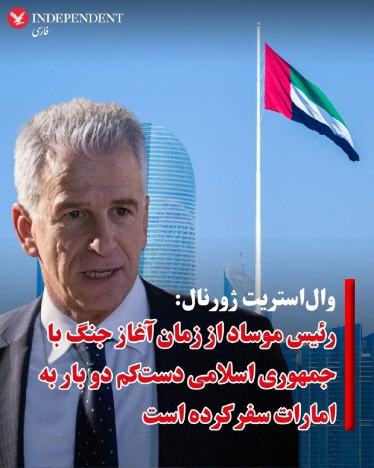
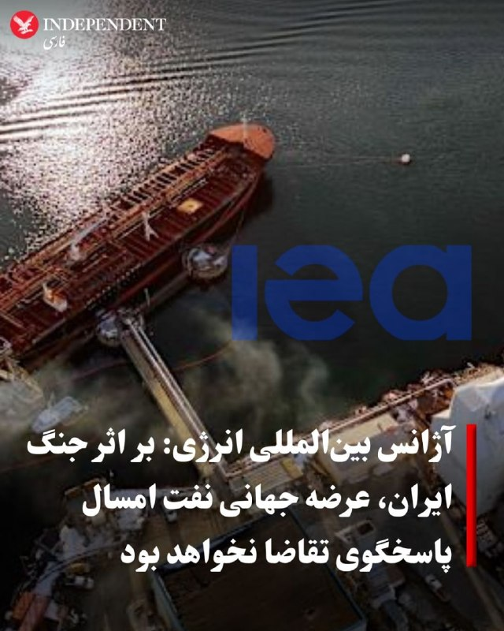
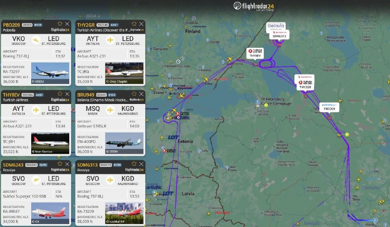
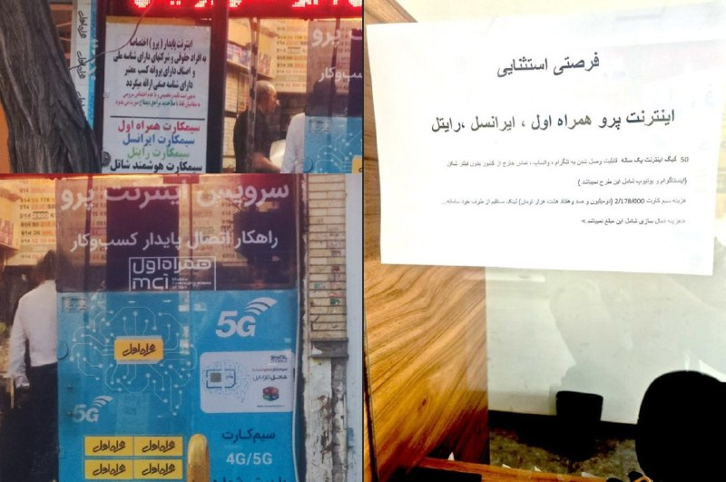
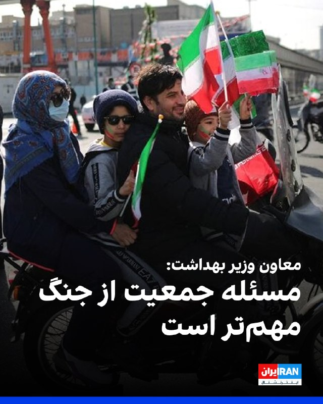
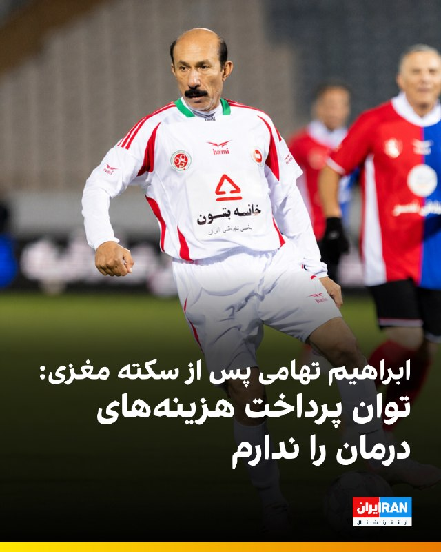
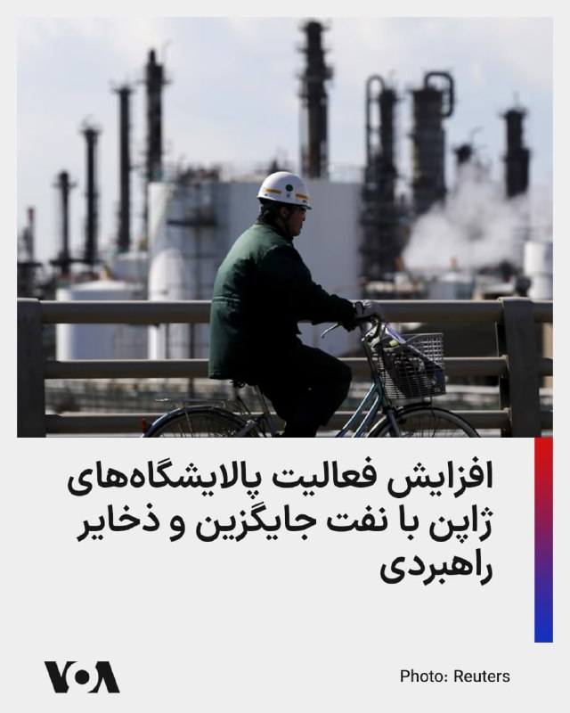
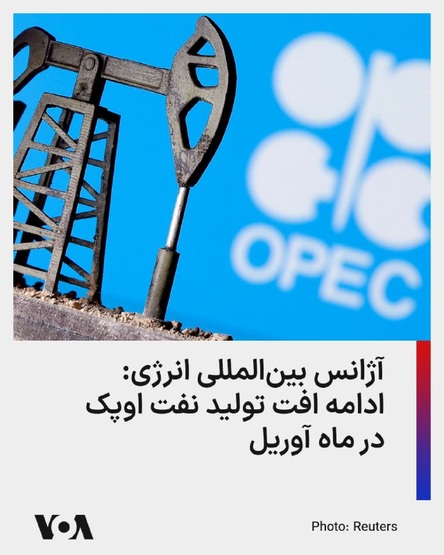
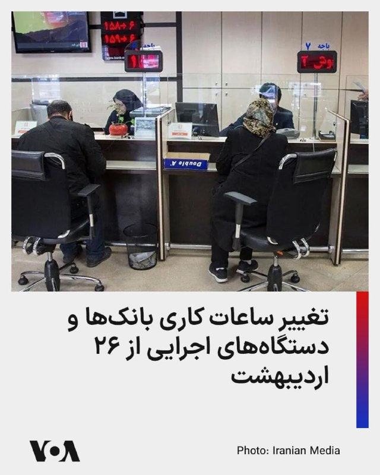

# خواننده تلگرام

<!-- TOP_NAV START -->

<!-- TOP_NAV END -->

<!-- MSG START -->

---
📅 بروزرسانی: 1405/02/23 14:52
---

## VahidOOnLine — post 239878

  

چارلز سوم، پادشاه بریتانیا، در آغاز سخنرانی خود در پارلمان این کشور با اشاره به وضعیت کنونی جهان اعلام کرد که دولت در برابر «جهانی خطرناک و بی‌ثبات» با قدرت واکنش نشان خواهد داد. او درگیری در خاورمیانه را تازه‌ترین نمونه از تهدیدهایی دانست که بریتانیا با آن روبه‌رو است.

او گفت: «جهانی که به‌طور فزاینده‌ای خطرناک و بی‌ثبات است، بریتانیا را تهدید می‌کند و درگیری در خاورمیانه تنها تازه‌ترین نمونه آن است. هر بخش از انرژی ملی، دفاع و امنیت اقتصادی کشور مورد آزمون قرار خواهد گرفت.»

پادشاه افزود: «دولت من با قدرت به این جهان پاسخ خواهد داد و در پی ایجاد کشوری خواهد بود که برای همه عادلانه باشد.»
‌🏁 🇬🇧 IranintlTV

🤖 @VahidOOnLine

## VahidOOnLine — post 239877

🗣روایت شما از اقتصاد بحرانی زیر سایه آتش‌بس- چهارشنبه ۲۳ اردیبهشت:
🔹واقعا نمی‌دونیم چیکار کنیم. حتی نفس کشیدن هم گرون شده. یکی از ترس‌های بزرگم اینه جنگ تموم شه، اینا باقی بمونن و به‌دنبال مخالف‌ها بگردن تا در سکوت قتل‌عام راه بندازن.

🔹در بازار لوازم‌خانگی امین حضور، قیمت کالاهایی از برندهای خارجی به شدت گرون و چند برابر شده، به این دلیل که از امارات بار قاچاق وارد نمی‌شه. قیمت مصرف لوازم خانگی از برندهای ایرانی هم هر هفته و بی‌دلیل افزایش پیدا می‌کنه.

🔹من یک دختر ۳۰ ساله از تهران هستم که هنوز با خانواده زندگی می‌کنم. ۸ سال کار کردم تا به آرزوهام برسم ولی الان دارم یکی‌یکی طلاهایی که پس‌انداز کرده بودم رو می‌فروشم تا فقط گذران زندگی کنم.

🔹من پشت کنکوری هستم و اگر امسال قبول نشم، باید برم سربازی اما نه پول کتاب کمک ‌درسی رو دارم نه اینترنت که بتونم از یوتیوب یا وبسایت‌ها چیزی یاد بگیرم.

🔹تریدر بازار فارکس و کریپتو هستم و با قطعی اینترنت کاملاً بیکار شدم. در واقع تمامی کسانی که درآمد ثابتشون با اینترنت بود، بیکار شدن و نمی‌دونن دقیقا باید چیکار کرد.

🔹پیش از جنگ اینترنت رو ماهانه ۴۹۰ هزار تومان شارژ می‌کردم. الان برای استفاده از اسنپ، بانک و دیجی‌کالا که برای خود حکومت هست، ماهانه ۸۰۰ هزار تومان پرداخت می‌کنم.

🔹وضعیت خیلی بده. کسی که پول نداشت، هزار برابر بیشتر ندار شده. پدر من بعد از ۳۰ سال معلم بودن هنوز مستاجره و این حقوق نه‌تنها کفاف زندگیش رو نمیده، بلکه از پرداخت پول داروهای مادرم هم عاجزیم.

🔹 من دو شغل دارم؛ کار آزادم از عید تا به امروز تعطیله و این خودش ضرر مالی هست و شغل دومم هم که دولتیه، حقوقم ۱۰ روز عقب افتاده.
‌🏁 🇬🇧 IranintlTV

🤖 @VahidOOnLine

## VahidOOnLine — post 239876

  

♦️ادعای رضا کیانیان، هنرپیشه مشهور سینما و تلویزیون ایران درباره کمک سه میلیون دلاری در کارزار احیای دریاچه ارومیه، جنجالی شده است.

کیانیان در مصاحبه با برنامه اینترنتی بهاره افشاری گفته بود: «سه میلیون دلار  [از ژاپن] گرفتم و به عیسی کلانتری دادم».

عیسی کلانتری، رئیس سابق سازمان محیط زیست در مصاحبه با ایلنا با تکذیب گفته‌های کیانیان گفت: « رضا کیانیان پولی از جایکا (دفتر همکاری‌های ایران و ژاپن) نگرفته که به من بدهد، اگر گرفته، اثبات کند! او اصلا او از جایگاه جایکا اطلاعی ندارد و آنها پول به فرد نمی‌دهند، خواستم شکایت کنم اما دیدم از روی بی‌اطلاعی این حرف‌ها را می‌گوید و یا شاید ‌دنبال بزرگ کردن خودش است.»
‌🇸🇦 Indypersian

🤖 @VahidOOnLine

## VahidOOnLine — post 239875

  

علیرضا رییسی، معاون بهداشت وزارت بهداشت، با هشدار نسبت به «سیر نزولی جمعیت» در کشور گفت: «روند جمعیت در ایران و جهان همچنان نزولی است، اما معتقدم مسئله جمعیت حتی از چالش‌های نظامی و جنگ‌های جاری نیز مهم‌تر است.»

او افزود: «همین اقتداری که ملت و نیروهای مسلح در ایام جنگ نشان داده‌اند، ناشی از همین جمعیت جوان است.»
‌🏁 🇬🇧 IranintlTV

🤖 @VahidOOnLine

## VahidOOnLine — post 239874

  

♦️وال استریت ژورنال روز چهارشنبه ۲۳ اردیبهشت به نقل از مقام‌های عرب و یک فرد آگاه گزارش داد، رئیس سازمان جاسوسی اسرائیل، موساد در طول جنگ با ایران دست‌کم دو بار به منظور هماهنگی در مورد جنگ به امارات متحده عربی سفر کرده است.
این منابع گفتند که دیوید بارنیا، رئیس موساد، دست‌کم در دو نوبت جداگانه، در ماه مارس و آوریل، مخفیانه از امارات متحده عربی بازدید کرد.

این منابع سفر بارنیا به امارات را نشانه‌ای از همکاری رو به رشد بین اسرائیل و امارات متحده عربی دانسته‌اند.
وال استریت ژورنال گزارش داده است که دو کشور در طول جنگ هماهنگی امنیتی نزدیکی را نشان داده‌اند و اسرائیل سامانه گنبد آهنین و ده‌ها پرسنل نظامی را برای راه‌اندازی آنها جهت دفاع در برابر موشک‌های ایرانی به امارات اعزام کرده است. دیوید هاکبی، سفیر ایالات متحده در اسرائیل روز سه‌شنبه گزارش‌های غیررسمی درباره استقرار سامانه گنبد آهنین و نیروهای اسرائیلی در امارات را تائید کرده بود.
وزارت امور خارجه امارات متحده عربی و دفتر نخست وزیر اسرائیل هنوز به این گزارش واکنشی نشان نداده‌اند.
‌🇸🇦 Indypersian

🤖 @VahidOOnLine

## VahidOOnLine — post 239873

  

روزنامه وال‌استریت ژورنال به نقل از مقام‌های عرب و یک فرد آگاه گزارش داد دیوید بارنئا، رییس موساد، در جریان جنگ علیه جمهوری اسلامی دست‌کم دو بار به امارات متحده عربی سفر کرد تا درباره هماهنگی‌های مرتبط با جنگ گفت‌وگو کند.

به گفته منابع آگاه، بارنئا در ماه‌های مارس و آوریل در دو نوبت جداگانه و به‌صورت محرمانه به امارات متحده عربی سفر کرد.

وزارت خارجه امارات متحده عربی و دفتر نخست‌وزیر اسرائیل بلافاصله به درخواست‌های این روزنامه برای اظهار نظر پاسخ ندادند.
‌🏁 🇬🇧 IranintlTV

🤖 @VahidOOnLine

## VahidOOnLine — post 239872

  <a href="telegram/content/VahidOOnLine_239872_1778671346.mp4" target="_blank">🎬 Download video</a>

⭕️ارتش اسرائیل تصاویری از حملات به زیرساخت‌های حزب‌الله در جنوب لبنان منتشر کرد

♦️ارتش اسرائیل روز چهارشنبه ۲۳ اردیبهشت تصاویری از حملات به زیرساخت‌های حزب‌الله در جنوب لبنان منتشر کرد.
ارتش اسرائیل همچنین اعلام کرد که این حملات در قالب موج تازه‌ای از عملیات علیه مواضع حزب‌الله انجام شده است.
این حملات با وجود آتش‌بس میان اسرائیل و دولت لبنان برای توقف درگیری‌ها ادامه دارد و تنش‌ها در مناطق مرزی همچنان بالا باقی مانده است.
‌🇸🇦 Indypersian

🤖 @VahidOOnLine

## VahidOOnLine — post 239871

  

♦️عباس عراقچی وزیر خارجه جمهوری اسلامی و جیحون بایراموف وزیر خارجه جمهوری آذربایجان، روز چهارشنبه ۲۳ اردیبهشت در یک تماس تلفنی درباره تحولات منطقه‌ای و روابط دوجانبه گفتگو کردند.
رسانه‌های ایران جزئیات بیشتری در خصوص این تماس تلفنی منتشر نکرده‌اند.
عباس عراقچی، وزیر امور خارجه جمهوری اسلامی قرار است این هفته برای شرکت در نشست وزرای خارجه بریکس، روزهای ۲۴ و ۲۵ اردیبهشت (۱۴ و ۱۵ مه) به دهلی‌نو سفر کند.
‌🇸🇦 Indypersian

🤖 @VahidOOnLine

## VahidOOnLine — post 239870

  

♦️آژانس بین‌المللی انرژی روز چهارشنبه ۲۳ اردیبهشت در گزارش ماهانه بازار نفت خود اعلام کرد که عرضه جهانی نفت امسال پاسخگوی کل تقاضا نخواهد بود، زیرا جنگ ایران تولید نفت خاورمیانه را مختل کرده است.

این نهاد بین‌المللی اعلام کرد: «با توجه به محدودیت تردد نفتکش‌ها در تنگه هرمز، مجموع کاهش عرضه از سوی تولیدکنندگان خلیج فارس در حال حاضر از یک میلیارد بشکه فراتر رفته و بیش از ۱۴ میلیون بشکه در روز نفت اکنون مسدود شده است که یک شوک عرضه بی‌سابقه است.»

به گزارش رویترز، آژانس بین‌المللی انرژی اعلام کرد که پیش‌بینی اولیه آن از سرگیری تدریجی تردد از طریق تنگه هرمز از سه ماهه سوم (ژوئیه/مرداد) به بعد است.

پیش‌بینی‌های آژانس بین‌المللی انرژی حاکی از آن است که عرضه در سال نزدیک به یک میلیون و هشتصد هزار بشکه در روز کمتر از کل تقاضا خواهد بود.
‌🇸🇦 Indypersian

🤖 @VahidOOnLine

## WithYashar — post 11140

ایتالیا اعلام کرد که کشتی‌های مین‌روب خود را به نزدیکی آب‌های خلیج فارس اعزام خواهند کرد ولی شروع مین‌روبی‌ ، به دستیابی به یک آتش‌بس دائم و پایدار بستگی دارد.
@withyashar

## WithYashar — post 11139

سلام یاشار جان خسته نباشی❤️ تو یه اتفاق جالب با همکلاسیم نشسته بودیم تو سلف دانشگاه غذا میخوردیم،دوستم پرسید اخبار چک میکنی گفتم اره،بعد نشون هم دادیم گوشیامونو😅چند روز پیش کانالتو براش فرستادم،البته از اینستا میشناختت ولی کانالتو نداشت،و پیجتم دنبال نمیکرد…

## WithYashar — post 11138

  

سلام یاشار جان خسته نباشی❤️
تو یه اتفاق جالب با همکلاسیم نشسته بودیم تو سلف دانشگاه غذا میخوردیم،دوستم پرسید اخبار چک میکنی گفتم اره،بعد نشون هم دادیم گوشیامونو😅چند روز پیش کانالتو براش فرستادم،البته از اینستا میشناختت ولی کانالتو نداشت،و پیجتم دنبال نمیکرد فقط چندبار دیده بود.
دوستم‌گفت بهت بگم‌ همش اخبارو چک میکنیم و منتظر اخبار بعدی میمونیم😅

## WithYashar — post 11137

  

اولین «نمایندگی رسمی مجاز اپل» یا Apple Authorized Reseller در افغانستان افتتاح شد
@withyashar

## WithYashar — post 11136

دیو دی‌کمپ، روزنامه نگار آمریکایی: شاید ظرف یک هفته آینده شاهد بازگشت به عملیات نظامی بزرگ آمریکا علیه ایران باشیم
@withyashar

## WithYashar — post 11135

نیویورک تایمز: قصد ترامپ از تغییر نام عملیات «خشم حماسی» به «چکش سنگین» این است که یک عملیات جدید ۶۰ روزه حمله به ایران شروع کند @withyashar

## WithYashar — post 11134

سخنگوی وزارت خارجه: ما عملاً در یک آتش‌بس اسمی قرار داریم، اما طبق حقوق بین‌الملل، خودِ محاصره یک اقدام جنگی محسوب می‌شود.
@withyashar

## mwarmonitor — post 9024

✈️🇺🇸نیروی هوایی آمریکا به دنبال تجهیز جنگنده‌های F-16 به اخلالگرهای نورثروپ گرومن است

📝نویسنده: کالین دمارست AXIOS

🔰نیروی هوایی ایالات متحده در نظر دارد بر اساس اسناد بودجه، طی چند سال آینده ۲۰۶ پکیج ارتقایافته جنگ الکترونیک برای جنگنده‌های F-16 خریداری کند.

🔸چرا این موضوع اهمیت دارد؟
هواپیماهای جنگنده ساخت شرکت لاکهید مارتین می‌توانند از اوایل سال ۲۰۲۸ به «سوییت یکپارچه جنگ الکترونیک وایپر» (IVEWS) محصول شرکت نورثروپ گرومن مجهز شوند.
🔹مارک ساندور، مدیر استراتژی و راهکارهای ماموریتی نورثروپ، به اکسیوس (Axios) گفت:
«این اقدام در واقع به معنای قرار دادن جنگ الکترونیک نسل ششم در یک پلتفرم نسل چهارم است.»
🔸وضعیت فعلی: پروژه‌ای که سال‌ها در حال توسعه بوده است
۲۰۱۹: نیروی هوایی برای اولین بار سیستم IVEWS را انتخاب کرد.
۲۰۲۱: اولین پرواز این سیستم در رزمایش "Northern Lightning" انجام شد.
۲۰۲۴: پروازهای آزمایشی بر روی F-16های نیروی هوایی آغاز گشت.
۲۰۲۵: ارزیابی‌های عملیاتی به پایان رسید.
در همان سال، نورثروپ اعلام کرد که سیستم IVEWS به طور «یکپارچه» با رادار آرایه فازی فعال SABR کار می‌کند. فیل لودن، مدیر بخش IVEWS در نورثروپ، اظهار داشت: «سخت‌افزار و نرم‌افزار بسیار پایدار بوده‌اند و نیروی هوایی با جدیت در حال افزایش سرعت تولید است.»
نگاهی به گذشته و چشم‌انداز جهانی
بودجه: سیستم IVEWS مبلغ ۱۸۷ میلیون دلار از بودجه سال ۲۰۲۵ دریافت کرد که صرف تولید اولیه با نرخ پایین شد.

🔸بازار بین‌المللی: علاقه زیادی به این پکیج جنگ الکترونیک در سطح جهان وجود دارد. در حال حاضر حدود ۲,۸۰۰ فروند F-16 در بیش از ۲۴ کشور در حال خدمت هستند.
🔹مشتریان خارجی: در سال ۲۰۲۴، گزارش‌های گسترده‌ای مبنی بر خرید این سیستم توسط ترکیه منتشر شد. لودن در این باره گفت: «ما به طور فعال در فرآیند فروش نظامی خارجی با بسیاری از کشورهای شریک درگیر هستیم.»

@mwarmonitor

## mwarmonitor — post 9023

  

❌به نظر می‌رسد حریم هوایی اطراف سن‌پترزبورگ بسته شده و پروازها در فاصله‌ای امن در حالت انتظار قرار گرفته‌اند.

@mwarmonitor

## mwarmonitor — post 9022

🔴رئیس موساد، بارنیا، دست‌کم دو بار در طول جنگ به امارات متحده عربی سفر کرده است تا برای هماهنگی در کارزار علیه ایران اقدام کند (وال‌استریت ژورنال).

@mwarmonitor

## FoxNewsTwitter — post 341628

  <a href="telegram/content/FoxNewsTwitter_341628_1778671353.mp4" target="_blank">🎬 Download video</a>

Fox News (Twitter/X)

NEW: House Speaker Mike Johnson sounds the alarm on “mini Mamdanis” to @kilmeade as Democrats trend toward electing socialists around the country:

BRIAN KILMEADE: "Democrats seem to be nominating some extreme candidates... People say, ‘This is just like what the Republicans went through after they lost to Obama, they had the Tea Party.’ Is this the same to you?"

JOHNSON: "This is something that we have never seen before in American history... This is about moving away from a constitutional republic to a communist utopian ideology."

"This is not our father's Democratic Party anymore. They're going far, far left and no one’s there to stop it."

| @foxandfriends

## FoxNewsTwitter — post 341627

  <a href="telegram/content/FoxNewsTwitter_341627_1778671356.mp4" target="_blank">🎬 Download video</a>

Fox News (Twitter/X)

NEW: President Trump is heading to China as the Iran war keeps rattling global oil markets.
He says Xi is “a friend of mine” and predicts “good things will happen” — but the stakes are much bigger than a handshake.

@TreyYingst reports the trip comes after diplomatic solutions with Iran failed to break through.

## FoxNewsTwitter — post 341626

  

Fox News (Twitter/X)

Marco Rubio made a major fashion statement on Air Force One.

The Secretary of State spotted on the president's plane in the now-infamous gray Nike Tech tracksuit associated with Venezuelan leader Nicolás Maduro.

Maduro was seen wearing a strikingly similar outfit during his capture by American forces earlier this year.

## pm_afshaa — post 90682

🔥رفقا بار هزارمه تبلیغ هانارو میذارم واستون ی مشتری ناراضی نداره و مخصوص یوزرای ما تخفیف گذاشته👇🏼 1 Gig = 280,000 T 2 Gig = 560,000 T 3 Gig = 800,000 T 5 Gig = 1,200,000 T 10 Gig = 2,200,000T 20 Gig = 4,000,000T 💎پرداخت ریال ، کارت به کارت 💵واریز با ارز…

## pm_afshaa — post 90681

🔥رفقا بار هزارمه تبلیغ هانارو میذارم واستون ی مشتری ناراضی نداره و مخصوص یوزرای ما تخفیف گذاشته👇🏼

1 Gig = 280,000 T
2 Gig = 560,000 T
3 Gig = 800,000 T
5 Gig = 1,200,000 T
10 Gig = 2,200,000T
20 Gig = 4,000,000T

💎پرداخت ریال ، کارت به کارت

💵واریز با ارز دیجیتال ( ترون )

📌قابلیت مشاهده حجم مصرفی
📌نامحدود بودن تعداد کاربران
📌سرعت دانلود به شدت بالا

ایدی جهت خرید👇🏼👇🏼👇🏼👇🏼

@RealHoneyi

## pm_afshaa — post 90680

🔴سنتکام:همچنان به اعمال محاصره علیه کشتی‌هایی که به داخل ایران وارد می‌شوند یا از آنها خارج می‌شوند، ادامه می‌دهیم

💧 Rainbet.com the #1 Non-KYC Crypto Casino & Sportsbook @rainbetcom

😁 @Pm_Afshaa

## pm_afshaa — post 90679

  <a href="telegram/content/pm_afshaa_90679_1778671359.webm" target="_blank">🎬 Download video</a>

🔴سی‌ان‌ان: پیش‌بینی میشه ترامپ از رئیس‌جمهور چین بخواد که بر ایران فشار بیاره تا تنگه هرمز رو بازگشایی کنه و با یک توافق صلح مناسب موافقت کنه.

💧 Rainbet.com the #1 Non-KYC Crypto Casino & Sportsbook @rainbetcom

😁 @Pm_Afshaa

## pm_afshaa — post 90678

  <a href="telegram/content/pm_afshaa_90678_1778671360.webm" target="_blank">🎬 Download video</a>

🔴اپل به صورت رسمی اولین نمایندگی خودش رو در افغانستان افتتاح کرد..

💧 Rainbet.com the #1 Non-KYC Crypto Casino & Sportsbook @rainbetcom

😁 @Pm_Afshaa

## pm_afshaa — post 90677

  <a href="telegram/content/pm_afshaa_90677_1778671361.webm" target="_blank">🎬 Download video</a>

🔴سخنگوی وزارت خارجه:
آمریکا فعلا با پیشنهاد جمهوری اسلامی موافقت نکرده، اما تهران از طریق میانجی‌های پاکستانی منتظر ارزیابی دقیق‌تره.

💧 Rainbet.com the #1 Non-KYC Crypto Casino & Sportsbook @rainbetcom

😁 @Pm_Afshaa

## pm_afshaa — post 90676

  <a href="telegram/content/pm_afshaa_90676_1778671362.webm" target="_blank">🎬 Download video</a>

🔴رسانه‌های اسرائیلی:
رئیس موساد، حداقل دو بار در طول جنگ به منظور هماهنگی کمپین علیه جمهوری اسلامی به امارات متحده عربی سفر کرده.

💧 Rainbet.com the #1 Non-KYC Crypto Casino & Sportsbook @rainbetcom

😁 @Pm_Afshaa

## pm_afshaa — post 90675

🔴دیو دی‌کمپ، روزنامه نگار آمریکایی: شاید ظرف یک هفته آینده شاهد بازگشت به عملیات نظامی بزرگ آمریکا علیه ایران باشیم

💧 Rainbet.com the #1 Non-KYC Crypto Casino & Sportsbook @rainbetcom

😁 @Pm_Afshaa

## pm_afshaa — post 90674

🔴کانال 13 اسرائیل:نتانیاهو امشب جلسه امنیتی ویژه در مورد ایران برگزار خواهد کر‌د

💧 Rainbet.com the #1 Non-KYC Crypto Casino & Sportsbook @rainbetcom

😁 @Pm_Afshaa

## iaghapour — post 2605

  

⭕️ با اپ TunnelX در ویندوز از قابلیت Split Tunneling استفاده کنید.

🔹اپ TunnelX برای زمانی ساخته شده که کاربر نمی‌خواهد تمام ترافیک سیستم از وی‌پی‌ان عبور کند. با این برنامه می‌توان فقط برنامه‌هایی مثل مرورگر، تلگرام، ابزارهای توسعه یا برنامه‌های مشخص دیگر را وارد تونل کرد و بقیه ترافیک سیستم را روی اینترنت عادی نگه داشت. همچنین در صورت نیاز، حالت Full-route برای عبور کل سیستم از تونل در دسترس است.

🔗 دانلود اپ از گیت‌هاب پروژه

🆔 @iaghapour

## DEJradio — post 4613

  <a href="telegram/content/DEJradio_4613_1778671363.mp4" target="_blank">🎬 Download video</a>

🔺🎥 ”ساختمون فرماندهان ارشد سـ.ـپاه در جنگ کاملا داغون شد

یک شهروند خبرنگار از تهران با ارسال ویدیویی از انهدام کامل یکی از اقامتگاه‌های سـ.ـپاه پاسداران نوشت، «این ساختمونی است که فرماندهان ارشد زندگی میکردن همونایی که تو جنگ بمبارون شدن. می‌گن جنگ رو بردیم ولی حتی پول ندارن خونه‌های داغون ‌شده ‌شون رو درست کنن. این دیگه چه جور پیروزیه؟ این فیلمی رو که دیشب تو تهران گرفتم، براتون می‌فرستم.»

#جمهوری_اسلامی #IRGCterrorists
@DEJradio

## DEJradio — post 4612

  <a href="telegram/content/DEJradio_4612_1778671365.mp4" target="_blank">🎬 Download video</a>

🤡
🔺 شخم زدن زمین توسط ارتش برای مقابله با فرود هواپیماهای آمریکا

#جمهوری_اسلامی #ارتش
@DEJradio

## DEJradio — post 4611

  <a href="telegram/content/DEJradio_4611_1778671368.mp4" target="_blank">🎬 Download video</a>

🔺📢 من دانشجو هستم و تا چند وقت دیگر باید از ایران بروم. چون سیستم های بین المللی قطع است و پدر و مادرم نمی توانند برایم پول واریز کنند، مجبورم مقدار بیشتری دلار ببرم تا هزینه یکسال را داشته باشم. اکثر دستگاه‌های عابربانک قطع هستند و یا پول نمی دهند و اگر هم پول می‌دهند بسیار محدود.

دلار هم تا یک سقفی صرافی‌ها می فروشند. گرفتار شده‌ام. اگر وضع مملکت درست بود مجبور نبودم پدرو مادر و دوست و آشنا را ول کنم و با فوق لیسانس دانشگاه امیرکبیر، تازه بروم از نو درس بخوانم.
مردم همه گرفتارند، بانک‌ها خودشان دنبال پول نقد هستند.

#جمهوری_اسلامی
@DEJradio

## mamlekate — post 103521

📝 صادرات نفت از جزیره خارک برای نخستین بار از آغاز جنگ، چند روز متوقف شد

تصاویر ماهواره‌ای نشان می‌دهند صادرات نفت از پایانه اصلی نفتی ایران در جزیره خارک طی روزهای اخیر متوقف شده و همزمان ظرفیت مخازن ذخیره‌سازی این جزیره نیز رو به تکمیل است؛ وضعیتی که می‌تواند جمهوری اسلامی را ناچار به کاهش بیشتر تولید نفت کند.

@mamlekate

## mamlekate — post 103520

  

📿 آگهی دفتر پیشخوان دولت برای فروش اینترنت طبقاتی پرو

📿 «سیم‌کارت سفید» ۱۲۰ میلیون تومان

📿 اینترنت تهدید شدید امنیتیه، ولی پول بدی دیگه تهدید نیست

@mamlekate 
🕊️ مملکته

## mamlekate — post 103519

❓ ساعت ۹:۰۲ دقیقه امروز یه صدای خیلی بلند با ارتعاش زیاد اومد سمت چیذر شنیدیم ما. انگار ۷،۸ کیلومتر فاصله داشت باهامون. ۹:۶ دقیقه و ۹:۱۱ دقیقه هم‌ اومد. آسمون ابری نیست که بگم‌صدای رعد و برقه

❗️ الو این صدا رو ما هم تو جردن شنیدیم فکر کردیم رعد و برقه. سمت کوه های تهران اره ابریه و هوا ابری بود احتمالا همون رعد و برق بود

❗️ این سه تا صدا رو همه شنیدیم. از شرق تا غرب.. لرزه نداشت من که یوسف ابادم ولی صدای مهیبی بود. هوا هم از این بهاری/گرم/ابری طوریاست که همه جوره تو اسمون بود. ولی صدای مهیبی بود همه مون به هم زنگ زدیم.

@mamlekate

## IranIntlTV — post 336966

چارلز سوم در «سخنرانی پادشاه» در مراسم افتتاح رسمی پارلمان بریتانیا گفت سیاست دولت همچنان بر ادامه حمایت از مردم اوکراین و بهبود روابط با شرکای اروپایی خواهد بود.
@iranintltv

## IranIntlTV — post 336965

  <a href="telegram/content/IranIntlTV_336965_1778671371.mp4" target="_blank">🎬 Download video</a>

چارلز سوم در «سخنرانی پادشاه» در پارلمان بریتانیا، با اشاره به اینکه قانون استقلال انرژی تجدیدپذیر به‌زودی معرفی خواهد شد، گفت استقلال انرژی باید هدفی بلندمدت برای امنیت ملی این کشور باشد. او افزود افزایش تولید انرژی کمک می‌کند دشمنان بریتانیا نتوانند امنیت اقتصادی مردم این کشور را هدف قرار دهند.
@iranintltv

## IranIntlTV — post 336964

  <a href="telegram/content/IranIntlTV_336964_1778671373.mp4" target="_blank">🎬 Download video</a>

چارلز سوم در «سخنرانی پادشاه» در پارلمان بریتانیا گفت کشورش در حوزه‌های اقتصاد، انرژی و دفاع با آزمون‌های دشواری روبه‌رو شده و دولت با یهودستیزی برخورد خواهد کرد.
@iranintltv

## IranIntlTV — post 336963

  

چارلز سوم، پادشاه بریتانیا، در آغاز سخنرانی خود در پارلمان این کشور با اشاره به وضعیت کنونی جهان اعلام کرد که دولت در برابر «جهانی خطرناک و بی‌ثبات» با قدرت واکنش نشان خواهد داد. او درگیری در خاورمیانه را تازه‌ترین نمونه از تهدیدهایی دانست که بریتانیا با آن روبه‌رو است.

او گفت: «جهانی که به‌طور فزاینده‌ای خطرناک و بی‌ثبات است، بریتانیا را تهدید می‌کند و درگیری در خاورمیانه تنها تازه‌ترین نمونه آن است. هر بخش از انرژی ملی، دفاع و امنیت اقتصادی کشور مورد آزمون قرار خواهد گرفت.»

پادشاه افزود: «دولت من با قدرت به این جهان پاسخ خواهد داد و در پی ایجاد کشوری خواهد بود که برای همه عادلانه باشد.»
https://iranintl.com/202605132329

## IranIntlTV — post 336962

🗣روایت شما از اقتصاد بحرانی زیر سایه آتش‌بس- چهارشنبه ۲۳ اردیبهشت:
🔹واقعا نمی‌دونیم چیکار کنیم. حتی نفس کشیدن هم گرون شده. یکی از ترس‌های بزرگم اینه جنگ تموم شه، اینا باقی بمونن و به‌دنبال مخالف‌ها بگردن تا در سکوت قتل‌عام راه بندازن.

🔹در بازار لوازم‌خانگی امین حضور، قیمت کالاهایی از برندهای خارجی به شدت گرون و چند برابر شده، به این دلیل که از امارات بار قاچاق وارد نمی‌شه. قیمت مصرف لوازم خانگی از برندهای ایرانی هم هر هفته و بی‌دلیل افزایش پیدا می‌کنه.

🔹من یک دختر ۳۰ ساله از تهران هستم که هنوز با خانواده زندگی می‌کنم. ۸ سال کار کردم تا به آرزوهام برسم ولی الان دارم یکی‌یکی طلاهایی که پس‌انداز کرده بودم رو می‌فروشم تا فقط گذران زندگی کنم.

🔹من پشت کنکوری هستم و اگر امسال قبول نشم، باید برم سربازی اما نه پول کتاب کمک ‌درسی رو دارم نه اینترنت که بتونم از یوتیوب یا وبسایت‌ها چیزی یاد بگیرم.

🔹تریدر بازار فارکس و کریپتو هستم و با قطعی اینترنت کاملاً بیکار شدم. در واقع تمامی کسانی که درآمد ثابتشون با اینترنت بود، بیکار شدن و نمی‌دونن دقیقا باید چیکار کرد.

🔹پیش از جنگ اینترنت رو ماهانه ۴۹۰ هزار تومان شارژ می‌کردم. الان برای استفاده از اسنپ، بانک و دیجی‌کالا که برای خود حکومت هست، ماهانه ۸۰۰ هزار تومان پرداخت می‌کنم.

🔹وضعیت خیلی بده. کسی که پول نداشت، هزار برابر بیشتر ندار شده. پدر من بعد از ۳۰ سال معلم بودن هنوز مستاجره و این حقوق نه‌تنها کفاف زندگیش رو نمیده، بلکه از پرداخت پول داروهای مادرم هم عاجزیم.

🔹 من دو شغل دارم؛ کار آزادم از عید تا به امروز تعطیله و این خودش ضرر مالی هست و شغل دومم هم که دولتیه، حقوقم ۱۰ روز عقب افتاده.

## IranIntlTV — post 336961

  

علیرضا رییسی، معاون بهداشت وزارت بهداشت، با هشدار نسبت به «سیر نزولی جمعیت» در کشور گفت: «روند جمعیت در ایران و جهان همچنان نزولی است، اما معتقدم مسئله جمعیت حتی از چالش‌های نظامی و جنگ‌های جاری نیز مهم‌تر است.»

او افزود: «همین اقتداری که ملت و نیروهای مسلح در ایام جنگ نشان داده‌اند، ناشی از همین جمعیت جوان است.»
https://iranintl.com/202605132086

## IranIntlTV — post 336960

  <a href="telegram/content/IranIntlTV_336960_1778671377.mp4" target="_blank">🎬 Download video</a>

یک شهروند با ارسال پیامی به ایران‌اینترنشنال می‌گوید: «گرانی بیداد می‌کند. جوان ۲۴ ساله‌ای هستم که هر شب از شدت غم، فکر می‌کنم الان است که سکته کنم. هیچ‌کس به داد ما نمی‌رسد.»

## IranIntlTV — post 336959

  

روزنامه وال‌استریت ژورنال به نقل از مقام‌های عرب و یک فرد آگاه گزارش داد دیوید بارنئا، رییس موساد، در جریان جنگ علیه جمهوری اسلامی دست‌کم دو بار به امارات متحده عربی سفر کرد تا درباره هماهنگی‌های مرتبط با جنگ گفت‌وگو کند.

به گفته منابع آگاه، بارنئا در ماه‌های مارس و آوریل در دو نوبت جداگانه و به‌صورت محرمانه به امارات متحده عربی سفر کرد.

وزارت خارجه امارات متحده عربی و دفتر نخست‌وزیر اسرائیل بلافاصله به درخواست‌های این روزنامه برای اظهار نظر پاسخ ندادند.
https://iranintl.com/202605134408

## IranIntlTV — post 336958

  <a href="telegram/content/IranIntlTV_336958_1778671381.mp4" target="_blank">🎬 Download video</a>

کانال ۱۳ اسرائیل از احتمال ازسرگیری درگیری میان اسرائیل و جمهوری اسلامی خبر داده و گزارش کرده است که ارتش این کشور همچنان در وضعیت آماده‌باش قرار دارد.
بابک اسحاقی، خبرنگار ایران‌اینترنشنال، گزارش می‌دهد
@iranintltv

## IranIntlTV — post 336957

  

🔻ابراهیم تهامی، بازیکن پیشین استقلال و تیم ملی فوتبال، که اسفند سال گذشته دچار سکته مغزی شده بود، درباره شرایط مالی خود به خبرگزاری تسنیم گفت: «هر جلسه فیزیوتراپی سه میلیون تومان هزینه دارد و برای کاردرمانی و گفتاردرمانی نیز باید حدود دو میلیون تومان پرداخت کنم، اما توان مالی آن را ندارم. به همین دلیل دو روز است فیزیوتراپی نرفته‌ام.»

🔹تهامی همچنین با انتقاد از بی‌توجهی برخی چهره‌های فوتبال گفت: «بازیکنان تیم ملی هیچ تماسی با من نگرفتند. انتظار زیادی از امیر قلعه‌نویی داشتم، اما او هم تاکنون تماسی نداشته است. دوست داشتم حالم را بپرسند.»

🔹او افزود: «محمد مایلی‌کهن با من تماس گرفت و جویای حالم شد که همین برایم کافی بود.»

@iranintltvsport

## IranIntlTV — post 336956

نسخه جمهوری اسلامی برای اقتصاد دیجیتال: اینترنت را ببند، غرفه اجاره بده

🖋فرشید نوروزی

هم‌زمان با تداوم قطع اینترنت در ایران و پیامدهای آن برای گروه‌های مختلف اجتماعی از جمله فروشندگان آنلاین، مقام‌های جمهوری اسلامی از برنامه‌هایی برای انتقال مشاغل خانگی از بستر فضای مجازی به «فضاهای فیزیکی» و «نمایشگاه‌ها» خبر دادند.

این اظهارات از آن جهت نگران‌کننده و قابل تأمل است که می‌تواند نشانه‌ای از عزم حکومت برای ادامه محدودیت اینترنت و جایگزین کردن فعالیت‌های آنلاین با مدل‌های کنترل‌پذیر فیزیکی باشد؛ آن هم در شرایطی که با وجود وعده‌های مبهم برخی مقام‌ها، هنوز چشم‌انداز روشنی برای اتصال آزاد و پایدار شهروندان ایرانی به اینترنت جهانی دیده نمی‌شود.

احمد میدری، وزیر تعاون، کار و رفاه اجتماعی، ۲۲ اردیبهشت به مناسبت روز مشاغل خانگی گفت: «مشاغل خانگی صرفا با فضای مجازی توسعه پیدا نمی‌کنند. اگرچه فضای مجازی در توسعه فروش محصولات خانگی موثر است و می‌تواند دسترسی‌ها و توسعه بازار را فراهم کند، ولی بدون فضای فیزیکی امکان توسعه مشاغل خانگی نیست.»

او حضور فیزیکی را تسهیل‌کننده «امکان مشارکت، توسعه عدالت و روابط بین بخشی» دانست و از اجرای طرحی با نام «هزار و یک میدان» خبر داد.

میدری ادامه داد: «در راستای طرح هزار و یک میدان، پلتفرم‌ها می‌توانند در این میدان‌ها آموزش بدهند. ما مشاغل و کسب‌وکارهای خانگی را دعوت می‌کنیم و پلتفرم‌ها می‌توانند از این فضا در شهرهای مختلف استفاده کنند.»

۷۵ روز از قطع اینترنت در ایران می‌گذرد و شهروندان تاکنون ۱۷۷۶ ساعت از دسترسی به شبکه جهانی محروم بوده‌اند.

راهکار حکومت برای بحران اینترنت: فروش حضوری یا استفاده از پلتفرم‌های داخلی
مالک حسینی، معاون توسعه کارآفرینی و اشتغال وزیر کار، ۲۲ اردیبهشت اعلام کرد نمایشگاه‌های مرتبط با طرح «هزار میدان، هزار بازار» ظرف ۱۰ روز آینده آغاز به کار می‌کنند و تا پایان سال جاری فعال خواهند بود.

او هدف این طرح را ایجاد «ظرفیت تازه‌ای برای عرضه و فروش محصولات مشاغل خانگی» دانست و گفت: «باید نمایشگاه‌های حضوری و بازارسازی برخط در کنار یکدیگر به‌عنوان یک ظرفیت مکمل برای تقویت فروش مشاغل خانگی دیده شوند.»

حسینی خواستار استفاده از «سکو‌های داخلی» برای فروش مشاغل خانگی شد و افزود: «اگر اینترنت بین‌الملل هم وصل شد، ماندگاری را در شبکه‌های داخلی می‌توان ادامه داد.»

معاون وزیر کار در حالی از اتصال دوباره اینترنت بین‌الملل با یک «اگر» نگران‌کننده سخن می‌گوید که فشارهای اقتصادی و معیشتی هر روز به‌طور فزاینده‌ای بر دوش مردم سنگینی می‌کند.

این در حالی است که فاطمه مهاجرانی، سخنگوی دولت مسعود پزشکیان، در پیام خود به مناسبت روز مشاغل خانگی، عملا نقش اینترنت و پلتفرم‌های دیجیتال را در توسعه این کسب‌وکارها منکر شد.

او در شبکه ایکس نوشت مشاغل خانگی زنان «در بستر شرکت ملی پست رونق یافته و بازاری به بزرگی ایران عزیزمان و حتی فراتر از مرزها فراهم آورده است».

در سوی دیگر، صفحه «فیلتربان» در ایکس که در حوزه حقوق دیجیتال و حق دسترسی به اینترنت فعالیت می‌کند، به‌شدت از این اظهارات مهاجرانی انتقاد کرد: «بهتر است به‌جای چنین پست‌هایی، کمی مسئولیت‌پذیر باشید یا حداقل سکوت کنید.»

قطع اینترنت؛ آن‌جا که چرخ معاش از حرکت می‌ایستد
در هفته‌های اخیر، شهروندان با ارسال پیام‌هایی به ایران‌اینترنشنال، از تداوم قطعی اینترنت در کشور به‌شدت انتقاد کردند و هشدار دادند زندگی روزمره و فعالیت‌های شغلی آنان، به‌طور فزاینده‌ای تحت تاثیر پیامدهای منفی این اقدام جمهوری اسلامی قرار گرفته است.

یک کارآفرین در پیام خود نوشت: «ناگهان ورود مواد اولیه قفل شد. از طرفی با قطع اینترنت، تمام سیستم فروش فلج شد. ۷۰ نفر نیرو بیکار شدند، خودم هم مفلس شدم.»

در پیام دیگری آمده است: «با خدا تومن کانفیگ تونستم وصل شم. من کارم با اینترنته و به‌خاطر قطعی نت بیکار شدم. کلی قسط دارم که باید تسویه بشه و اجاره باید بدم.»

یک مخاطب نیز گفت: «افزایش حداقل دو برابری قیمت‌ها و قطع اینترنت باعث تعطیلی کسب‌وکار ۱۱ ساله ما شد.»

کاربران فضای مجازی نیز درباره پیامدهای سنگین تداوم قطع اینترنت بر مشاغل آنلاین ابراز نگرانی کردند.

کاربری در ایکس نوشت: «به نظرم بچه‎‌های آنلاین‌شاپ‌های اینستاگرام به‌طور جدی دنبال مشاغل جدید باشند .... متاسفانه باید پذیرفت دیگه از این کار پولی گیر نمی‌آد.»

در پست دیگری در ایکس آمده است: «فکر کن طرف آنلاین‌شاپ داره. می‌ره سیم‌کارت پرو می‌گیره، بعد مشتری‌هاش قطع هستن.»

🔗متن کامل گزارش را اینجا بخوانید
@iranintltv

## IranIntlTV — post 336955

  <a href="telegram/content/IranIntlTV_336955_1778671384.mp4" target="_blank">🎬 Download video</a>

دونالد ترامپ، رییس‌جمهوری آمریکا، اعلام کرد گفت‌وگوها با جمهوری اسلامی در جریان است، اما واشینگتن با توجه به کاهش درآمدهای تهران، برای رسیدن به توافق عجله‌ای ندارد.
گفت‌وگو با علی‌حسین قاضی‌زاده، عضو تحریریه ایران‌اینترنشنال
@iranintltv

## IranIntlTV — post 336954

  <a href="telegram/content/IranIntlTV_336954_1778671386.mp4" target="_blank">🎬 Download video</a>

نوجوانان با ارسال پیام‌هایی به مدیا بات ایران‌اینترنشنال، از دغدغه‌ها و رنج‌های خود زیر سایه جمهوری اسلامی و پس از سرکوب خونین دی‌ماه می‌گویند.
جزییات بیشتر با لیلا سعادتی، عضو تحریریه ایران‌اینترنشنال
@iranintltv

## IranIntlTV — post 336953

  <a href="telegram/content/IranIntlTV_336953_1778671388.mp4" target="_blank">🎬 Download video</a>

یک شهروند اهل سیستان و بلوجستان با ارسال پیامی به ایران‌اینترنشنال می‌گوید: «ما همیشه محروم و گرسنه بودیم، ولی این روزها محروم‌تر و گرسنه‌تر هم شده‌ایم. گالن ۷۰ لیتری بنزین شده پنج میلیون تومان، در حالی که برای رسیدن به بیمارستان باید ۴۰ تا ۶۰ لیتر بنزین مصرف کنیم.»

## IranIntlTV — post 336952

  <a href="telegram/content/IranIntlTV_336952_1778671391.mp4" target="_blank">🎬 Download video</a>

یک شهروند با ارسال ویدیویی به ایران‌اینترنشنال می‌گوید: «امروز چیزی بخری، فردا ده برابر می‌شود. دیگر هیچ‌چیز نمی‌شود خرید. تا یک ماه پیش، بیشتر دغدغه‌ها روغن، تخم‌مرغ و کانفیگ بود، الان همه‌چیز هر روز چند برابر گران‌تر می‌شود.»

## IranIntlTV — post 336951

  <a href="telegram/content/IranIntlTV_336951_1778671393.mp4" target="_blank">🎬 Download video</a>

یک شهروند با ارسال پیام به ایران‌اینترنشنال می‌گوید: «داروهای اساسی، هم گران و هم نایاب شده‌اند. یک جعبه قرص مُداسین که قیمتش ۳۶۰ هزار تومان است را چون در داروخانه‌ها پیدا نمی‌شود، در بازار آزاد به قیمت پنج میلیون تومان خریدم.»

## FarsiVOA — post 217606

  

رویترز گزارش داد پالایشگاه‌های ژاپن برای نخستین بار از ماه مارس، نرخ فرآوری نفت خود را به بیش از ۷۰ درصد ظرفیت رسانده‌اند؛ اقدامی که با استفاده از نفت آزادشده از ذخایر دولتی و تأمین محموله‌های جایگزین انجام شده است.

ژاپن که معمولاً حدود ۹۵ درصد نفت وارداتی خود را از خلیج فارس تأمین می‌کند، پس از آغاز جنگ آمریکا و اسرائیل با جمهوری اسلامی و اختلال در تنگه هرمز، به سراغ نفت آمریکا، منطقه خزر، آمریکای لاتین و حتی یک محموله نفت روسیه غیرتحریمی رفته است.

شرکت‌های ایدمیتسو کوسان و کازمو انرژی، دومین و سومین پالایشگر بزرگ ژاپن، گفته‌اند در کنار منابع دیگر، از نفتی از خلیج فارس استفاده می‌کنند که مسیر آن از تنگه هرمز عبور نمی‌کند و هدف دارند نرخ فعالیت پالایشگاه‌های خود را در سال مالی جاری به بیش از ۹۰ درصد برسانند.

دولت ژاپن از ۱۶ مارس نفتی معادل حدود ۷۵ روز مصرف داخلی را از ذخایر خود در دسترس قرار داده؛ بزرگ‌ترین آزادسازی ذخایر نفتی در تاریخ این کشور.
@FarsiVOA

## FarsiVOA — post 217605

🔺اوج‌گیری بحران آب در ایران؛ از مصرف میلیاردی پایتخت تا هشدار در مورد مهاجرت اجباری میلیون‌ها نفر

▪️همزمان با هشدار کارشناسان و مقام‌های صنعت آب ایران درباره تنش‌های آبی و پیامدهای آن، شرکت آب و فاضلاب استان تهران روز چهارشنبه ۲۳ اردیبهشت، اعلام کرد که مصرف آب پایتخت به مرز سه میلیارد لیتر در شبانه روز رسیده است.

▪️در این میان، دبیرکل فدراسیون صنعت آب ایران هشدار داد که پایداری فلات مرکزی ایران در گرو کاهش فوری ۱۶ میلیارد مترمکعبی مصرف آب است؛ در غیر این صورت با بحران مهاجرت اجباری ۱۵ میلیون نفر مواجه خواهیم شد.

▪️فلات مرکزی ایران شامل هفت استان کرمان، فارس، اصفهان، یزد، مرکزی، قم و سمنان می‌شود که حدود ۲۰ درصد جمعیت کشور را در خود جای داده است.

⬇️ بیشتر بخوانید:
https://ir.voanews.com/a/8149523.html

## FarsiVOA — post 217604

  

آژانس بین‌المللی انرژی از ادامه افت تولید نفت اوپک در ماه آوریل به رغم آتش‌بس میان جمهوری اسلامی و آمریکا خبر داد.

بر اساس این گزارش، تولید روزانه نفت اعضای اوپک در ماه گذشته ۲۰ میلیون و ۱۸۰ هزار بشکه بوده که ۶۲۰ هزار بشکه کمتر از ماه مارس است.

در مجموع تولید روزانه نفت در جهان به خاطر انسداد تنگه هرمز توسط جمهوری اسلامی از ۹ اسفند، ۱۲ میلیون و ۸۰۰ هزار بشکه افت داشته است که بخشی از آن با آزادسازی ذخایر استراتژیک نفت جبران شده است.

ذخایر نفت قابل مشاهده جهان در ماه مارس ۱۲۹ میلیون بشکه و در ماه گذشته ۱۱۷ میلیون بشکه افت کرده است.
@FarsiVOA

## FarsiVOA — post 217603

  

رئیس فدراسیون بانک‌های امارات متحده عربی نگرانی‌ها درباره فرار سرمایه به‌دلیل جنگ ایران را رد کرد و گفت به رغم حملات جمهوری اسلامی، ثبات بانکی در امارات برقرار است.

عبدالعزیز الغریر اعلام کرد انتظار می‌رود در سه‌ماه دوم سال جاری میلادی، وضعیت حوزه بانکداری در این کشور بهتر از ماه‌های آغازین سال باشد. او در ادامه با رد نگرانی‌ها از فرار سرمایه از این کشور گفت «به‌طور میانگین وضعیت خوب است؛ بخشی از سرمایه‌ها خارج و بخشی دیگر وارد می‌شود».

طبق آمارهای کنفرانس تجارت و توسعه سازمان ملل متحد (آنکتاد) ورود سرمایه‌های مستقیم خارجی به امارات در سال گذشته نسبت به ۲۰۲۴ با جهشی ۴۹ درصدی به بالای ۵۶ میلیارد دلار اوج گرفته بود.
@FarsiVOA

## FarsiVOA — post 217602

  

ارتش اسرائیل اعلام کرد طی شبانه‌روز گذشته بیش از ۴۰ موضع وابسته به حزب‌الله در جنوب لبنان را هدف قرار داده و شماری از نیروهای این گروه را که تهدیدی برای نیروهای اسرائیلی محسوب می‌شدند، از پا درآورده است.

بر اساس اعلام ارتش اسرائیل، اهداف حمله‌شده شامل انبارهای سلاح، ساختمان‌های مورد استفاده نظامی و زیرساخت‌هایی بوده که حزب‌الله از آن‌ها برای پیشبرد حملات خود استفاده می‌کرد. ارتش اسرائیل همچنین اعلام کرد چند سکوی آماده شلیک راکت که به سمت اسرائیل نشانه‌گیری شده بودند، در این حملات منهدم شده‌اند.

این حملات پس از آن انجام شد که حزب‌الله چند راکت و یک پهپاد به سوی نیروهای اسرائیلی در جنوب لبنان شلیک کرد؛ حمله‌ای که به گفته ارتش اسرائیل تلفاتی به همراه نداشت، اما بار دیگر نشان داد آتش‌بس در مرز لبنان عملاً زیر فشار حملات حزب‌الله قرار گرفته است.

اسرائیل در کنار آمریکا و بسیاری از کشورهای دیگر، گروه شبه‌نظامی حزب‌الله را که مورد حمایت جمهوری اسلامی است، گروهی تروریستی می‌داند.
@FarsiVOA

## FarsiVOA — post 217601

  

ساعات کاری بانک‌ها، ادارات و دستگاه‌های اجرایی از ۲۶ اردیبهشت تا ۱۵ شهریور به ۷ تا ۱۳ تغییر کرد. این تصمیم با هدف «مدیریت مصرف انرژی و پایداری شبکه برق» اعلام شده است.

براساس ابلاغ سازمان اداری و استخدامی کشور، تمامی بانک‌ها، ادارات، شهرداری‌ها، مؤسسات عمومی دولتی و غیردولتی و سایر دستگاه‌های اجرایی موظف‌اند فعالیت روزانه خود را از ساعت ۷ صبح آغاز کرده و در ساعت ۱۳ به پایان برسانند. همچنین دستگاه‌ها ملزم هستند یک ساعت پیش از پایان وقت اداری، سامانه‌های سرمایشی خود را خاموش کنند.

این تغییر شامل واحدهای قضایی و اداری قوه قضائیه نیز می‌شود.

ساعات کاری در سال‌های اخیر نیز برای مدیریت مصرف برق در فصل‌های گرم، به ‌صورت مقطعی تغییر کرده است؛ از جمله از زمان لغو تغییر ساعت رسمی در شش ماه اول سال، ساعت کاری بانک‌ها و دستگاه‌های اجرایی جلوتر کشیده شد.

این رویکرد در عمل به ‌عنوان جایگزینی برای تغییر ساعت رسمی است که از سال ۱۴۰۲ و با مصوبه مجلس شورای اسلامی لغو شد.
@FarsiVOA

## DW_Farsi — post 124643

  

🔶 تلاش یک نفت‌کش چینی برای گذر از تنگه هرمز
 
داده‌های رهگیری کشتی‌ها حاکی از آن است که که یک نفت‌کش غول‌پیکر چین روز چهارشنبه ۱۳ مه (۲۳ اردیبهشت) در تلاش عبور از تنگه هرمز  بوده است. به گزارش رسانه‌ها، این نفت‌کش حامل دو میلیون بشکه نفت خام عراق است.
 
بر اساس داده‌های شرکت‌های "ال‌اس‌ای‌جی" و "کپلر" که در زمینه رهگیری کشتی‌ها فعالیت دارند،  نفتکش غول‌پیکر چینی "یوآن هوا هو" از نزدیکی جزیره لارک ایران عبور کرده و در بخش شرقی تنگه هرمز به سمت جنوب در حال حرکت است. 
 
این داده‌ها نشان می‌دهد که نفت‌کش مزبور، اوایل ماه مارس نزدیک به دو میلیون بشکه نفت خام "بصره مدیوم" را در ترمینال بصره عراق بارگیری کرده و از آن زمان در خلیج فارس مانده بود. اعلام شده که مقصد این نفتکش آسیا است.
 
خبرگزاری رویترز گزارش داده که اگر این تردد با موفقیت انجام گیرد، این سومین مورد ثبت‌شده عبور یک نفت‌کش چینی از تنگه هرمز از زمان آغاز جنگ آمریکا و اسرائیل علیه جمهوری اسلامی از اسفند ماه گذشته به این سو بوده است.
 
@dw_farsi

## DW_Farsi — post 124642

🔶 نیویورک تایمز: ایران به اکثر تأسیسات موشکی خود دسترسی دارد

به گزارش رسانه‌های آمریکایی، جمهوری اسلامی ایران به رغم  حملاتی که در جنگ با اسرائيل و آمریکا متحمل شده، هنوز به بخش بزرگی از سایت‌های موشکی  و پرتابگرهای سیار خود دسترسی دارد.
 
روزنامه نیویورک تایمز سه‌شنبه ۲۲ اردیبهشت (۱۲ مه) با استناد به داده‌های سازمان‌های امنیتی و اطلاعاتی ایالات متحده گزارش داد که ایران هنوز حدود ۷۰ درصد از پرتابگرهای متحرک خود و تقریباً ۷۰ درصد از ذخایر موشکی پیش از جنگ خود را حفظ کرده است.
 
نیویورک تایمز این گزارش را با تکیه بر اظهارات منابع آگاه تنظیم کرده که به داده‌ها و اطلاعات امنیتی مربوط به آغاز ماه مه در رابطه با این موضوع دسترسی داشته‌اند. طبق این گزارش، ایران دوباره به اکثر سایت‌های موشکی و تأسیسات زیرزمینی خود دسترسی یافته است.
 
نشریه واشنگتن پست نیز هفته گذشته در گزارشی به اطلاعات تحلیل‌گران سازمان‌های امنیتی اشاره کرده بود که در جریان بررسی‌های خود آمار و ارقامی مشابه ارائه کرده‌اند.
 
این نشریه در گزارش خود به نقل از منابع آگاه نوشته بود، ایران در مقایسه با پیش از جنگ، به حدود ۷۵ درصد از پرتابگرهای سیار خود دسترسی داشته و ۷۰ درصد از ذخایر موشکی خود را حفظ کرده است.
 
در گزارش واشنگتن پست به نقل از یک مقام آگاه آمریکایی آمده بود، جمهوری اسلامی قادر است، تقریبا تمامی سایت‌های نظامی زیرزمینی خود را به کار گیرد، شماری از موشک‌های آسیب‌دیده خود را تعمیر کند و همچنین موشک‌هایی تازه‌ای تولید کند.
@dw_farsi

## DW_Farsi — post 124641

🔶 گزارش رویترز از "حملات پنهانی" عربستان به ایران در جریان جنگ
 
خبرگزاری رویترز در گزارشی اختصاصی از ریاض و دبی نوشت، عربستان سعودی در جریان جنگ اخیر آمریکا و اسرائیل علیه جمهوری اسلامی، چندین حمله اعلام‌نشده علیه ایران انجام داده است؛ حملاتی که به گفته دو مقام غربی مطلع و دو مقام ایرانی، در واکنش به حملات انجام‌شده علیه خاک عربستان صورت گرفت.
 
این گزارش که روز سه‌شنبه ۲۲ اردیبهشت (۱۲ مه) منتشر شد، نخستین روایت شناخته‌شده از اقدام مستقیم نظامی عربستان سعودی در خاک ایران است.
 
به نوشته رویترز، این حملات که تاکنون علنی نشده بودند، در اواخر ماه مارس (اوایل فروردین) و توسط نیروی هوایی عربستان انجام شده‌اند. یکی از مقام‌های غربی، آنها را "حملات متقابل در پاسخ به زمانی که عربستان سعودی هدف قرار گرفت" توصیف کرده است.
 
رویترز تأکید کرده است که نتوانسته اهداف مشخص این حملات را تأیید کند. یک مقام ارشد وزارت خارجه عربستان نیز در پاسخ به پرسش این خبرگزاری، مستقیماً نگفته است که آیا چنین حملاتی انجام شده‌اند یا نه. وزارت خارجه جمهوری اسلامی نیز به درخواست رویترز برای اظهارنظر پاسخ نداده است.
 
عربستان سعودی، برخلاف دهه‌های گذشته که در برابر تهدیدهای ایران عمدتاً به چتر نظامی آمریکا تکیه می‌کرد، این بار ظاهراً خود وارد اقدام مستقیم علیه خاک ایران شده است.
 
رویترز می‌نویسد جنگی که از نهم اسفند ۱۴۰۴ (۲۸ فوریه ۲۰۲۶) با حملات هوایی آمریکا و اسرائیل به ایران آغاز شد، عربستان را در برابر حملاتی قرار داد که از سپر نظامی ایالات متحده عبور کردند.

@dw_farsi

## DW_Farsi — post 124640

🎥 زندگی میان مردگان؛ زنی که انسان‌ها را در آخرین سفر بدرقه می‌کند
 
مرگ برای آنا-لنا پایان راه نیست، بلکه آغاز همراهی با کسانی است که جا مانده‌اند. زنی جوان که شغلش با وداع، سوگ و خاطره گره خورده، اما خود می‌گوید این کار بیش از هر چیز درباره زندگی و آدم‌های زنده است.
 
@dw_farsi

## Persian_Trend_Official — post 14047

  <a href="telegram/content/Persian_Trend_Official_14047_1778671400.mp4" target="_blank">🎬 Download video</a>

💢تصاویر ماهواره ای با کیفیت از میزان تخریب سایت نظامی یزد زیر ضرب حملات امریکا و اسرائیل

🫆:Tony

📌 @persian_trend_official
پرشین ترند | متفاوت‌ترین کانال نظامی

## Persian_Trend_Official — post 14046

⭕️ طبق گزارش وال استریت ژورنال، دیوید بارنیا، رئیس موساد، حداقل دو بار در طول جنگ به امارات متحده عربی سفر کرد تا هماهنگی کمپین علیه ایران (جمهوری اسلامی) را انجام دهد.

📝 Nick

📌 @persian_trend_official
پرشین ترند | متفاوت‌ترین کانال نظامی

## Persian_Trend_Official — post 14045

  <a href="telegram/content/Persian_Trend_Official_14045_1778671402.webm" target="_blank">🎬 Download video</a>

📝 Nick

📌 @persian_trend_official
پرشین ترند | متفاوت‌ترین کانال نظامی

## Persian_Trend_Official — post 14044

  <a href="telegram/content/Persian_Trend_Official_14044_1778671403.mp4" target="_blank">🎬 Download video</a>

🔴در فلوریدا، یک آتش‌نشان در حین مهار آتش‌سوزی‌های جنگلی که تاکنون بیش از 48500 هکتار را سوزانده است، جان خود را از دست داد

💢به گزارش رسانه ها حداقل 120 خانه در جورجیا ویران شده است.

💢مقامات ایالتی آمریکا آتش‌سوزی‌های جنگلی فعلی را از مخرب‌ترین آتش‌سوزی‌ها در ده سال گذشته می‌دانند. خشکسالی و گرمای هوا مقصر هستند.

🫆:Tony

📌 @persian_trend_official
پرشین ترند | متفاوت‌ترین کانال نظامی

## Persian_Trend_Official — post 14043

⭕️ علی‌حسین قاضی زاده:

احمقانه‌ترین پرسش این روزها این است که «آیا موافق جنگ هستید یا خیر؟»
ساده‌ترین پاسخ این پرسش احمقانه این است که خیر.

چه کسی می‌تواند در حالت کلی موافق جنگ باشد؟
اما جنگ گاهی ابزاری است برای پیشگیری از کشته شدن بیشتر.
اگر جنگ ۱۲روزه به سقوط حکومت منجر می‌شد، کشتار ۱۸ و ۱۹ دی رخ می‌داد؟
این همه اعدام ادامه می‌یافت؟
اگر جنگ چیزی جز سیاهی مطلق نیست، چرا بخش بزرگی از مردم ایران، کمک نظامی را برای ساقط کردن این حکومت طلب کرده‌اند؟
وقتی در کره شمالی زندگی می‌کنید یا در ایران زیر حکومت ج.ا. پرسش اصلی این نیست فلان مسیر برای مردم هزینه‌ای دارد یا خیر، سوال این مردمان این است که کدام مسیر با حداقل هزینه، به نجات کشور منجر می‌شود.
ممکن است پاسخ این سوال، جلب حمایت نظامی یا همان جنگ باشد.
جنگ سیاه است اما وقتی در ایران یا کره شمالی زندگی می‌کنید، سیاه‌تر از جنگ، تداوم این حکومت‌هاست.

📝 Nick

📌 @persian_trend_official
پرشین ترند | متفاوت‌ترین کانال نظامی

## Persian_Trend_Official — post 14042

  

شات گان اون هم با لوله کروم که زیر نور آفتاب طوری برق میزنه که از یک کیلومتری دیده میشه. تو آمریکا حتی غیر نظامی هایی که عشق اسلحه هستن و سرشون در میاد هم اگر اسلحه با لوله کروم بخری مسخرت میکنن میگن باربی جواهرآلات جدید خریده! سپاه روز به روز از یک نیروی…

## RadioFarda — post 157130

بلومبرگ: بارگیری نفت از جزیره خارک متوقف شده است

🔸خبرگزاری بلومبرگ بر اساس تصاویر ماهواری که خود گردآوری کرده، از «توقف بارگیری» محموله‌های نفتی ایران از پایانه اصلی صادرات نفت کشور در جزیره خارک خبر داد.

🔸در این گزارش که روز سه‌شنبه ۲۲ اردیبهشت منتشر شده، آمده در تصاویر ماهواری‌ یادشده، «نخستین‌ نشانه‌های یک توقف طولانی‌مدت بارگیریِ» محموله‌های نفتی در خارک از آغاز جنگ در اسفند پارسال، قابل مشاهده است.

🔸بر اساس این تصاویر ماهواره‌ای، در روزهای ۱۸، ۱۹ و ۲۱ اردیبهشت «هیچ نفتکش اقیانوس‌پیمایی در جزیره خارک مشاهده نشده است».

🔸بلومبرگ نوشته: «اگرچه از زمان آغاز درگیری‌ها روزهایی بوده که اسکله‌ها خالی بوده‌اند، اما این طولانی‌ترین دوره‌ای است که هیچ نفتکشی در منطقه دیده نشده است.»

🔸این خبر در شرایطی منتشر می‌شود که ایران در «تمام مدت» درگیری‌ با آمریکا و اسرائیل، همچنان در این پایانه، نفت بارگیری می‌کرد و با پرکردن کشتی‌ها، از آنها به‌عنوان مخازن شناور ذخیره نفت استفاده می‌کرد.

🔸این روزنامه نوشته اگر جزیره خارک همچنان غیرفعال بماند، فشار بر دیگر تأسیسات ذخیره‌سازی نفت ایران افزایش خواهد یافت؛ چرا که «تصاویری ماهواره‌ای نشان می‌دهند این مخازن نیز در حال پر شدن هستند».

🔸این گزارش حاکی است «برآوردها درباره میزان ظرفیت باقی‌مانده متفاوت است، اما اگر همه مخازن به ظرفیت کامل برسند، ایران ممکن است ناچار به کاهش بیشتر تولید نفت شود. این کشور پیش‌تر نیز بخشی از تولید خود را کاهش داده است.»

🔸تصاویر ماهواره «سنتینل ۲» اتحادیه اروپا که در ۲۱ اردیبهشت ثبت شده‌اند، نشان می‌دهند «تمام اسکله‌های جزیره خارک خالی بوده‌اند. تصاویر ثبت‌شده دو و سه روز قبل از آن نیز هیچ نفتکش اقیانوس‌پیمایی را در این پایانه نشان نمی‌دهند».

🔸بر اساس گزارش بلومبرگ، از زمان آغاز جنگ، پایانه خارک «هرگز بیش از یک روز متوالی» خالی دیده نشده بود. از میان ۷۳ روزی که از حملات آمریکا و اسرائیل در نهم اسفند پارسال می‌گذرد، «تنها برای ۳۳ روز تصویر ماهواره‌ای از اسکله‌های خارک وجود دارد؛ یکی در اواسط آوریل و دیگری در اوایل مارس هیچ نفتکشی را در اسکله‌ها نشان نمی‌دادند».

🔸به دلیل مسیر حرکت ماهواره‌های «سنتینل ۱و ۲» به دور زمین، همه مناطق سطح سیاره هر روز پوشش تصویری ندارند و به همین دلیل در داده‌ها فاصله‌هایی وجود دارد.

🔸بلومبرگ همچنین بر اساس تحلیل تصاویر ماهواره‌ای نوشته با توقف ظاهری بارگیری نفتکش‌ها، مخازن ذخیره در جزیره خارک در حال «پر شدن» هستند.

🔸بر اساس این گزارش، این مخازن دارای سقف شناور هستند که با پر شدن مخزن بالا آمده و فاصله میان سقف و لبه مخزن کاهش می‌یابد. در نتیجه سایه‌ای که دیواره مخزن روی سقف می‌اندازد کوچک‌تر می‌شود. بنابراین مقایسه تصاویر ثبت‌شده در زمان مشابه در روزهای مختلف می‌تواند تغییر حجم نفت داخل مخازن را نشان دهد.

🔸تصاویر مخازن نفتی جزیره خارک در ۲۱ اردیبهشت نشان می‌دهد «چندین مخزن» در این پایانه، «سایه‌هایی به‌مراتب کوچک‌تر نسبت به تصویر ۱۷ فروردین یعنی درست پیش از آغاز محاصره دریایی توسط نیروی دریایی آمریکا دارند».

🔸این گزارش حاکی است این تصاویر نشان می‌دهند ظرفیت خالی جزیره خارک «تقریباً به صفر» نزدیک شده و اگر ایران دیگر جایی برای ذخیره نفت نداشته باشد، «ممکن است مجبور شود تولید برخی میادین نفتی را کاهش دهد؛ اتفاقی که یک پیروزی نمادین برای آمریکا محسوب خواهد شد».

🔸از زمان آغاز محاصره بنادر ایران، دونالد ترامپ و مقام‌های دولت او پیش‌بینی کرده‌اند که ایران به‌سرعت ناچار به تعطیل کردن چاه‌های نفت خواهد شد. برخی ناظران دیگر، از جمله شرکت تحلیلی کپلر برآورد کرده‌اند که شاید تهران بتواند تا اواخر ماه جاری میلادی، ماه مه، پیش از به پایان‌رسیدن فضای ذخیره‌سازی‌اش به تولید نفت ادامه دهد.

🔸روزنامه نیویورک تایمز نیز بر اساس یک تصویر ماهواره‌ای مربوط به ۱۶ اردیبهشت گزارش داده که در تأسیسات نفتی خارک، «نشتی سه هزار بشکه‌ای رخ داده؛ موضوعی که می‌توانسته بر عملیات بارگیری اثر گذاشته باشد.»

🔸با این حال ایران وقوع هرگونه نشت نفت را رد کرده و به نوشته بلومبرگ، تصاویر بعدی، که در آنها بارگیری متوقف شده، نشانه آشکاری از نشت نشان نمی‌دهند.

@RadioFarda

## RadioFarda — post 157129

پاراگراف اول؛ «خیابان» در ایران و راهبرد «اقلیت حاکم» برای اعلام پیروزی

🔸حکومت جمهوری اسلامی پیوند میدان، خیابان و دیپلماسی را عرصه یک نبرد برای جنگ ۴۰ روزه اسرائیل و آمریکا علیه ایران عنوان می‌کند؛ جنگی که در ادبیات این روزهای نسل دوم و سوم حکمرانان نظام حاکم، «جنگ رمضان» نامیده می‌شود.

🔸خیابان برای نسل تازه‌ای از حکمرانان جمهوری اسلامی، محل تقارن کشته شدن رهبر جمهوری اسلامی با باورهای آیینی شیعی و عواطف ملی‌گرایانه است.

🔸آیت‌الله علی خامنه‌ای پیش از کشته شدن در جنگ ۴۰ روزه گفته بود که مردم ایران «مبعوث» شده‌اند تا با حوادث پیش رو مقابله کنند.

🔸به نظر می‌رسد این گفته‌ها برای کسانی که امروز قدرت را در جمهوری اسلامی در دست دارند، به یک الگوی راهبردی تبدیل شده است.

🔸تعبیری که از دل اسلام سیاسی جمهوری اسلامی در هنگامهٔ جنگ علیه ایران، نوعی کنشگری سیاسی ـ ایدئولوژیک را برکشیده تا بدیلی بسازد برای مفهوم مدرن «انسجام ملی» در علوم سیاسی.

🔸اما تصاحب خیابان برای جمهوری اسلامی، بعد از کشتار ۱۸ و ۱۹ دی‌ماه، بستری بود تا هم مشروعیت بگیرد و هم بر روایت معترضان و گروه مخالفی که صدای بلندتری در اعتراض‌ها داشت غلبه کند؛ با این انگاره که آن‌ها در زمان جنگ دیگر به خیابان بر نمی‌گردند.

🔸«خیابان» کنونی که از درون جنگی بیرون آمده که پشتوانه آن اعتراض‌های خونین را با خود دارد، بیشتر جنب «میدانی‌»ست که منتقدانش بر این باورند که به مدد صداوسیمای انحصاری، تک‌صدایی شده و شاید تنها خاصیتش تأثیرگذاری بر دیپلماسی در بزنگاه‌هاست.

🔸در این خیابان، حالا مرزها هم مقداری جابه‌جا شده‌اند و اصول‌گرایان تندرو از رواداری با زنان و دخترانی می‌گویند که شب‌ها در تجمع‌های خیابانی، بدون حجاب اجباری، پرچم ایران به دست دارند یا چفیه بر گردن انداخته‌اند.

🔸آن‌ها حتی، تا جابه‌جا کردن خطوط امر به معروف و نهی از منکر هم رفته‌اند؛ موضوعاتی که به گمان کسانی که «سرنخ تجمع‌های خیابانی» را در دست دارند، می‌تواند بر «تاب‌آوری اجتماعی» اضافه کند.

🔸در برنامهٔ رادیویی «پاراگراف اول»، شارمین میمندی‌نژاد، پژوهشگر علوم اجتماعی از نیویورک و آلان توفیقی، تحلیلگر سیاسی در پاریس، به مفهوم خیابان برای جمهوری اسلامی و اهمیت آن در الگوی رفتاری حکومت و مخالفانش پرداخته‌اند.

🔸 گزارش کامل را در وب‌سایت رادیوفردا بخوانید.

@RadioFarda

## RadioFarda — post 157128

رسانه‌های اسرائیل؛ از جنجال بر سر رئیس جدید موساد تا «طرح آماتوری» تغییر رژیم ایران

🔸در میانهٔ انتظار اسرائیل برای تصمیم رئیس‌جمهور آمریکا در مورد احتمال ازسرگیری جنگ با ایران، در حالی که مواضع دوقطبی در خصوص راه برخورد با ایران تشدید شده، موضوعات دیگری نیز جامعه و رسانه‌های اسرائیل را به خود مشغول کرده است.

🔸از گزارش‌های رسانه‌های اسرائیل چنین برمی‌آید که موساد، سازمان جاسوسی خارجی و «مأموریت‌های ویژه»، این‌ روزها تنها به رصد امور ایران و طراحی برنامه‌ها برای ادامه مقابله با جمهوری اسلامی مشغول نیست؛ فردی که قرار است به‌زودی بر ریاست این سازمان تکیه بزند، در کانون جنجالی قرار گرفته که تا به دیوان عالی این کشور هم رسیده است.

🔸رومن گوفمن افسر ارشدی است که سال‌های طولانی منشی نظامی نخست‌وزیر اسرائیل بوده و بنیامین نتانیاهو پنج ماه پیش خبر داد که او را به ریاست موساد برگزیده است. در حالی که قرار است گوفمن همین روزها جانشین داوید برنئا شود، رئیس کنونی این سازمان نیز علیه انتصاب او نامه نوشته است.

🔸از کی این انتصاب بحث‌برانگیز شد؟ اوری المکایس، یک شهروند اسرائیلی، گفته هنگامی که ۱۷ ساله بود و گوفمن افسر و فرمانده لشکر ۲۱۰ ارتش بود، از سوی نیروهای زیر دست وی به خدمت گرفته شد. المکایس مدعی است که به عنوان بخشی از یک «عملیات نفوذ» از طریق اینترنت، علیه حزب‌الله، سپاه پاسداران، ارتش سوریه و گروه‌های مسلح فلسطینی در کرانه باختری، به کار گرفته شد.

🔸 گزارش کامل را در وب‌سایت رادیوفردا بخوانید.

@RadioFarda

## RadioFarda — post 157127

🔸شاهزاده رضا پهلوی در نشست نشریهٔ پولیتکو با موضوع امنیتی گفت دونالد ترامپ، رئیس‌جمهور آمریکا، باید از ارسال «پیام‌های متناقض» دربارهٔ اهدافش در جنگ با ایران دست بردارد و در عوض «کار را تمام کند» و حکومت جمهوری اسلامی را سرنگون سازد. 🔸به‌گزارش نشریه پولیتکو…

## RadioFarda — post 157126

  

🔸شاهزاده رضا پهلوی در نشست نشریهٔ پولیتکو با موضوع امنیتی گفت دونالد ترامپ، رئیس‌جمهور آمریکا، باید از ارسال «پیام‌های متناقض» دربارهٔ اهدافش در جنگ با ایران دست بردارد و در عوض «کار را تمام کند» و حکومت جمهوری اسلامی را سرنگون سازد.

🔸به‌گزارش نشریه پولیتکو از این نشست که سه‌شنبه ۲۳ اردیبهشت برگزار شد، آقای پهلوی افزود: «حالا که با یک حیوان زخمی روبه‌رو هستید، این فرصتی نیست که برای تمام کردن کار و پایان دادن به آن از دست بدهید.»

🔸رضا پهلوی همچنین گفت تهدیدهای گاه‌به‌گاه ترامپ دربارهٔ حمله به زیرساخت‌های غیرنظامی ایران و نابودی «تمدن» ایران، حتی اگر صرفاً تاکتیکی برای مذاکره باشد، مفید نیست، «چون باز هم بخشی از همان ارسال پیام متناقض است» خطاب به مردم ایران که خواهند پرسید «شما آمده‌اید ما را آزاد کنید یا بیشتر به ما آسیب بزنید؟»

🔸همزمان، ویدئویی از اعتراض یک زن در جریان این نشست در شبکه‌های اجتماعی پربازدید شده است.

@RadioFarda

## RadioFarda — post 157123

حضور کم کارگردانان زن و جنگ ایران؛ چالش‌های فستیوال کن ۲۰۲۶ چیست؟

🔸جشنواره کن، از معتبرترین فستیوال‌های سینمایی جهان، در حالی در فرانسه گشایش یافته که تازه‌ترین فیلم اصغر فرهادی، کارگردان ایرانی، در بخش رقابتی این جشنواره در کنار آثار برخی از بزرگان سینمای جهان حضور دارد و همچنین انتظار می‌رود جنگ ایران موجب بحث‌های سیاسی در این جشنواره شود.

🔸هفتادونهمین دوره جشنواره فیلم کن از روز سه‌شنبه ۲۲ اردیبهشت آغاز شد. فیلم افتتاحیهٔ امسال، «بوسهٔ آذرخش‌گون» ساخته کارگردان پی‌یر سالوادوری، یک درام عاشقانه فرانسوی‌زبان بود که داستانش در پاریس در فاصلهٔ میان دو جنگ جهانی می‌گذرد.

🔸قرار است در دو هفته آینده، ابرستارهایی از جمله جان تراولتا، آدام درایور و باربارا استرایسند روی فرش قرمز این جشنواره قدم بگذارند.

🔸 گزارش کامل را در وب‌سایت رادیوفردا بخوانید.

@RadioFarda

## IranianMinds — post 20063

🔴 وال‌استریت ژورنال:

رییس موساد در جریان جنگ دو بار به امارات سفر کرد.

@IranianMinds

## IranianMinds — post 20062

  

میدونم باورتون نمیشه اما

اپل به صورت رسمی اولین نمایندگی خودش رو در افغانستان افتتاح کرد.

@IranianMinds

## IranianMinds — post 20061

🔴 ان‌بی‌سی نیوز و نیویورک تایمز به نقل از منابع پنتاگون: آمریکا درصورت شکست مطلق مذاکرات، اسم حمله به ایران رو به «چکش سنگین» تغییر می‌ده و یکبار دیگه به ایران حمله می‌کنه.

@IranianMinds

## IranianMinds — post 20060

🔴 کانال 13 اسرائیل:
نتانیاهو امشب جلسه امنیتی ویژه در مورد ایران برگزار خواهد کر‌د

@IranianMinds

## IranianMinds — post 20059

🔴 فایننشال تایمز:

پوتین مطمئن است که ارتشش می‌تواند منطقه دونباس در اوکراین را فتح کند و فرماندهان نظامی روسیه او را متقاعد کرده‌اند که فتح این منطقه می‌تواند تا پاییز تکمیل شود. پس از آن، طبق این گزارش، پوتین قصد دارد مطالبات ارضی خود را مطرح کند و کنترل مناطق بیشتری در اوکراین را به دست گیرد.

@IranianMinds

## IranianMinds — post 20058

🔴 کامران غضنفری، نماینده مجلس: شواهد و قرائن نشان می‌دهد که آمریکا و اسرائیل قصد انجام یک عملیات گسترده برای تصرف برخی از جزایر جنوب رو دارن.

@IranianMinds

## BBCPersian — post 280913

  

🔻مسعود پزشکیان، رئیس‌جمهور ایران، محمدرضا عارف، معاون اول خود، را به ریاست «ستاد ویژه ساماندهی و راهبری فضای مجازی کشور» منصوب کرد.

در حکم آقای پزشکیان بر «حکمرانی یکپارچه» در فضای مجازی، پایان دادن به «چندصدایی» و جلوگیری از «موازی‌کاری» میان نهادهای مسئول تأکید شده است.

این انتصاب در حالی انجام می‌شود که امروز هفتاد و پنجمین روز اختلال و محدودیت گسترده اینترنت در ایران است.

حکومت ایران از ۹ اسفند (۲۸ فوریه) و همزمان با حملات اسرائیل و آمریکا، دسترسی به اینترنت بین‌الملل را قطع کرد و تماس‌ تلفنی با خارج از ایران هم با اختلال جدی رو‌به‌رو است.

📷SHARGH
@BBCPersian

## BBCPersian — post 280912

  

🔻 یک کمیسیون مستقل اسرائیلی جزئیات تکان‌دهنده‌ای از خشونت جنسی «سیستماتیک و گسترده» توسط حماس و سایر گروه‌های مسلح فلسطینی در جریان حملات ۷ اکتبر ۲۰۲۳ و علیه گروگان‌ها منتشر کرده است.

گزارش ۳۰۰ صفحه‌ای این کمیسیون نتیجه‌گیری می‌کند که تجاوز و شکنجه جنسی «با هدف به حداکثر رساندن درد و رنج» انجام شده است.

در حالی که سازمان ملل متحد و دیگران گزارش‌هایی در مورد خشونت جنسی در جریان این حملات منتشر کرده‌اند گفته می‌شود که گزارش این کمیسیون مستقل جامع‌ترین گزارش است.

حماس در حمله هفتم اکتبر ۲۰۲۳، حدود ۱۲۰۰ نفر را کشت و ۲۵۱ نفر را گروگان گرفت.

این گزارش بر اساس ۴۳۰ مصاحبه فیلمبرداری شده با بازماندگان و شاهدان آن حمله، بیش از ۱۰ هزار عکس و فیلم گرفته شده توسط مهاجمان و سوابق و مدارک رسمی از محل‌های حمله تهیه شده است.

بیشتر بخوانید:

https://bbc.in/3R7ooD9
📷Reuters
@BBCPersian

## BBCPersian — post 280911

  <a href="telegram/content/BBCPersian_280911_1778671408.mp4" target="_blank">🎬 Download video</a>

🔻در پی زمین‌لرزه‌های دیشب و بامداد امروز به وقت محلی که دماوند و تهران را لرزاند، ساکنان مناطقی که این زلزله‌ها را حس کردند از جمله در بومهن و پردیس، شب را از خارج از خانه و در خیابان ها و پارک‌ها به‌سر بردند.

به گزارش خبرگزاری مهر زمین‌لرزه در تهران بین ۵ تا ۱۰ ثانیه طول کشید.
مرکز لرزه‌نگاری دانشگاه تهران اعلام کرده بزرگی زلزله دیشب ۴/۶ و کانون آن در حوالی پردیس، حد فاصل بین استان‌های تهران و مازندران و در عمق ۱۰ کیلومتری زمین بوده است.
در تهران پس از زلزله اول در ساعت ۳۰ دقیقه بامداد امروز یک پس‌لرزه دیگر و در مجموع تا کنون هشت زمین‌لرزه خفیف ثبت شده است.

بنابر گزارش رسانه‌های ایران تاکنون اخباری مبنی بر خسارت‌های احتمالی زمین لرزه در تهران اعلام نشده و بررسی‌های اولیه نهادهای امدادرسانی حاکی از این است که زلزله تا این لحظه در تهران مصدومی نداشته است.

وقوع این زمین‌لرزه در پایتخت ایران، هم‌زمان با طوفانی با سرعت ۵۵ کیلومتر بر ساعت در تهران و قطعی برق در برخی مناطق تهران همراه شد.
متن کامل خبر را اینجا بخوانید.
🎥IRIB
@BBCPersian

## BBCPersian — post 280910

🔻سایه جنگ ایران بر نشست وزیران خارجه بریکس در دهلی‌نو

انتظار می‌رود که جنگ آمریکا و اسرائیل علیه ایران بر نشست دو روزه وزیران خارجه گروه بریکس که از فردا پنجشنبه در دهلی‌نو آغاز می‌شود، سایه بیفکند؛ نشستی که به‌گزارش رویترز، توان این بلوک را برای رسیدن به موضعی واحد و صدور بیانیه مشترک،‌ محک خواهد زد.

این گروه که در ابتدا شامل برزیل، روسیه، هند، چین و آفریقای جنوبی بود، طی سال‌های اخیر با پیوستن مصر، اتیوپی، اندونزی، ایران و امارات متحده عربی گسترش یافته است.

ایران از اعضای بریکس خواسته که اقدامات آمریکا و اسرائیل را محکوم کنند، اما اختلاف‌ها با امارات متحده عربی آشکار شده است.

هند با وجود تنش‌ها همچنان به دنبال دستیابی به بیانیه مشترک در نشست وزیران خارجه بریکس است.

کشورهای بریکس با فشار اقتصادی ناشی از افزایش قیمت انرژی در پی جنگ روبه‌رو شده‌اند.

گفته می‌شود که احتمالا عباس عراقچی، وزیر خارجه ایران، امشب برای شرکت در این نشست وارد دهلی‌نو شود.

همچنین انتظار می‌رود سرگئی لاوروف، وزیر خارجه روسیه، نیز در این نشست حضور داشته باشد.

https://bbc.in/4u4bsfN
@BBCPersian

## BBCPersian — post 280909

🔻وزارت بهداشت ایران: حدود ۴۰ مجروح جنگ، هنوز در بیمارستان بستری هستند

حسین کرمانپور، رئیس مرکز روابط عمومی و اطلاع‌رسانی وزارت بهداشت ایران می‌گوید که حدود چهل نفر از مجروحان جنگ اخیر همچنان در بیمارستان‌ها بستری هستند.

او همچنین گفته طی دوران جنگ «کادر درمان به ۴۰هزار مجروح خدمات درمانی و بستری» ارائه داده‌اند.

این مقام وزارت بهداشت ایران تعداد کشته‌های جنگ آمریکا و اسرائیل علیه ایران را هم بر اساس آمار وزارت بهداشت، ۳ هزار و ۴۸۳ نفر اعلام کرده است.
https://bbc.in/4tAXKjn
@BBCPersian

## BBCPersian — post 280908

🔻نتبلاکس: قطع اینترنت در ایران وارد هفتادوپنجمین روز متوالی شد

به‌گزارش نت‌بلاکس که وضعیت اینترنت در جهان را بررسی می‌کند، قطعی اینترنت در ایران اکنون از ۱۷۷۶ ساعت گذشته و وارد هفتاد و پنجمین روز خود شده است.

نت‌بلاکس می‌گوید: «این سانسور دیجیتال، به سودجویی و کاهش امنیت دیجیتال منجر شده» وهمچنین «زمینه فساد و کلاه‌برداری را فراهم کرده‌ است.»

فاطمه مهاجرانی، سخنگوی دولت ایران دیروز از تداوم قطع اینترنت دفاع کرد و وعده داد که با پایان شرایط جنگی، وضعیت اینترنت بهبود پیدا خواهد کرد.

نت‌بلاکس می‌گوید که دسترسی آزاد به شبکه جهانی وب یک حق اساسی است که زمینه‌ساز سایر آزادی‌ها محسوب می‌شود، و محرومیت از آن، توان عمومی برای ثبت، مستندسازی و پیگیری نقض‌ اساسی حقوق بشر را به‌شدت محدود می‌کند.

مقام‌های جمهوری اسلامی ایران از ۹ اسفند (۲۸ فوریه) و همزمان با حملات اسرائیل و آمریکا، دسترسی به اینترنت بین‌الملل را قطع کردند. تماس‌ تلفنی با خارج از ایران هم با اختلال جدی رو‌به‌رو است.

همزمان استفاده از اینترنت ماهواره‌ای در ایران جرم شناخته شده و ماموران حکومت، کاربران آن را تحت تعقیب قرار می‌دهند.

@BBCPersian

## BBCPersian — post 280901

🔻نشست این هفته ترامپ و شی جین‌پینگ می‌تواند روابط میان این دو قدرت جهانی را برای سال‌های آینده شکل دهد؛ روابطی که پیامدهای گسترده‌ای برای مردم سراسر جهان خواهد داشت.

در حالی که این دو غول تجاری خود را برای دیدار در پکن آماده می‌کنند، در این پست نگاهی می‌اندازیم به این‌که برخی از دیدارهای پیشین آنها چگونه پیش رفته است.

برای جزئیات بیشتر آلبوم را ورق بزنید.

📷Getty Images
@BBCPersian

## BBCPersian — post 280900

  <a href="telegram/content/BBCPersian_280900_1778671410.mp4" target="_blank">🎬 Download video</a>

🔻‌‌ویروس هانتا از جمله ویروس‌هایی است که توسط جوندگان منتقل می‌شود، در حالی که ویروس کرونا عمدتا از انسان به انسان انتقال پیدا می‌کند.

سازمان بهداشت جهانی‌تاکید کرده که شیوع ویروس هانتا که در یک کشتی تفریحی اتفاق افتاد و باعث مرگ چند مسافر شد، شروع یک همه‌گیری جهانی نیست.

با این حال، پس از آنکه آخرین مسافران این کشتی تفریحی را ترک کردند، سه مورد جدید دیگر و‌مرتبط با این بیماری مرگبار شناسایی شده‌است.

دامینیک هیوز، خبرنگار بخش سلامت بی‌بی‌سی، در این ویدیو درباره تفاوت این دو ویروس و نحوه انتقال آن‌ها توضیح می‌دهد.

https://bbc.in/4ntA6Ee
@BBCPersian

## Dirty_Kids — post 389365

  <a href="telegram/content/Dirty_Kids_389365_1778671412.mp4" target="_blank">🎬 Download video</a>

حرف دل ایران ❤️🦁💚⁩
این رپ خوندرو چندن گوش میکنید

@Dirty_Kids 👻

## Dirty_Kids — post 389364

  

🌪وقتی اینترنت طوفانیه... کافیه بادبان ها رو بکشی تا

⚫️با بالاترین کیفیت ممکن
⚡️ 

⚫️100 هزار تومان شارژ هدیه 
🎁

⚫️پایین ترین قیمت گیگی 250
🌐 

⚫️و ارائه پورسانت %10 در ازای هر معرفی
💼

بتونی یه اتصال پایدار با پشتیبانی 24 ساعته داشته باشی
🚀

بادبان راهتو باز می‌کنه
⛵️

R23

🛡@BadBan_VPN | کانال 

🤖@BadBan_VPNBot | ربات 

📞@BadBan_VPNSupport | پشتیبانی

## Dirty_Kids — post 389363

  

فلورین تاردیف که روزنامه‌نگاره، کتاب جدیدی چاپ کرده به اسم «Un couple parfait» و جایی از کتابش به اون ماجرای چک زدن بریژیت مکرون تو صورت مردک قرمساق امانوئل مکرون جلو در هواپیما اشاره کرده و نوشته،

اون داستان به خاطر پیام‌های بوجی موجی طور از گلشیفته فراهانی بوده که بریژیت روی گوشی امانوئل‌مکرون قحبه زاده در طول سفر به ویتنام دیده.

می‌شه گفت که یک سر مواضع دوستانه‌ی امانوئل مکرون قحبه با جمهوری‌اسلامی و هر شب تماس گرفتناش با مسعود پزشکیان برمی‌گرده به همین ادعای فلورین تاردیف در کتابش.

این مطلب رو در اسرع وقت باید به عرض شیر وفادار خدا برسونم.

@Dirty_Kids 👻

## Hranews — post 112924

تداوم بازداشت و بی‌خبری از وضعیت سیاوش عزیزی‌مقدم

❗️
❗️
❗️
❗️
❗️– سیاوش عزیزی‌مقدم، شهروند اهل مهاباد حدود ۲۰ روز است که بازداشت شده و در بلاتکلیفی به‌سر می‌برد. بی‌خبری از سرنوشت این شهروند، منجر به افزایش نگرانی‌های خانواده وی شده است.

ادامه مطلب

#سیاوش_عزیزی‌مقدم

↘️
@hranews_bot تماس ✉️ - @Hranews کانال هرانا 🆑

## Hranews — post 112923

سه شهروند از جمله یک زن در شاهین‌شهر بازداشت شدند

❗️
❗️
❗️
❗️
❗️– جانشین فرماندهی انتظامی استان اصفهان از #بازداشت سه شهروند از جمله یک زن در شاهین‌شهر به دلیل آنچه «ارسال اطلاعات و همکاری با شبکه معاند» عنوان کرده است، خبر داد.

ادامه مطلب

↘️
@hranews_bot تماس ✉️ - @Hranews کانال هرانا 🆑

## alonews — post 119706

  <a href="telegram/content/alonews_119706_1778671415.webm" target="_blank">🎬 Download video</a>

👈برآورد می‌شود که در کف اقیانوس‌ها ۱۱۳ میلیون بشکه نفت در داخل کشتی‌هایی که در طول جنگ جهانی دوم غرق شده‌اند، وجود دارد.

🔴این میزان تقریباً معادل حجم تولید روزانه نفت در جهان در حال حاضر است

✅ @AloNews خبر جنگ

## alonews — post 119705

  <a href="telegram/content/alonews_119705_1778671415.webm" target="_blank">🎬 Download video</a>

👈مدیرعامل بانک مسکن: وام مسکن را به ۱.۲ میلیارد تومان افزایش می‌دهیم با اقساط بازپرداخت ماهی ۳۰ میلیون تومان

✅ @AloNews خبر جنگ

## alonews — post 119704

  <a href="telegram/content/alonews_119704_1778671415.webm" target="_blank">🎬 Download video</a>

👈 اپل به صورت رسمی اولین نمایندگی خودشو در افغانستان افتتاح کرد...

✅ @AloNews خبر جنگ

## alonews — post 119703

  <a href="telegram/content/alonews_119703_1778671415.webm" target="_blank">🎬 Download video</a>

👈همزمان با کاهش درآمدهای نفتی و افزایش شدید هزینه های نظامی و اقتصادی عربستان سعودی، کسری بودجه این رژیم رکورد هشت ساله را شکست

✅ @AloNews خبر جنگ

## alonews — post 119702

  <a href="telegram/content/alonews_119702_1778671415.webm" target="_blank">🎬 Download video</a>

👈ذوق‌زدگی معاون جبلی از حکم عجیب دادگاه علیه آپارات: از رهنمودهای شما برای صدور این رای بی‌نظیر قدردانی می‌شود!

🔴این نامه در شبکه‌های اجتماعی منتشر شده است.

✅ @AloNews خبر جنگ

## alonews — post 119701

  <a href="telegram/content/alonews_119701_1778671416.mp4" target="_blank">🎬 Download video</a>

🔴رانت و خرید مدرک اینقدر فاجعه آمیز شده که طرف که مدعیه دانشجوست نمی دونه کدوم دانشگاه دانشجوس !

🔴در واقع نمی دونه از کدوم دانشگاه قراره بهش مدرک بدن!

مجری حکومتی: درس می‌خونی؟
ـ امیرحسین محمودی بازیکن تیم حکومتی فوتبال جمهوری اسلامی: بله
مجری حکومتی: چه رشته‌ای؟
- دانشجوی تربیت بدنی هستم.
مجری حکومتی: کدوم دانشگاه؟
- حضور ذهن ندارم!!!

@AloSport

## alonews — post 119700

  <a href="telegram/content/alonews_119700_1778671418.webm" target="_blank">🎬 Download video</a>

👈گاردین: «اختلافات داخلی میان کشورهای حاشیهٔ خلیج فارس، به‌ویژه بین عربستان سعودی و امارات، در محافل خصوصی معطوف به این مسئله بوده است که آیا خشم اعراب از حملات ایران باید تا حد تلافی‌های نظامی ادامه یابد، یا این اقدام ممکن است سطحی از خصومت از سوی ایران ایجاد کند که روابط دیپلماتیک ظریف کشورهای حاشیهٔ خلیج فارس را تهدید نماید.

✅ @AloNews خبر جنگ

## alonews — post 119699

  <a href="telegram/content/alonews_119699_1778671418.webm" target="_blank">🎬 Download video</a>

👈بیش از ۱۵۰۰ کشتی خارجی در دو سوی تنگهٔ هرمز منتظر دریافت مجوز از سوی جمهوری اسلامی ایران برای عبور هستند.

✅ @AloNews خبر جنگ

## alonews — post 119698

  <a href="telegram/content/alonews_119698_1778671418.webm" target="_blank">🎬 Download video</a>

👈فرماندهی مرکزی ارتش آمریکا (سنتکام) اعلام کرد همچنان به اعمال محاصره علیه کشتی‌هایی که به داخل ایران وارد می‌شوند یا از آنها خارج می‌شوند، ادامه می‌دهند.

🔴سنتکام مدعی شد که در جریان این عملیات، مسیر ۶۵ کشتی تجاری را تغییر داده و چهار کشتی دیگر را از کار انداخته‌است

✅ @AloNews خبر جنگ

## alonews — post 119697

  <a href="telegram/content/alonews_119697_1778671418.webm" target="_blank">🎬 Download video</a>

👈توییت ایلان ماسک داخل ایکس : تو راه پکن با هواپیمای ایرفورس وان

✅ @AloNews خبر جنگ

## alonews — post 119696

  <a href="telegram/content/alonews_119696_1778671419.webm" target="_blank">🎬 Download video</a>

👈سخنگوی کمیسیون انرژی مجلس: ایران با وجود ۱۵ همسایه عملاً محاصره ناپذیر است

✅ @AloNews خبر جنگ

## alonews — post 119695

  <a href="telegram/content/alonews_119695_1778671419.webm" target="_blank">🎬 Download video</a>

👈 رئیس موساد، دیوید بارنیا، حداقل دو بار در طول جنگ به امارات متحده عربی سفر کرد تا هماهنگی کمپین علیه ایران را انجام دهد، طبق گزارش وال استریت ژورنال.

✅ @AloNews خبر جنگ

## alonews — post 119694

  <a href="telegram/content/alonews_119694_1778671419.webm" target="_blank">🎬 Download video</a>

👈معاون اطلاع‌رسانی دفتر رئیس‌جمهور: احتمالاً سرپرست فعلی وزارت دفاع برای تصدی وزارتخانه معرفی شود

✅ @AloNews خبر جنگ

## alonews — post 119693

  <a href="telegram/content/alonews_119693_1778671419.webm" target="_blank">🎬 Download video</a>

👈ادعای سی‌ان‌ان: پیش‌بینی می‌شود ترامپ از رئیس‌جمهور چین بخواهد تا بر ایران فشار آورد تا تنگهٔ هرمز را بازگشایی کند و با یک توافق صلح مناسب موافقت نماید

✅ @AloNews خبر جنگ

## alonews — post 119692

  <a href="telegram/content/alonews_119692_1778671420.webm" target="_blank">🎬 Download video</a>

👈بهداشت لبنان: 8 کشته در حملات به بیروت و صیدا

✅ @AloNews خبر جنگ

## alonews — post 119691

  <a href="telegram/content/alonews_119691_1778671420.webm" target="_blank">🎬 Download video</a>

👈 رییس سازمان ملی تعلیم و تربیت کودک: کودکستان‌ها فعلا باز نمی‌شوند

✅ @AloNews خبر جنگ

## alonews — post 119690

  <a href="telegram/content/alonews_119690_1778671420.webm" target="_blank">🎬 Download video</a>

👈معاون ارتباطات شرکت مخابرات ایران: اینترنت بین‌الملل نباید با همان قیمت اینترنت ملی عرضه شود!

✅ @AloNews خبر جنگ

## alonews — post 119689

  <a href="telegram/content/alonews_119689_1778671420.webm" target="_blank">🎬 Download video</a>

👈وزیر دفاع ایتالیا : قراره خودروهای مین‌روب به منطقه خلیج فارس بفرستیم

✅ @AloNews خبر جنگ

## alonews — post 119688

  <a href="telegram/content/alonews_119688_1778671420.webm" target="_blank">🎬 Download video</a>

👈شهباز شریف به روسیه سفر می‌کند

✅ @AloNews خبر جنگ

## alonews — post 119687

  <a href="telegram/content/alonews_119687_1778671421.webm" target="_blank">🎬 Download video</a>

👈سخنگوی وزارت خارجه: ما آماده بودیم روی نوعی تفاهم‌نامه توافق کنیم تا این اصول که مبتنی بر حقوق بین‌الملل و منشور سازمان ملل هستند، به‌صورت مکتوب ثبت شوند و هیچ‌کس نمی‌تواند اهمیت و صحت چنین اصولی را زیر سؤال ببرد.

🔴 پس از آن در ۳۰ روز بعدی، که البته قابل تمدید هم بود، قرار بود درباره جزئیات هر توافق احتمالی صحبت کنیم. بنابراین این چارچوب کلی ماجرا بود و باید ببینیم گام بعدی چه خواهد بود.

✅ @AloNews خبر جنگ

<!-- MSG END -->

<!-- NAV START -->

<!-- NAV END -->
