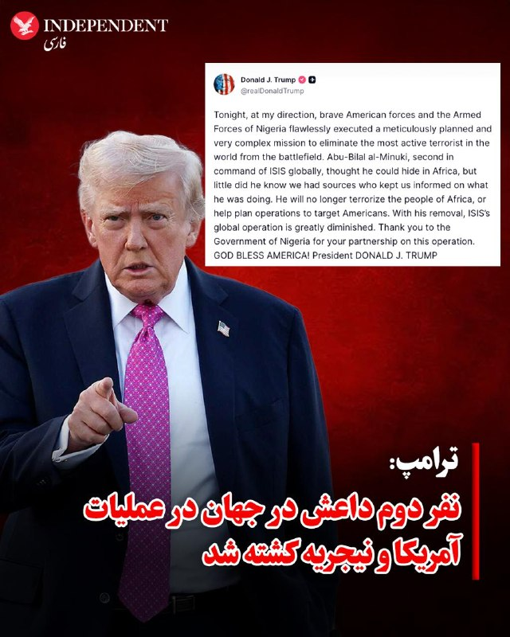
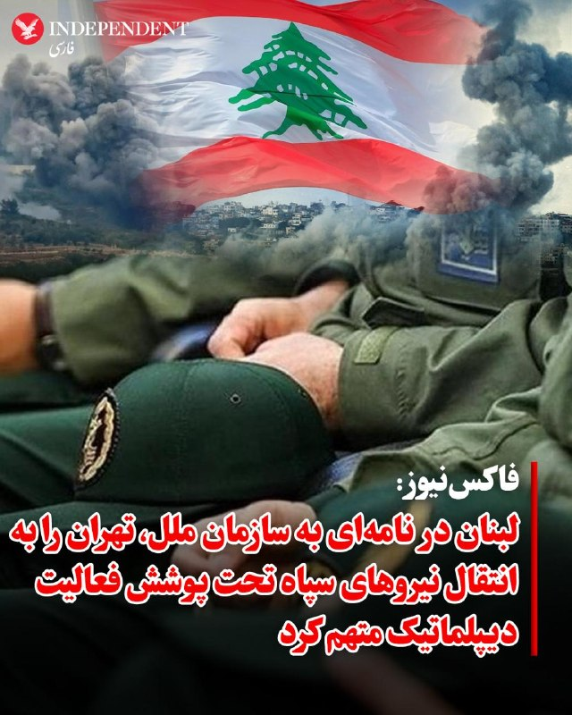
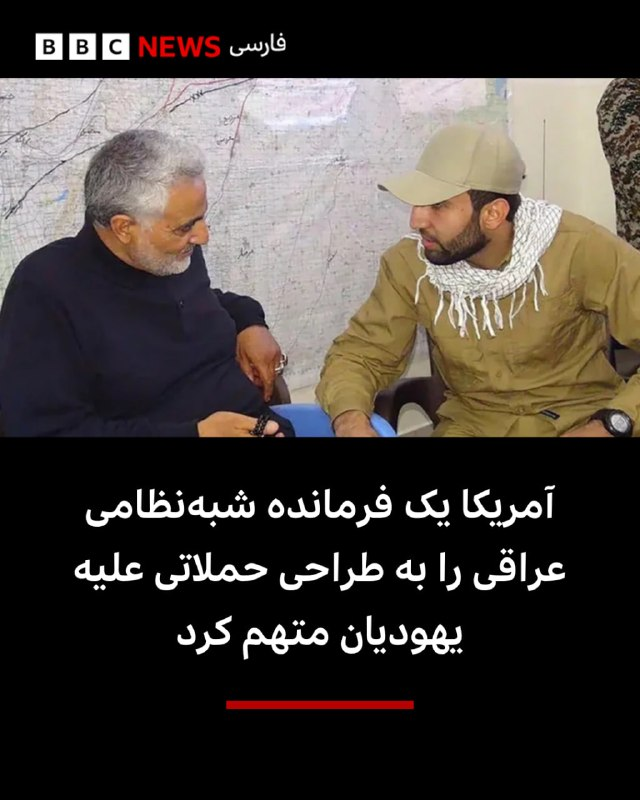
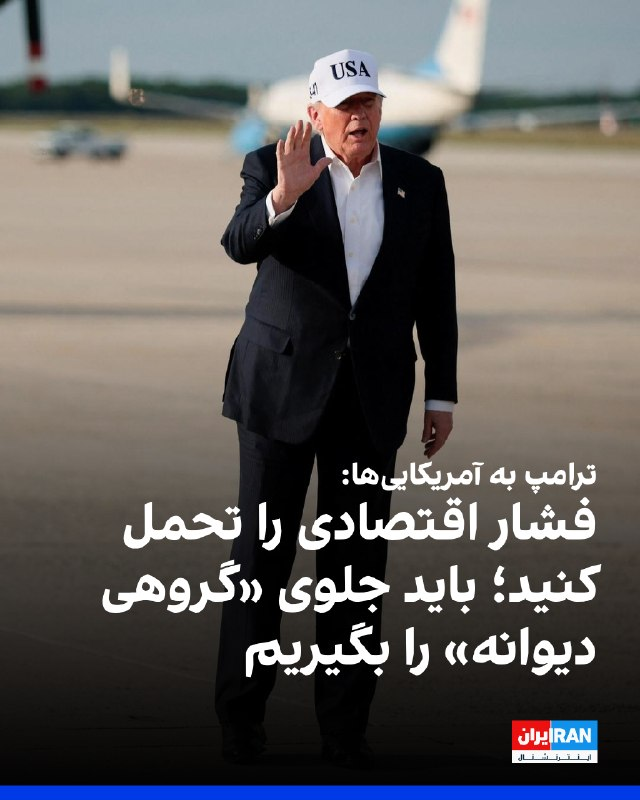
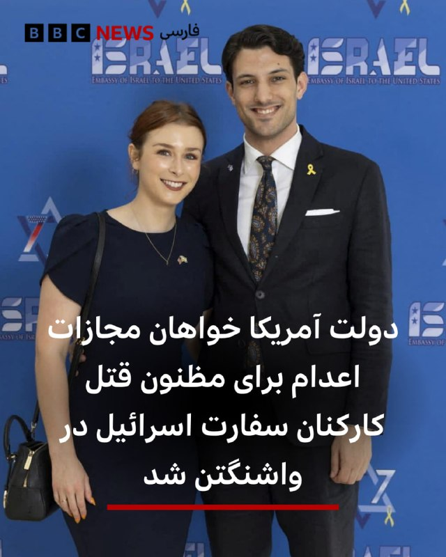
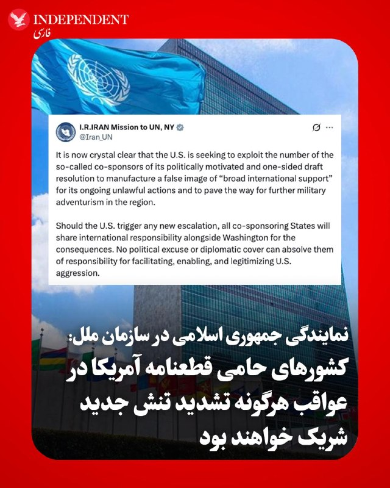
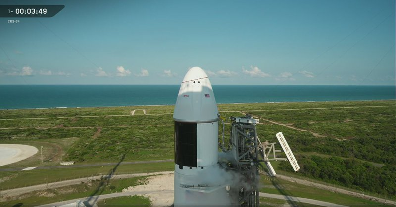
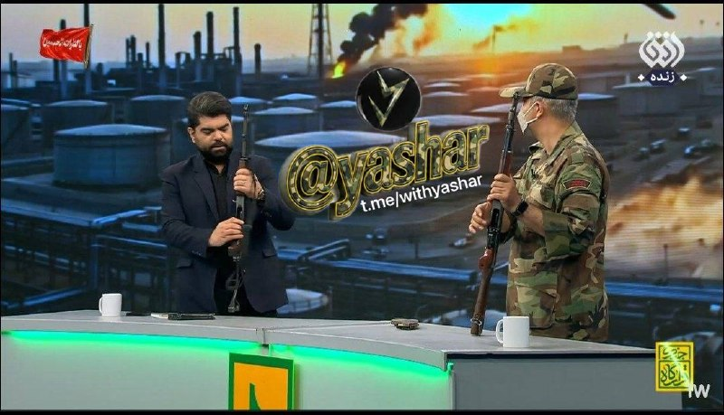
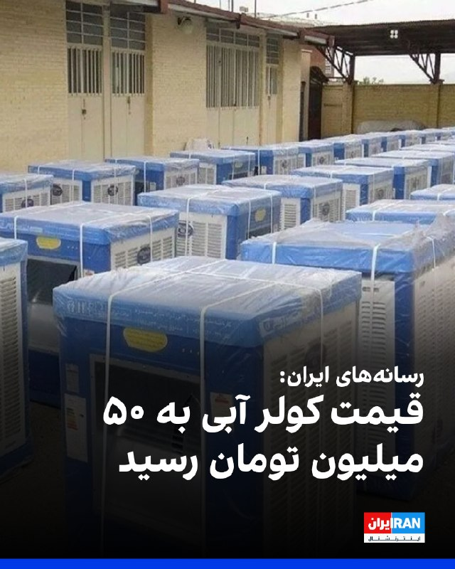
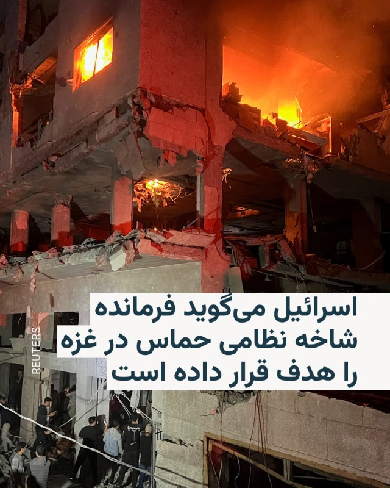

# خواننده تلگرام

<!-- TOP_NAV START -->

<a href="https://github.com/sinaalibabaei/aio-downloader/blob/main/telegram/content/archive_1.md" style="display:inline-block; padding:6px 12px; margin:0 4px; background-color:#2ea44f; color:white; text-decoration:none; border-radius:4px; font-weight:bold;">صفحه بعد</a>

<!-- TOP_NAV END -->

<!-- MSG START -->

---
📅 بروزرسانی: 1405/02/26 08:20
---

## VahidOOnLine — post 240410

  

ترامپ در تروث‌سوشال اعلام کرد ابو بلال المینوکی، نفر دوم داعش در جهان، در عملیاتی که از سوی نیروهای آمریکا و نیجریه انجام شد، کشته شده است.
او در پیامی نوشت: «امشب به دستور من، نیروهای شجاع آمریکایی و نیروهای مسلح نیجریه یک ماموریت بسیار دقیق و پیچیده را به‌طور بی‌نقص اجرا کردند تا فعال‌ترین تروریست جهان را از میدان نبرد حذف کنند. ابو بلال المینوکی، نفر دوم داعش در سطح جهانی، فکر می‌کرد می‌تواند در آفریقا پنهان شود، اما نمی‌دانست ما منابعی داریم که ما را از آنچه انجام می‌داد آگاه می‌کردند.»
ترامپ همچنین از دولت نیجریه برای همکاری در این عملیات قدردانی کرد.

‌🏁 🇬🇧 IranintlTV

🤖 @VahidOOnLine

## VahidOOnLine — post 240409

  

♦️دونالد ترامپ، رئیس‌جمهوری ایالات متحده، در مصاحبه اخیر با شبکه فاکس‌نیوز گفت «آستانه درد» و تاب‌آوری ایران را دست‌کم نگرفته است. ترامپ با اشاره به سیاست خویشتن‌داری واشنگتن تاکید کرد ایالات متحده عامدانه از هدف قرار دادن زیرساخت‌های حیاتی و غیرنظامی نظیر پل‌ها و تأسیسات تولید برق خودداری کرده است.
رئیس جمهوری آمریکا با یادآوری میزان خسارات وارد شده به ایران گفت: «ما به شکل باورنکردنی و بسیار سخت به آن‌ها ضربه زدیم. ببینید، ما پل‌ها و ظرفیت برق آن‌ها را رها کردیم؛ در حالی که می‌توانیم همه این‌ها را ظرف دو روز از بین ببریم. ظرف دو روز، همه چیز را.»
او در پاسخ به این سوال که آیا تاب‌آوری رژیم ایران در برابر آسیب‌ها را دست‌کم گرفته است، گفت: «من هیچ چیز را دست‌کم نگرفتم. ما به جز شیرهای خروجی نفت، به بقیه بخش‌ها ضربه زدیم.»
‌🇸🇦 Indypersian

🤖 @VahidOOnLine

## VahidOOnLine — post 240408

  

نیویورک‌تایمز به نقل از دو مقام خاورمیانه‌ای گزارش داد آمریکا و اسرائیل در حال تدارکات فشرده برای از سرگیری احتمالی حملات علیه جمهوری اسلامی در اوایل هفته آینده هستند و این گزینه‌ها شامل بمباران‌های تهاجمی‌تر علیه اهداف نظامی و زیرساختی و عملیات ویژه زمینی برای یافتن مواد هسته‌ای خواهد بود.
طبق این گزارش، نیروهای عملیات ویژه اعزام شده به منطقه می‌توانند در این ماموریت مورد استفاده قرار گیرند، اما چنین عملیاتی به هزاران نیروی پشتیبانی نیاز دارد.
این روزنامه افزود به گفته دستیاران ترامپ، او هنوز در مورد گام‌های بعدی خود تصمیمی نگرفته است.
بر اساس این گزارش، مقام‌های آمریکایی گفتند که حدود پنج هزار تفنگدار دریایی و حدود دو هزار چترباز از لشکر ۸۲ هوابرد ویژه ارتش ایالات متحده در منطقه منتظر دستورالعمل‌ هستند.
مقام‌های نظامی نیز گفتند که این نیروها می‌توانند برای دستیابی به مواد هسته‌ای ایران در سایت اتمی اصفهان، از جمله ایمن‌سازی محیط برای محافظت از اپراتورهای ویژه‌ای که وظیفه ورود به آنجا را دارند، مورد استفاده قرار گیرند.
‌🏁 🇬🇧 IranintlTV

🤖 @VahidOOnLine

## VahidOOnLine — post 240407

  

♦️دونالد ترامپ، رئیس‌جمهوری آمریکا، شنبه ۲۶ اردیبهشت با انتشار پیامی در «تروث سوشال» اعلام کرد که نیروهای آمریکایی با همکاری ارتش نیجریه، در جریان یک عملیات پیچیده و دقیق، «ابوبلال المینوکی» مرد شماره دو و فعال‌ترین عضو ارشد داعش در جهان را از پای درآورده‌اند.
ترامپ در این پیام تاکید کرد که او تصور می‌کرد می‌تواند در آفریقا پنهان شود، اما منابع اطلاعاتی تمامی تحرکات او را زیر نظر داشتند. به گفته رئیس‌جمهوری آمریکا، با حذف این فرمانده ارشد، توانایی عملیاتی جهانی داعش به‌شدت کاهش یافته است و او دیگر نمی‌تواند مردم آفریقا یا منافع آمریکا را هدف قرار دهد. ترامپ همچنین از همکاری و مشارکت دولت نیجریه در اجرای موفقیت‌آمیز این عملیات قدردانی کرد.
‌🇸🇦 Indypersian

🤖 @VahidOOnLine

## VahidOOnLine — post 240406

  

♦️به گزارش فاکس‌نیوز، دولت لبنان در اقدامی بی‌سابقه، با ارسال شکایت‌نامه‌ای تند به سازمان ملل متحد، جمهوری اسلامی را به سوءاستفاده از مصونیت دیپلماتیک متهم کرده است.
بر اساس این نامه که اواخر فروردین تنظیم و به‌تازگی منتشر شده است، احمد عرفه، سفیر لبنان در سازمان ملل، با انتقاد شدید از اقدامات محمدرضا شیبانی، سفیر جمهوری اسلامی در بیروت، تهران را به اعزام نیروهای سپاه پاسداران به خاک لبنان تحت پوشش فعالیت‌های دیپلماتیک متهم کرد.
در این شکایت‌نامه تاکید شده است این اقدامات جمهوری اسلامی، دخالت آشکار در امور داخلی لبنان است و این کشور را به جنگی ناخواسته می‌کشاند.
افشای این نامه همزمان با دومین روز گفتگوهای دوجانبه اسرائیل و لبنان در واشینگتن با میانجی‌گری آمریکا صورت می‌گیرد؛ گفتگوهایی که هدف آن عادی‌سازی روابط و برچیدن حزب‌الله عنوان شده است.
سخنگوی وزارت خارجه آمریکا فضای این مذاکرات را «بسیار مثبت» و «فراتر از حد انتظار» توصیف کرد. همچنین وزارت خارجه آمریکا اعلام کرد آتش‌بس موقت میان اسرائیل و لبنان ۴۵ روز دیگر تمدید شده است.
‌🇸🇦 Indypersian

🤖 @VahidOOnLine

## VahidOOnLine — post 240405

  

فدراسیون بین‌المللی روزنامه‌نگاران اعلام کرد با گذشت حدود ۱۰ روز از بازداشت امیرحسین رضایی، روزنامه‌نگار حوزه اقتصاد در اراک، همچنان خبری از وضعیت او در دست نیست و بازداشت او ادامه دارد.
پیش‌تر گزارش شده بود نیروهای امنیتی صبح ۱۶ اردیبهشت با یورش به منزل پدری رضایی در اراک، او را بازداشت و به مکان نامعلومی منتقل کرده‌اند. رضایی دانشجوی علوم سیاسی دانشگاه تهران و روزنامه‌نگار پیشین «دنیای اقتصاد» است.
فدراسیون بین‌المللی روزنامه‌نگاران نوشت ادامه بازداشت و بی‌خبری از این روزنامه‌نگار در حالی است که محدودیت‌های اینترنتی در ایران ادامه دارد و فشار نهادهای امنیتی بر فعالان رسانه و اطلاع‌رسانی مستقل افزایش یافته است.

‌🏁 🇬🇧 IranintlTV

🤖 @VahidOOnLine

## VahidOOnLine — post 240404

  

♦️وزارت امور خارجه امارات متحده عربی شنبه ۲۶ اردیبهشت با انتشار بیانیه‌ای اعلام کرد تمام اقدامات این کشور در چارچوب تدابیر دفاعی برای حفاظت از حاکمیت، غیرنظامیان و زیرساخت‌های حیاتی انجام شده است.
این بیانیه پس از آن صادر شد که روزنامه وال‌استریت ژورنال در گزارشی نوشت امارات در اواسط فروردین عملیات نظامی علیه ایران انجام داده است؛ با این حال، وزارت خارجه امارات در بیانیه خود مستقیما به این حملات ادعایی اشاره‌ای نکرد.
امارات در این بیانیه با محکوم کردن شدید تهدیدها و حملات جمهوری اسلامی به این کشور و منطقه، اعلام کرد که شلیک نزدیک به ۳۰۰۰ موشک بالستیک، کروز و پهپاد به سمت امارات که منجر به تلفات غیرنظامی و آسیب به زیرساخت‌ها شده، نقض آشکار حاکمیت کشورها است. وزارت خارجه امارات تاکید کرد که این کشور حق حاکمیتی، قانونی، دیپلماتیک و نظامی خود را برای مقابله با هرگونه اقدام خصمانه محفوظ می‌داند و فشارها یا ادعاهای مغرضانه تاثیری بر مواضع ثابت آن نخواهد داشت.
‌🇸🇦 Indypersian

🤖 @VahidOOnLine

## VahidOOnLine — post 240403

  

فاکس‌نیوز گزارش داد دولت لبنان با ارسال نامه‌ای کم‌سابقه به سازمان ملل، جمهوری اسلامی را به سوءاستفاده از مصونیت دیپلماتیک، دخالت در امور داخلی لبنان و انتقال نیروهای سپاه پاسداران «در پوشش فعالیت دیپلماتیک» متهم کرده است.
به گزارش فاکس، این نامه که اواخر آوریل ارسال و به‌تازگی منتشر شده، هم‌زمان با مذاکرات اسرائیل و لبنان در واشینگتن درباره عادی‌سازی روابط و آینده حزب‌الله اهمیت بیشتری یافته است.
در این نامه، سفیر لبنان در سازمان ملل، ایران را به «اقدامات غیرقانونی در نقض آشکار تصمیمات دولت لبنان» متهم کرده و تأکید کرده این رفتار دخالت مستقیم در امور داخلی لبنان و نقض کنوانسیون ۱۹۶۱ وین درباره روابط دیپلماتیک است.

‌🏁 🇬🇧 IranintlTV

🤖 @VahidOOnLine

## VahidOOnLine — post 240402

  

مایک والتز، سفیر آمریکا در سازمان ملل، در گفت‌وگو با فاکس‌نیوز گفت چین پس از سفر دونالد ترامپ به پکن از جمهوری اسلامی فاصله گرفته است. او افزود پکن با اصل عدم دستیابی ایران به سلاح هسته‌ای و عدم نظامی‌سازی تنگه هرمز موافقت کرده است.
والتز تاکید کرد هیچ کشوری نمی‌تواند از خطوط کشتیرانی بین‌المللی مانند تنگه جبل‌الطارق، تنگه مالاکا یا تنگه هرمز به‌عنوان منبع درآمد خصوصی از طریق دریافت عوارض استفاده کند و این مسیرها باید برای تجارت جهانی باز بمانند.

‌🏁 🇬🇧 IranintlTV

🤖 @VahidOOnLine

## VahidOOnLine — post 240401

  

♦️مایک والتز، سفیر آمریکا در سازمان ملل در گفتگو با شبکه فاکس نیوزگفت: «باید به یاد داشته باشیم هیچ دلیلی وجود ندارد که رژیم ایران این گرد و غبار را که شامل اورانیوم با غنای بالای ۶۰ درصد است، در اختیار داشته باشد. هیچ کشوری در جهان وجود ندارد که تا این سطح غنی سازی کند و سلاح هسته‌ای نداشته باشد، چون هیچ دلیل دیگری برای این کار وجود ندارد.»
او افزود: «اگر اهداف شما صرفا صلح‌آمیز و غیرنظامی است، دلیلی ندارد آن را در عمق سایت‌های نظامی مستحکم دفن کنید و در سراسر کشور پراکنده سازید. این مواد برای ساخت ۱۰ یا ۱۱ سلاح هسته‌ای کافی است و رئیس‌جمهوری ترامپ به صراحت اعلام کرده که این بخش باید برچیده شود.»
والتز همچنین تاکید کرد: «ما در عملیات "چکش نیمه‌شب" در سال گذشته، غنی سازی آن‌ها را ویران کردیم، اما هنوز می‌بینیم که در تلاش برای بازسازی آن هستند.»
‌🇸🇦 Indypersian

🤖 @VahidOOnLine

## VahidOOnLine — post 240400

  

ترامپ در گفت‌وگو با فاکس‌نیوز در پاسخ به این پرسش که آیا توان و مقاومت حکومت ایران را دست‌کم گرفته، گفت: «هیچ‌چیز را دست‌کم نگرفتم. ما به‌شدت به آن‌ها ضربه زدیم.»
ترامپ تاکید کرد آمریکا عمدا بخشی از زیرساخت‌های ایران را هدف قرار نداده است و افزود: «پل‌هایشان را باقی گذاشتیم. زیرساخت برق‌شان را باقی گذاشتیم. می‌توانیم همه آن را در دو روز نابود کنیم؛ همه‌چیز.» او گفت به تاسیسات نفتی و برخی زیرساخت‌ها در خارک حمله نشده، زیرا آسیب به آن‌ها می‌توانست موجب از بین رفتن نفت شود.
او همچنین گفت مقام‌های ایرانی به او گفته‌اند محل نگهداری مواد هسته‌ای به‌شدت هدف قرار گرفته و «کوه گرانیتی» روی آن فرو ریخته است. ترامپ افزود: «آن‌ها گفتند فقط دو کشور می‌توانند به آن دسترسی پیدا کنند؛ ما و چین. گفتند خودشان توانایی دسترسی ندارند چون کاملاً نابود شده است.»

‌🏁 🇬🇧 IranintlTV

🤖 @VahidOOnLine

## VahidOOnLine — post 240399

  

ترامپ در گفت‌وگو با فاکس‌نیوز گفت: مقام‌های جمهوری اسلامی «هر بار توافق می‌کنند، روز بعد انگار می‌گویند چنین گفت‌وگویی نداشته‌ایم. این حدود پنج بار اتفاق افتاده است. مشکلی در آن‌ها وجود دارد. واقعا دیوانه‌اند. و به همین دلیل نمی‌توانند سلاح هسته‌ای داشته باشند.»
رییس‌جمهوری آمریکا درباره وضعیت مذاکرات با جمهوری اسلامی گفت افرادی که آمریکا با آن‌ها در حال گفت‌وگو است، به گفته او «منطقی» به نظر می‌رسند، اما توان یا آمادگی لازم برای تصمیم‌گیری ندارند.
ترامپ در پاسخ به این پرسش که آیا حکومت ایران در نهایت عقب‌نشینی خواهد کرد گفت: «بله، قطعا. هیچ شکی ندارم.»

‌🏁 🇬🇧 IranintlTV

🤖 @VahidOOnLine

## WithYashar — post 11370

## WithYashar — post 11369

@withyashar

## mwarmonitor — post 9147

🇺🇸امشب با دستور من، نیروهای شجاع آمریکایی و نیروهای مسلح نیجریه، ماموریتی به‌دقت برنامه‌ریزی‌شده و بسیار پیچیده را برای حذف فعال‌ترین تروریست جهان از صحنه نبرد، به‌طور بی‌نقصی اجرا کردند.
«ابوبلال المینوکی»، شخص دوم در فرماندهی جهانی داعش، فکر می‌کرد که می‌تواند در آفریقا پنهان شود، اما روحش هم خبر نداشت که ما منابعی داشتیم که ما را از کارهایی که انجام می‌داد مطلع نگه می‌داشتند. او دیگر مردم آفریقا را وحشت‌زده نخواهد کرد و در برنامه‌ریزی عملیات‌ها برای هدف قرار دادن آمریکایی‌ها نقشی نخواهد داشت. با حذف او، عملیات جهانی داعش به شدت کاهش یافته و ضعیف شده است.
از دولت نیجریه بابت همکاری‌شان در این عملیات سپاسگزارم. خدا آمریکا را حفظ کند!

رئیس‌جمهور دونالد جی. ترامپ

@mwarmonitor

## FoxNewsTwitter — post 341806

  <a href="telegram/content/FoxNewsTwitter_341806_1778907024.mp4" target="_blank">🎬 Download video</a>

Fox News (Twitter/X)

Countless bees swarmed outside the White House, near the press corps' media area, on Friday.

About 20 minutes later, the bees swarmed a hive on a tree on the North Lawn.

## pm_afshaa — post 90826

اینایی که تو اپای ایرانی به اسم ما فعالیت میکنن به زودی یه کپی رایت میزنم دهن همتونو میگام خسارت بد نام کردنم رو هم ازتون میگیرم کونتونو پاره میکنم

## VahidOnline — post 75494

دونالد ترامپ با اشاره به افزایش هزینه‌های اقتصادی ناشی از تقابل با جمهوری اسلامی، از آمریکایی‌ها خواست این فشار کوتاه‌مدت را تحمل کنند و گفت جلوگیری از تهدید حکومت ایران اولویتی بالاتر از پیامدهای کوتاه‌مدت اقتصادی دارد.

او تاکید کرد: «متاسفم که این فشار را تحمل می‌کنید، اما باید جلوی این گروه بسیار دیوانه را بگیریم.»

رییس‌جمهوری آمریکا در بخش دیگری از این مصاحبه گفت حکومت ایران از نظر نظامی به‌شدت آسیب دیده و بار دیگر تاکید کرد: «آن‌ها دیگر نیروی دریایی ندارند. نیروی هوایی ندارند. همه‌چیز نابود شده است. نیروی هوایی‌شان از بین رفته است.»

او تاکید کرد: «تنگه باز خواهد شد. آن‌ها سلاح هسته‌ای نخواهند داشت و دنیا ادامه خواهد یافت.»

رییس‌جمهوری آمریکا گفت به درخواست مقام‌هایی از پاکستان، مرحله نهایی عملیات علیه ایران را متوقف کرده است. او گفت: «آن‌ها گفتند: می‌توانید متوقف شوید؟ ما قرار است به توافق برسیم. و واقعاً چارچوب یک توافق را داشتیم؛ بدون برنامه هسته‌ای.»

ترامپ در ادامه تاکید کرد تهران پذیرفته بود مواد باقی‌مانده از برنامه هسته‌ای خود را تحویل دهد، اما بعد از هر توافق عقب‌نشینی کرده است. او گفت: «هر بار توافق می‌کنند، روز بعد انگار می‌گویند چنین گفت‌وگویی نداشته‌ایم. این حدود پنج بار اتفاق افتاده است. مشکلی در آن‌ها وجود دارد. واقعاً دیوانه‌اند. و به همین دلیل نمی‌توانند سلاح هسته‌ای داشته باشند.»

رییس‌جمهوری آمریکا در بخش دیگری از مصاحبه، در پاسخ به این پرسش که آیا توان و مقاومت حکومت ایران را دست‌کم گرفته، گفت: «هیچ‌چیز را دست‌کم نگرفتم. ما به‌شدت به آن‌ها ضربه زدیم.»

ترامپ تاکید کرد آمریکا عمداً بخشی از زیرساخت‌های ایران را هدف قرار نداده است و افزود: «پل‌هایشان را باقی گذاشتیم. زیرساخت برق‌شان را باقی گذاشتیم. می‌توانیم همه آن را در دو روز نابود کنیم؛ همه‌چیز.» او گفت به تاسیسات نفتی و برخی زیرساخت‌ها در خارک حمله نشده، زیرا آسیب به آن‌ها می‌توانست موجب از بین رفتن نفت شود.

رییس‌جمهوری آمریکا درباره وضعیت مذاکرات با جمهوری اسلامی گفت افرادی که آمریکا با آن‌ها در حال گفت‌وگو است، به گفته او «منطقی» به نظر می‌رسند، اما توان یا آمادگی لازم برای تصمیم‌گیری ندارند.

ترامپ در پاسخ به این پرسش که آمریکا در حال حاضر با چه کسانی در ایران طرف است، گفت: «با افرادی طرف هستیم که فکر می‌کنم منطقی هستند، اما از توافق می‌ترسند. نمی‌دانند چطور توافق کنند. قبلاً در چنین موقعیتی نبوده‌اند.»
او در پاسخ به این سوال که آیا تا زمان دستیابی به توافق صبر خواهد کرد، تاکید کرد: «من کاری را انجام می‌دهم که درست باشد. باید کار درست را انجام دهم.»

او همچنین گفت مقام‌های ایرانی به او گفته‌اند محل نگهداری مواد هسته‌ای به‌شدت هدف قرار گرفته و «کوه گرانیتی» روی آن فرو ریخته است. ترامپ افزود: «آن‌ها گفتند فقط دو کشور می‌توانند به آن دسترسی پیدا کنند؛ ما و چین. گفتند خودشان توانایی دسترسی ندارند چون کاملاً نابود شده است.»
ترامپ گفت: «نمی‌توان اجازه داد ایران سلاح هسته‌ای داشته باشد. آن‌ها از آن علیه ما استفاده خواهند کرد. اول اسرائیل را نابود می‌کنند، بعد خاورمیانه را، بعد اروپا را.»

او درباره افزایش قیمت سوخت در آمریکا گفت فشار اقتصادی ناشی از بحران کوتاه‌مدت خواهد بود و افزود: «وقتی مردم توضیح کامل را می‌شنوند، همه موافق می‌شوند. این یک درد کوتاه‌مدت خواهد بود.» ترامپ گفت پس از پایان بحران، قیمت انرژی «مثل سنگ سقوط خواهد کرد.»

رییس‌جمهوری آمریکا در پاسخ به نگرانی‌ها درباره افزایش فشار اقتصادی بر خانواده‌های آمریکایی در پی جنگ با ایران و رشد هزینه‌ها، گفت شهروندان باید این فشارها را تحمل کنند زیرا به گفته او هدف، مقابله با تهدیدی بزرگ‌تر است.

ترامپ در واکنش به این موضوع که برخی آمریکایی‌ها افزایش هزینه‌ها و بدبینی اقتصادی را احساس می‌کنند، گفت: «باید تحمل کنند و باور داشته باشند که ما آن‌ها را به نقطه بهتری می‌رسانیم. اما من باید کار درست را انجام دهم.»

ترامپ در ادامه، فشارهای اقتصادی ناشی از بحران را با ضرورت مقابله با جمهوری اسلامی مرتبط دانست و گفت: «به مردم گفتم متاسفم که این فشار را تحمل می‌کنید، اما باید جلوی این گروه بسیار دیوانه را بگیریم.»

رییس‌جمهوری آمریکا همچنین گفت کشتی‌های حامل نفت ایران که چین در روزهای اخیر خارج کرده، با اجازه واشینگتن حرکت کرده‌اند. او گفت: «ما اجازه دادیم این اتفاق بیفتد.»

ترامپ در پایان در پاسخ به این پرسش که آیا حکومت ایران در نهایت عقب‌نشینی خواهد کرد گفت: «بله، قطعاً. هیچ شکی ندارم.»
@VahidOOnLine

📡 @VahidOnline

## VahidOnline — post 75493

  

عباس عراقچی، وزیر خارجه جمهوری اسلامی، در واکنش به بالا رفتن قیمت انرژی در آمریکا، در ایکس نوشت: «در حال حاضر، افزایش قیمت بنزین و حباب بازار سهام را کنار بگذارید. درد واقعی زمانی آغاز می‌شود که بدهی آمریکا و نرخ وام‌های مسکن شروع به جهش کنند.»
او نوشت همین حالا هم میزان ناتوانی در بازپرداخت وام خودرو به بالاترین سطح خود در بیش از ۳۰ سال گذشته رسیده است، اما تمام این‌ها قابل اجتناب بود.
@VahidOOnLine

📡 @VahidOnline

## VahidOnline — post 75492

  

‌ نماینده چین در سازمان ملل و و رئیس دوره‌ای شورای امنیت، از پیش‌نویس قطعنامه پیشنهادی آمریکا و بحرین درباره تنگه هرمز انتقاد کرد و گفت که «محتوا و زمان‌بندی آن مناسب نیست و تصویبش کمکی نخواهد کرد.»

به گزارش رویترز، این پیش‌نویس قطعنامه از ایران می‌خواهد که حملات و مین‌گذاری در تنگه هرمز را متوقف کند. اما دیپلمات‌ها گفتند که اگر این قطعنامه به رای گذاشته شود، احتمالا با وتوی روسیه و چین روبه‌رو خواهد شد.

دو کشور ماه گذشته نیز قطعنامه مشابه مورد حمایت آمریکا را وتو کرده بودند و متن آن را علیه ایران «جانبدارانه» خواندند.
@VahidHeadline

📡 @VahidOnline

## IranIntlTV — post 337409

  

ترامپ در تروث‌سوشال اعلام کرد ابو بلال المینوکی، نفر دوم داعش در جهان، در عملیاتی که از سوی نیروهای آمریکا و نیجریه انجام شد، کشته شده است.
او در پیامی نوشت: «امشب به دستور من، نیروهای شجاع آمریکایی و نیروهای مسلح نیجریه یک ماموریت بسیار دقیق و پیچیده را به‌طور بی‌نقص اجرا کردند تا فعال‌ترین تروریست جهان را از میدان نبرد حذف کنند. ابو بلال المینوکی، نفر دوم داعش در سطح جهانی، فکر می‌کرد می‌تواند در آفریقا پنهان شود، اما نمی‌دانست ما منابعی داریم که ما را از آنچه انجام می‌داد آگاه می‌کردند.»
ترامپ همچنین از دولت نیجریه برای همکاری در این عملیات قدردانی کرد.

https://iranintl.com/202605165314

## IranIntlTV — post 337408

  

نیویورک‌تایمز به نقل از دو مقام خاورمیانه‌ای گزارش داد آمریکا و اسرائیل در حال تدارکات فشرده برای از سرگیری احتمالی حملات علیه جمهوری اسلامی در اوایل هفته آینده هستند و این گزینه‌ها شامل بمباران‌های تهاجمی‌تر علیه اهداف نظامی و زیرساختی و عملیات ویژه زمینی برای یافتن مواد هسته‌ای خواهد بود.
طبق این گزارش، نیروهای عملیات ویژه اعزام شده به منطقه می‌توانند در این ماموریت مورد استفاده قرار گیرند، اما چنین عملیاتی به هزاران نیروی پشتیبانی نیاز دارد.
این روزنامه افزود به گفته دستیاران ترامپ، او هنوز در مورد گام‌های بعدی خود تصمیمی نگرفته است.
بر اساس این گزارش، مقام‌های آمریکایی گفتند که حدود پنج هزار تفنگدار دریایی و حدود دو هزار چترباز از لشکر ۸۲ هوابرد ویژه ارتش ایالات متحده در منطقه منتظر دستورالعمل‌ هستند.
مقام‌های نظامی نیز گفتند که این نیروها می‌توانند برای دستیابی به مواد هسته‌ای ایران در سایت اتمی اصفهان، از جمله ایمن‌سازی محیط برای محافظت از اپراتورهای ویژه‌ای که وظیفه ورود به آنجا را دارند، مورد استفاده قرار گیرند.
https://iranintl.com/202605169621

## IranIntlTV — post 337407

  

فدراسیون بین‌المللی روزنامه‌نگاران اعلام کرد با گذشت حدود ۱۰ روز از بازداشت امیرحسین رضایی، روزنامه‌نگار حوزه اقتصاد در اراک، همچنان خبری از وضعیت او در دست نیست و بازداشت او ادامه دارد.
پیش‌تر گزارش شده بود نیروهای امنیتی صبح ۱۶ اردیبهشت با یورش به منزل پدری رضایی در اراک، او را بازداشت و به مکان نامعلومی منتقل کرده‌اند. رضایی دانشجوی علوم سیاسی دانشگاه تهران و روزنامه‌نگار پیشین «دنیای اقتصاد» است.
فدراسیون بین‌المللی روزنامه‌نگاران نوشت ادامه بازداشت و بی‌خبری از این روزنامه‌نگار در حالی است که محدودیت‌های اینترنتی در ایران ادامه دارد و فشار نهادهای امنیتی بر فعالان رسانه و اطلاع‌رسانی مستقل افزایش یافته است.

https://iranintl.com/202605161865

## IranIntlTV — post 337406

  

فاکس‌نیوز گزارش داد دولت لبنان با ارسال نامه‌ای کم‌سابقه به سازمان ملل، جمهوری اسلامی را به سوءاستفاده از مصونیت دیپلماتیک، دخالت در امور داخلی لبنان و انتقال نیروهای سپاه پاسداران «در پوشش فعالیت دیپلماتیک» متهم کرده است.
به گزارش فاکس، این نامه که اواخر آوریل ارسال و به‌تازگی منتشر شده، هم‌زمان با مذاکرات اسرائیل و لبنان در واشینگتن درباره عادی‌سازی روابط و آینده حزب‌الله اهمیت بیشتری یافته است.
در این نامه، سفیر لبنان در سازمان ملل، ایران را به «اقدامات غیرقانونی در نقض آشکار تصمیمات دولت لبنان» متهم کرده و تأکید کرده این رفتار دخالت مستقیم در امور داخلی لبنان و نقض کنوانسیون ۱۹۶۱ وین درباره روابط دیپلماتیک است.

https://iranintl.com/202605166136

## IranIntlTV — post 337405

  

مایک والتز، سفیر آمریکا در سازمان ملل، در گفت‌وگو با فاکس‌نیوز گفت چین پس از سفر دونالد ترامپ به پکن از جمهوری اسلامی فاصله گرفته است. او افزود پکن با اصل عدم دستیابی ایران به سلاح هسته‌ای و عدم نظامی‌سازی تنگه هرمز موافقت کرده است.
والتز تاکید کرد هیچ کشوری نمی‌تواند از خطوط کشتیرانی بین‌المللی مانند تنگه جبل‌الطارق، تنگه مالاکا یا تنگه هرمز به‌عنوان منبع درآمد خصوصی از طریق دریافت عوارض استفاده کند و این مسیرها باید برای تجارت جهانی باز بمانند.

https://iranintl.com/202605168445

## IranIntlTV — post 337404

  

ترامپ در گفت‌وگو با فاکس‌نیوز در پاسخ به این پرسش که آیا توان و مقاومت حکومت ایران را دست‌کم گرفته، گفت: «هیچ‌چیز را دست‌کم نگرفتم. ما به‌شدت به آن‌ها ضربه زدیم.»
ترامپ تاکید کرد آمریکا عمدا بخشی از زیرساخت‌های ایران را هدف قرار نداده است و افزود: «پل‌هایشان را باقی گذاشتیم. زیرساخت برق‌شان را باقی گذاشتیم. می‌توانیم همه آن را در دو روز نابود کنیم؛ همه‌چیز.» او گفت به تاسیسات نفتی و برخی زیرساخت‌ها در خارک حمله نشده، زیرا آسیب به آن‌ها می‌توانست موجب از بین رفتن نفت شود.
او همچنین گفت مقام‌های ایرانی به او گفته‌اند محل نگهداری مواد هسته‌ای به‌شدت هدف قرار گرفته و «کوه گرانیتی» روی آن فرو ریخته است. ترامپ افزود: «آن‌ها گفتند فقط دو کشور می‌توانند به آن دسترسی پیدا کنند؛ ما و چین. گفتند خودشان توانایی دسترسی ندارند چون کاملاً نابود شده است.»

https://iranintl.com/202605166343

## IranIntlTV — post 337403

  

ترامپ در گفت‌وگو با فاکس‌نیوز گفت: مقام‌های جمهوری اسلامی «هر بار توافق می‌کنند، روز بعد انگار می‌گویند چنین گفت‌وگویی نداشته‌ایم. این حدود پنج بار اتفاق افتاده است. مشکلی در آن‌ها وجود دارد. واقعا دیوانه‌اند. و به همین دلیل نمی‌توانند سلاح هسته‌ای داشته باشند.»
رییس‌جمهوری آمریکا درباره وضعیت مذاکرات با جمهوری اسلامی گفت افرادی که آمریکا با آن‌ها در حال گفت‌وگو است، به گفته او «منطقی» به نظر می‌رسند، اما توان یا آمادگی لازم برای تصمیم‌گیری ندارند.
ترامپ در پاسخ به این پرسش که آیا حکومت ایران در نهایت عقب‌نشینی خواهد کرد گفت: «بله، قطعا. هیچ شکی ندارم.»

https://iranintl.com/202605166651

## FarsiVOA — post 217869

  

⚡️مایک والتز، نماینده آمریکا در سازمان ملل متحد گفت در ارتباط با جمهوری اسلامی، مسئله اورانیوم غنی‌شده، غنی‌سازی اورانیوم، و تنگه هرمز وجود دارد. او به فاکس‌نیوز گفت «باید به یاد داشته باشیم، هیچ دلیلی وجود ندارد» جمهوری اسلامی اورانیوم با غنای ۶۰ درصد داشته باشد آن هم به میزانی که به گفته او می‌تواند به ۱۰ تا ۱۱ بمب هسته‌ای تبدیل شود. آقای والتز با زیر سوال بردن ادعای صلح‌آمیز بودن برنامه هسته‌ای جمهوری اسلامی گفت «هیچ کشوری در دنیا وجود ندارد که تا این سطح غنی‌سازی کند و بعد سلاح هسته‌ای نداشته باشد، چون اصلاً دلیلی برای انجامش (این سطح از غنی‌سازی) وجود ندارد.»
@FarsiVOA

## FarsiVOA — post 217868

⚡️مراسم «انجمن قلم آمریکا» و اهدای «جایزه آزادی نوشتن باربی» به گلرخ ایرایی و علی اسداللهی
@FarsiVOA

## FarsiVOA — post 217867

⚡️توافق آمریکا و چین درباره تنگه هرمز چه پیامدی برای حکومت ایران دارد؟ گفت‌وگو با ابراهیم روشندل
@FarsiVOA

## Persian_Trend_Official — post 14226

  <a href="telegram/content/Persian_Trend_Official_14226_1778907034.mp4" target="_blank">🎬 Download video</a>

صبحتون بخیر ☕️🤍

📝 Nick
📌 @persian_trend_official
پرشین ترند | متفاوت‌ترین کانال نظامی

## RadioFarda — post 157240

  

🔸پسر عبدالرحیم موسوی، فرمانده پیشین نیروهای مسلح، که در جریان حمله به «بیت رهبری» کشته شده بود، در یک گفت‌وگوی تلویزیونی اعلام کرد که جنازه پدرش ۳۰ روز زیر آوار بوده است.

🔸فرزند آقای موسوی گفت که حوالی ساعت ۹ صبح روز نهم اسفند ۱۴۰۴ قطعی شد که پدرش باید به جلسه برود و پس از حمله هوایی به بیت رهبری حدود ۳۰ روز گروه تفحص و او به دنبال پیکر پدرش می‌گشتند.

🔸در جریان حمله نهم اسفند به مقر علی‌خامنه‌ای، رهبر پیشین جمهوری اسلامی، علاوه بر او ده‌ها مقام بلندپایه حکومت کشته شدند.

@RadioFarda

## RadioFarda — post 157239

  <a href="https://t.me/radiofarda/157239" target="_blank">📎 Download file</a>

📻بشنوید: سرخط خبرها با رادیوفردا، ۲۶ اردیبهشت ۱۴۰۵‌

@RadioFarda

## BBCPersian — post 281180

  

‌ ‌ ‌
رسانه‌های ایران خبر از درگذشت یحیی دهقان‌پور عکاس پیشکسوت و مدرس رشته عکاسی داده‌اند.

آقای دهقان‌پور متولد سال ۱۳۱۹ خورشیدی بود و در خصوص او نوشته‌اند که «نه‌ تنها به عنوان یک عکاس صاحب‌سبک شناخته می‌شد، بلکه با سال‌ها تدریس در مراکز آموزشی، نسل‌های متعددی از عکاسان را تربیت کرد» و «او در میان شاگردانش به عنوان یکی از پایه‌گذاران نگاه معاصر به آموزش عکاسی شناخته شود.»
از مهم‌ترین آثار او می‌توان به مجموعه تصاویر از مراسم خاکسپاری فروغ فرخزاد در سال ۱۳۴۵ اشاره کرد.

📷Masoud Momenha
@BBCPersian

## BBCPersian — post 281174

‌ ‌ ‌
بر اساس اسنادی که اخیرا از سوی وزارت دادگستری آمریکا منتشر شد، جفری اپستین یک روز پیش از بازداشتش در سال ۲۰۱۹ تلاش کرده بود کاخی چند میلیون دلاری در مراکش بخرد.

جفری اپستین از سال ۲۰۱۱ در پی خرید بين النخيل بود، اما اختلاف‌ها با فروشنده بر سر قیمت و نحوه انجام معامله سال‌ها ادامه داشت.

این قصر باشکوه در محله اعیانی النخیل شهر مراکش واقع شده و به عنوان یک شاهکار معماری توصیف شده است؛ بنایی که توسط ۱۳۰۰ صنعتگر ساخته شده و با نقش‌ونگارها و کاشی‌کاری‌های ظریف آراسته شده است.

اپستین ۵ ژوئیه ۲۰۱۹، یک روز پیش از بازداشتش، حواله بانکی ۱۴/۹۵ میلیون دلاری را امضا کرد؛ این اقدام در پی توافق برای خرید شرکت فراساحلی مالک این ملک به مبلغ ۱۸ میلیون یورو صورت گرفت.

https://bbc.in/4u9JQG8
📷 Getty/ US Department of Justice/ PA
@BBCPersian

## BBCPersian — post 281165

‌ ‌ ‌
حمله هوایی اسرائیل که ظهر شنبه گذشته بدون هیچ هشداری رخ داد، ساختمانی را در منطقه سکسکیه در جنوب لبنان ویران کرد که خانواده‌ای آواره از جنگ در آن پناه گرفته بودند. آتش‌بسی که ماه گذشته اعلام شد، نتوانسته درگیری میان اسرائیل و حزب‌الله را متوقف کند. در این بخش از لبنان، حملات اسرائیل شبانه‌روز ادامه دارد.

وقتی به محل رسیدم، نیروهای امدادی جست‌وجو را به پایان رسانده بودند. مردی روی آوارها در سکوت به ویرانی خیره شده بود. همسایه‌ها دوچرخه آسیب‌دیده یک کودک و خرس عروسکی بنفشی را که پوشیده از گرد و خاک بود، از زیر آوار بیرون آورده بودند.

در این حمله ۹ نفر کشته شدند. ارتش اسرائیل گفت اعضایی از حزب‌الله را هدف قرار داده که از ساختمانی با «کاربری نظامی» فعالیت می‌کردند و «تهدیدی فوری» به شمار می‌رفتند. اسرائیل جزئیات بیشتری ارائه نکرد.

https://bbc.in/4wwDC4L
📸Neha Sharma/BBC/ GettyImages/ AFP via Getty Images
@BBCPersian

## BBCPersian — post 281164

🔻 ترامپ از سفر چین به آمریکا بازگشت

دونالد ترامپ، رئیس جمهور آمریکا پس از سفرش به چین به کشورش بازگشت.

به گزارش رویترز، سفر رسمی دو روزه ترامپ به پکن شامل گفت‌وگو با شی جین‌پینگ، رئیس جمهور چین درباره تایوان، ایران و تجارت بود، اما درباره مسائل اختلافی میان دو اقتصاد بزرگ جهان، دستاورد مشخصی به همراه نداشت.

آقای ترامپ پس از ورود به آمریکا به خبرنگاران گفت: «تنها چیزی که می‌توانم بگویم این است که آن سفر موفقیتی بزرگ بود. ما توافق‌های بزرگی انجام دادیم، توافق‌های تجاری بسیار خوبی داشتیم و روابط فوق‌العاده‌ای برقرار کردیم. اتفاقات زیادی افتاده که به‌زودی درباره آن‌ها خواهید شنید. فکر می‌کنم این واقعا یک موفقیت عظیم و لحظه‌ای تاریخی بود.»

او همچنین گفت که شی جین‌پینگ در ماه سپتامبر سال جاری میلادی سفری متقابل به واشنگتن خواهد داشت.

https://bbc.in/4dth6kD
@BBCPersian

## BBCPersian — post 281163

  

‌ ‌ ‌ ‌
یک فرمانده شبه‌نظامیان عراقی به اتهام نقش داشتن در طراحی بیش از ۱۲ حمله «تروریستی» در آمریکای شمالی و اروپا بازداشت شده است؛ حملاتی که به گفته مقام‌های قضایی در واکنش به جنگ با ایران برنامه‌ریزی شده بود.

مقام‌های قضایی آمریکا می‌گویند که محمد باقر سعد داوود ساعدی، ۳۲ ساله، در حال طراحی حمله به یک کنیسه در نیویورک و دو مرکز یهودی در لس‌آنجلس و اسکاتسدیل بوده است.

بر اساس شکایت کیفری، او با شش اتهام مرتبط با تروریسم روبه‌رو است. وکیلش اما می‌گوید که او هدف «پیگردی سیاسی» قرار گرفته است.

به گفته مقام‌های آمریکایی، ساعدی از فرماندهان کتائب حزب‌الله است؛ گروهی مستقر در عراق که آمریکا آن را سازمانی تروریستی می‌داند و روابط نزدیکی با ایران دارد.

او که شهروند عراق است، ابتدا در ترکیه بازداشت شد و سپس به اف‌بی‌آی تحویل داده و به آمریکا منتقل شد.

ساعدی در دادگاه فدرال منهتن حاضر شد و تا زمان برگزاری محاکمه در بازداشت خواهد ماند.

https://bbc.in/4uggfuE
📷US Department of Justice
@BBCPersian

## BBCPersian — post 281162

  

‌ ‌ ‌ ‌
نواف سلام، نخست‌وزیر لبنان، می‌گوید که کشورش دیگر تاب «جنگ‌های بی‌پروا» در خدمت منافع خارجی را ندارد و خواستار حمایت اعراب و جامعه جهانی از مذاکرات لبنان با اسرائیل شد.

آقای سلام در سخنرانی خود در یک ضیافت خیریه ابراز امیدواری کرد که «تمام حمایت‌های عربی و بین‌المللی برای تقویت موضع لبنان در مذاکرات» با اسرائیل بسیج شود.

این اظهارات اندکی پس از پایان تازه‌ترین دور گفت‌وگوها و تمدید آتش‌بس جاری برای ۴۵ روز مطرح شد که با میانجی‌گری آمریکا به اجرا گذاشته می‌شود.

او در انتقادی تلویحی از حزب‌الله، که در حمایت از ایران وارد جنگ خاورمیانه شده بود، گفت که لبنان «به اندازه کافی از این ماجراجویی‌های بی‌پروا در خدمت پروژه‌ها و منافع خارجی آسیب دیده» و تاکید کرد ارتش لبنان باید تنها نیروی مسلح آن کشور باشد.

https://bbc.in/4dxLD0L
📷 EPA/Shutterstock
@BBCPersian

## BBCPersian — post 281161

🔻امارات پس از گزارش حمله به ایران از «اقدامات دفاعی» خود دفاع کرد

امارات متحده عربی روز شنبه اعلام کرد همه اقداماتی را که انجام داده، در چارچوب تدابیر دفاعی با هدف حفاظت از حاکمیت، غیرنظامیان و زیرساخت‌های حیاتی‌اش بوده است.

به گزارش رویترز، این بیانیه پس از آن منتشر شد که روزنامه وال استریت ژورنال روز دوشنبه گزارش داد امارات در اوایل آوریل عملیات نظامی علیه ایران انجام داده است.

با این حال، بیانیه وزارت خارجه امارات به‌طور صریح به حملات گزارش‌شده علیه ایران اشاره نکرده است.

پیشتر امارات متحده عربی پس از اینکه عباس عراقچی آن کشور را به داشتن «نقش فعال» در حملات به ایران متهم کرد، این اظهارات را «تلاش‌ برای توجیه حملات تروریستی ایران» خواند و آن را رد کرد.

خلیفه بن شاهین المرار، از مقام‌های وزارت خارجه امارات که به نمایندگی کشورش در نشست وزرای خارجه بریکس در دهلی‌نو شرکت داشت، گفته بود که «امارات متحده عربی به دنبال حمایت سایر کشورها نیست و کاملا قادر به جلوگیری از این تجاوز بی‌دلیل است.»
https://bbc.in/4fq0iNX
@BBCPersian

---
📅 بروزرسانی: 1405/02/26 04:59
---

## VahidOOnLine — post 240398

  

♦️دونالد ترامپ، رئیس‌جمهوری آمریکا در مصاحبه با شبکه فاکس‌نیوز درباره میزان خسارات وارد شده به رژیم ایران گفت: «ما به شکل باورنکردنی و بسیار سخت به آن‌ها ضربه زدیم. ببینید، ما پل‌ها و ظرفیت برق آن‌ها را رها کردیم؛ در حالی که می‌توانیم همه این‌ها را ظرف دو روز از بین ببریم. ظرف دو روز، همه چیز را.»
او در پاسخ به این سوال که آیا تاب‌آوری رژیم ایران در برابر آسیب‌ها را دست‌کم گرفته است، گفت: من هیچ چیز را دست‌کم نگرفتم. ما به جز شیرهای خروجی نفت، به بقیه بخش‌ها ضربه زدیم،
‌🇸🇦 Indypersian

🤖 @VahidOOnLine

## VahidOOnLine — post 240397

  

ترامپ در گفت‌وگو با فاکس‌نیوز با اشاره به افزایش هزینه‌های اقتصادی ناشی از تقابل با جمهوری اسلامی، از آمریکایی‌ها خواست این فشار کوتاه‌مدت را تحمل کنند و گفت جلوگیری از تهدید حکومت ایران اولویتی بالاتر از پیامدهای کوتاه‌مدت اقتصادی دارد.

او 'گفت: «متاسفم که این فشار را تحمل می‌کنید، اما باید جلوی این گروه بسیار دیوانه را بگیریم.»

رییس‌جمهوری آمریکا گفت شی جین‌پینگ، رییس‌جمهوری چین، برای کمک به حل بحران ایران و بازگشایی تنگه هرمز اعلام آمادگی کرده، اما تاکید کرد واشینگتن «به کمک نیاز ندارد.»

ترامپ گفت چین «۴۰ درصد نفت خود» را از منطقه تنگه هرمز دریافت می‌کند و افزود: «اگر او بخواهد کمک کند، عالی است. اما ما به کمک نیاز نداریم. مشکل کمک این است که وقتی کسی به شما کمک می‌کند، همیشه در مقابل چیزی می‌خواهد.»

رییس‌جمهوری آمریکا در بخش دیگری از این مصاحبه گفت حکومت ایران از نظر نظامی به‌شدت آسیب دیده و بار دیگر تاکید کرد: «آن‌ها دیگر نیروی دریایی ندارند. نیروی هوایی ندارند. همه‌چیز نابود شده است. نیروی هوایی‌شان از بین رفته است.»

‌🏁 🇬🇧 IranintlTV

🤖 @VahidOOnLine

## VahidOOnLine — post 240396

  

♦️فو کونگ، نماینده چین در سازمان ملل متحد، با انتقاد از پیش‌نویس قطعنامه آمریکا و بحرین درباره تنگه هرمز گفت که محتوا و زمان‌بندی این قطعنامه مناسب نیست و تصویب آن کمکی نخواهد کرد.
به گزارش رویترز، این قطعنامه از ایران می‌خواهد حملات و مین‌گذاری در تنگه هرمز را متوقف کند. دیپلمات‌ها می‌گویند این قطعنامه در صورت رای‌گیری با وتوی روسیه و چین مواجه می‌شود؛ این دو کشور ماه گذشته نیز قطعنامه مشابهی را وتو کرده بودند. فو کونگ تاکید کرد که باید هر دو طرف را به مذاکرات جدی برای حل مسئله ترغیب کرد.
این موضع‌گیری پس از پایان دیدار دو روزه دونالد ترامپ و شی جین‌پینگ در پکن اعلام شد. کاخ سفید اعلام کرد دو طرف بر باز ماندن این آبراه توافق دارند و وزارت خارجه چین نیز اعلام کرد این درگیری هیچ دلیلی برای ادامه ندارد.
‌🇸🇦 Indypersian

🤖 @VahidOOnLine

## VahidOOnLine — post 240395

  

ترامپ پس از بازگشت از سفر چین در محوطه کاخ سفید به خبرنگاران گفت این سفر «یک موفقیت بزرگ» بوده است. او تاکید کرد «توافق‌های تجاری فوق‌العاده‌ای» حاصل شده و افزود اتفاقات مهمی رخ داده که به‌زودی اعلام خواهد شد. ترامپ این سفر را «یک لحظه تاریخی» توصیف کرد.
‌🏁 🇬🇧 IranintlTV

🤖 @VahidOOnLine

## VahidOOnLine — post 240394

  

♦️دونالد ترامپ، رئیس‌جمهوری ایالات متحده در گفتگو با شبکه خبری فاکس نیوز گفت: «ما پنج بار به توافق با رژیم ایران نزدیک شدیم و هر بار در آستانه دستیابی به آن بودیم، اما روز بعد طوری رفتار می‌کردند که انگار اصلا گفتگویی نداشته‌ایم.»
او در این مصاحبه افزود: «آن‌ها به خوبی می‌دانند که ما از نظر نظامی چقدر قوی هستیم. سپس، به درخواست یک گروه بسیار خوب از پاکستان که بسیار به ایران نزدیک هستند، من آن گام نهایی را برنداشتم. آن‌ها گفتند آیا می‌توانید متوقفش کنید؟ ما می‌خواهیم توافق کنیم؛ و ما واقعا چارچوب یک توافق را داشتیم؛ بدون سلاح هسته‌ای. آن‌ها قرار بود همه چیزهایی را که می‌خواستیم، حتی غبار هسته‌ای را به ما تحویل دهند. اما هر بار که به توافق می‌رسیدیم، روز بعد مثل این بود که اصلا چنین گفتگویی نداشته‌ایم. این اتفاق حدود پنج بار تکرار شده است. مشکلی در آن‌ها وجود دارد؛ آن‌ها واقعا دیوانه‌اند.»
‌🇸🇦 Indypersian

🤖 @VahidOOnLine

## WithYashar — post 11368

نیویورک تایمز از قول مقامات نظامی آمریکا:

اگر جزیره خارگ تصرف شود ، نیروهای زمینی برای حفظ آن لازم خواهند بود.

@withyashar

## WithYashar — post 11367

  <a href="telegram/content/WithYashar_11367_1778894949.mp4" target="_blank">🎬 Download video</a>

تنها چیزی که می‌توانم بگویم این است که این یک موفقیت بزرگ بود.»

رئیس جمهور ترامپ پس از سفر به چین به کاخ سفید بازگشت و به خبرنگاران گفت: «ما به توافق‌های بزرگی رسیدیم» و این دیدار را یک لحظه تاریخی خواند.

سپس او به اتفاقات بیشتری در آینده اشاره کرد: «اتفاقات زیادی افتاده است و شما درباره آنها خواهید شنید.»
@withyashar

## WithYashar — post 11366

ترامپ: افزایش قیمت‌ بنزین مرتبط با جنگ ایران «درد کوتاه‌مدت» است که بسیار کمتر از چیزی است که مردم انتظار داشتن.

وقتی به کسی میگید که باید کمی بیشتر برای بنزین در یک دوره بسیار کوتاه بپردازید، چون میخوایم جلوی تهدید تکه‌تکه شدن توسط یک دیوانه، یک فرد دیوانه رو بگیریم، و آنها دیوانه هستن با استفاده از سلاح‌های هسته‌ای، همه میگن که این خوب است.
@withyashar

## pm_afshaa — post 90825

  <a href="telegram/content/pm_afshaa_90825_1778894952.webm" target="_blank">🎬 Download video</a>

🔴ترامپ: افزایش قیمت‌ بنزین مرتبط با جنگ ایران «درد کوتاه‌مدت» است که بسیار کمتر از چیزی است که مردم انتظار داشتن.

وقتی به کسی میگید که باید کمی بیشتر برای بنزین در یک دوره بسیار کوتاه بپردازید، چون میخوایم جلوی تهدید تکه‌تکه شدن توسط یک دیوانه، یک فرد دیوانه رو بگیریم، و آنها دیوانه هستن با استفاده از سلاح‌های هسته‌ای، همه میگن که این خوب است.

💧 Rainbet.com the #1 Non-KYC Crypto Casino & Sportsbook @rainbetcom

😁 @Pm_Afshaa

## IranIntlTV — post 337402

  

ترامپ در گفت‌وگو با فاکس‌نیوز با اشاره به افزایش هزینه‌های اقتصادی ناشی از تقابل با جمهوری اسلامی، از آمریکایی‌ها خواست این فشار کوتاه‌مدت را تحمل کنند و گفت جلوگیری از تهدید حکومت ایران اولویتی بالاتر از پیامدهای کوتاه‌مدت اقتصادی دارد.

او 'گفت: «متاسفم که این فشار را تحمل می‌کنید، اما باید جلوی این گروه بسیار دیوانه را بگیریم.»

رییس‌جمهوری آمریکا گفت شی جین‌پینگ، رییس‌جمهوری چین، برای کمک به حل بحران ایران و بازگشایی تنگه هرمز اعلام آمادگی کرده، اما تاکید کرد واشینگتن «به کمک نیاز ندارد.»

ترامپ گفت چین «۴۰ درصد نفت خود» را از منطقه تنگه هرمز دریافت می‌کند و افزود: «اگر او بخواهد کمک کند، عالی است. اما ما به کمک نیاز نداریم. مشکل کمک این است که وقتی کسی به شما کمک می‌کند، همیشه در مقابل چیزی می‌خواهد.»

رییس‌جمهوری آمریکا در بخش دیگری از این مصاحبه گفت حکومت ایران از نظر نظامی به‌شدت آسیب دیده و بار دیگر تاکید کرد: «آن‌ها دیگر نیروی دریایی ندارند. نیروی هوایی ندارند. همه‌چیز نابود شده است. نیروی هوایی‌شان از بین رفته است.»

https://iranintl.com/202605160790

## IranIntlTV — post 337401

  

ترامپ پس از بازگشت از سفر چین در محوطه کاخ سفید به خبرنگاران گفت این سفر «یک موفقیت بزرگ» بوده است. او تاکید کرد «توافق‌های تجاری فوق‌العاده‌ای» حاصل شده و افزود اتفاقات مهمی رخ داده که به‌زودی اعلام خواهد شد. ترامپ این سفر را «یک لحظه تاریخی» توصیف کرد.
https://iranintl.com/202605154748

## FarsiVOA — post 217866

  

⚡️سی‌ان‌ان به نقل از «منابع مطلع» نوشت که مقامات آمریکایی احتمال می‌دهند هکرهای جمهوری اسلامی با مجموعه‌ای از نفوذها به سامانه‌های پایش میزان سوخت مخازن پمپ‌بنزین در چند ایالت ارتباط دارند. این گزارش می‌گوید این نفوذها خسارت فیزیکی یا حادثه‌ای ایجاد نکرده‌اند، اما به‌طور بالقوه این امکان را ایجاد می‌کند که نشت سوخت را در صورت نفوذ بیشتر، پنهان کند و این مسئله باعث نگرانی است.
@FarsiVOA

## FarsiVOA — post 217865

  

⚡️دونالد ترامپ، رئیس‌جمهوری آمریکا، در مصاحبه‌ای با فاکس‌نیوز گفت ایالات متحده می‌تواند پل‌ها و نیروگاه‌ها در ایران را «در دو روز» منهدم کند.
آقای ترامپ در پاسخ به برت بایر،‌ مجری فاکس‌نیوز که با توجه به شرایط حاضر از رئیس‌جمهوری آمریکا پرسید که آیا آستانه تحمل درد جمهوری اسلامی را دست‌‌کم گرفته است؟ گفت: «من هیچ چیزی را دست کم نگرفتم. ما به طرز باورنکردنی به آنها ضربه زدیم.»
آقای ترامپ گفت: «ببینید، ما پل‌هایشان را باقی گذاشتیم. ظرفیت تولید برقشان را باقی گذاشتیم. می‌توانیم همه آن‌ها را ظرف دو روز، فقط دو روز، کاملاً از بین ببریم.»
آقای ترامپ افزود به تاسیسات حساس انرژی جزیره خارک نیز آمریکا حمله نکرد: «ما جزیره خارک را هم باقی گذاشتیم،..من گفتم بزنیدش، اما نه شیرهایی را که نفت از آن‌ها خارج می‌شود، چون اگر آن‌ها را بزنید، یعنی مقداری نفت از دست خواهد رفت.»
@FarsiVOA

## FarsiVOA — post 217864

⚡️طرح ممنوعیت اقامت بستگان مقام‌های جمهوری اسلامی در خاک آمریکا؛ گفت‌وگو با کیانوش رزاقی
@FarsiVOA

## BBCPersian — post 281160

  

‌ ‌ ‌ ‌
نماینده چین در سازمان ملل و و رئیس دوره‌ای شورای امنیت، از پیش‌نویس قطعنامه پیشنهادی آمریکا و بحرین درباره تنگه هرمز انتقاد کرد و گفت که «محتوا و زمان‌بندی آن مناسب نیست و تصویبش کمکی نخواهد کرد.»

به گزارش رویترز، این پیش‌نویس قطعنامه از ایران می‌خواهد که حملات و مین‌گذاری در تنگه هرمز را متوقف کند. اما دیپلمات‌ها گفتند که اگر این قطعنامه به رای گذاشته شود، احتمالا با وتوی روسیه و چین روبه‌رو خواهد شد.

دو کشور ماه گذشته نیز قطعنامه مشابه مورد حمایت آمریکا را وتو کرده بودند و متن آن را علیه ایران «جانبدارانه» خواندند.

https://bbc.in/3R8fHbP
📷 Space Frontiers/Archive Photos/Hulton Archive/Getty Images
@BBCPersian

## BBCPersian — post 281159

🔻 واکنش شاهزاده رضا پهلوی به مصادره اموال ایرانیان داخل و خارج

شاهزاده رضا پهلوی در یک پیام ویدئویی به مصادره اموال ایرانیان داخل و خارج از آن کشور واکنش نشان داده است.

او با انتشار این پیام در شبکه‌های اجتماعی می‌گوید: «نه‌تنها افرادی که در صدور دستور، اجرای آن، یا تسهیل این مصادره‌ها نقش دارند در معرض مسئولیت قرار خواهند گرفت، بلکه کسانی که آگاهانه و داوطلبانه به خرید و فروش این اموال می‌پردازند نیز باید پاسخگو باشند. این مسئولیت، استفاده از اموال یا دارایی‌های آنان برای جبران خسارت واردشده به مالکان اصلی را نیز شامل می‌‌شود.»

آقای پهلوی همچنین گفت که از «کمیته‌ تدوین مقررات عدالت انتقالی ایران خواسته است که درباره‌ دو موضوع مهم، نظر مشورتی خود را ارائه کند: نخست، موضوع مسئولیت کیفری افرادی که با ساختارهای سرکوبگر جمهوری اسلامی همکاری می‌کنند؛ و دوم، موضوع مصادره‌ اموال معترضان و خانواده‌های آنان.»

او می‌گوید که پیام این کمیته مشورتی «روشن است و این اقدامات، همکاری‌های ساده یا بی‌اهمیت نیستند؛ بلکه یاری‌رسانی به جنایت علیه بشریت محسوب می‌شوند. هیچ مقام، هیچ دستور و هیچ بهانه‌ای نمی‌تواند مسئولیت کیفری فردی را از میان ببرد.»

پس از اعتراضات سراسری دی‌ماه ۱۴۰۴ و سرکوب خونین آن از سوی حکومت جمهوری اسلامی، دستگاه قضایی ایران، توقیف و مصادره اموال معترضان را آغاز کرد و پس از جنگ آمریکا و اسرائیل با ایران، به‌شکل فزاینده‌ای این اقدام را از سرگرفت.

قوه قضائیه ایران پیشتر مدعی شد که درآمد ناشی از فروش این اموال را در بازسازی خرابی‌های ناشی از جنگ هزینه خواهد کرد.

https://bbc.in/4dNmz76
@BBCPersian

## BBCPersian — post 281158

  

‌ ‌ ‌ ‌
دونالد ترامپ، رئیس جمهور آمریکا، می‌گوید که تعلیق ۲۰ ساله برنامه هسته‌ای ایران را می‌پذیرد، که به نظر می‌رسد یک تغییر اساسی در موضع او مبنی بر برچیده شدن کامل برنامه هسته‌ای ایران باشد.

آقای ترامپ در هواپیمای ریاست جمهور و پس از سفر به پکن گفته است که این تعلیق باید «۲۰ سال واقعی» باشد.

پیشتر، او از ایران خواسته بود که غنی‌سازی اورانیوم را به طور دائم متوقف کند و از دستیابی به سلاح‌های هسته‌ای برای همیشه جلوگیری شود.

اما او همچنین گفت که صبرش در قبال ایران رو به پایان است و هیچ نشانه‌ای از پیشرفت در مذاکرات وجود ندارد.

اخیرا ایران پیشنهادات آمریکا برای رسیدن به توافق را رد کرده بود و پس آن هم واشنگتن پیشنهادات تهران را قابل قبول ندانست.

https://bbc.in/4uedXw9
📷 Reuters
@BBCPersian

---
📅 بروزرسانی: 1405/02/26 03:09
---

## VahidOOnLine — post 240393

  

♦️ایلان ماسک، میلیاردر مشهور آمریکایی، مالک پلتفرم اکس و بنیان‌گذار تسلا و اسپیس‌ایکس، با انتشار عبارتی کوتاه در حساب کاربری خود در اکس نوشت: «اینستاگرام برنامه‌ای برای دختران است.»
در روزهای گذشته، برخی از مشهورترین مدیران ارشد آمریکایی، از جمله ایلان ماسک، دونالد ترامپ را در سفر رسمی و تاریخی‌اش به چین همراهی کرده‌اند.
‌🇸🇦 Indypersian

🤖 @VahidOOnLine

## VahidOOnLine — post 240392

  

سفیر چین در سازمان ملل از پیش‌نویس قطعنامه پیشنهادی آمریکا و بحرین درباره تنگه هرمز انتقاد کرد و گفت «هم محتوا و هم زمان آن نامناسب است» و کمکی به کاهش تنش‌ها با جمهوری اسلامی نخواهد کرد.
این پیش‌نویس از تهران می‌خواهد حملات و فعالیت‌های مین‌گذاری در تنگه هرمز را متوقف کند. چین و روسیه ماه گذشته نیز قطعنامه مشابهی را با این استدلال که جمهوری اسلامی را ناعادلانه هدف قرار می‌دهد، مسدود کرده بودند.

‌🏁 🇬🇧 IranintlTV

🤖 @VahidOOnLine

## VahidOOnLine — post 240391

  

سفیر چین در سازمان ملل از پیش‌نویس قطعنامه پیشنهادی آمریکا و بحرین درباره تنگه هرمز انتقاد کرد و گفت «هم محتوا و هم زمان آن نامناسب است» و کمکی به کاهش تنش‌ها با جمهوری اسلامی نخواهد کرد.
این پیش‌نویس از تهران می‌خواهد حملات و فعالیت‌های مین‌گذاری در تنگه هرمز را متوقف کند. چین و روسیه ماه گذشته نیز قطعنامه مشابهی را با این استدلال که جمهوری اسلامی را ناعادلانه هدف قرار می‌دهد، مسدود کرده بودند.

‌🏁 🇬🇧 IranintlTV

🤖 @VahidOOnLine

## VahidOOnLine — post 240390

  

سفیر چین در سازمان ملل از پیش‌نویس قطعنامه پیشنهادی آمریکا و بحرین درباره تنگه هرمز انتقاد کرد و گفت «هم محتوا و هم زمان آن نامناسب است» و کمکی به کاهش تنش‌ها با جمهوری اسلامی نخواهد کرد.
این پیش‌نویس از تهران می‌خواهد حملات و فعالیت‌های مین‌گذاری در تنگه هرمز را متوقف کند. چین و روسیه ماه گذشته نیز قطعنامه مشابهی را با این استدلال که جمهوری اسلامی را ناعادلانه هدف قرار می‌دهد، مسدود کرده بودند.

‌🏁 🇬🇧 IranintlTV

🤖 @VahidOOnLine

## VahidOOnLine — post 240389

♦️دونالد ترامپ، رئیس‌جمهوری آمریکا، بامداد شنبه ۲۶ اردیبهشت پس از پایان سفر رسمی خود به چین وارد پایگاه مشترک اندروز در نزدیکی واشنگتن شد.
پکن در دو روز گذشته میزبان دیدار تاریخی دونالد ترامپ و شی جین‌پینگ، رئیس‌جمهوری چین، بود؛ سفری که با استقبال رسمی گسترده و گفتگو درباره روابط اقتصادی، تجاری و تنش‌های منطقه‌ای همراه بود.
‌🇸🇦 Indypersian

🤖 @VahidOOnLine

## VahidOOnLine — post 240388

♦️حساب رسمی کاخ سفید، روز جمعه ۲۵ اردیبهشت، با انتشار تصاویری از سفر دونالد ترامپ به چین اعلام کرد رئیس‌جمهوری آمریکا از «معبد آسمان» در پکن بازدید کرده است.
پکن در دو روز گذشته میزبان دیدار تاریخی دونالد ترامپ، رئیس‌جمهوری آمریکا، و شی جین‌پینگ، رئیس‌جمهوری چین، بود؛ دیداری که با استقبال رسمی گسترده و گفتگو درباره مسائل اقتصادی، تجاری و تنش‌های منطقه‌ای همراه بود.
‌🇸🇦 Indypersian

🤖 @VahidOOnLine

## VahidOOnLine — post 240387

  <a href="telegram/content/VahidOOnLine_240387_1778888389.mp4" target="_blank">🎬 Download video</a>

دادستان‌های آمریکا اعلام کردند یک شهروند عراقی به اتهام طراحی حمله تروریستی به یک کنیسه مشهور در نیویورک و حمایت از گروه‌های مورد حمایت جمهوری اسلامی بازداشت و متهم شده است.

محمد باقر سعد داوود الساعدی، ۳۲ ساله، روز جمعه در دادگاهی در منهتن حاضر شد و مقام‌های آمریکایی او را به «توطئه برای ارائه حمایت مادی به سازمان‌های تروریستی خارجی» از جمله سپاه پاسداران و گروه کتائب حزب‌الله عراق متهم کردند.

بر اساس اسناد دادگاه، الساعدی از فرماندهان کتائب حزب‌الله معرفی شده و متهم است از ماه مارس در طراحی، اجرا و تبلیغ حدود ۱۸ حمله علیه منافع آمریکا و اسرائیل در اروپا نقش داشته است.

دادستان‌ها می‌گویند او برای انجام حمله به یک کنیسه در نیویورک، با فردی که در واقع مامور مخفی اف‌بی‌آی بوده تماس گرفته و تصاویر، نقشه‌ها و اطلاعات مربوط به محل حمله را در اختیار او قرار داده است. به گفته مقام‌های آمریکایی، او همچنین تصاویری از مراکز یهودیان در لس‌آنجلس و اسکاتسدیل آریزونا ارسال کرده بود.

در یکی از مکالمات ضبط‌شده، الساعدی درباره هزینه «انجام عملیات بمب‌گذاری» در آمریکا پرس‌وجو کرده و گفته بود: «ما برایش یک معبد یهودیان یا یک مرکز یهودیان فراهم می‌کنیم.»

دادستان‌ها می‌گویند او با مامور مخفی بر سر پرداخت ۱۰ هزار دلار رمزارز برای اجرای حمله توافق کرده و سه هزار دلار به‌عنوان پیش‌پرداخت ارسال کرده بود. بر اساس این گزارش، الساعدی بعدتر در ترکیه بازداشت و به اف‌بی‌آی تحویل داده شد.

پلیس نیویورک اعلام کرد این پرونده «تهدیدهای جهانی ناشی از جمهوری اسلامی و گروه‌های نیابتی‌اش» را آشکار می‌کند. مقام‌های آمریکایی همچنین گفتند با همکاری نهادهای امنیتی، طرح حمله به کنیسه‌ای در منهتن خنثی شده است.

در اسناد دادگاه همچنین تصاویری از دیدار الساعدی با قاسم سلیمانی، فرمانده پیشین نیروی قدس سپاه پاسداران، منتشر شده است.
‌🏁 🇬🇧 ManotoTV

🤖 @VahidOOnLine

## VahidOOnLine — post 240386

  

♦️عباس عراقچی، وزیر امور خارجه جمهوری اسلامی، در واکنش به افزایش قیمت انرژی در آمریکا، با انتشار پیامی در اکس نوشت آمریکایی‌ها مجبور شده‌اند «هزینه‌های سرسام‌آور جنگ انتخابی علیه ایران» را تحمل کنند.
او در این پیام نوشت: «فعلا افزایش قیمت بنزین و حباب بازار سهام را کنار بگذارید. درد واقعی زمانی آغاز می‌شود که بدهی آمریکا و نرخ وام‌های مسکن شروع به افزایش کنند.»
عراقچی همچنین مدعی شد میزان ناتوانی در بازپرداخت وام خودرو در آمریکا به بالاترین سطح خود در بیش از ۳۰ سال گذشته رسیده و افزود: «تمام این‌ها قابل اجتناب بود.»
‌🇸🇦 Indypersian

🤖 @VahidOOnLine

## WithYashar — post 11365

## WithYashar — post 11364

صادق هدایت میگه دیگه
میگه اگه کارت با سر و کله زدن با ادماس میفهمی چه ملت شریف زبون نفهمی داریم

## WithYashar — post 11363

  <a href="telegram/content/WithYashar_11363_1778888390.mp4" target="_blank">🎬 Download video</a>

اف‌بی‌آی ترامپ یک توطئه تروریستی بزرگ را که قرار بود توسط یک فرمانده شبه‌نظامی تحت حمایت ایران در خاک ایالات متحده، کانادا و اروپا انجام شود، خنثی کرده است.
محمد السعدی - رهبر کتائب حزب‌الله اسلام‌گرا - بیش از ۲۰ حمله را برنامه‌ریزی کرده بود. هدف او اماکن یهودی، از جمله یکی در نیویورک بود.
جان‌های بیشتری نجات یافت
«بنابراین او به اینجا آورده شد و امروز زودتر در دادگاه حاضر شد.»
می خواهم در مورد این عملیات محتاط باشم تا کسی را به خطر نیندازم، اما همین کافی است که بگویم این تلاشی بود که نه تنها اف‌بی‌آی، بلکه شرکای اجرای قانون ما در خارج از کشور را نیز شامل می‌شد.
@withyashar

## WithYashar — post 11361

  <a href="telegram/content/WithYashar_11361_1778888392.mp4" target="_blank">🎬 Download video</a>

ترامپ: ما ۹ تا دوربین مختلف در فضا روی سایت هسته ای ایران داریم

می‌تونیم اسم طرف رو هم بخونیم
مثلاً اگه اسمش محمد باشه، ‌که خب بیشترشون محمدن، تقریباً می‌تونیم حدس بزنیم که حدود ۵۰٪ اطلاعاتش درست در میاد
@withyashar

## FoxNewsTwitter — post 341805

  <a href="telegram/content/FoxNewsTwitter_341805_1778888394.mp4" target="_blank">🎬 Download video</a>

Fox News (Twitter/X)

NOW: “All I can say is, that was a great success.”

President Trump returned to the White House after his trip to China, telling reporters “we made great deals” and calling the visit a historic moment.

Then he teased more to come: “A lot of things have happened and you’ll be hearing about them.”

## FoxNewsTwitter — post 341804

  

Fox News (Twitter/X)

WATCH LIVE: Alexandria Ocasio-Cortez and Chris Rabb hold rally in Philadelphia https://twitter.com/i/broadcasts/1vJpPrAbMmDJE

## FoxNewsTwitter — post 341803

  <a href="telegram/content/FoxNewsTwitter_341803_1778888396.mp4" target="_blank">🎬 Download video</a>

Fox News (Twitter/X)

BREAKING: President Trump is now back in the U.S.

The president waved and pumped his fist as he stepped off Air Force One at Joint Base Andrews on Friday evening following his multi-day trip to China.

Trump has said that he and Chinese President Xi Jinping largely agreed Iran must not have a nuclear weapon and that the Strait of Hormuz should be reopened.

## FoxNewsTwitter — post 341802

Fox News (Twitter/X)

BREAKING: The U.S. Supreme Court has denied Virginia's attempt to get its state supreme court's decision tossing out controversial election map overturned. The state's Democratic leaders had redrawn congressional maps, giving their party 10 out of 11 seats.

## pm_afshaa — post 90824

  <a href="telegram/content/pm_afshaa_90824_1778888398.mp4" target="_blank">🎬 Download video</a>

🔴دونالد ترامپ: ما بر روی سایت‌های هسته‌ای ایران 9 تا دوربین در فضا داریم. ما نام یک شخص رو میخونیم، اگه اسمش محمد باشه که اکثر آنها محمد هستن، شما میتونید حدود 50 درصد درست حدس بزنید.

خلاصه اینکه، هر کسی که به آنجا نزدیک میشه، ما یک تگ داریم.

💧 Rainbet.com the #1 Non-KYC Crypto Casino & Sportsbook @rainbetcom

😁 @Pm_Afshaa

## pm_afshaa — post 90823

  <a href="telegram/content/pm_afshaa_90823_1778888399.webm" target="_blank">🎬 Download video</a>

🔴ترامپ: ایران سال‌ها و سال‌ها جهان رو با تنگه هرمز به گروگان گرفته، آنها در گذشته تنگه رو بسته‌اند، از آن به عنوان سلاح استفاده می‌کنن ولی از آن به عنوان سلاح علیه من استفاده نمی‌کنن.

شی جین‌پینگ، رئیس جمهور چین دیشب با خنده بهم گفت: خب، اونا تنگه رو میبندن، بعد تو هم اونا رو می‌بندی.

💧 Rainbet.com the #1 Non-KYC Crypto Casino & Sportsbook @rainbetcom

😁 @Pm_Afshaa

## pm_afshaa — post 90822

  <a href="telegram/content/pm_afshaa_90822_1778888400.webm" target="_blank">🎬 Download video</a>

🔴ترامپ در مورد سفر خود به چین:
این یک موفقیت بزرگ بود. فوق‌العاده بود و ما قراردادهای بزرگی بستیم.

ما قراردادهای تجاری بزرگی انجام دادیم و رابطه‌ای عالی داریم. اتفاقات زیادی افتاده ث و شما در مورد آن‌ها خواهید شنید. فکر میکنم این واقعاً یک لحظه تاریخی بود.

💧 Rainbet.com the #1 Non-KYC Crypto Casino & Sportsbook @rainbetcom

😁 @Pm_Afshaa

## pm_afshaa — post 90821

  <a href="telegram/content/pm_afshaa_90821_1778888400.mp4" target="_blank">🎬 Download video</a>

🔴مجری: چطور چین این هفته 3 نفتکش پر از نفت ایران رو بیرون برد؟

ترامپ: چون ما اجازه دادیم این اتفاق بیفته.

💧 Rainbet.com the #1 Non-KYC Crypto Casino & Sportsbook @rainbetcom

😁 @Pm_Afshaa

## pm_afshaa — post 90820

🎙️مجری: آمریکایی‌ها میخوان بدونن چه زمانی تمام میشه؟

ترامپ: جنگ ویتنام 19 سال طول کشید، عراق حدود 10 سال، کره 7 سال، یکی دیگه 14 سال، یکی دیگه 12 سال، یکی دیگر 9 سال و ما فقط دو و نیم ماهه که اونجا (جنگ ایران) هستیم.

💧 Rainbet.com the #1 Non-KYC Crypto Casino & Sportsbook @rainbetcom

😁 @Pm_Afshaa

## pm_afshaa — post 90819

  <a href="telegram/content/pm_afshaa_90819_1778888401.webm" target="_blank">🎬 Download video</a>

🔴دونالد ترامپ: ایران دیگه برگی برای بازی نداره و تنها چیزی که دارن یه رسانه فیکه؛ خودشونم میدونن ما از نظر نظامی چقدر دست بالا رو داریم.

بعد یه گروه محترم از پاکستان که به ایران نزدیکن، ازم خواستن اون ضربه نهایی رو نزنم؛ گفتن میتونیم توافق کنیم، ما هم تقریباً به چارچوب توافق رسیده بودیم، اما بدون سلاح هسته‌ای. قرار بود حتی مواد هسته‌ای رو هم تحویل بدن، هر چیزی که میخواستیم، ولی هر بار توافق میکنن، فرداش انگار نه انگار همچین حرفی شده؛ این داستان حدود پنج بار تکرار شده… یه مشکلی دارن واقعاً... دیوونه‌ان. و دقیقاً به خاطر همین نمی‌تونن سلاح هسته‌ای داشته باشن!

💧 Rainbet.com the #1 Non-KYC Crypto Casino & Sportsbook @rainbetcom

😁 @Pm_Afshaa

## pm_afshaa — post 90818

  <a href="telegram/content/pm_afshaa_90818_1778888402.mp4" target="_blank">🎬 Download video</a>

🎙️مجری‌‌‌‌: فکر می کنید ایران به زودی تسلیم خواهد شد؟

ترامپ: من شک ندارم.

🎙️مجری: تحمل درد (مقاومت) ایران رو دست کم گرفتید؟

ترامپ: من چیزی رو دست کم نگرفتم، میتونستم ظرف دو روز پل‌ها و ظرفیت برق آنها رو نابود کنم.

💧 Rainbet.com the #1 Non-KYC Crypto Casino & Sportsbook @rainbetcom

😁 @Pm_Afshaa

## pm_afshaa — post 90817

  <a href="telegram/content/pm_afshaa_90817_1778888403.webm" target="_blank">🎬 Download video</a>

🔴ترامپ: به چین گفتم که آمریکا در پرونده ایران یا تامین امنیت کشتیرانی در تنگه هرمز به هیچ کمکی نیاز نداره.

رئیس جمهور چین با من موافقه که ایران نباید سلاح هسته‌ای داشته باشه. چین برای تامین 40 درصد نفت خود به تنگه هرمز وابسته‌س.

تنگه هرمز باز خواهد شد و ما تضمین خواهیم کرد که آنها سلاح هسته‌ای نداشته باشن و جهان پایدار بمونه.

💧 Rainbet.com the #1 Non-KYC Crypto Casino & Sportsbook @rainbetcom

😁 @Pm_Afshaa

## IranIntlTV — post 337400

  

سفیر چین در سازمان ملل از پیش‌نویس قطعنامه پیشنهادی آمریکا و بحرین درباره تنگه هرمز انتقاد کرد و گفت «هم محتوا و هم زمان آن نامناسب است» و کمکی به کاهش تنش‌ها با جمهوری اسلامی نخواهد کرد.
این پیش‌نویس از تهران می‌خواهد حملات و فعالیت‌های مین‌گذاری در تنگه هرمز را متوقف کند. چین و روسیه ماه گذشته نیز قطعنامه مشابهی را با این استدلال که جمهوری اسلامی را ناعادلانه هدف قرار می‌دهد، مسدود کرده بودند.

https://iranintl.com/202605154459

## IranIntlTV — post 337399

  

سفیر چین در سازمان ملل از پیش‌نویس قطعنامه پیشنهادی آمریکا و بحرین درباره تنگه هرمز انتقاد کرد و گفت «هم محتوا و هم زمان آن نامناسب است» و کمکی به کاهش تنش‌ها با جمهوری اسلامی نخواهد کرد.
این پیش‌نویس از تهران می‌خواهد حملات و فعالیت‌های مین‌گذاری در تنگه هرمز را متوقف کند. چین و روسیه ماه گذشته نیز قطعنامه مشابهی را با این استدلال که جمهوری اسلامی را ناعادلانه هدف قرار می‌دهد، مسدود کرده بودند.

https://iranintl.com/202605154459

## IranIntlTV — post 337398

  

سفیر چین در سازمان ملل از پیش‌نویس قطعنامه پیشنهادی آمریکا و بحرین درباره تنگه هرمز انتقاد کرد و گفت «هم محتوا و هم زمان آن نامناسب است» و کمکی به کاهش تنش‌ها با جمهوری اسلامی نخواهد کرد.
این پیش‌نویس از تهران می‌خواهد حملات و فعالیت‌های مین‌گذاری در تنگه هرمز را متوقف کند. چین و روسیه ماه گذشته نیز قطعنامه مشابهی را با این استدلال که جمهوری اسلامی را ناعادلانه هدف قرار می‌دهد، مسدود کرده بودند.

https://iranintl.com/202605154459

## IranIntlTV — post 337397

  <a href="telegram/content/IranIntlTV_337397_1778888405.mp4" target="_blank">🎬 Download video</a>

عکس یادگاری سرمایه‌داری و کمونیسم در پکن، برای تهران تصویری آرامش‌بخش نبود؛ سفر ترامپ به چین نشان داد جمهوری اسلامی در اوج ضعف، بیش از آن‌که بازیگر میز قدرت‌ها باشد، به کارتی در دست واشینگتن و پکن تبدیل شده است.

آرین ریسباف گزارش می‌دهد.
@iranintltv

## ManotoTV — post 105502

  <a href="telegram/content/ManotoTV_105502_1778888407.mp4" target="_blank">🎬 Download video</a>

دادستان‌های آمریکا اعلام کردند یک شهروند عراقی به اتهام طراحی حمله تروریستی به یک کنیسه مشهور در نیویورک و حمایت از گروه‌های مورد حمایت جمهوری اسلامی بازداشت و متهم شده است.

محمد باقر سعد داوود الساعدی، ۳۲ ساله، روز جمعه در دادگاهی در منهتن حاضر شد و مقام‌های آمریکایی او را به «توطئه برای ارائه حمایت مادی به سازمان‌های تروریستی خارجی» از جمله سپاه پاسداران و گروه کتائب حزب‌الله عراق متهم کردند.

بر اساس اسناد دادگاه، الساعدی از فرماندهان کتائب حزب‌الله معرفی شده و متهم است از ماه مارس در طراحی، اجرا و تبلیغ حدود ۱۸ حمله علیه منافع آمریکا و اسرائیل در اروپا نقش داشته است.

دادستان‌ها می‌گویند او برای انجام حمله به یک کنیسه در نیویورک، با فردی که در واقع مامور مخفی اف‌بی‌آی بوده تماس گرفته و تصاویر، نقشه‌ها و اطلاعات مربوط به محل حمله را در اختیار او قرار داده است. به گفته مقام‌های آمریکایی، او همچنین تصاویری از مراکز یهودیان در لس‌آنجلس و اسکاتسدیل آریزونا ارسال کرده بود.

در یکی از مکالمات ضبط‌شده، الساعدی درباره هزینه «انجام عملیات بمب‌گذاری» در آمریکا پرس‌وجو کرده و گفته بود: «ما برایش یک معبد یهودیان یا یک مرکز یهودیان فراهم می‌کنیم.»

دادستان‌ها می‌گویند او با مامور مخفی بر سر پرداخت ۱۰ هزار دلار رمزارز برای اجرای حمله توافق کرده و سه هزار دلار به‌عنوان پیش‌پرداخت ارسال کرده بود. بر اساس این گزارش، الساعدی بعدتر در ترکیه بازداشت و به اف‌بی‌آی تحویل داده شد.

پلیس نیویورک اعلام کرد این پرونده «تهدیدهای جهانی ناشی از جمهوری اسلامی و گروه‌های نیابتی‌اش» را آشکار می‌کند. مقام‌های آمریکایی همچنین گفتند با همکاری نهادهای امنیتی، طرح حمله به کنیسه‌ای در منهتن خنثی شده است.

در اسناد دادگاه همچنین تصاویری از دیدار الساعدی با قاسم سلیمانی، فرمانده پیشین نیروی قدس سپاه پاسداران، منتشر شده است.

## FarsiVOA — post 217863

⚡️موضع‌گیری شش کشور عربی علیه جمهوری اسلامی در نامه‌ای به شورای امنیت؛ گفت‌وگو با مجید گلپور
@FarsiVOA

## FarsiVOA — post 217862

🔺ترامپ: مقامات جمهوری اسلامی دیوانه‌‌اند و به‌همین دلیل نباید سلاح هسته‌ای داشته باشند؛ پس از هر توافقی وانمود می‌کنند هیچ مذاکره‌ای نشده است

◾️دونالد ترامپ، رئیس‌جمهوری آمریکا، در مصاحبه‌ای با فاکس‌نیوز گفت ایالات متحده می‌تواند پل‌ها و نیروگاه‌ها در ایران را «در دو روز» منهدم کند.

⬇️ بیشتر بخوانید:
https://ir.voanews.com/a/8150501.html
@FarsiVOA

## Persian_Trend_Official — post 14225

  <a href="telegram/content/Persian_Trend_Official_14225_1778888408.mp4" target="_blank">🎬 Download video</a>

شبتون بخیر ❤️🔥

📝 Nick
📌 @persian_trend_official
پرشین ترند | متفاوت‌ترین کانال نظامی

## BBCPersian — post 281157

  

‌ ‌ ‌ ‌
دولت ایالات متحده به دنبال مجازات اعدام برای مظنونی است که سال گذشته به قتل دو نفر از کارکنان سفارت اسرائیل در واشنگتن متهم شده است.

جینین پیرو، دادستان ناحیه کلمبیا، روز جمعه درخواست مجازات اعدام برای سه مورد از مجموع ۱۳ اتهام علیه الیاس رودریگز ۳۱ ساله را ارائه کرد. پس از محدودیت‌های اعمال‌شده در دوره جو بایدن، رئیس جمهور سابق آمریکا، دونالد ترامپ، از مجازات اعدام فدرال حمایت کرد.

مقام‌های قضایی آمریکا ادعا می‌کنند که رودریگز پیش از شلیک در خارج از موزه یهودیان پایتخت به سمت زوج یارون لیشینسکی، ۳۰ ساله، و سارا لین میلگریم، ۲۶ ساله، فریاد زده بود «فلسطین را آزاد کنید.»

آقای رودریگز پس از این حمله دستگیر شد و در دادگاه خود را بی‌گناه دانسته است.

اگر رودریگز به اتهام قتل یک مقام خارجی، شلیک با اسلحه گرم در حین جرم خشونت‌آمیز و قتل از طریق استفاده از اسلحه گرم مجرم شناخته شود، دادستان ناحیه کلمبیا برای او درخواست اعدام خواهد کرد.

https://bbc.in/496s8el
📷 X/Reuters
@BBCPersian

## Dirty_Kids — post 389538

  <a href="telegram/content/Dirty_Kids_389538_1778888409.webm" target="_blank">🎬 Download video</a>

☢️خفن ترین و‌ قدیمی ترین  انالیزور  ایران ینی دکتر بت 
👍 
🔴هیچ سایت بتی دوست نداره شما کانال دکتر بت رو پیدا کنین چون خیلی سود میکنید🤷‍♂ رایگان بهترین شرط هارو براتون میذاره حتی هزار تومن هم دریافت نمیکنه روزانه میتونی از پیش بینی فوتبال باهاش پول در بیاری…

## Dirty_Kids — post 389537

  <a href="telegram/content/Dirty_Kids_389537_1778888409.webm" target="_blank">🎬 Download video</a>

☢️خفن ترین و‌ قدیمی ترین  انالیزور  ایران ینی دکتر بت 
👍

🔴هیچ سایت بتی دوست نداره شما کانال دکتر بت رو پیدا کنین چون خیلی سود میکنید🤷‍♂

رایگان بهترین شرط هارو براتون میذاره
حتی هزار تومن هم دریافت نمیکنه
روزانه میتونی از پیش بینی فوتبال باهاش پول در بیاری 👌
A25
اگ اهل پیش بینی فوتبالی این کانال اصلا از دست ندین👇

✅https://t.me/+4_ADqwB9e-QwYjlk

✅https://t.me/+4_ADqwB9e-QwYjlk

## Dirty_Kids — post 389536

  

#بخوابیم

@Dirty_Kids 👻

## Dirty_Kids — post 389535

  

بانو ناتالیا بیش از ۲۰ نفر از اعضای حماس رو به هلاکت رسونده تو غزه

@Dirty_Kids 👻

## Dirty_Kids — post 389534

  <a href="telegram/content/Dirty_Kids_389534_1778888410.mp4" target="_blank">🎬 Download video</a>

عمو مانوک؛ اخلاق رضاشاه

@Dirty_Kids 👻

## Dirty_Kids — post 389533

  

پاتو لیس بزن گه اضافه نخور 😂😂

@Dirty_Kids 👻

## Dirty_Kids — post 389532

  <a href="telegram/content/Dirty_Kids_389532_1778888412.mp4" target="_blank">🎬 Download video</a>

املاکی در مصاحبه با Bret Baier مجری برنامه Special Report شبکه فاکس نیوز در خصوص خواری که رژیم کسمغز روافض در مذاکرات ازش گاییدن فرموده که:

«ما واقعاً به نوعی از پایه‌های یک توافق رسیده بودیم. بدون سلاح هسته‌ای.

اون‌هزارپدرای قحبه‌ قرار بود غبار هسته‌ای رو به ما تحویل بدن، همه چیو، هر چیزی که ما می‌خواستیم.

و هر بار که توافقی می‌کنن، این پدرخرابا روز بعدش به جوری رفتار می‌کنن که انگار ما از اساس همچی گفتگویی نداشتیم، و این اتفاق حدود پنج بار رخ داده.

یک مشکلی در این مادرقحبه‌های رافضی وجود داره، در واقع این حرومیا دیونه میوونه‌اند. [علاوه بر کسمغزی،خدعه‌زاده‌ان شیر خدا. اما خب دو بار گاییدی‌شون و فهمیدن اون ممه رو لولو خورد]

و می‌دونید چیه؟ به همین دلیل، این جاکش‌پدرا‌ نباید سلاح هسته‌ای داشته باشن»



@Dirty_Kids 👻

## Dirty_Kids — post 389529

این بانو که یکم حشری‌طور میزنه امروز حاشیه ساز بوده

یه عده دفاع میکنن ازش
یه عده هیت میدن

@Dirty_Kids 👻

## manototv — post 105502

  <a href="telegram/content/manototv_105502_1778888412.mp4" target="_blank">🎬 Download video</a>

دادستان‌های آمریکا اعلام کردند یک شهروند عراقی به اتهام طراحی حمله تروریستی به یک کنیسه مشهور در نیویورک و حمایت از گروه‌های مورد حمایت جمهوری اسلامی بازداشت و متهم شده است.

محمد باقر سعد داوود الساعدی، ۳۲ ساله، روز جمعه در دادگاهی در منهتن حاضر شد و مقام‌های آمریکایی او را به «توطئه برای ارائه حمایت مادی به سازمان‌های تروریستی خارجی» از جمله سپاه پاسداران و گروه کتائب حزب‌الله عراق متهم کردند.

بر اساس اسناد دادگاه، الساعدی از فرماندهان کتائب حزب‌الله معرفی شده و متهم است از ماه مارس در طراحی، اجرا و تبلیغ حدود ۱۸ حمله علیه منافع آمریکا و اسرائیل در اروپا نقش داشته است.

دادستان‌ها می‌گویند او برای انجام حمله به یک کنیسه در نیویورک، با فردی که در واقع مامور مخفی اف‌بی‌آی بوده تماس گرفته و تصاویر، نقشه‌ها و اطلاعات مربوط به محل حمله را در اختیار او قرار داده است. به گفته مقام‌های آمریکایی، او همچنین تصاویری از مراکز یهودیان در لس‌آنجلس و اسکاتسدیل آریزونا ارسال کرده بود.

در یکی از مکالمات ضبط‌شده، الساعدی درباره هزینه «انجام عملیات بمب‌گذاری» در آمریکا پرس‌وجو کرده و گفته بود: «ما برایش یک معبد یهودیان یا یک مرکز یهودیان فراهم می‌کنیم.»

دادستان‌ها می‌گویند او با مامور مخفی بر سر پرداخت ۱۰ هزار دلار رمزارز برای اجرای حمله توافق کرده و سه هزار دلار به‌عنوان پیش‌پرداخت ارسال کرده بود. بر اساس این گزارش، الساعدی بعدتر در ترکیه بازداشت و به اف‌بی‌آی تحویل داده شد.

پلیس نیویورک اعلام کرد این پرونده «تهدیدهای جهانی ناشی از جمهوری اسلامی و گروه‌های نیابتی‌اش» را آشکار می‌کند. مقام‌های آمریکایی همچنین گفتند با همکاری نهادهای امنیتی، طرح حمله به کنیسه‌ای در منهتن خنثی شده است.

در اسناد دادگاه همچنین تصاویری از دیدار الساعدی با قاسم سلیمانی، فرمانده پیشین نیروی قدس سپاه پاسداران، منتشر شده است.

## alonews — post 120300

  <a href="telegram/content/alonews_120300_1778888413.mp4" target="_blank">🎬 Download video</a>

👈رئیس جمهور ترامپ در مورد ایران:
ما نه تا دوربین مختلف توی اون سایت داریم و دقت به قدری بالاست که ما می توانیم نام یک شخص را هم بخوانیم.

🔴اگر اسمش محمد است ، بیشترشان محمد هستند ؛ شما می توانید حدود 50 درصد درست حدس بزنید.

🔴هر کسي که به اون فضا نزديک بشه ، ما میفهمیم

✅ @AloNews خبر جنگ

## alonews — post 120299

  <a href="telegram/content/alonews_120299_1778888415.mp4" target="_blank">🎬 Download video</a>

👈ترامپ: گفتم گرد و غبار هسته ای را می گیریم ایران گفت: "شما می توانید آن را داشته باشید. اونا گفتن ، " ما نمیتونیم تحملش کنیم. ما توانایی مصرف آن را نداریم. گفتم: "چرا؟ اونا گفتن چون خيلي ضربه خورده"

🔴برت بایر فاکس: چرا این کافی نیست اگر هدف شما این بود که آنها را عقب بیندازید ؟

🔴ترامپ: از نظر روابط عمومی به اندازه کافی خوب نیست‌‌

✅ @AloNews خبر جنگ

## alonews — post 120298

  <a href="telegram/content/alonews_120298_1778888416.mp4" target="_blank">🎬 Download video</a>

👈برت بایر از فاکس: فکر می کنید ایران به زودی تسلیم خواهد شد ؟

🔴ترامپ: بله ، من هیچ شکی ندارم.‌‌

✅ @AloNews خبر جنگ

## alonews — post 120297

  <a href="telegram/content/alonews_120297_1778888417.mp4" target="_blank">🎬 Download video</a>

👈رئیس جمهور ترامپ در مورد ایران:
ایران سالهاست که جهان را با تنگه هرمز نگه داشته است. اونا در گذشته تنگه رو بسته بودن اونا ازش به عنوان سلاح استفاده ميکنن اونا ازش به عنوان سلاح با من استفاده نميکنن

🔴رئیس جمهور شی دیشب با لبخند گفت: "خب ، آنها تنگه را می بندند ، و بعد شما آنها را می بندید."‌‌

✅ @AloNews خبر جنگ

## alonews — post 120296

  <a href="telegram/content/alonews_120296_1778888419.mp4" target="_blank">🎬 Download video</a>

👈برت بایر از فاکس: آیا تاب آوری ایران را دست کم گرفتید ؟

🔴ترامپ: چیزی را دست کم نگرفتم ما می توانیم پل ها و ظرفیت برق آنها را در دو روز از بین ببریم.‌‌

✅ @AloNews خبر جنگ

---
📅 بروزرسانی: 1405/02/26 02:10
---

## VahidOOnLine — post 240385

  

عباس عراقچی، وزیر خارجه جمهوری اسلامی، در واکنش به بالا رفتن قیمت انرژی در آمریکا، در ایکس نوشت: «در حال حاضر، افزایش قیمت بنزین و حباب بازار سهام را کنار بگذارید. درد واقعی زمانی آغاز می‌شود که بدهی آمریکا و نرخ وام‌های مسکن شروع به جهش کنند.»
او نوشت همین حالا هم میزان ناتوانی در بازپرداخت وام خودرو به بالاترین سطح خود در بیش از ۳۰ سال گذشته رسیده است، اما تمام این‌ها قابل اجتناب بود.

‌🏁 🇬🇧 IranintlTV

🤖 @VahidOOnLine

## VahidOOnLine — post 240384

  

♦️نمایندگی دائم جمهوری اسلامی در سازمان ملل متحد روز جمعه ۲۵ اردیبهشت، در پیامی در شبکه اجتماعی اکس نوشت آمریکا تلاش دارد با استفاده از شمار کشورهای حامی پیش‌نویس قطعنامه پیشنهادی خود، تصویری از حمایت گسترده بین‌المللی برای اقداماتش ایجاد کند و زمینه را برای تشدید تنش‌ها در منطقه فراهم سازد.
این نمایندگی افزود: در صورت هرگونه تشدید تنش تازه از سوی آمریکا، کشورهای حامی این قطعنامه نیز در پیامدهای آن شریک خواهند بود و هیچ «توجیه سیاسی» یا «پوشش دیپلماتیک» نمی‌تواند مسئولیت کشورهایی را که در تسهیل و مشروعیت‌بخشی به اقدامات آمریکا نقش دارند، از میان ببرد.
‌🇸🇦 Indypersian

🤖 @VahidOOnLine

## VahidOOnLine — post 240383

  

مایک والتز، سفیر آمریکا در سازمان ملل ، به فاکس‌نیوز گفت: «باید به خاطر داشته باشیم که هیچ دلیلی وجود ندارد که جمهوری اسلامی این گرد و غبار را که شامل ۶۰ درصد اورانیوم با غنای بالا است، در اختیار داشته باشد.»
او گفت:« هیچ کشوری در جهان وجود ندارد که تا آن سطح غنی‌سازی کند و سپس سلاح هسته‌ای نداشته باشد زیرا هیچ دلیلی برای انجام این کار وجود ندارد.»

‌🏁 🇬🇧 IranintlTV

🤖 @VahidOOnLine

## WithYashar — post 11360

ترامپ : ویتنام ۱۹ سال طول کشید، عراق حدود ۱۰ سال، کره ۷ سال، یکی دیگه ۱۴ سال، یکی ۱۲ سال، یکی هم ۹ سال
- ما فقط دو ماه و نیم اونجا بودیم
- چین هم این هفته سه تا نفتکش پر از نفت ایران رو برد، چون ما اجازه دادیم این اتفاق بیفته،شما اجازه دادید
@withyashar

## WithYashar — post 11359

  <a href="telegram/content/WithYashar_11359_1778884809.mp4" target="_blank">🎬 Download video</a>

مجریان صداوسیما برداشتن یه تصویر هوش مصنوعی رو گذاشتن و دارن تحلیلش میکنن!
😂😂
@withyashar

## WithYashar — post 11358

فقط حال من رو فروشنده های بازار که با مردم سر و کله میززند و جماعت زبون نفهم و میبینند درک میکنند

## WithYashar — post 11357

## WithYashar — post 11356

## WithYashar — post 11355

## FoxNewsTwitter — post 341801

  

Fox News (Twitter/X)

WATCH LIVE: President Trump arrives in Washington after high-stakes China summit https://twitter.com/i/broadcasts/1wGWjazXOPAKQ

## FoxNewsTwitter — post 341800

  <a href="telegram/content/FoxNewsTwitter_341800_1778884811.mp4" target="_blank">🎬 Download video</a>

Fox News (Twitter/X)

Bruce Springsteen walked right past former New Jersey Gov. Chris Christie's outstretched hand during a concert at Brooklyn’s Barclays Center.

Springsteen is seen greeting fans in the arena when Christie extends his hand — but the rock legend doesn't show him any love. Christie quickly pulls his hand back and keeps cheering.

Springsteen has been a vocal critic of President Trump, especially during his latest tour.

## FoxNewsTwitter — post 341799

  

Fox News (Twitter/X)

WATCH LIVE: SpaceX CRS-34 resupply mission launches from Cape Canaveral (Courtesy: SpaceX) https://twitter.com/i/broadcasts/1nGnRYkMkydGO

## IranIntlTV — post 337396

  

عباس عراقچی، وزیر خارجه جمهوری اسلامی، در واکنش به بالا رفتن قیمت انرژی در آمریکا، در ایکس نوشت: «در حال حاضر، افزایش قیمت بنزین و حباب بازار سهام را کنار بگذارید. درد واقعی زمانی آغاز می‌شود که بدهی آمریکا و نرخ وام‌های مسکن شروع به جهش کنند.»
او نوشت همین حالا هم میزان ناتوانی در بازپرداخت وام خودرو به بالاترین سطح خود در بیش از ۳۰ سال گذشته رسیده است، اما تمام این‌ها قابل اجتناب بود.

https://iranintl.com/202605157120

## IranIntlTV — post 337395

  <a href="telegram/content/IranIntlTV_337395_1778884814.mp4" target="_blank">🎬 Download video</a>

امارات متحده عربی اعلام کرد پروژه خط لوله جدید نفت برای دور زدن تنگه هرمز را با سرعت بیشتری پیش خواهد برد.

به گفته مقام‌های ابوظبی، این خط لوله تا سال ۲۰۲۷ ظرفیت صادرات نفت از بندر فجیره را دو برابر می‌کند.

گفت‌وگو با علی دادپی، اقتصاددان
@iranintltv

## IranIntlTV — post 337394

  <a href="telegram/content/IranIntlTV_337394_1778884815.mp4" target="_blank">🎬 Download video</a>

دونالد ترامپ در مسیر بازگشت از چین گفت با تعلیق ۲۰ ساله غنی‌سازی اورانیوم در ایران موافق است، به شرط آنکه در این مدت تمام برنامه هسته‌ای تهران پاکسازی شود.

گفت‌وگو با امیر گیتی، عضو تحریریه ایران‌اینترنشنال
@iranintltv

## IranIntlTV — post 337393

  <a href="telegram/content/IranIntlTV_337393_1778884817.mp4" target="_blank">🎬 Download video</a>

🔻مراسم بدرقه تیم ملی با حضور هواداران حکومت در میدان انقلاب تهران برگزار شد و هنگام پخش سرود جمهوری اسلامی، بازیکنان تیم ملی سلام نظامی دادند و تعلق خاطر خود به حکومت را نشان دادند.

🔹توضیحات مزدک میرزایی، ایران اینترنشنال در برنامه هت‌تریک

🔹تماشای نشخه کامل هت‌تریک؛👇
https://youtu.be/v5Exyf8Nyes

@iranintltvsport

## IranIntlTV — post 337392

  

مایک والتز، سفیر آمریکا در سازمان ملل ، به فاکس‌نیوز گفت: «باید به خاطر داشته باشیم که هیچ دلیلی وجود ندارد که جمهوری اسلامی این گرد و غبار را که شامل ۶۰ درصد اورانیوم با غنای بالا است، در اختیار داشته باشد.»
او گفت:« هیچ کشوری در جهان وجود ندارد که تا آن سطح غنی‌سازی کند و سپس سلاح هسته‌ای نداشته باشد زیرا هیچ دلیلی برای انجام این کار وجود ندارد.»

https://iranintl.com/202605157842

## Shin_Persian — post 6023

Shin ✓ @hey_itsmyturn
Fri, 15 May 2026 21:46:56 UTC

Heavy #USAF 🇺🇸 jet activity over Erbil
#KRI, #Iraq 🇮🇶

فارسی

فعالیت سنگین جت‌های نیروی هوایی ایالات متحده (USAF) 🇺🇸 بر فراز اربیل
#KRI، #Iraq 🇮🇶

𝕏 · @shin_persian

## FarsiVOA — post 217861

⚡️گزارش صدای آمریکا از نشست امنیتی نشریه پولیتیکو
@FarsiVOA

## FarsiVOA — post 217860

🔺وزارت دادگستری آمریکا برای فرد متهم به قتل دو کارمند سفارت اسرائيل در واشنگتن درخواست مجازات اعدام می‌کند

◾️دادستان‌ها در آمریکا روز جمعه اعلام کردند که وزارت دادگستری ایالات متحده برای مردی که متهم است دو کارمند سفارت اسرائیل در واشنگتن را در بیرون یک موزه یهودیان با شلیک گلوله کشت، درخواست مجازات اعدام خواهد کرد.

⬇️ بیشتر بخوانید:
https://ir.voanews.com/a/8150497.html
@FarsiVOA

## Persian_Trend_Official — post 14224

  

🔴محمدباقر السعدی، رهبر حزب‌الله عراق توسط FBI دستگیر شد

🔹السعدی به دلیل فعالیت‌هایش با گردان‌های حزب‌الله عراق و سپاه پاسداران ایران با شش اتهام روبرو است

💢اداره تحقیقات فدرال آمریکا اعلام کرد «محمد السعدی» که از او به‌عنوان یک هدف باارزش مرتبط با تروریسم بین‌المللی یاد شده، بازداشت و به آمریکا منتقل شده است.

🔻بر اساس بیانیه اف‌بی‌آی:

▪️ السعدی و همدستانش متهم به برنامه‌ریزی، هماهنگی و پذیرش مسئولیت دست‌کم ۲۰ حمله تروریستی در اروپا و کانادا هستند
▪️ مقام‌های آمریکایی مدعی‌اند این شبکه در حال برنامه‌ریزی حملات آینده علیه آمریکا نیز بوده است
▪️ از جمله اهداف احتمالی، مراکز و نهادهای یهودی در نیویورک، کالیفرنیا و آریزونا عنوان شده‌اند

💢اف‌بی‌آی این بازداشت را بخشی از اقدامات دولت ترامپ برای مقابله با تروریسم توصیف کرده است.

🫆:Tony

📌 @persian_trend_official
پرشین ترند | متفاوت‌ترین کانال نظامی

## Persian_Trend_Official — post 14223

  

واقعا احمدی نژاد چه شد ؟!

## IranianMinds — post 20219

  <a href="telegram/content/IranianMinds_20219_1778884820.mp4" target="_blank">🎬 Download video</a>

عباس یه بار فقط بگو بله مامان 😭

🔴 جاوید نام عباس کشاورز ۳۹ ساله اهل روستای لفمجان لاهیجان پدر ارشا ۱۲ ساله …

او در شب ۱۹ دی ۱۴۰۴ در جریان اعتراضات در شهر رشت، در محدوده میدان صیقلان، با شلیک مستقیم گلوله کشته شد.

جاویدنامان فراموش نمیشوند.

@IranianMinds

## IranianMinds — post 20218

فقط کافیه مرغ از خیابون رد کنی و‌پولت چند برابر کنی
💵👌

## IranianMinds — post 20217

  <a href="telegram/content/IranianMinds_20217_1778884821.mp4" target="_blank">🎬 Download video</a>

بچه ها اسم این بازی عبور مرغ از خیابون  هست ویدئو نگاه کنید خیلی راحت 8 میلیون ازش سود گرفتیم😍

😤اگ توم دوس داری خیلی راحت از بازی های انلاین پول در بیاری حتما عضو کازینو شبانه شو
✅

توی کازینو شبانه بهت اموزش میدیم از بازی های انلاین پول دربیاری👌

کازینو شبانه راهی برای چند برابر کردن سرمایت 🤷‍♂

کسب درامد انلاین با یه ادم حرفه ای یاد بگیر و‌ پول دربیار 
💵
ae25
🎯همین حالا عضو شو و شروع کن👇
https://t.me/+OS-QBvyDO4M2ZGY0
https://t.me/+OS-QBvyDO4M2ZGY0

## IranianMinds — post 20216

🔴 کانال ۱۳ اسرائیل:

برآوردها حاکی از آن است که ترامپ چراغ سبز برای حمله محدود به مواضع رژیم ملاها را خواهد داد

@IranianMinds

## IranianMinds — post 20215

🔴 سازمان ملل: نگرانیم، چون ممکنه منطقه بازم دچار تنش و درگیری بشه

@IranianMinds

## IranianMinds — post 20214

  

🔴جلد جدید مجله تایم:

چگونه دیدار ترامپ و شی، یک نظم نوین جهانی را به نمایش گذاشت.

@IranianMinds

## IranianMinds — post 20213

  

🔴 نیویورک تایمز :

ترامپ پس از بازگشت از چین، در حالی که مشاوران ارشد و مقامات پنتاگون برنامه‌های احتمالی برای حملات مجدد به ایران در صورت شکست مذاکرات صلح را نهایی می‌کردند، وارد آمریکا شد.

اگرچه ترامپ هنوز تصمیم نهایی نگرفته است، گزارش‌ها حاکی از آن است که مقامات آمریکایی و اسرائیلی برای حملاتی که ممکن است طی روزهای آینده آغاز شوند، آماده می‌شوند.

برنامه‌ریزان نظامی درباره گسترش کمپین‌های بمباران و حتی مأموریت‌های عملیات ویژه برای هدف قرار دادن تأسیسات هسته‌ای زیرزمینی ایران بحث کرده‌اند!

@IranianMinds

## BBCPersian — post 281156

  

‌ ‌ ‌ ‌
نخست‌وزیر و وزیر دفاع اسرائیل با صدور بیانیه‌ای اعلام کردند که عزالدین حداد، فرمانده گردان‌‌های عزالدین قسام، شاخه نظامی حماس در غزه را کشته‌اند.

در بیانیه بنیامین نتانیاهو، و اسرائیل کاتس که در رسانه‌های اسرائیلی منتشر شده، آمده است که حداد یکی از «معماران حملات ۷ اکتبر ۲۰۲۳» به اسرائیل بوده است.

طبق این بیانیه، عزالدین حداد از اجرای توافق دونالد ترامپ، رئیس‌جمهور آمریکا، برای خلع سلاح حماس خودداری کرده بود.

یک مقام ارشد امنیتی گفت که نشانه‌های اولیه حاکیست که او کشته شده است.

شاهدان عینی در غزه به بی‌بی‌سی گفتند که یک آپارتمان هدف حمله موشکی قرار گرفت و سپس خودرویی که گفته می‌شود محل را ترک کرده بود، در حمله‌ای دیگر هدف قرار گرفت؛ حمله‌ای که به کشته شدن سه نفر انجامید.

حماس تاکنون کشته شدن عزالدین حداد را نه تایید کرده و نه رد کرده است.

https://bbc.in/4uPJdl1
📷Reuters
@BBCPersian

## alonews — post 120295

  <a href="telegram/content/alonews_120295_1778884825.mp4" target="_blank">🎬 Download video</a>

👈ترامپ : ویتنام ۱۹ سال طول کشید، عراق حدود ۱۰ سال، کره ۷ سال، یکی دیگه ۱۴ سال، یکی ۱۲ سال، یکی هم ۹ سال
- ما فقط دو ماه و نیم اونجا بودیم
- چین هم این هفته سه تا نفتکش پر از نفت ایران رو برد، چون ما اجازه دادیم این اتفاق بیفته،شما اجازه دادید

✅ @AloNews خبر جنگ

## alonews — post 120294

  <a href="telegram/content/alonews_120294_1778884826.webm" target="_blank">🎬 Download video</a>

👈ترامپ به فاکس نیوز: چین جرات اقدام علیه تایوان را در دوران قدرت من نخواهد داشت‌‌

🔴پکن از عدم نیاز واشنگتن به هیچ کمکی در پرونده ایران یا ایمن سازی ناوبری در تنگه هرمز خبر داد‌‌

🔴چین برای تامین 40 درصد منابع نفتی خود به تنگه هرمز تکیه می کند‌‌

🔴خب، به هر حال ما به یک راه‌حل خواهیم رسید. بنابراین یا این مسئله به‌صورت خشونت‌آمیز حل می‌شود یا بدون خشونت. و من خیلی ترجیح می‌دهم که بدون خشونت باشد

✅ @AloNews خبر جنگ

## alonews — post 120293

  <a href="telegram/content/alonews_120293_1778884826.webm" target="_blank">🎬 Download video</a>

👈پک ۱۰عددی کاندوم با افزایش قیمت به ۴۸۰هزار تومان رسیده!

🔴دولت باید به اینجور چیزا سوبسید بده تا همه بتونن استفاده کنن اما.....

✅ @AloNews خبر جنگ

## alonews — post 120292

تعرفه سرویس های Vip 
⭕️ 
✅ 1 گیگابایت 
⬅️ 250/000 تومان 
✅ 3 گیگابایت 
⬅️ 750/000 تومان استارلینک Vip 
💫 
🌟(مناسب برای شرایط بحرانی مثل جنگ و اختلالات) 
⭐️ 5 گیگابایت 
⬅️ 1/400/000 تومان 
⭐️ 10 گیگابایت 
⬅️ 2/800/000 تومان ویژگی های سرویس های Vip : 
❤️‍🔥 
✅ متصل…

## alonews — post 120291

تعرفه سرویس های Vip 
⭕️

✅ 1 گیگابایت 
⬅️ 250/000 تومان

✅ 3 گیگابایت 
⬅️ 750/000 تومان

استارلینک Vip 
💫 
🌟(مناسب برای شرایط بحرانی مثل جنگ و اختلالات)

⭐️ 5 گیگابایت 
⬅️ 1/400/000 تومان

⭐️ 10 گیگابایت 
⬅️ 2/800/000 تومان

ویژگی های سرویس های Vip : 
❤️‍🔥

✅ متصل در تمامی دستگاه و اپراتور ها

✅ مناسب استفاده روزمره در تمامی برنامه ها

✅ دارای ساب برای اطلاع لحظه ای باقیمانده

✅ تک لینک بدون نیاز به بروزرسانی های متعدد
 برای خرید از پشتیبانی به ایدی زیر پیام بدید.
👇

🔤 @expressuport

خرید فوری از ربات.
👇

🔤 @vpn_express_sup_bot

---
📅 بروزرسانی: 1405/02/26 01:16
---

## VahidOOnLine — post 240382

  

♦️علی موسوی، پسر عبدالرحیم موسوی، رئیس پیشن ستاد کل نیروهای مسلح جمهوری اسلامی، گفت که جنازه پدرش که در نخستین روز حملات اسرائیل و آمریکا به بیت رهبر کشته شد نزدیک به ۳۰ روز در زیر آوار ماند و  یک ماه در جستجوی جنازه اش بودند. موسوی پس از کشته شدن محمد باقری در جنگ ۱۲ روزه، به‌عنوان رییس ستاد کل نیروهای مسلح منصوب شده بود.
‌🇸🇦 Indypersian

🤖 @VahidOOnLine

## VahidOOnLine — post 240381

  <a href="telegram/content/VahidOOnLine_240381_1778881585.mp4" target="_blank">🎬 Download video</a>

یک شهروند در پیامی به ایران اینترنشنال از شرایط سخت معیشتی خود می‌گوید. او اشاره می‌کند که همسر و بچه‌اش را به خانه مادرخانمش فرستاده و خودش تنها در خانه «نان خشک» می‌خورد. او از کار اخراج شده است. صدای او با هوش مصنوعی بازخوانی شده است.
‌🏁 🇬🇧 IranintlTV

🤖 @VahidOOnLine

## VahidOOnLine — post 240380

  

♦️به گزارش نیویورک تایمز، روز جمعه ۲۵ اردیبهشت به نقل از دو مقام خاورمیانه‌ای نوشت ایالات متحده و اسرائیل در حال انجام تدارکات فشرده برای احتمال ازسرگیری حملات علیه جمهوری اسلامی، حتی از اوایل هفته آینده، هستند. این تحرکات، بزرگ‌ترین تدارکات جنگی دو کشور از زمان اجرایی شدن آتش‌بس در ۱۸ فروردین به شمار می‌رود. هم‌زمان، پیت هگست، وزیر دفاع آمریکا، در کنگره اعلام کرد که پنتاگون علاوه بر طرح افزایش تنش، برنامه‌ای نیز برای بازگرداندن بیش از ۵۰ هزار نیروی اعزامی به خاورمیانه به شرایط استقرار استاندارد دارد. این آمادگی‌ها در حالی صورت می‌گیرد که دونالد ترامپ با «غیرقابل قبول» خواندن آخرین پیشنهاد صلح تهران، هشدار داده است که ایران یا باید توافق کند یا با نابودی نظامی روبرو خواهد شد.
نیویورک تایمز به نقل از مقام‌های اطلاعاتی آمریکا نوشت جمهوری اسلامی دوباره به بخش عمده‌ای از پایگاه‌های موشکی، پرتابگرها و تاسیسات زیرزمینی خود دسترسی پیدا کرده و همچنین دسترسی عملیاتی به ۳۰ پایگاه از ۳۳ پایگاه موشکی خود در امتداد تنگه هرمز را بازیابی کرده است.
‌🇸🇦 Indypersian

🤖 @VahidOOnLine

## WithYashar — post 11354

نیویورک تایمز به نقل از مقامات آمریکا:

دستیاران ترامپ برنامه‌هایی رو برای بازگشت به حملات نظامی به ایران آماده کردن، اگر او تصمیم بگیره با بمباران بیشتر از بن بست خارج بشه.

از جمله گزینه‌ها، اعزام نیروهای ویژه به ایران برای هدف قرار دادن مواد هسته‌ای مدفون شده است و ممکنه از نیروهای ویژه برای کنترل جزیره خارک استفاده بشه.
@withyashar

## WithYashar — post 11353

  

جلد جدید مجله تایم: چگونه دیدار ترامپ و شی، نظم نوین جهانی را نشان داد
@withyashar

## WithYashar — post 11352

ترامپ خیلی عجله داشته هیچ فیلمی عکسی از رسیدنش نیومده بیرون ! عجبیه

## WithYashar — post 11351

  <a href="telegram/content/WithYashar_11351_1778881590.mp4" target="_blank">🎬 Download video</a>

🎬 Video

## WithYashar — post 11350

حوس لوبیا پلو کردم 😅 امشب که بیداریم درست کنم

## WithYashar — post 11349

ترامپ در تروث : تینا را آزاد کنید
@withyashar
تینا پیترز یک مقام انتخاباتی سابق آمریکاست که به‌خاطر دخالت غیرقانونی در سیستم‌های رأی‌گیری بعد از انتخابات 2020 زندانی شده و حالا ترامپ از او حمایت سیاسی می‌کند

## WithYashar — post 11348

## WithYashar — post 11347

## WithYashar — post 11346

## WithYashar — post 11345

نیویورک‌تایمز به نقل از ۲ مقام امنیتی:

آمریکا و اسرائیل در حال آماده‌سازی گسترده برای احتمال ازسرگیری حملات علیه جمهوری اسلامی هستند،

این حمله ممکن است از هفته آینده آغاز شود
@withyashar

## WithYashar — post 11344

یه مسیج درست اگه تو دایرکت دیدی به من بگو ! انگار‌من کشیش کلیسام ! یا کلانتر محل !

## WithYashar — post 11343

## WithYashar — post 11342

امشب حمله‌ست؟

## WithYashar — post 11341

امشب حمله‌ست؟

## pm_afshaa — post 90816

  <a href="telegram/content/pm_afshaa_90816_1778881592.webm" target="_blank">🎬 Download video</a>

🔴نیویورک‌تایمز به نقل از دو مقام امنیتی:
آمریکا و اسرائیل در حال آماده‌سازی گسترده برای احتمال ازسرگیری حملات علیه ایران هستن و ممکنه از هفته آینده آغاز بشه.

💧 Rainbet.com the #1 Non-KYC Crypto Casino & Sportsbook @rainbetcom

😁 @Pm_Afshaa

## pm_afshaa — post 90815

  <a href="telegram/content/pm_afshaa_90815_1778881593.webm" target="_blank">🎬 Download video</a>

🔴نیویورک تایمز:
چند صد نیروی عملیات ویژه آمریکا از ماه مارس وارد منطقه شدن برای سناریوی احتمالی حمله به تأسیسات هسته‌ای زیرزمینی ایران.

الانم بیشتر از 50 هزار نیروی آمریکایی، دو ناو هواپیمابر، ناوشکن‌ها و کلی جنگنده تو منطقه مستقرن.

گفته میشه اگه عملیات زمینی علیه ایران کلید بخوره، نیروهای بیشتری مثل تفنگدارای دریایی و لشکر 82 هوابرد هم وارد عمل میشن.

💧 Rainbet.com the #1 Non-KYC Crypto Casino & Sportsbook @rainbetcom

😁 @Pm_Afshaa

## pm_afshaa — post 90814

  <a href="telegram/content/pm_afshaa_90814_1778881594.webm" target="_blank">🎬 Download video</a>

🔴نیویورک تایمز به نقل از مقامات آمریکا:
دستیاران ترامپ برنامه‌هایی رو برای بازگشت به حملات نظامی به ایران آماده کردن، اگر او تصمیم بگیره با بمباران بیشتر از بن بست خارج بشه.

از جمله گزینه‌ها، اعزام نیروهای ویژه به ایران برای هدف قرار دادن مواد هسته‌ای مدفون شده است و ممکنه از نیروهای ویژه برای کنترل جزیره خارک استفاده بشه.

💧 Rainbet.com the #1 Non-KYC Crypto Casino & Sportsbook @rainbetcom

😁 @Pm_Afshaa

## IranIntlTV — post 337391

  <a href="telegram/content/IranIntlTV_337391_1778881594.mp4" target="_blank">🎬 Download video</a>

یک شهروند در پیامی به ایران اینترنشنال از شرایط سخت معیشتی خود می‌گوید. او اشاره می‌کند که همسر و بچه‌اش را به خانه مادرخانمش فرستاده و خودش تنها در خانه «نان خشک» می‌خورد. او از کار اخراج شده است. صدای او با هوش مصنوعی بازخوانی شده است.

## Shin_Persian — post 6022

DefenceGeek 🇬🇧 ✓ @DefenceGeek
Fri, 15 May 2026 19:27:11 UTC

ROYAL AIR FORCE - MIDDLE EAST - ORBAT - 15th May 2026
As of this evening, I believe the RAF has the following aircraft still deployed in the Middle East:

RAF Akrotiri, Cyprus:
F-35B ZM142 #43C818 (since 06/02)
F-35B ZM156 #43C826 (10/03)
F-35B ZM159 #43C829 (06/02)
F-35B ZM169 #43C833 (06/02)
Typhoon ZK322 #43C6D5 (26/01)
Typhoon ZK334 #43CAE8 (26/01)
Typhoon ZK335 #43C746 (24/04)
Typhoon ZK343 #43CAE3 (24/04)
Typhoon ZK352 #43C77B (24/04)
Typhoon ZK353 #43C77C (24/04)
Typhoon ZK354 #43C77D (20/01)
Typhoon ZK366 #43C794 (06/02)
Typhoon ZK370 #43C798 (28/10/25)
Voyager KC.3 ZZ334 #43C6F7
Voyager KC.2 ZZ343 #43C700
Protector RG.1 PR010 #43C972

Al-Udeid Airbase (or another site), Qatar:
Typhoon ZK347 #43C709 (as of 06/03)
Typhoon ZK348 #43C70A (06/03)
Typhoon ZK350 #43C70C (23/01)
Typhoon ZK371 #43C799 (06/03)
Typhoon ZK373 #43C79B (23/01)
Typhoon ZK374 #43C79C (06/03)
Typhoon ZK432 #43C7A9 (23/01)
Typhoon ???? (x1 of the ones listed as Akrotiri should actually be here)

Returned to the UK today (15/05):
Voyager KC.2 ZZ338 #43C6FB
Voyager KC.2 ZZ331 #43C6F4
F-35B ZM141 #43C817
F-35B ZM144 #43C81A
F-35B ZM145 #43C81B
F-35B ZM150 #43C820
F-35B ZM157 #43C827
F-35B ZM164 #43C82E
F-35B ZM166 #43C821
F-35B ZM168 #43C832

Other recent returns to the UK:
Typhoon ZK305 #43C60D (29/04)
Typhoon ZK326 #43C6D9 (29/04)
Typhoon ZK359 #43C782 (30/04)
Typhoon ZK361 #43C784 (07/05)
Shadow R.1 ZZ419 #43C2B5 (14/04)
Shadow R.1 ZZ504 #43C61D (30/04)

Usual caveats apply, my data is based on public flight tracking information and collaboration with @ArmchairAdml & others from @MATA_osint and so is subject to change/corrections!
https://www.raf.mod.uk/news/articles/sustained-at-range-raf-fighters-deliver-defensive-cover-over-the-red-sea/

ترجمه فارسی در بخش نظرات

𝕏 · @shin_persian

## Shin_Persian — post 6021

  <a href="telegram/content/Shin_Persian_6021_1778881598.mp4" target="_blank">🎬 Download video</a>

Open Source Intel ✓ @Osint613
Fri, 15 May 2026 19:06:22 UTC

Four assistants to Haddad were killed inside a vehicle as they attempted to escape from the apartment used as his hiding location.

فارسی

چهار دستیار حداد در حالی که قصد داشتند با خودرویی از آپارتمانی که به عنوان مخفیگاه او استفاده می‌شد فرار کنند، کشته شدند.

𝕏 · @shin_persian

## Shin_Persian — post 6020

  

Waleed Gadban ✓ @GadbanWaleed
Fri, 15 May 2026 17:28:51 UTC

در تصویر: ترور تروریست ارشد حماس.

احمد وحیدی، داری نگاه می‌کنی؟

English

In the image: The assassination of a senior Hamas terrorist.

Ahmad Vahidi, are you watching?

𝕏 · @shin_persian

## FarsiVOA — post 217859

🔺یک رهبر کتائب الحزب‌الله به اتهامات تروریستی در آمریکا محاکمه می‌شود؛ یار عراقی «قاسم سلیمانی» خارج از ایالات متحده دستگیر شد

◾️وزارت دادگستری ایالات متحده روز جمعه ۲۵ اردیبهشت از آغاز محاکمه محمد‌باقر سعد داوود السعدی، تبعه عراقی و عضو ارشد کتائب حزب‌الله خبر داد و او را به همکاری با سازمان‌های تروریستی تحت حمایت رژیم ایران و هدایت حملات علیه شهروندان و منافع ایالات متحده متهم کرد.

⬇️ بیشتر بخوانید:
https://ir.voanews.com/a/8150492.html
@FarsiVOA

## BBCPersian — post 281155

🔻 افزایش قیمت نفت و تنش در تنگه هرمز، سود اوراق آمریکا را به بالاترین سطح یک‌سال اخیر رساند

بازده اوراق خزانه‌داری ایالات متحده آمریکا یا سودی که سرمایه‌گذاران برای خرید اوراق بدهی دولت آمریکا مطالبه می‌کنند، روز جمعه به بالاترین سطح یک سال گذشته رسید.

به گزارش رویترز، افزایش قیمت نفت، نگرانی‌ها درباره تورم و انتظار برای قوی‌تر شدن اقتصاد آمریکا باعث شد بازارها پیش‌بینی کنند که نرخ‌های بهره ممکن است برای مدت طولانی‌تری بالا بماند.

قیمت نفت نیز روز جمعه بیش از سه درصد افزایش یافت؛ پس از آن‌که اظهارات دونالد ترامپ و عباس عراقچی، امیدها به توافقی برای پایان دادن به حملات و توقیف کشتی‌ها در اطراف تنگه هرمز را کاهش داد.

دونالد ترامپ گفت که صبرش در قبال ایران رو به پایان است و شی جین‌پینگ، رئیس جمهور چین نیز در دیدار با آقای ترامپ در پکن موافقت کرد که تهران باید تنگه هرمز را بازگشایی کند.

وزیر خارجه ایران هم گفت که تهران به آمریکا «اعتماد ندارد» و تنها در صورتی به مذاکره علاقه‌مند است که واشنگتن جدیت خود را نشان دهد.

https://bbc.in/3PJL9ww
@BBCPersian

## Dirty_Kids — post 389528

  

🔴 طبق گفته دو مقام خاورمیانه‌ای، آمریکا و اسرائیل دارن آماده‌سازی خیلی گسترده‌ای انجام می‌دن. (بزرگ‌ترین سطح از وقتی که آتش‌بس برقرار شده)

این آماده‌سازی‌ها انقدر جدیه که ممکنه از هفته آینده دوباره حملات شروع بشه.

@Dirty_Kids 👻

## Dirty_Kids — post 389526

  <a href="telegram/content/Dirty_Kids_389526_1778881602.mp4" target="_blank">🎬 Download video</a>

امروز یکی تو فضای مجازی با هوش مصنوعی یه عکس از ترامپ و ایلان ماسک زیر پرچم داس و چکشِ کمونیست ساخت؛

بعد تو صداوسیما، خانعلی زاده (کارشناس روابط خارجی و همراه تیم مذاکره کننده تو سفر به پاکستان) خیلی جدی تحلیل کرد که این عکس خروجی سفر ترامپه و این یعنی آمریکا همیشه زیرخوابِ چینه...

@Dirty_Kids 👻

## alonews — post 120290

  <a href="telegram/content/alonews_120290_1778881604.mp4" target="_blank">🎬 Download video</a>

👈مجریان بیسواد صدا و سیما برداشتن یه تصویر هوش مصنوعی رو گذاشتن و دارن تحلیلش میکنن!

✅ @AloNews خبر جنگ

## alonews — post 120289

  <a href="telegram/content/alonews_120289_1778881605.mp4" target="_blank">🎬 Download video</a>

👈مصاحبه‌گر : قبول دارید عامل گرانی‌ها محاصره آمریکا علیه ماست؟

🔴حامی حکومت : نه، قبول ندارم!

✅ @AloNews خبر جنگ

## alonews — post 120288

  <a href="telegram/content/alonews_120288_1778881607.webm" target="_blank">🎬 Download video</a>

👈نیویورک تایمز: گزینه‌های ترامپ در ایران شامل نیروهای ویژه زمینی برای کنترل اورانیوم است

✅ @AloNews خبر جنگ

---
📅 بروزرسانی: 1405/02/26 00:18
---

## VahidOOnLine — post 240379

  <a href="telegram/content/VahidOOnLine_240379_1778878110.mp4" target="_blank">🎬 Download video</a>

‌
شیخ خالد بن محمد بن زاید، ولیعهد ابوظبی، اعلام کرد پروژه «خط لوله غرب به شرق» با هدف افزایش صادرات نفت از بندر فجیره و «پاسخ به تقاضای جهانی» با سرعت بیشتری اجرا خواهد شد.

بر اساس اعلام مقام‌های امارات، این پروژه ظرفیت صادرات نفت از مسیر فجیره را دو برابر می‌کند و قرار است تا سال ۲۰۲۷ به بهره‌برداری برسد.

پس از جنگ آمریکا و اسرائیل با جمهوری اسلامی و افزایش تنش‌ها در تنگه هرمز، کشورهای خلیج فارس به دنبال مسیرهای جایگزین برای صادرات نفت و گاز هستند. حدود یک‌پنجم نفت جهان پیش‌تر از تنگه هرمز عبور می‌کرد.
‌🏁 🇬🇧 ManotoTV

🤖 @VahidOOnLine

## VahidOOnLine — post 240378

  <a href="telegram/content/VahidOOnLine_240378_1778878111.mp4" target="_blank">🎬 Download video</a>

یکی از مخاطبان ایران‌اینترنشنال در پیامی می‌گوید وضعیت برگزاری امتحانات دانش‌آموزان پایه‌های هفتم تا دهم در کرمانشاه هنوز مشخص نیست و این بلاتکلیفی باعث نگرانی و فشار روانی شده است. او خواستار تعیین هرچه سریع‌تر وضعیت امتحان‌هاست.

این پیام با هوش مصنوعی خوانده شده است
‌🏁 🇬🇧 IranintlTV

🤖 @VahidOOnLine

## VahidOOnLine — post 240377

  

رسانه‌های ایران از افزایش نجومی قیمت کولر آبی خبر دادند و افزودند در حال حاضر، قیمت کولرهای آبی از حدود ۲۰ میلیون تومان شروع می‌شود و برخی مدل‌های سلولزی و کم‌مصرف به بالای ۵۰ میلیون تومان رسیده‌اند.
بنا بر این گزارش، بسیاری از خریداران به سمت تعمیر کولرهای قدیمی و خرید مدل‌های دست‌دوم رفته‌اند.

این در حالی است که در سال ۱۴۰۱، ارزانترین کولر آبی در بازار یک میلیون و ۵۰۰ تومان و ارزانترین کولر گازی دیواری نیز ۹ میلیون تومان بوده است.
‌🏁 🇬🇧 IranintlTV

🤖 @VahidOOnLine

## VahidOOnLine — post 240376

🗣روایت شما از بحران اقتصادی و زندگی در آتش‌بس- جمعه ۲۵ اردیبهشت:

🔹روز ۲۰ اردیبهشت رفتم در ملایر دیسک صفحه ماشین بگیرم، قیمت گفت ۶ میلیون تومان، فردایش برای خرید قطعی مراجعه کردم؛ همان را گفت ۱۲ میلیون شده است. قیمت یک قلم جنس در یک روز دو برابر شد.

🔹یک کیلو قهوه گلد را که تا هفته قبل در تهران می‌خریدیم یک میلیون و ۷۰۰ هزار تومان، می‌خریدم امروز خریدم ۵ میلیون و ۳۰۰ هزار تومان!

🔹من یک نقاشم و تنها دلخوشی‌ام نقاشی بود. الان توان خرید بوم ندارم که هیچ، حتی مقوایی که هفته پیش خریدم ۲۵۰ هزار تومان هم این هفته شده ۳۲۰ هزار تومن! مدام باید با ترس خراب‌نکردن و هدر ندادن ابزار و مواد اولیه، نقاشی کنم.

🔹کشاورز هستم. سهمیه کود نسبت به پارسال تقریبا نصف شده و وقتی سهمیه جدید می‌آید کلا دو سه روز مهلت خرید دارد. اگر کسی توانایی خرید نداشته باشد، سهمش می‌سوزد. دولت هم سهم کود دولتی آن فرد را به صورت آزاد می‌فروشد.

🔹بنزین کارت آزاد ۵ هزار تومنی، از ساعت ۹ صبح به بعد دیگر موجود نیست.

🔹یک شانه تخم‌مرغ خریدم ۶۰۰ هزار تومان. دیگر حتی نمی‌شود یک وعده غذای ساده خورد.

🔹قبض برق که هر دوره برای ما ۱۲۰ هزار تومان صادر می‌شد این بار شده یک میلیون و ۲۰۰ هزار تومان، تازه همراه با تهدید قطع فوری!
‌🏁 🇬🇧 IranintlTV

🤖 @VahidOOnLine

## WithYashar — post 11340

  

صدا و سیما هم میدونه چی میشه داره آموزش کار با سلاح رو میده 😂 اینا رفتنین شک نکنید 👋🏾👋🏾
@withyashar

## WithYashar — post 11339

اگه امشب شب‌زیبایی‌نبود و امید نبود الان رد میدادم ! با این پیغام هایی که دایرکت میاد

## WithYashar — post 11338

عمو یاشار ما امشب منتظر اومدم اومدمیم😂🫡

## WithYashar — post 11337

یاشار یچی خواستم بگم روم نشد ولی کلاهبرداریه اگه امکانش بود اطلاع رسانی کن ما پیوی ینفر رفتیم برامون خاله جور کنه واسه معرفی ۲۰۰ از ما گرفت بعد شماره طرفو داد گفت یک میلیون ۳۰۰ دیه برامون بزن گرفتیم براش زدیم بعد اومد گفت برای تضمین ۱۳ میلیون بزنید بعد اینکه…

## WithYashar — post 11336

یاشار یچی خواستم بگم روم نشد ولی کلاهبرداریه اگه امکانش بود اطلاع رسانی کن
ما پیوی ینفر رفتیم برامون خاله جور کنه واسه معرفی ۲۰۰ از ما گرفت بعد شماره طرفو داد گفت یک میلیون ۳۰۰ دیه برامون بزن گرفتیم براش زدیم بعد اومد گفت برای تضمین ۱۳ میلیون بزنید بعد اینکه کارتون تموم شد برش میگردونم حالا ما بهش گفتیم ۱۳ میلیون از کجا بیارم گفتم کنسلش کن ۱۳۰۰ بهمون برگردون اومده میگه اون مهریه بوده دیگه میره برا خالهه
ولله به این پفیوزا اعتماد نکنید اگه امکانش هست بزار چنلت بقیه هم در جریان باشن

## WithYashar — post 11335

ترامپ رسید آمریکا
@withyashar

## WithYashar — post 11334

نیویورک تایمز: آمریکا محمد بکر سعید داود السعدی، فرمانده ارشد شبه‌نظامی گردان‌های حزب‌الله درعراق، رو دستگیر کرد و علیه‌اش کیفرخواست صادر کرد.

او متهم به طراحی حداقل 18 حمله در اروپا، آمریکا و کانادا از پایان فوریه شده؛ این حملات به عنوان انتقام از حملات آمریکا و اسرائیل علیه جمهوری اسلامی برنامه‌ریزی شده بودن.
@withyashar

## WithYashar — post 11333

  <a href="telegram/content/WithYashar_11333_1778878116.mp4" target="_blank">🎬 Download video</a>

لحظه خداحافظی ترامپ با شی و خوشحالی او از سفر موفقیت آمیزش
@withyashar

## WithYashar — post 11332

  <a href="telegram/content/WithYashar_11332_1778878118.mp4" target="_blank">🎬 Download video</a>

‏مایک والتز، سفیر آمریکا در سازمان ملل ، می‌گوید که یکی از «نتایج بزرگ» سفر ترامپ به چین این بود که چین موافقت کرده از ایران فاصله بگیرد.
@withyashar

## FoxNewsTwitter — post 341798

  <a href="telegram/content/FoxNewsTwitter_341798_1778878121.mp4" target="_blank">🎬 Download video</a>

Fox News (Twitter/X)

🍷Cheers to savings! Take $25 OFF any order on the Fox News Wine Shop. Use code CHEERS25 at checkout. bit.ly/4ueKKkV

## FoxNewsTwitter — post 341797

  <a href="telegram/content/FoxNewsTwitter_341797_1778878124.mp4" target="_blank">🎬 Download video</a>

Fox News (Twitter/X)

WATCH: President Trump tells @BretBaier that he is signaling a “neutral” stance on Taiwan security following high-stakes meetings with President Xi, emphasizing his desire to avoid military conflict.

The President confirmed that U.S. policy remains unchanged but expressed hesitation regarding billions of dollars in pending weapons approvals for the island.

"I haven't approved it yet. We're going to see what happens. I may do it. I may not do it... We're not looking to have wars."

Watch the full interview at 6 p.m. ET on @SpecialReport

## FoxNewsTwitter — post 341796

  <a href="telegram/content/FoxNewsTwitter_341796_1778878126.mp4" target="_blank">🎬 Download video</a>

Fox News (Twitter/X)

RT @TheStoryFNC: EXCLUSIVE: @DAGToddBlanche responds as feds charge Iraqi national with plotting to ‘terrorize’ Americans and Jews in retaliation for military action against Iran

## pm_afshaa — post 90813

  <a href="telegram/content/pm_afshaa_90813_1778878129.webm" target="_blank">🎬 Download video</a>

‏
🔴مایک والتز، سفیر آمریکا در سازمان ملل: یکی از نتایج بزرگ سفر ترامپ به چین این بود که چین موافقت کرده از ایران فاصله بگیره.

💧 Rainbet.com the #1 Non-KYC Crypto Casino & Sportsbook @rainbetcom

😁 @Pm_Afshaa

## pm_afshaa — post 90812

  <a href="telegram/content/pm_afshaa_90812_1778878130.webm" target="_blank">🎬 Download video</a>

🔴نیویورک تایمز: آمریکا محمد بکر سعید داود السعدی، فرمانده ارشد شبه‌نظامی گردان‌های حزب‌الله درعراق، رو دستگیر کرد و علیه‌اش کیفرخواست صادر کرد.

او متهم به طراحی حداقل 18 حمله در اروپا، آمریکا و کانادا از پایان فوریه شده؛ این حملات به عنوان انتقام از حملات آمریکا و اسرائیل علیه جمهوری اسلامی برنامه‌ریزی شده بودن.

💧 Rainbet.com the #1 Non-KYC Crypto Casino & Sportsbook @rainbetcom

😁 @Pm_Afshaa

## pm_afshaa — post 90811

  <a href="telegram/content/pm_afshaa_90811_1778878131.webm" target="_blank">🎬 Download video</a>

🔴سپهوند، عضو کمیسیون انرژی مجلس:
روزانه 30 میلیون لیتر کمبود بنزین داریم و چون در کوتاه‌مدت امکان افزایش تولید وجود نداره، باید مدیریت مصرف سوخت رو جدی گرفت.

💧 Rainbet.com the #1 Non-KYC Crypto Casino & Sportsbook @rainbetcom

😁 @Pm_Afshaa

## pm_afshaa — post 90810

  <a href="telegram/content/pm_afshaa_90810_1778878132.webm" target="_blank">🎬 Download video</a>

🔴کانال 12 به نقل از مقام ارشد اسرائیلی
اسرائیل خودش رو برای احتمال ازسرگیری قریب‌الوقوع جنگ با جمهوری اسلامی آماده میکنه. آمریکا به این نتیجه رسیده که مذاکرات با تهران به بن‌بست رسیده.

💧 Rainbet.com the #1 Non-KYC Crypto Casino & Sportsbook @rainbetcom

😁 @Pm_Afshaa

## pm_afshaa — post 90809

🔴آخرین رهبران تروریست باقی مانده از ستاد کل شاخه نظامی رضوان و حماس محمد عوده، رئیس اداره اطلاعات، و عماد آکل، رئیس ستاد جبهه داخلی توسط جنگنده های اسراییل به هلاکت رسیدن

💧 Rainbet.com the #1 Non-KYC Crypto Casino & Sportsbook @rainbetcom

😁 @Pm_Afshaa

## VahidOnline — post 75491

  

فرزند عبدالرحیم موسوی، رییس ستاد کل نیروهای مسلح جمهوری اسلامی، گفت که جنازه پدرش که در نخستین روز حملات اسرائیل و آمریکا به دفتر خامنه‌ای کشته شد، نزدیک به ۳۰ روز زیر آوار مانده بود.
موسوی پس از کشته شدن محمد باقری در جنگ ۱۲ روزه، به‌عنوان رییس ستاد کل نیروهای مسلح منصوب شد.
@VahidOOnLine

📡 @VahidOnline

## kianmeli1 — post 87423

‏🔴به گزارش فرانس ۲۴ مقام‌های آمریکایی محمد باقر سعد داوود الساعدی، شهروند عراقی را به اتهام طراحی دست‌کم ۱۸ حمله «تروریستی» در اروپا در واکنش به جنگ آمریکا علیه جمهوری اسلامی بازداشت و متهم کردند

‏براساس این گزارش او متهم است در حملاتی از جمله آتش‌زدن یک بانک در آمستردام و حمله با چاقو به چند مرد یهودی در لندن نقش داشته، او ماه گذشته قصد حمله به یک کنیسه در نیویورک را داشته و تصاویر و نقشه‌هایی از مراکز یهودی در لس‌آنجلس و اسکاتسدیل آریزونا را در اختیار یک مامور مخفی قرار داده است.او همچنین به مشارکت در دو حمله اخیر در کانادا، شامل حمله به یک کنیسه و تیراندازی به کنسولگری آمریکا در تورنتو در ماه مارس، متهم شده است
https://t.me/kianmeli1

## kianmeli1 — post 87422

‏🔴آلیس روفو، معاون وزیر نیروهای مسلح فرانسه اعلام کرد که «شارل دوگل» ناو هواپیمابر فرانسه برای مداخله در صورت تشکیل یک ماموریت «بی‌طرف» جهت بازگرداندن آزادی کشتیرانی در تنگه هرمز ‌مستقر شده است
https://t.me/kianmeli1

## kianmeli1 — post 87421

🔴دقایقی پیش فرمانده حماس کشته شد ‏ نخست‌وزیر و وزیر دفاع اسرائیل در بیانیه‌ای اعلام کردند ارتش این کشور عزالدین حداد، فرمانده شاخه نظامی حماس، را در یک حمله هوایی هدف قرار داده است https://t.me/kianmeli1

## kianmeli1 — post 87420

‏🔴روابط عمومی هیات کوهنوردی استان همدان اعلام کرد که پس از گذشت چهار ماه از مفقود شدن چهار کوهنورد در ارتفاعات الوند، پیکر چهارمین کوهنورد در روز جمعه ۲۵ اردیبهشت پیدا شد
https://t.me/kianmeli1

## kianmeli1 — post 87419

‏🔴مدیر جهاد کشاورزی کازرون اعلام کرد که در پی آتش‌سوزی در مزارع گندم روستای علی‌آباد دوتو در بخش مرکزی این شهرستان، ۲۰ هکتار از مزارع خسارت دید
https://t.me/kianmeli1

## kianmeli1 — post 87418

  

🔴سی ان‌ ان
هکرهای ایرانی با سوءاستفاده از یک نقص جزئی: بدون رمز عبور، به مانیتورهای سوخت پمپ بنزین‌های ایالات متحده نفوذ کردند.

آنها خوانش‌ها را جعل کردند اما نتوانستند به سطح واقعی سوخت دست بزنند.
https://t.me/kianmeli1

## IranIntlTV — post 337390

  <a href="telegram/content/IranIntlTV_337390_1778878134.mp4" target="_blank">🎬 Download video</a>

ماه‌ها پس از اعتراضات دی‌ماه و در شرایطی که بخشی از جامعه نسبت به تغییرات ناامید شده، برخی هنرمندان همچنان تلاش می‌کنند صدای امید و همراهی با معترضان را زنده نگه دارند. در تازه‌ترین نمونه، ابی و شاهین نجفی با انتشار قطعه مشترک «شاهراه» از مقاومت، امید و ادامه مسیر گفته‌اند.
@iranintltv

## IranIntlTV — post 337389

اسرائیل از هدف قرار دادن رهبر شاخه نظامی حماس در غزه خبر داد

اسرائیل اعلام کرد جمعه ۲۵ اردیبهشت در حمله‌ای در غزه، عزالدین حداد، رهبر شاخه نظامی حماس را هدف قرار داده است.

بنیامین نتانیاهو، نخست‌وزیر اسرائیل، و اسرائیل کاتس، وزیر دفاع، در بیانیه‌ای مشترک اعلام کردند حداد «مسئول قتل، ربایش و آسیب رساندن به هزاران غیرنظامی و نظامی اسرائیلی» بوده است.

آنها اعلام نکردند که آیا معتقدند حداد کشته شده است یا نه. حماس هنوز درباره سرنوشت حداد اظهار نظر نکرده است.

اسرائیل حداد را از طراحان حملات ۷ اکتبر ۲۰۲۳ توصیف کرده است. عزالدین حداد پس از کشته شدن محمد سنوار، برادر یحیی سینوار و فرمانده این گروه در مه ۲۰۲۵، به فرماندهی نظامی حماس در نوار غزه رسید.

حداد بالاترین مقام حماس است که از زمان توافق مورد حمایت آمریکا در ماه اکتبر که قرار بود درگیری‌ها در غزه را متوقف کند، هدف حمله اسرائیل قرار گرفته است.

مذاکرات اسرائیل و حماس برای پیشبرد طرح پساجنگ دونالد ترامپ برای غزه همچنان در بن‌بست باقی مانده است.

گفته شده است که این حمله به‌دستور مستقیم بنیامین نتانیاهو، نخست‌وزیر اسرائیل، انجام گرفته است.

به‌گزارش رویترز، امدادگران در غزه اعلام کردند که در حملات هوایی به یک آپارتمان و یک خودرو دست‌کم سه نفر کشته و ۲۰ نفر زخمی شده‌اند. هنوز مشخص نیست که حداد در میان کشته‌شدگان بوده یا نه.

اسرائیل می‌گوید: «حداد مسئول کشتار اسرائیلی‌ها بوده است»

امدادگران و شاهدان در غزه گفتند یک حمله هوایی، آپارتمانی را در منطقه ریمال در شهر غزه هدف قرار داده که دست‌کم یک نفر را کشته و چندین نفر دیگر را زخمی کرده است. هویت فرد کشته‌شده هنوز مشخص نیست.

به گفته امدادگران و شاهدان، اندکی بعد حمله هوایی دیگری یک خودرو را در خیابانی نزدیک هدف قرار داد. گزارشی فوری از تلفات این حمله دوم منتشر نشده است.

اسرائیل در پنج هفته‌ای که از توقف جنگ مشترک با آمریکا علیه جمهوری اسلامی می‌گذرد، حملات خود به غزه را تشدید کرده و تمرکز آتش خود را دوباره بر این منطقه معطوف کرده است؛ جایی که ارتش معتقد است نیروهای حماس در حال تقویت کنترل خود هستند.

توافقی که در ماه اکتبر به دست آمد، پس از دو سال جنگ میان اسرائیل و حماس، درگیری‌های گسترده را متوقف کرد اما تلاش‌ها برای دستیابی به یک راه‌حل دائمی، شامل خروج نیروهای اسرائیلی، خلع سلاح شبه‌نظامیان و بازسازی این منطقه، با مشکل مواجه شده است.

نیروهای اسرائیلی همچنان بیش از نیمی از خاک غزه را در اشغال دارند؛ جایی که بیشتر ساختمان‌های باقی‌مانده را تخریب کرده و به ساکنان دستور تخلیه داده‌اند.

اکنون بیش از دو میلیون نفر در نوار باریکی در امتداد ساحل عمدتا در ساختمان‌های آسیب‌دیده یا چادرهای موقت زندگی می‌کنند، در حالی که نیروهای حماس عملا کنترل این منطقه را در دست دارند.

بر اساس آمارهایی که میان نیروهای نظامی و غیرنظامیان تفکیک قائل نمی‌شود، از زمان آتش‌بس اکتبر تاکنون حدود ۸۵۰ فلسطینی در حملات اسرائیل کشته شده‌اند. در همین مدت، چهار سرباز اسرائیلی نیز به‌دست شبه‌نظامیان کشته شده‌اند. حماس آمار تلفات نیروهای خود را اعلام نمی‌کند.

🔗وب‌سایت ایران‌اینترنشنال
@iranintltv

## IranIntlTV — post 337388

  <a href="https://t.me/IranintlTV/337388" target="_blank">📎 Download file</a>

🎧نسخه صوتی ۲۴ با فرداد فرحزاد: ترامپ: توقف ۲۰ ساله غنی‌سازی ایران قابل بررسی است
@iranintlTV

## IranIntlTV — post 337387

  <a href="telegram/content/IranIntlTV_337387_1778878137.mp4" target="_blank">🎬 Download video</a>

ابراهیم حامدی، ابی، و شاهین نجفی ترانه جدیدی با نام «شاهراه» منتشر کرده‌اند؛ اثری که به گفته آن‌ها از امید و ایستادگی می‌گوید.

گفت‌وگو با ابراهیم حامدی و شاهین نجفی، خواننده
@iranintltv

## IranIntlTV — post 337386

  <a href="telegram/content/IranIntlTV_337386_1778878140.mp4" target="_blank">🎬 Download video</a>

عباس عراقچی گفت در روزهای اخیر پیام‌هایی از سوی آمریکا دریافت شده که نشان‌دهنده تمایل واشینگتن به ادامه مذاکرات است.

همزمان محمدعلی جعفری، فرمانده قرارگاه بقیه‌الله سپاه، گفت آغاز دوباره جنگ به ضرر آمریکا خواهد بود.

گفت‌وگو با جابر رجبی، تحلیل‌گر سیاسی
@iranintltv

## IranIntlTV — post 337385

یکی از فرماندهان کتائب حزب‌الله عراق در آمریکا محاکمه می‌شود

مقام‌های فدرال در آمریکا اعلام کردند که محمد باقر سعد داوود الساعدی، از فرماندهان کتائب حزب‌الله عراق، از گروه‌های نیابتی تحت حمایت جمهوری اسلامی متهم شده است که دیگران را به حمله به منافع آمریکایی و اسرائیلی هدایت و تشویق کرده است.

به‌گفته این مقام‌ها، او به اتهام برنامه‌ریزی برای حمله به اماکن یهودی در ایالات متحده، از جمله یک کنیسه در شهر نیویورک، تحت پیگرد قرار گرفته است.

قرار است الساعدی جمعه در دادگاه فدرال منهتن حاضر شود. هنوز مشخص نیست او چگونه بازداشت و به ایالات متحده منتقل شده است.
الیزابت تسورکوف، پژوهشگر روسی-اسرائیلی که در مارس ۲۰۲۳ هنگام انجام تحقیقات دکترا در عراق تسورکوف به مدت ۹۰۳ روز گروگان گروه کتائب حزب‌الله گروگان بود و در سپتامبر ۲۰۲۵ آزاد شد.

بر اساس شکایتی کیفری که جمعه ۲۵ اردیبهشت علنی شد، محمد باقر سعد داوود الساعدی متهم است که از اواخر فوریه تاکنون دست‌کم ۱۸ حمله در اروپا و کانادا را در واکنش به حملات آمریکا و اسرائیل علیه جمهوری اسلامی برنامه‌ریزی کرده است.

طبق این شکایت، الساعدی یکی از فرماندهان کتائب حزب‌الله است؛ گروهی شبه‌نظامی در عراق که به‌عنوان نیروی نیابتی سپاه پاسداران عمل می‌کند و به تهران در گسترش نفوذ خود در منطقه، از جمله از طریق حمله به نیروهای آمریکایی و اهداف دیپلماتیک، کمک کرده است.

در این شکایت آمده است که الساعدی قصد داشته آمریکایی‌ها و یهودیان را در لس‌آنجلس و نیویورک به قتل برساند و برنامه‌ریزی برای حمله به یک کنیسه در نیویورک را آغاز کرده بود.

در شکایت آمده است که الساعدی و همدستانش دست‌کم ۱۸ حمله تروریستی در اروپا و دو حمله دیگر در کانادا را برنامه‌ریزی و هماهنگ کرده‌اند و مسئولیت آنها را بر عهده گرفته‌اند. همچنین او متهم شده که دیگران را برای انجام حملات در داخل آمریکا، از جمله در نیویورک، هدایت و هماهنگ کرده است.

در کیفرخواست همچنین گفته شده که او به‌عنوان یکی از رهبران کتائب حزب‌الله، قاسم سلیمانی، فرمانده پیشین نیروی قدس سپاه پاسداران را می‌شناخت. سلیمانی در سال ۲۰۲۰ در حمله نظامی آمریکا کشته شد.

دولت آمریکا همچنین اعلام کرده که الساعدی با ابومهدی المهندس، رهبر وقت کتائب حزب‌الله که او نیز در همان حمله سال ۲۰۲۰ کشته شد، همکاری نزدیک داشته است.

کتائب حزب‌الله به حمله به پایگاه‌های ارتش آمریکا در عراق و سوریه متهم شده و از سوی ایالات متحده به‌عنوان یک سازمان تروریستی خارجی شناخته می‌شود. این گروه مدت‌ها یکی از مهم‌ترین اجزای شبکه نیروهای نیابتی جمهوری اسلامی در منطقه بوده است.

کتائب حزب‌الله که پس از حمله آمریکا به عراق در سال ۲۰۰۳ شکل گرفت، به یکی از مهم‌ترین گروه‌های تشکیل‌دهنده نیروهای موسوم به بسیج مردمی تبدیل شد؛ ائتلافی از گروه‌های شبه‌نظامی که بعدها در ساختار امنیتی عراق ادغام شد.

با وجود این، مقام‌های آمریکایی می‌گویند این گروه همچنان به‌طور نزدیک از سپاه پاسداران دستور می‌گیرد و در پیشبرد نفوذ منطقه‌ای تهران،‌از جمله از طریق حمله به نیروهای آمریکایی و اهداف دیپلماتیک، نقش دارد.

دامنه فعالیت این گروه فراتر از خاورمیانه چندان روشن نیست و سابقه مستندی از عملیات‌های گسترده جهانی ندارد. در مقایسه با برخی دیگر از متحدان جمهوری اسلامی، از جمله حزب‌الله لبنان و حماس در غزه، کتائب حزب‌الله در جنگ‌های دو سال گذشته در خاورمیانه تا حد زیادی دست‌نخورده باقی مانده است.

مارکو روبیو، وزیر امور خارجه آمریکا، در ماه مارس اعلام کرد که این گروه یک خبرنگار آمریکایی به نام شلی کیتلسون را در بغداد ربوده و بعدا آزاد کرده است.
 
🔗وب‌سایت ایران‌اینترنشنال
@iranintltv

## IranIntlTV — post 337384

  <a href="telegram/content/IranIntlTV_337384_1778878143.mp4" target="_blank">🎬 Download video</a>

با گذشت چند ماه از اعتراضات دی و ناامیدی بخشی از مردم از بهبود اوضاع در ایران، شماری از هنرمندان، تلاش کرده‌اند در حمایت از معترضان و همینطور زنده نگهداشتن امید مردم، نقش داشته باشند. در یکی از تازه‌ترین این تلاش‌‎ها، ابراهیم حامدی، ابی، این بار با شاهین نجفی، ترانه جدیدی به نام شاهراه، منتشر کرده‎‌اند تا از امید و ایستادگی بگویند.
@iranintltv

## IranIntlTV — post 337383

  

🔻پیمان حدادی، مدیرعامل باشگاه پرسپولیس، در یک برنامه تلویزیونی مدعی شد افشین پیروانی برای سفر به کشوری غیر از آمریکا با او هماهنگ کرده بود. او گفت: «تصمیم پیروانی برای سفر به آمریکا شخصی بود. او قبلاً هم به این کشور سفر کرده بود، اما به نظر من در این شرایط سفر به آمریکا درست نبود.»

🔹حدادی گفت: «پیروانی با من هماهنگ کرده بود که برای دیدن خانواده‌اش به کشور دیگری برود. خانواده او به دلیل شرایط جنگی نگران بودند، اما درباره سفر به آمریکا به من چیزی نگفته بود.»

🔹باشگاه پرسپولیس هفته گذشته از اخراج افشین پیروانی، مدیر تیم فوتبال بزرگسالان این باشگاه، به دلیل «سفر به آمریکا» هم‌زمان با عملیات نظامی آمریکا و اسرائیل علیه جمهوری اسلامی خبر داد و اعلام کرد این سفر «مورد تأیید ارکان مدیریتی باشگاه نبوده است.»

🔹با این حال، حدادی امروز گفت دلیل اخراج پیروانی حاضر نشدن او در تمرینات بوده، نه سفر به آمریکا: «تمرینات ما آغاز شد و او در تمرینات حضور پیدا نکرد. در باشگاه کمیته انضباطی داریم که درباره او تصمیم گرفت؛ همان‌طور که درباره سروش رفیعی و میلاد محمدی تصمیم گرفته شد و جریمه شدند.»

@iranintltvsport

## IranIntlTV — post 337382

  <a href="telegram/content/IranIntlTV_337382_1778878146.mp4" target="_blank">🎬 Download video</a>

دونالد ترامپ گفت اگر لازم باشد آمریکا برای گرفتن ذخایر اورانیوم غنی‌شده مستقیما وارد ایران می‌شود. ترامپ گفته در صورت تعهد واقعی تهران، واشینگتن شاید با تعلیق ۲۰ ساله برنامه هسته‌ای موافقت کند، اما ادامه هر برنامه مرتبط با سلاح هسته‌ای توافق را منتفی می‌کند.
@iranintltv

## IranIntlTV — post 337381

  <a href="telegram/content/IranIntlTV_337381_1778878149.mp4" target="_blank">🎬 Download video</a>

یکی از مخاطبان ایران‌اینترنشنال در پیامی می‌گوید وضعیت برگزاری امتحانات دانش‌آموزان پایه‌های هفتم تا دهم در کرمانشاه هنوز مشخص نیست و این بلاتکلیفی باعث نگرانی و فشار روانی شده است. او خواستار تعیین هرچه سریع‌تر وضعیت امتحان‌هاست.

این پیام با هوش مصنوعی خوانده شده است

## IranIntlTV — post 337380

  

رسانه‌های ایران از افزایش نجومی قیمت کولر آبی خبر دادند و افزودند در حال حاضر، قیمت کولرهای آبی از حدود ۲۰ میلیون تومان شروع می‌شود و برخی مدل‌های سلولزی و کم‌مصرف به بالای ۵۰ میلیون تومان رسیده‌اند.
بنا بر این گزارش، بسیاری از خریداران به سمت تعمیر کولرهای قدیمی و خرید مدل‌های دست‌دوم رفته‌اند.

این در حالی است که در سال ۱۴۰۱، ارزانترین کولر آبی در بازار یک میلیون و ۵۰۰ تومان و ارزانترین کولر گازی دیواری نیز ۹ میلیون تومان بوده است.
https://iranintl.com/202605156933

## ManotoTV — post 105501

  <a href="telegram/content/ManotoTV_105501_1778878153.mp4" target="_blank">🎬 Download video</a>

‌
شیخ خالد بن محمد بن زاید، ولیعهد ابوظبی، اعلام کرد پروژه «خط لوله غرب به شرق» با هدف افزایش صادرات نفت از بندر فجیره و «پاسخ به تقاضای جهانی» با سرعت بیشتری اجرا خواهد شد.

بر اساس اعلام مقام‌های امارات، این پروژه ظرفیت صادرات نفت از مسیر فجیره را دو برابر می‌کند و قرار است تا سال ۲۰۲۷ به بهره‌برداری برسد.

پس از جنگ آمریکا و اسرائیل با جمهوری اسلامی و افزایش تنش‌ها در تنگه هرمز، کشورهای خلیج فارس به دنبال مسیرهای جایگزین برای صادرات نفت و گاز هستند. حدود یک‌پنجم نفت جهان پیش‌تر از تنگه هرمز عبور می‌کرد.

## FarsiVOA — post 217857

🔺اسرائيل به رهبر شاخه نظامی حماس حمله کرد؛ عزالدین حداد یکی از طراحان «قتل‌عام ۷ اکتبر» بود

◾️وزیر دفاع اسرائیل، یسرائیل کاتز، روز جمعه ۲۵ اردیبهشت گفت ارتش اسرائیل به دستور او و نخست‌وزیر اسرائیل، عزالدین حداد، رهبر شاخه نظامی سازمان تروریستی حماس و یکی از طراحان قتل‌عام ۷ اکتبر ۲۰۲۳ را هدف قرار داده است.

⬇️ بیشتر بخوانید:
https://ir.voanews.com/a/iran-hamas-hezbollah-lebanon-october-7-/8150485.html
@FarsiVOA

## FarsiVOA — post 217856

⚡️از «اینترنت پرو» و «قلک» توصیف شده برای همراه اول، ایرانسل، و رایتل تا هشدارها درباره بنزین ۲۰ هزار تومانی؛ فشار اقتصادی و معیشتی بر مردم ایران ادامه دارد.
@FarsiVOA

## FarsiVOA — post 217855

⚡️پیام واشنگتن به زیدی: شراکت، مشروط به مهار گروه‌های وابسته به جمهوری اسلامی و نابودی تروریسم است
@FarsiVOA

## FarsiVOA — post 217854

🔺واکنش نماینده آمریکا در سازمان ملل به ویدیوی آلودگی نفتی در سواحل ایران؛ جمهوری اسلامی «به محیط زیست نیز حمله می‌کند»

◾️مایک والتز، نماینده آمریکا در سازمان ملل متحد، روز جمعه ویدیویی را که گفته می‌شود مربوط به آلودگی نفتی در سواحل ایران در خلیج فارس است، بازنشر کرد.

⬇️ بیشتر بخوانید:
https://ir.voanews.com/a/8150486.html
@FarsiVOA

## FarsiVOA — post 217853

⚡️الهه و الناز محمدی، برنده جایزه «شجاعت در روزنامه‌نگاری» شدند؛ گفت‌و‌گو با سجاد شهرابی، گوینده رادیو و فعال حوزه رسانه، درباره اهمیت این جایزه برای تداوم فعالیت خبرنگاران مستقل در داخل ایران
@FarsiVOA

## Persian_Trend_Official — post 14222

  

〰️در تازه‌ترین تحولات امنیتی در منطقه، فرماندهی مرکزی ایالات متحده (سنتکام) با انتشار تصاویری از برخاستن یک فروند بالگرد MH-60R Sea Hawk از عرشه ناوشکن آمریکایی USS Rafael Peralta (DDG-115) در دریای عرب، از ادامه عملیات گسترده دریایی آمریکا خبر داد. این عملیات که با هدف اعمال محدودیت‌ها و نظارت شدید بر خطوط کشتیرانی مرتبط با ایران انجام می‌شود،
بر اساس ادعای سنتکام، تاکنون ۷۵ کشتی تجاری مسیر حرکت خود را تغییر داده‌اند و ۴ شناور نیز برای اطمینان از اجرای قوانین و مقررات اعلام‌شده، متوقف یا غیرفعال شده‌اند. واشنگتن این اقدامات را بخشی از راهبرد «کنترل امنیت دریایی» عنوان می‌کند؛ اما ناظران معتقدند که چنین تحرکاتی می‌تواند فشار اقتصادی و روانی بر تجارت دریایی منطقه را افزایش دهد.

👑:☆Phantom☆

📮 persian_trend_official
پرشین ترند | متفاوت‌ترین کانال نظامی

## Persian_Trend_Official — post 14221

  <a href="telegram/content/Persian_Trend_Official_14221_1778878154.webm" target="_blank">🎬 Download video</a>

👑:☆Phantom☆

📮 persian_trend_official
پرشین ترند | متفاوت‌ترین کانال نظامی

## Persian_Trend_Official — post 14220

  

🔴نتانیاهو 💢نیروهای دفاعی اسرائیل (IDF) عزالدین الحدّاد، فرمانده نظامی حماس در غزه را هدف قرار داده‌اند. 🫆:Tony 📌 @persian_trend_official پرشین ترند | متفاوت‌ترین کانال نظامی

## Persian_Trend_Official — post 14219

  

🔹دستور مستقیم نخست وزیر عراق به کلیه گمرکات عراق به‌منظور عبور ترانزیت کالاهای مورد نیاز ایران از کشور عراق به ایران

🫆:Tony

📌 @persian_trend_official
پرشین ترند | متفاوت‌ترین کانال نظامی

## Persian_Trend_Official — post 14218

  <a href="telegram/content/Persian_Trend_Official_14218_1778878157.webm" target="_blank">🎬 Download video</a>

هم‌اکنون گزارش ها از بمباران شدید و غیر عادی در جنوب لبنان

👑:☆Phantom☆

📮 persian_trend_official
پرشین ترند | متفاوت‌ترین کانال نظامی

## Persian_Trend_Official — post 14216

  <a href="telegram/content/Persian_Trend_Official_14216_1778878157.webm" target="_blank">🎬 Download video</a>

🔴 سی‌ان‌ان: هکرهای جمهوری اسلامی سامانه پمپ‌بنزین‌های آمریکا را هدف قرار دادند

🔹شبکه سی‌ان‌ان مدعی شد هکرهای وابسته به جمهوری اسلامی موفق شده‌اند سامانه‌های خوانش مخازن سوخت در چند ایالت آمریکا را هک کنند.

💢بر اساس این گزارش:

▪️ حملات چندین جایگاه سوخت در ایالت‌های مختلف آمریکا را هدف قرار داده است

▪️ سامانه‌های مرتبط با مدیریت و پایش مخازن سوخت دچار اختلال شده‌اند

▪️ جزئیاتی درباره میزان خسارت یا اختلال گسترده منتشر نشده است

🫆:Tony

📌 @persian_trend_official
پرشین ترند | متفاوت‌ترین کانال نظامی

## Persian_Trend_Official — post 14215

  <a href="telegram/content/Persian_Trend_Official_14215_1778878158.mp4" target="_blank">🎬 Download video</a>

🇮🇷
🇺🇸
🇨🇳سفیر ایالات متحده مایک والتز ادعا می‌کند که «نتیجه بزرگ» سفر ترامپ به چین، موافقت چین با عقب‌نشینی از ایران بوده است

👑:☆Phantom☆

📮 persian_trend_official
پرشین ترند | متفاوت‌ترین کانال نظامی

## Persian_Trend_Official — post 14213

  <a href="telegram/content/Persian_Trend_Official_14213_1778878160.webm" target="_blank">🎬 Download video</a>

سرلشکر رضایی: قواعد نظم جدید جهان آمریکامحور نیست

🔺رئیس‌جمهور آمریکا نه از موضع قدرت، بلکه در سایه سنگین ناکامی در جنگ با ایران وارد پکن شد و آنجا را ترک کرد؛ وقتی او برای مهار بحران خودساخته به نفوذ چین چشم می‌دوزد، یعنی نظم جدید به سرعت در حال تنظیم قواعدی است که دیگر آمریکامحور نیست!

🫆:Tony

📌 @persian_trend_official
پرشین ترند | متفاوت‌ترین کانال نظامی

## Persian_Trend_Official — post 14212

https://youtube.com/live/MneL4ZkKs1A?feature=share

## Persian_Trend_Official — post 14211

  <a href="telegram/content/Persian_Trend_Official_14211_1778878161.webm" target="_blank">🎬 Download video</a>

🔹فرزند عبدالرحیم موسوی

💢جنازه پدرم که روز ا‌ول جنگ در دفتر خامنه ای کشته شد ،نزدیک به 30 روز زیر آوار حملات مانده بود

🫆:Tony

📌 @persian_trend_official
پرشین ترند | متفاوت‌ترین کانال نظامی

## RadioFarda — post 157238

🔸روزنامه آمریکایی «نیویورک تایمز» روز جمعه ۲۵ اردیبهشت به نقل از دو مقام خاورمیانه‌ای نوشت که ایالات متحده و اسرائیل در حال انجام تدارکات فشرده برای احتمال ازسرگیری حملات علیه ایران، حتی از اوایل هفته آینده، هستند. 🔸به گفتهٔ این دو که نخواستند نامشان فاش…

## RadioFarda — post 157237

  

🔸روزنامه آمریکایی «نیویورک تایمز» روز جمعه ۲۵ اردیبهشت به نقل از دو مقام خاورمیانه‌ای نوشت که ایالات متحده و اسرائیل در حال انجام تدارکات فشرده برای احتمال ازسرگیری حملات علیه ایران، حتی از اوایل هفته آینده، هستند.

🔸به گفتهٔ این دو که نخواستند نامشان فاش شود، این تدارکات گسترده‌ترین مورد از زمان اجرایی شدن آتش‌بس در ۱۹ فروردین است.

🔸دونالد ترامپ، رئیس‌جمهور آمریکا، روز ۲۲ اردیبهشت پیش از عزیمت به چین گفت: «یا توافق می‌کنند یا کاملاً نابود می‌شوند. لذا در هر صورت، ما برنده‌ایم».

🔸به گفته مقام‌های آمریکایی، اگر ترامپ تصمیم به ازسرگیری حملات نظامی بگیرد، گزینه‌ها شامل حملات به اهداف نظامی و زیرساخت‌های ایران خواهد بود.

🔸آن‌ها افزودند گزینهٔ دیگر شامل استقرار نیروهای عملیات ویژه در داخل خاک برای هدف قرار دادن مواد هسته‌ای مدفون در اعماق زمین است.

🔸به گفته این مقام‌ها، چند صد نیروی عملیات ویژه در ماه مارس به خاورمیانه اعزام شده‌اند تا چنین گزینه‌ای را در اختیار ترامپ قرار دهند.

@RadioFarda

## RadioFarda — post 157236

  

🔸اسرائیل اعلام کرد در حملات هوایی روز جمعه به نوار غزه، عزالدین الحداد، فرمانده شاخه نظامی حماس در غزه، را هدف قرار داده است.

🔸به گزارش رویترز، مقام‌های درمانی غزه گفتند در این حملات دست‌کم هفت فلسطینی، از جمله یک کودک و سه زن، کشته و حدود ۵۰ نفر زخمی شدند.

🔸اسرائیل و حماس هنوز درباره سرنوشت الحداد اظهارنظر قطعی نکرده‌اند. او پس از کشته شدن محمد سنوار در سال ۲۰۲۵، فرماندهی شاخه نظامی حماس در غزه را بر عهده گرفته بود.

🔸بنیامین نتانیاهو و اسرائیل کاتز، نخست‌وزیر و وزیر دفاع اسرائیل، در بیانیه‌ای مشترک، الحداد را از طراحان حمله ۱۵ مهر ۱۴۰۲ به اسرائیل معرفی کردند.

🔸به گفته منابع پزشکی در غزه، یکی از حملات ساختمانی مسکونی در منطقه الرمال شهر غزه را هدف قرار داد و حمله‌ای دیگر یک خودرو را در خیابانی نزدیک منهدم کرد.

🔸حملات جدید در حالی انجام شده که مذاکرات اسرائیل و حماس بر سر طرح پساجنگ آمریکا برای غزه همچنان بدون نتیجه مانده است.

@RadioFarda

## IranianMinds — post 20212

🔴ترامپ به آمریکا رسید.

@IranianMinds

## IranianMinds — post 20211

فرزند عبدالرحیم موسوی، رییس ستاد کل نیروهای مسلح جمهوری اسلامی:

جنازه پدرم ۳۰ روز زیر آوار حملات مونده بود.

@IranianMinds

## BBCPersian — post 281154

  

🔻دونالد ترامپ، رئیس‌جمهوری آمریکا، روز جمعه سفر سه روزه خود به چین را در حالی به پایان رساند که هر دو ابر قدرت پیشرفت در رابطه‌شان را ستودند اما تحول بزرگی در زمینه مسائل عمده و مورد اختلاف، از جمله ایران و تایوان، اعلام نشد. همزمان پکن اعلام کرده است که شی جین‌پینگ، رئیس‌جمهور چین، دعوت دونالد ترامپ برای سفر به آمریکا در سال جاری را پذیرفته است.

دونالد ترامپ بعد از پایان سفرش و در راه بازگشت به آمریکا به خبرنگاران همراهش گفت که در مورد مساله باز کردن تنگه هرمز از چین تقاضای کمک نکرده است هرچند اضافه کرد که انتظار دارد پکن خودش در این مورد تهران را تحت فشار بگذارد. آقای ترامپ همچنین گفت که در دیدار با شی جین‌پینگ،‌ رئیس‌جمهور چین، «توافق‌های تجاری فوق‌العاده‌ای» حاصل شده است. اما هیچ یک از دو ابر قدرت جزئیات بیشتر یا بیانیه‌ای رسمی در این مورد منتشر نکرده‌اند.

ادامه خبر را از لینک زیر در وبسایت بی‌بی‌سی فارسی بخوانید.

📷 Anadolu via Getty Images
https://bbc.in/4dnZ3fx
@BBCPersian

## Dirty_Kids — post 389525

  

تراپی

@Dirty_Kids 👻

## Dirty_Kids — post 389524

  <a href="telegram/content/Dirty_Kids_389524_1778878165.mp4" target="_blank">🎬 Download video</a>

خوب شد به حرف این 👆 گوش ندادن، اگه گوش میدادن الان موشعلی و فرمانده‌هاشو زنده بودن

ولی بجاش رفتن به حرف رافئی‌پور و خوش‌چشم گوش دادن همشون کتلت شدن:)))

@Dirty_Kids 👻

## manototv — post 105501

  <a href="telegram/content/manototv_105501_1778878168.mp4" target="_blank">🎬 Download video</a>

‌
شیخ خالد بن محمد بن زاید، ولیعهد ابوظبی، اعلام کرد پروژه «خط لوله غرب به شرق» با هدف افزایش صادرات نفت از بندر فجیره و «پاسخ به تقاضای جهانی» با سرعت بیشتری اجرا خواهد شد.

بر اساس اعلام مقام‌های امارات، این پروژه ظرفیت صادرات نفت از مسیر فجیره را دو برابر می‌کند و قرار است تا سال ۲۰۲۷ به بهره‌برداری برسد.

پس از جنگ آمریکا و اسرائیل با جمهوری اسلامی و افزایش تنش‌ها در تنگه هرمز، کشورهای خلیج فارس به دنبال مسیرهای جایگزین برای صادرات نفت و گاز هستند. حدود یک‌پنجم نفت جهان پیش‌تر از تنگه هرمز عبور می‌کرد.

## alonews — post 120287

  <a href="telegram/content/alonews_120287_1778878169.mp4" target="_blank">🎬 Download video</a>

👈گلایه مخاطب ایران اینترنشنال از قیمت نجومی عرق سگی

🔴قبل جنگ لیتری ۲۵۰بود و با دوستام میخوردم اما الان لیتری ۱۵۰۰ و تنها میخورم

✅ @AloNews خبر جنگ

## alonews — post 120286

  <a href="telegram/content/alonews_120286_1778878171.webm" target="_blank">🎬 Download video</a>

👈ادعای نیویورک‌تایمز: دو مقام خاورمیانه‌ای ادعا کردند که آمریکا و اسرائیل در حال آماده‌سازی گسترده برای احتمال ازسرگیری حملات علیه ایران هستند؛ آماده‌سازی‌ای که بزرگ‌ترین سطح از زمان آتش‌بس محسوب می‌شود؛ این حمله ممکن است از هفته آینده آغاز شود

🔴مقام‌های نظامی آمریکا به‌طور غیررسمی می‌گویند پیروزی در حملات جدید بسیار دشوار است، زیرا ایران بخش زیادی از توان موشکی و زیرزمینی خود را بازیابی کرده است

✅ @AloNews خبر جنگ

## alonews — post 120285

  <a href="telegram/content/alonews_120285_1778878171.webm" target="_blank">🎬 Download video</a>

👈نیویورک‌تایمز: ترامپ روز جمعه پس از بازگشت از چین، با تصمیم‌های مهمی درباره ایران مواجه شد؛ در حالی که نزدیک‌ترین مشاورانش طرح‌هایی برای ازسرگیری حملات نظامی در صورت تصمیم او برای شکستن بن‌بست از طریق فشار نظامی تهیه کرده‌اند

🔴مشاوران رئیس جمهور آمریکا می‌گویند ترامپ هنوز درباره گام بعدی درباره ایران تصمیم نگرفته است

✅ @AloNews خبر جنگ

## alonews — post 120284

  <a href="telegram/content/alonews_120284_1778878171.webm" target="_blank">🎬 Download video</a>

👈فارس: نمایندگان مجلس پیشنهاد افزایش ۵۰۰ هزار تا ۱ میلیون‌تومانی رقم کالابرگ را داده‌اند اما دولت گفته که تنها منابع افزایش ۲۵۰ هزارتومانی رقم کالابرگ را در اختیار دارد و سازمان برنامه هم اعلام کرده که پول نداریم!

✅ @AloNews خبر جنگ

## alonews — post 120283

  <a href="telegram/content/alonews_120283_1778878172.webm" target="_blank">🎬 Download video</a>

👈ترامپ رسید آمریکا

✅ @AloNews خبر جنگ

## alonews — post 120282

  <a href="telegram/content/alonews_120282_1778878172.webm" target="_blank">🎬 Download video</a>

👈مقامات آمریکایی مشکوک هستند که هکرهای مرتبط با ایران ممکن است پشت یک سری نفوذهای سایبری باشند که سیستم‌های نظارت بر سوخت در پمپ‌بنزین‌ها در چندین ایالت را هدف قرار داده‌اند، طبق گزارش CNN

🔴هکرها از سیستم‌های اندازه‌گیری خودکار مخازن که به اینترنت متصل بودند بدون حفاظت رمز عبور سوء استفاده کردند و این امکان را برایشان فراهم کرد تا خوانش‌های نمایش داده شده سوخت را دستکاری کنند — هرچند نه سطح واقعی سوخت.

✅ @AloNews خبر جنگ

## alonews — post 120281

  <a href="telegram/content/alonews_120281_1778878172.webm" target="_blank">🎬 Download video</a>

👈ژان-لوک ملانشون، نامزد ریاست‌جمهوری فرانسه، درباره ایران و تنگه هرمز: «وقتی کشوری از خود دفاع می‌کند، از تمام ابزارهای دفاعی خود استفاده می‌کند.

🔴ما هم همین کار را میکردیم.

🔴ما تمام کانال مانش را مین‌گذاری می‌کردیم.»

✅ @AloNews خبر جنگ

## alonews — post 120280

  <a href="telegram/content/alonews_120280_1778878173.webm" target="_blank">🎬 Download video</a>

👈منابع عراقی از حملۀ پهپادی به مقر گروهک‌های تجزیه‌طلب در کردستان عراق خبر می‌دهند.

✅ @AloNews خبر جنگ

## alonews — post 120279

  <a href="telegram/content/alonews_120279_1778878173.webm" target="_blank">🎬 Download video</a>

👈فیلد مارشال ، محسن رضایی: قواعد نظم جدید جهان دیگه آمریکا محور نیست

✅ @AloNews خبر جنگ

## alonews — post 120277

  <a href="telegram/content/alonews_120277_1778878173.mp4" target="_blank">🎬 Download video</a>

👈شهر صور تو "جنوب لبنان" بعد از حمله‌ی سنگین ارتش اسرائیل

✅ @AloNews خبر جنگ

## alonews — post 120276

  <a href="telegram/content/alonews_120276_1778878175.webm" target="_blank">🎬 Download video</a>

👈واشنگتن پست : ایران واضح‌ترین بازنده دیدار ترامپ از پکن است، با مخالفت علنی پکن با اختلال در هرمز، تعهد به عدم ارسال تجهیزات نظامی به تهران و توافق بر اینکه تنگه «باید باز بماند.»

✅ @AloNews خبر جنگ

<!-- MSG END -->

<!-- NAV START -->

<a href="https://github.com/sinaalibabaei/aio-downloader/blob/main/telegram/content/archive_1.md" style="display:inline-block; padding:6px 12px; margin:0 4px; background-color:#2ea44f; color:white; text-decoration:none; border-radius:4px; font-weight:bold;">صفحه بعد</a>

<!-- NAV END -->
