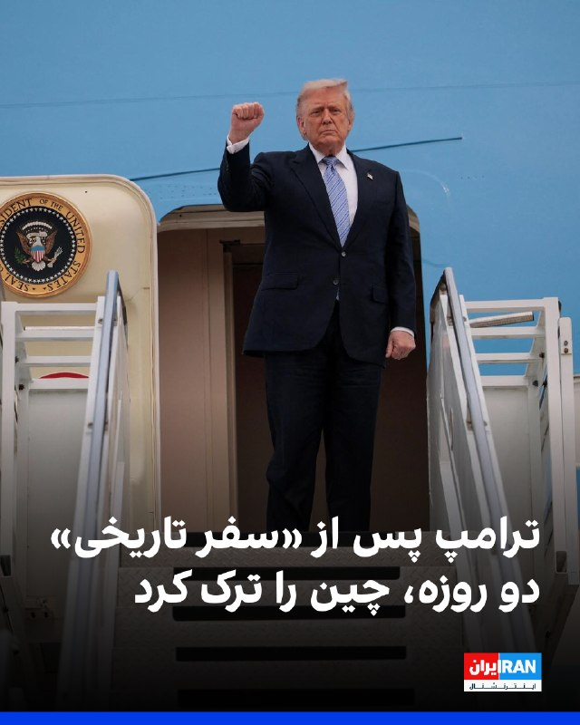
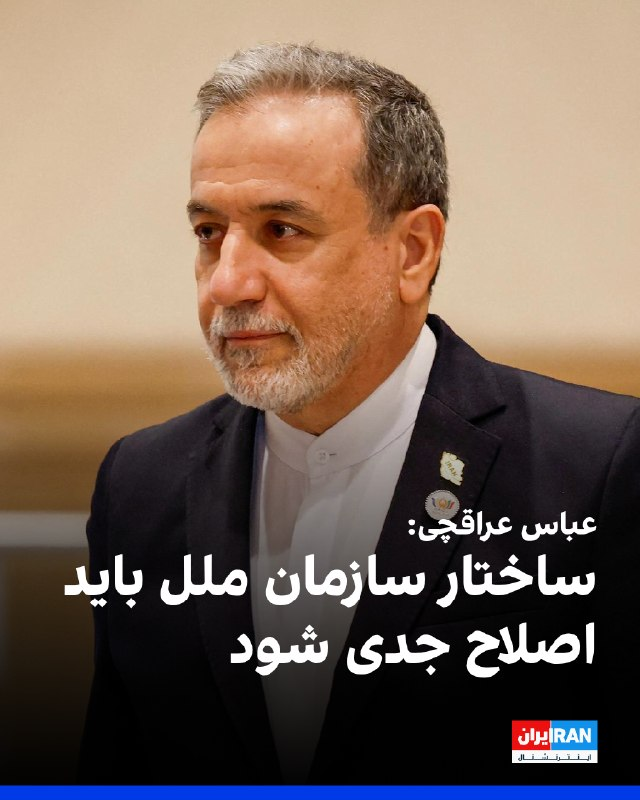
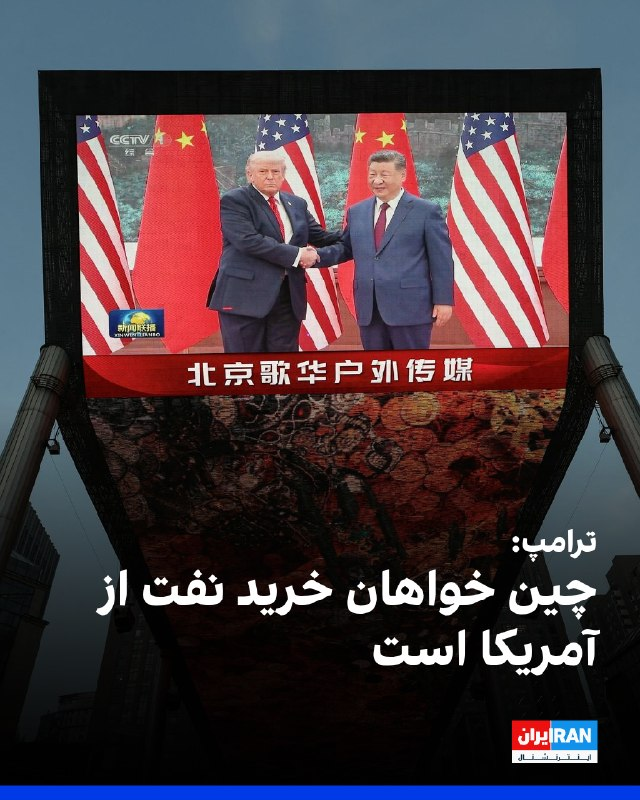
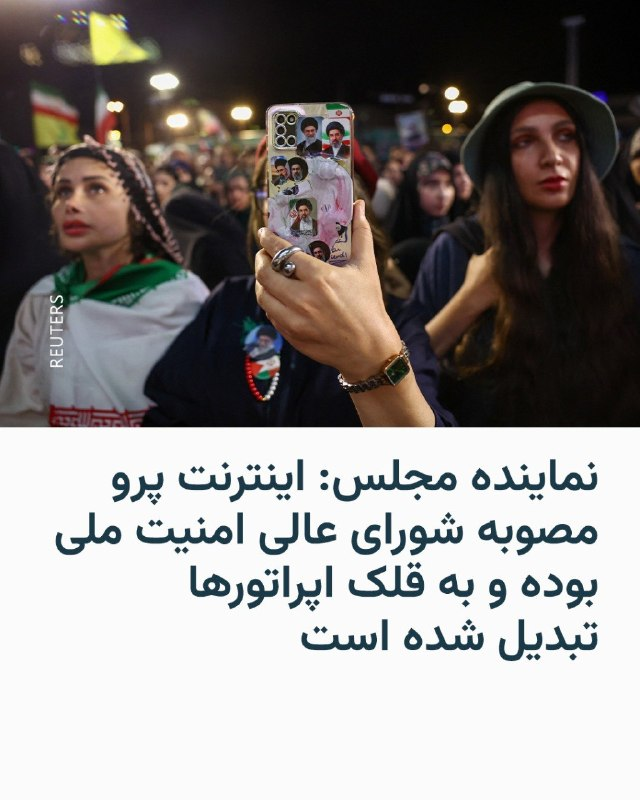
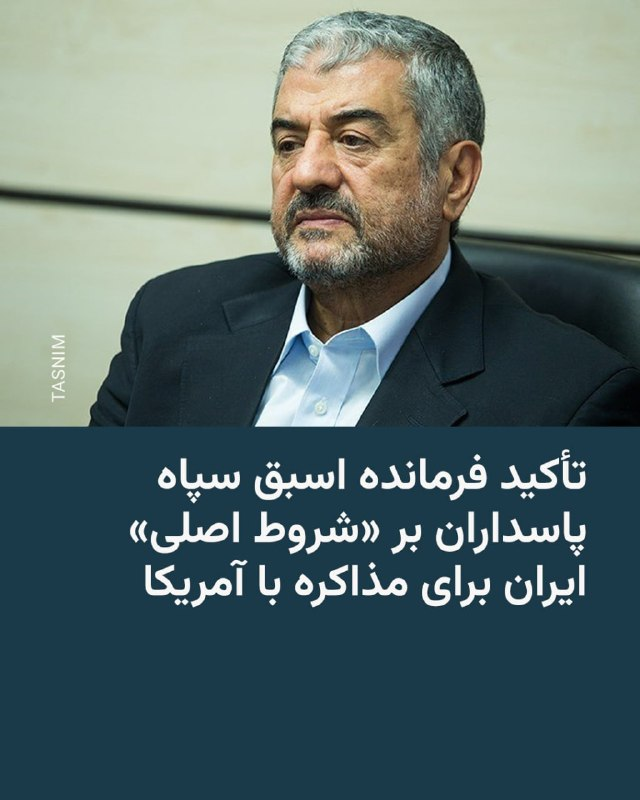
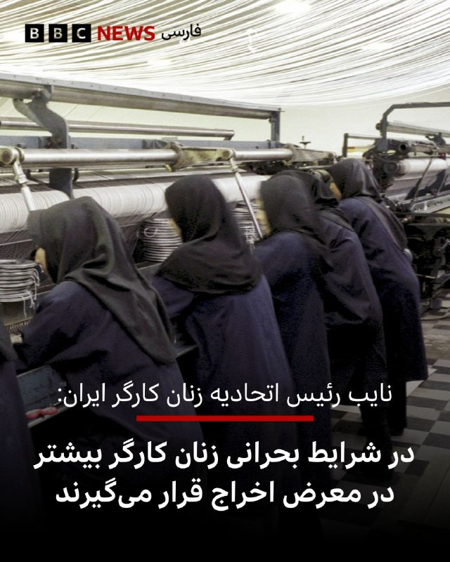

# خواننده تلگرام

<!-- TOP_NAV START -->

<a href="https://github.com/sinaalibabaei/aio-downloader/blob/main/telegram/content/archive_1.md" style="display:inline-block; padding:6px 12px; margin:0 4px; background-color:#2ea44f; color:white; text-decoration:none; border-radius:4px; font-weight:bold;">صفحه بعد</a>

<!-- TOP_NAV END -->

<!-- MSG START -->

---
📅 بروزرسانی: 1405/02/25 11:13
---

## VahidOOnLine — post 240256

  

دونالد ترامپ، رییس‌جمهوری آمریکا، روز جمعه پس از سفری دو روزه سوار هواپیمای اختصاصی ریاست‌جمهوری آمریکا «ایر فورس وان» شد و پکن را ترک کرد. وانگ یی، وزیر امور خارجه چین، ترامپ را پیش از سوار شدن به هواپیما همراه با هیاتی دیپلماتیک بدرقه کرد.

شی جین‌پینگ، رییس‌جمهوری چین، در سخنرانی خود در مراسم ضیافت رسمی به مناسبت سفر دونالد ترامپ، این سفر را «تاریخی» خواند و گفت: «دو شعار "احیای چین" و "عظمت را به آمریکا بازگردانیم" می‌توانند در کنار یکدیگر پیش بروند.»
‌🏁 🇬🇧 IranintlTV

🤖 @VahidOOnLine

## VahidOOnLine — post 240255

  <a href="telegram/content/VahidOOnLine_240255_1778831000.mp4" target="_blank">🎬 Download video</a>

اف‌بی‌آی اعلام کرد برای دریافت اطلاعاتی که به شناسایی و بازداشت «مونیکا ویت»، مامور سابق ضدجاسوسی و متخصص اطلاعاتی نیروی هوایی آمریکا، منجر شود ۲۰۰ هزار دلار جایزه تعیین کرده است.
بر اساس بیانیه اف‌بی‌آی، ویت بین سال‌های ۱۹۹۷ تا ۲۰۰۸ در نیروی هوایی آمریکا خدمت کرده و سپس تا سال ۲۰۱۰ به‌عنوان پیمانکار دولت آمریکا فعالیت داشته است. او به اطلاعات محرمانه و فوق‌محرمانه، از جمله هویت نیروهای مخفی جامعه اطلاعاتی آمریکا، دسترسی داشته است. مقام‌های آمریکایی می‌گویند او پس از شرکت در نشست‌هایی مرتبط با برنامه «افق نو» در تهران، به ایران پناهنده شد و اطلاعات حساسی را در اختیار جمهوری اسلامی قرار داد.
وزارت دادگستری آمریکا پیش‌تر او را به همکاری در عملیات جاسوسی سایبری، افشای اطلاعات محرمانه و به خطر انداختن جان نیروهای آمریکایی و خانواده‌هایشان متهم کرده بود. اف‌بی‌آی می‌گوید مونیکا ویت همچنان متواری است و احتمال می‌دهد افرادی از محل اختفای او اطلاع داشته باشند.
‌🏁 🇬🇧 ManotoTV

🤖 @VahidOOnLine

## VahidOOnLine — post 240254

  <a href="telegram/content/VahidOOnLine_240254_1778831000.mp4" target="_blank">🎬 Download video</a>

ارتش اسرائیل اعلام کرد در پی فعال شدن آژیر هشدار در مناطق مسد و عیلابون، یک پرتابه شلیک‌شده از خاک لبنان به سوی اسرائیل رهگیری شده است. به گفته ارتش اسرائیل، این اقدام «نقض دیگری از تفاهم‌های آتش‌بس» از سوی حزب‌الله به شمار می‌رود.
همزمان ارتش اسرائیل اعلام کرد یک سرباز این کشور شب گذشته بر اثر شلیک خمپاره حزب‌الله در جنوب لبنان کشته شده است. سرباز کشته‌شده، گروهبان دوم نگو داگان، ۲۰ ساله، از گردان دوازدهم تیپ گولانی و اهل شهرک دکل در جنوب اسرائیل معرفی شده است.
ارتش اسرائیل همچنین اعلام کرد شب گذشته سکوی پرتابی را که حزب‌الله از آن چندین راکت به سوی منطقه کریات شمونا شلیک کرده بود، در منطقه زبدین در جنوب لبنان هدف قرار داده و منهدم کرده است. به گفته ارتش، چندین ساختمان مورد استفاده حزب‌الله برای اهداف نظامی نیز در این حملات هدف قرار گرفته‌اند.
‌🏁 🇬🇧 ManotoTV

🤖 @VahidOOnLine

## VahidOOnLine — post 240253

  <a href="telegram/content/VahidOOnLine_240253_1778831002.mp4" target="_blank">🎬 Download video</a>

ویدئویی از قدم زدن دونالد ترامپ و شی جین‌پینگ در باغ‌های مجموعه حکومتی ژونگ‌نان‌های در پکن منتشر شده است.
در این ویدئو، ترامپ از رئیس‌جمهوری چین می‌پرسد: «وقتی دیگر رؤسای کشورها به دیدارتان می‌آیند، آن‌ها را هم اینجا می‌پذیرید؟»
شی جین‌پینگ در پاسخ می‌گوید: «به ندرت می‌آیند».
‌🏁 🇬🇧 ManotoTV

🤖 @VahidOOnLine

## VahidOOnLine — post 240252

  <a href="telegram/content/VahidOOnLine_240252_1778831004.mp4" target="_blank">🎬 Download video</a>

دونالد ترامپ پس از دیدار با شی جین‌پینگ اعلام کرد آمریکا و چین درباره ایران دیدگاه‌های «بسیار مشابهی» دارند و هر دو خواهان پایان تنش‌ها و باز ماندن تنگه هرمز هستند.
ترامپ گفت: «نمی‌خواهیم ایران به سلاح هسته‌ای دست پیدا کند.» او همچنین وضعیت کنونی را «دیوانه‌وار» توصیف کرد و افزود واشینگتن خواهان پایان بحران است.
رئیس‌جمهوری آمریکا همچنین با اشاره به روابط خود با شی جین‌پینگ گفت دو طرف طی سال‌های گذشته توانسته‌اند مشکلاتی را حل کنند که دیگران قادر به حل آن‌ها نبودند و تاکید کرد روابط میان واشینگتن و پکن همچنان «بسیار قوی» است.
‌🏁 🇬🇧 ManotoTV

🤖 @VahidOOnLine

## VahidOOnLine — post 240251

  <a href="telegram/content/VahidOOnLine_240251_1778831006.mp4" target="_blank">🎬 Download video</a>

مقام‌های فنلاند روز جمعه درباره فعالیت مشکوک پهپادی در منطقه پایتخت هشدار دادند و فرودگاه هلسینکی اعلام کرد پروازها به‌طور موقت متوقف شده است.
پتری اورپو، نخست‌وزیر فنلاند، در پیامی در شبکه اجتماعی ایکس اعلام کرد: «مقام‌ها در حال اقدام هستند. نیروهای مسلح نیز توان نظارتی و واکنش خود را تقویت کرده‌اند. از همه می‌خواهم اطلاعیه‌های رسمی را دنبال کنند.
‌🏁 🇬🇧 ManotoTV

🤖 @VahidOOnLine

## VahidOOnLine — post 240250

♦️دونالد ترامپ، رئیس‌جمهوری ایالات متحده، روز جمعه در پایان سفر رسمی دو روزه به چین و دیدار با شی جین‌پینگ، رئیس‌جمهوری این کشور، پکن را ترک کرد.
دونالد ترامپ پس از مراسم رسمی بدرقه ‌در فرودگاه بین‌المللی پکن، با هواپیمای ریاست‌جمهوری آمریکا، «ایرفورس وان» به واشنگتن بازگشت.
‌🇸🇦 Indypersian

🤖 @VahidOOnLine

## VahidOOnLine — post 240249

  <a href="telegram/content/VahidOOnLine_240249_1778831007.mp4" target="_blank">🎬 Download video</a>

⭕️پرواز خودروی متهم فراری در جریان تعقیب و گریز پلیس در آمریکا

♦️مقام‌های پلیس در ایالت ویسکانسین آمریکا، ویدیویی منتشر کرده‌اند که لحظه پرتاب شدن خودروی یک مظنون روی خودرویی دیگر را هنگام تلاش برای فرار نشان می‌دهد.

بر اساس این ویدیو، خودروی مظنون هنگام فرار با سرعت از روی بخشی از بزرگراه به هوا پرتاب شد و پس از عبور از بالای یک خودروی دیگر، در یک مزرعه فرود آمد.

به گفته مقام‌ها، مظنون پس از توقف خودرو تلاش کرد پیاده فرار کند، اما پس از یک تعقیب و گریز کوتاه بازداشت شد. مقام‌های محلی اعلام کردند او اکنون با چندین اتهام روبه‌رو است.
‌🇸🇦 Indypersian

🤖 @VahidOOnLine

## VahidOOnLine — post 240248

  

⭕️عراقچی و وزیر خارجه هند درباره وضعیت تنگه هرمز و آتش‌بس میان تهران و واشنگتن رایزنی کردند

♦️عباس عراقچی، در حاشیه اجلاس وزیران امورخارجه بریکس، در دیدار با همتای هندی خود درباره آخرین تحولات پس از جنگ ایران و ائتلاف آمریکا و اسرائیل، وضعیت آتش‌بس شکننده جاری و روند مذاکرات مرتبط با پایان جنگ گفتگو کرد.

به گزارش میزان، عراقچی در این دیدار همتای هندی خود را در جریان آخرین تحولات سیاسی و امنیتی منطقه قرار داد و درباره روند مذاکرات مرتبط با خاتمه جنگ توضیحاتی ارائه کرد. وزیر امور خارجه هند نیز بر حمایت کشورش از راهکارهای دیپلماتیک برای حل‌وفصل مسائل و اختلافات بین‌المللی تاکید کرد.

دو طرف همچنین درباره آخرین وضعیت تنگه هرمز و تحولات مرتبط با امنیت دریایی و ثبات منطقه‌ای رایزنی و تبادل نظر کردند، موضوعی که در هفته‌های اخیر به‌دلیل تنش‌های منطقه‌ای و نگرانی‌ها درباره امنیت مسیرهای کشتیرانی، اهمیت بیشتری یافته است.
‌🇸🇦 Indypersian

🤖 @VahidOOnLine

## VahidOOnLine — post 240247

  

سنتکام، ستاد فرماندهی مرکزی آمریکا، تصویری از یک جنگنده اف-۱۶ نیروی هوایی آمریکا منتشر کرد و اعلام کرد این جنگنده برای پرواز شبانه از پایگاهی در خاورمیانه به پرواز درآمده است.

سنتکام نوشت: «جنگنده‌های نیروی هوایی آمریکا به طور منظم در حمایت از امنیت منطقه‌ای، آسمان خاورمیانه را گشت‌زنی می‌کنند.»
‌🏁 🇬🇧 IranintlTV

🤖 @VahidOOnLine

## VahidOOnLine — post 240246

  

عباس عراقچی، وزیر خارجه جمهوری اسلامی، در نشست وزیران خارجه بریکس خواستار اصلاح ساختار سازمان ملل و «نمایندگی عادلانه» همه مناطق جهان در شورای امنیت شد.

او در این نشست گفت: «جمهوری اسلامی خواستار اصلاح ساختار سازمان ملل و نمایندگی عادلانه همه مناطق جهان در شورای امنیت است.»

وزیر خارجه جمهوری اسلامی همچنین تحریم‌های «یکجانبه» را سلاحی علیه حقوق انسان‌ها توصیف کرد و افزود: «تحریم‌های یکجانبه به سلاحی علیه حقوق انسان‌ها تبدیل شده‌اند و مقابله با تروریسم اقتصادی ماموریت ضروری بریکس است.»
‌🏁 🇬🇧 IranintlTV

🤖 @VahidOOnLine

## VahidOOnLine — post 240245

⭕️ترامپ در حضور شی: درباره ایران احساس مشترکی داریم، نمی‌خواهیم سلاح هسته‌ای داشته باشد و تنگه هرمز باید باز باشد

📌وزارت خارجه چین می‌گوید تنگه هرمز باید باز باشد و آتش‌بس حفظ شود

♦️دونالد ترامپ، رئیس‌جمهوری آمریکا صبح روز جمعه، در دومین روز سفر به چین همراه با اعضای ارشد کابینه خود برای دیدار دوباره با شی‌ جین‌پینگ، رئیس‌جمهوری چین وارد مجموعه «ژونگ‌نانهای» در پکن شد. رهبر چین شخصا باغ رز این مجموعه را به ترامپ نشان داد و پس از اینکه دید توجه رئیس‌جمهوری آمریکا به این رزها جلب شده، دستور داد که بذر این گیاهان که بیش از ۴۰۰ سال عمر دارند را به ترامپ هدیه دهند.

بیشتر بخوانید...
‌🇸🇦 Indypersian

🤖 @VahidOOnLine

## VahidOOnLine — post 240244

⭕️اصغر فرهادی با «داستان‌های موازی» بر فرش قرمز کن قدم گذاشت

♦️عوامل فیلم «داستان‌های موازی» به کارگردانی اصغر فرهادی، شامگاه پنجشنبه در هفتادونهمین جشنواره فیلم کن روی فرش قرمز حاضر شدند؛ فیلمی که با حضور گروهی از سرشناس‌ترین بازیگران سینمای فرانسه ساخته شده است.

در این مراسم، کاترین دونو، ونسان کسل، ایزابل اوپر و پی‌یر نینی، از بازیگران اصلی فیلم، در کنار فرهادی روی فرش قرمز جشنواره کن حضور یافتند.

«داستان‌های موازی» تازه‌ترین ساخته اصغر فرهادی، فیلمساز ایرانی برنده دو جایزه اسکار است. این فیلم «چندین داستان درهم‌تنیده در گوشه‌ای از پاریس» را روایت می‌کند.
‌🇸🇦 Indypersian

🤖 @VahidOOnLine

## VahidOOnLine — post 240243

♦️پس از گفت‌وگوی خصوصی ترامپ و شی در صبح روز جمعه که حدود ۱۰ دقیقه طول کشید و دور از حضور رسانه‌ها انجام شد، دو رهبر در باغ‌های ژونگ‌نانهای قدم زدند.
ترامپ گفت: «این‌ها زیباترین رزهایی هستند که کسی تا به حال دیده است.»
وقتی خبرنگاری از او پرسید آیا از سفرش لذت می‌برد، ترامپ در حالی که مسئولان چینی می‌گفتند «سوال نپرسید»، با بالا بردن انگشت شست واکنش نشان داد.
آن دو از میان گذرگاهی سرپوشیده با ستون‌های سبز و طاق‌هایی که روی آن‌ها تصاویر پرندگان و مناظر سنتی کوهستانی چین نقاشی شده بود عبور کردند و به میدان کوچکی رسیدند که در آنجا برای عکس یادگاری مقابل دوربین‌ها ایستادند.
ترامپ و شی بعدا در یک آلاچیق مجلل نشستند؛ جایی که شی از طریق مترجم درباره تاریخ ژونگ‌نانهای توضیح داد. پیت هگست، وزیر جنگ آمریکا، مارکو روبیو، وزیر خارجه، و اسکات بسنت، وزیر خزانه‌داری، نیز حضور داشتند.
شی گفت بذر گل‌های رز را برای ترامپ خواهد فرستاد.
ترامپ نیز افزود که دو طرف به «توافق‌های تجاری فوق‌العاده‌ای» دست یافته‌اند.
‌🇸🇦 Indypersian

🤖 @VahidOOnLine

## VahidOOnLine — post 240242

  

ترامپ در گفت‌وگو با فاکس‌نیوز در پکن با اشاره به اینکه گسترش همکاری‌های تجاری میان آمریکا و چین می‌تواند به نفع هر دو طرف باشد، گفت چین خواهان خرید نفت از ایالات‌متحده است.
او با اشاره به روابط بسیار خوب خود با شی گفت: «زمانی چین از آمریکا سوءاستفاده می‌کرد، اما حالا ما با چین عملکرد بسیار خوبی داریم.»
ترامپ با اشاره به همراهی ۳۰ نفر از بزرگ‌ترین صاحبان‌کسب‌وکار آمریکا در سفر به چین گفت بسیاری از این مدیران برای نخستین‌بار با شی جین‌پینگ دیدار کردند. او این دیدارها را مثبت ارزیابی کرد.
او همچنین افزود در دیدار با مقام‌های چینی، موضوع دسترسی بیشتر شرکت ویزا به بازار کارت‌های اعتباری چین را مطرح کرده است.
ترامپ درباره رئیس‌جمهوری چین گفت: «وقتی درباره برخی رهبران خوب صحبت می‌کنم، از من انتقاد می‌شود، اما او نزدیک به یک‌ونیم میلیارد نفر را برای مدت طولانی رهبری کرده و مورد احترام است.»

‌🏁 🇬🇧 IranintlTV

🤖 @VahidOOnLine

## VahidOOnLine — post 240241

  

شبکه کان اسرائیل گزارش داد دونالد ترامپ، رییس‌جمهوری آمریکا، پس از بازگشت از سفر به چین درباره ازسرگیری جنگ علیه جمهوری اسلامی یا تمدید محاصره تنگه هرمز تصمیم‌گیری خواهد کرد.
به گفته منابع اسرائیلی، در روزهای اخیر رایزنی‌هایی میان مقام‌های ارشد ارتش اسرائیل و فرماندهی مرکزی ایالات متحده (سنتکام) انجام شده است. این منابع افزودند اسرائیل خواهان بازگشت به کارزار نظامی علیه جمهوری اسلامی است و بنیامین نتانیاهو، نخست‌وزیر اسرائیل، چندین بار بر این موضع تاکید کرده است.
هم‌زمان روزنامه هاآرتص نوشت هرچند نشانه‌ای از هشدار امنیتی غیرمعمول مشاهده نشده، اما احتمال ازسرگیری درگیری‌ها در روزهای آینده مطرح است.

‌🏁 🇬🇧 IranintlTV

🤖 @VahidOOnLine

## WithYashar — post 11265

ترامپ در تروث : «وقتی رئیس‌جمهور شی با بیانی بسیار سنجیده از ایالات متحده به‌عنوان کشوری که شاید در حال افول باشد یاد کرد، منظور او آسیب عظیمی بود که ما در چهار سال دوران جو بایدنِ خواب‌آلود و دولت بایدن متحمل شدیم؛ و در این مورد، او صددرصد درست می‌گفت. کشور…

## WithYashar — post 11264

@withyashar

## WithYashar — post 11263

  <a href="telegram/content/WithYashar_11263_1778831014.mp4" target="_blank">🎬 Download video</a>

@withyashar منتظر ری اکشننن

## WithYashar — post 11262

نظرت چیه؟قبل جام جهانی میزنع یا بعد؟

## WithYashar — post 11261

کانال 13 اسرائیل:اسرائیل انتظار دارد حمله احتمالی آمریکا در ایران از فردا با بازگشت ترامپ از چین آغاز شود
@withyashar

## WithYashar — post 11260

  <a href="telegram/content/WithYashar_11260_1778831016.mp4" target="_blank">🎬 Download video</a>

پایان سفر ترامپ به چین

دونالد ترامپ، رئیس جمهور آمریکا، پکن را ترک کرد و سفر خود به جمهوری خلق چین را به پایان رساند.

شی جین‌پینگ، رئیس‌جمهور چین در آخرین روز سفر رئیس جمهور ایالات متحده گفت که دونالد ترامپ به دنبال بازگرداندن عظمت آمریکا است و او نیز متعهد به هدایت مردم چین برای تحقق رستاخیز ملی است.

شی جین‌پینگ همچنین تأکید کرده است که چین و آمریکا می‌توانند از طریق تقویت همکاری‌ها، روند توسعه و پیشرفت خود را تسریع کنند.
@withyashar

## WithYashar — post 11259

  <a href="telegram/content/WithYashar_11259_1778831019.mp4" target="_blank">🎬 Download video</a>

ترامپ: امیدوارم ایران تماشا کند. ما دقیقاً می‌دانیم چه چیزی را آماده کرده‌اند. می‌دانید، آن‌ها کمی استراحت داشتند، بنابراین سعی دارند چند چیز را با هم جمع کنند. آن‌ها موشک‌هایی را از زیر زمین بیرون آورده‌اند. همه این‌ها در یک روز از بین خواهند رفت. امیدوارم این رو ببینند چون همه کارهایی که در چهار هفته گذشته انجام داده‌اند، در یک روز از بین خواهد رفت.
@withyashar
یاشار:خوب دیگه رسمأ داره میگه جنگ میشه و هم داره میگه حمله خیلی سریع و محکم انجام میشه همانطور که گفتیم

## WithYashar — post 11258

آمریکا پیشنهاد ۱۴ ماده‌ای ایران را رد کرد

طبق اطلاعات رسیده به تهران تایمز، دولت آمریکا پاسخ پیشنهاد مکتوب ایران درباره پایان جنگ را داده است.

گفتنی است ایران پیشنهاد خود را مبتنی بر مذاکرات دو مرحله ای ارائه کرده بود که در مرحله اول منجر به پایان جنگ در همه جبهه ها شده و در صورت تحقق شروط ایران، مرحله دوم مذاکرات که درباره موضوع هسته ای بود، آغاز می شد
@withyashar

## WithYashar — post 11257

مجلس نمایندگان آمریکا برای سومین بار طرح دموکرات‌ها جهت محدود کردن اختیارات نظامی ترامپ علیه جمهوری اسلامی رو رد کرد.

این طرح با نتیجه ۲۱۲ در برابر ۲۱۲ به تساوی رسید و در نهایت با اختلاف یک رای شکست خورد.
@withyashar

## WithYashar — post 11256

ترامپ، به شبکه فاکس نیوز: مذاکره با ایران درباره کنار گذاشتن غبار هسته‌ای به دلیل تضاد در تصمیمات ایران، رفت و برگشت دارد تأسیسات هسته‌ای ایران تحت نظارت مداوم ۹ دوربین، ۲۴ ساعته قرار دارند. هرگونه تحرک ایرانی در داخل تأسیسات هسته‌ای با واکنش مستقیم نظامی…

## WithYashar — post 11255

  <a href="telegram/content/WithYashar_11255_1778831022.mp4" target="_blank">🎬 Download video</a>

‏ ترامپ: ما مشکلات زیادی را حل کرده‌ایم که دیگران قادر نبودند و این رابطه یک رابطه بسیار قوی است. فکر می‌کنم در مورد ایران کارهای فوق‌العاده‌ای انجام داده‌ایم، ما هم صحبت کردیم.

‏ما در مورد ایران بسیار مشابه‌ایم، می‌خواهیم این وضعیت پایان یابد. نمی‌خواهیم آن‌ها به سلاح هسته‌ای دست پیدا کنند. می‌خواهیم تنگه‌ها باز باشند و ما آن را برایشان می‌بندیم، آن‌ها تنها تنگه را بستند و بعد ما هم روی سرشان بستیم.
@withyashar

## WithYashar — post 11254

ترامپ، به شبکه فاکس نیوز: مذاکره با ایران درباره کنار گذاشتن غبار هسته‌ای به دلیل تضاد در تصمیمات ایران، رفت و برگشت دارد
تأسیسات هسته‌ای ایران تحت نظارت مداوم ۹ دوربین، ۲۴ ساعته قرار دارند.
هرگونه تحرک ایرانی در داخل تأسیسات هسته‌ای با واکنش مستقیم نظامی مواجه خواهد شد.
@withyashar

## FoxNewsTwitter — post 341767

  <a href="telegram/content/FoxNewsTwitter_341767_1778831024.mp4" target="_blank">🎬 Download video</a>

Fox News (Twitter/X)

NOW: President Trump gives a fist pump as he departs China after a series of crucial meetings with President Xi Jinping on the Iran war, trade tensions, technology, and Taiwan.

Ahead of his departure, Trump met with Xi and expressed optimism about hosting him in the U.S. this September.

“You're going to walk away hopefully very impressed, like I'm very impressed with China."

## FoxNewsTwitter — post 341766

  <a href="telegram/content/FoxNewsTwitter_341766_1778831028.mp4" target="_blank">🎬 Download video</a>

Fox News (Twitter/X)

NOW: President Trump exits the Beast to fanfare and pumps his fist during a departure ceremony at Beijing Capital International Airport.

Ahead of his departure, Trump met with Chinese President Xi Jinping and expressed optimism about hosting him in the U.S. this September.

“You're going to walk away hopefully very impressed, like I'm very impressed with China."

## FoxNewsTwitter — post 341765

  

Fox News (Twitter/X)

WATCH LIVE: President Trump departs Beijing after summit with President Xi https://twitter.com/i/broadcasts/1XxygmDlakEGM

## FoxNewsTwitter — post 341764

  

Fox News (Twitter/X)

President Trump took a stroll through Zhongnanhai Garden, part of a powerful Chinese government complex, with President Xi Jinping on his second day of meetings in Beijing.

## FoxNewsTwitter — post 341763

  <a href="telegram/content/FoxNewsTwitter_341763_1778831032.mp4" target="_blank">🎬 Download video</a>

Fox News (Twitter/X)

NOW: President Trump tours Zhongnanhai Garden with Chinese President Xi Jinping.

## FoxNewsTwitter — post 341762

  <a href="telegram/content/FoxNewsTwitter_341762_1778831035.mp4" target="_blank">🎬 Download video</a>

Fox News (Twitter/X)

NOW: President Trump says he and Chinese President Xi "feel very similar on Iran."

"We want that to end. We don't want them to have a nuclear weapon. We want the straits open."

## FoxNewsTwitter — post 341761

  <a href="telegram/content/FoxNewsTwitter_341761_1778831037.mp4" target="_blank">🎬 Download video</a>

Fox News (Twitter/X)

NOW: President Trump says he and Chinese President Xi agree they do not want Iran to obtain a nuclear weapon and want the Strait of Hormuz to remain open.

## pm_afshaa — post 90766

🔴کانال 13 اسرائیل:اسرائیل انتظار دارد حمله احتمالی آمریکا در ایران از فردا با بازگشت ترامپ از چین آغاز شود

💧 Rainbet.com the #1 Non-KYC Crypto Casino & Sportsbook @rainbetcom

😁 @Pm_Afshaa

## pm_afshaa — post 90765

🔴ترامپ به فاکس نیوز:امیدوارم ایران در حال تماشا باشد. ما دقیقاً می‌دانیم چه چیزی را به نمایش گذاشته‌اند.

می‌دانید، آنها کمی استراحت داشتند، بنابراین سعی می‌کنند چند چیز را جمع کنند. آنها چند موشک را از زیر زمین برداشته‌اند. همه آن‌ها در یک روز از بین خواهد رفت.

هر کاری که در چهار هفته گذشته انجام داده‌اند، در یک روز از بین خواهد رفت

💧 Rainbet.com the #1 Non-KYC Crypto Casino & Sportsbook @rainbetcom

😁 @Pm_Afshaa

## pm_afshaa — post 90764

🔴توییت جدید ترامپ:جنگ با ایران ادامه خواهد داشت

💧 Rainbet.com the #1 Non-KYC Crypto Casino & Sportsbook @rainbetcom

😁 @Pm_Afshaa

## VahidOnline — post 75471

دونالد ترامپ، رئیس جمهوری آمریکا در مصاحبه‌ای که با فاکس نیوز انجام داد گفت او درباره ایران با چین صحبت کرده است.

ترامپ افزود فکر نمی‌کند که چین هم خواهان این باشد که جمهوری اسلامی به سلاح هسته‌ای دست پیدا کند.

او گفت جمهوری اسلامی می‌تواند یا «توافق کند و یا «نابود» شود. رئیس جمهوری آمریکا گفت نمی‌خواهد چنین کاری کند اما آمریکا قوی‌ترین ارتش جهان را دارد.

ترامپ گفت ما در جمهوری اسلامی با «رده سوم» رهبرانش طرف هستیم. او گفت رده اول و دوم رهبری نابود شدند و فکر می‌کند رده سوم از رده اول و دوم «که دیگر با ما نیستند» «منطقی‌تر» و از لحاظی «باهوش‌تر» هستند.

او این تغییر را به‌نوعی با یک «تغییر رژیم» مقایسه کرد.

ترامپ با اشاره به اینکه جمهوری اسلامی «پنج روز» زمان صرف کرد تا به پیشنهاد آمریکا که «یک ساعت» هم زمان نمی‌برد پاسخ دهد، افزود جمهوری اسلامی در داخل خود «آشوب فراوان» دارد و «چیزی به جز آشوب» ندارند.

ترامپ در مورد حمایت چین از جمهوری اسلامی گفت که رئيس جمهوری چین، شی جین‌پینگ قویا گفت که به جمهوری اسلامی سلاح نخواهد داد.
...
او افزود «امیدوارم» جمهوری اسلامی این مصاحبه را ببیند چرا که آمریکا می‌تواند به سرعت همه تسلیحاتی که آن‌ها در طول آتش‌بس ممکن است به آن‌ها دست یافته باشند به سرعت نابود ‌کند. ترامپ گفت «ما دقیقا می‌دانیم چه کاری می‌کنند...و هر کاری که در چهار هفته گذشته انجام داده‌اند ما آن‌ها را در یک روز از بین می‌بریم.»

رئیس جمهوری آمریکا گفت جنگ را می‌توانست «چند هفته بیشتر» ادامه دهد و ماجرا تمام می‌شد اما به درخواست چند کشور آن را متوقف کرد. ترامپ گفت جمهوری اسلامی دو گزینه دارد: «یا توافق کند و یا نابود شود.»

ترامپ همچنین درباره خارج کردن اورانیوم غنی‌شده از ایران گفت این کار را بیشتر برای «روابط عمومی» انجام خواهد داد و او احساس بهتری خواهد داشت که آن مواد از ایران خارج شود.

رئیس جمهوری آمریکا افزود «به‌دست آوردنش پروژه بزرگی است، واقعاً پروژه بزرگی است.»

او گفت: «اوایل به انجام این کار فکر می‌کردیم، اما زمان می‌برد؛ حدود یک هفته و نیم طول می‌کشید، و این مدت زیادی است که در قلمرو دشمن باشید.»

دونالد ترامپ توضیح داد که «باید این حجم عظیم گرانیت را جابه‌جا کنید. می‌دانید، آنجا گرانیت است. گرانیت سخت‌ترین سنگ است. واقعاً شگفت‌انگیز است، چون بمب‌هایی که استفاده کردیم فوق‌العاده قدرتمند بودند. و یادتان نرود که علاوه بر آن، با موشک‌های تاماهاوک هم آنجا را زدیم.»

او گفت فکر نمی‌کند خارج کردن آن مواد از ایران «لازم باشد، مگر از نظر روابط عمومی. به نظرم برای رسانه‌های جعلی مهم است که ما آن را به‌دست بیاوریم. من همان کسی بودم که گفتم آن را به‌دست خواهیم آورد، و به‌دستش هم می‌آوریم. حواسمان به آن هست.»

ترامپ اشاره کرد که با «نیروی فضایی» آمریکا که ابتکار او بود همه تحرکات در اطراف سایت‌های هسته‌ای در ایران زیر نظر آمریکا است.

او گفت «من ترجیح می‌دهم آن را به‌دست بیاوریم، اما مراقبش هستیم. دقیقاً می‌دانیم آنجا چه اتفاقی می‌افتد. چند روز پیش مردی تلاش کرد وارد آن گذرگاه شود. دیدیم دری کاملاً متلاشی شده بود. و ما از همه‌چیز خبر داریم. اگر هرگز حرکتی انجام دهند، و این را هم به آن‌ها گفته‌ام، اگر نیرویی بفرستند و ببینم کسی تلاش می‌کند، تنها کاری که می‌کنیم این است که با چند بمب دیگر آنجا را می‌زنیم و کار تمام می‌شود. آن‌ها چنین کاری نخواهند کرد.»

ترامپ گفت: «به آن‌ها گفتم ما در آن محل، در آن سه سایت، ۲۴ ساعته ۹ دوربین داریم. دقیقاً می‌دانیم چه می‌گذرد. هیچ‌کس حتی به آن نزدیک هم نشده است. در ابتدا بررسی کردند و گفتند هیچ راهی وجود ندارد که کسی بتواند به آن غبار هسته‌ای برسد. اما با این حال، من ترجیح می‌دهم آن را داشته باشیم. ترجیح می‌دهم به‌دستش بیاوریم.»

@VahidHeadline

📡 @VahidOnline

## IranIntlTV — post 337272

  <a href="telegram/content/IranIntlTV_337272_1778831039.mp4" target="_blank">🎬 Download video</a>

یک شهروند با ارسال پیامی به ایران اینترنشنال با مقایسه قطع اینترنت در ایران و غزه گفت که در مورد غزه مواضع جهانی دیده شد. پیام این مخاطب با هوش مصنوعی خوانده شده است.

## IranIntlTV — post 337271

  

دونالد ترامپ، رییس‌جمهوری آمریکا، روز جمعه پس از سفری دو روزه سوار هواپیمای اختصاصی ریاست‌جمهوری آمریکا «ایر فورس وان» شد و پکن را ترک کرد. وانگ یی، وزیر امور خارجه چین، ترامپ را پیش از سوار شدن به هواپیما همراه با هیاتی دیپلماتیک بدرقه کرد.

شی جین‌پینگ، رییس‌جمهوری چین، در سخنرانی خود در مراسم ضیافت رسمی به مناسبت سفر دونالد ترامپ، این سفر را «تاریخی» خواند و گفت: «دو شعار "احیای چین" و "عظمت را به آمریکا بازگردانیم" می‌توانند در کنار یکدیگر پیش بروند.»
https://iranintl.com/202605150729

## IranIntlTV — post 337270

  <a href="telegram/content/IranIntlTV_337270_1778831043.mp4" target="_blank">🎬 Download video</a>

عباس عراقچی، وزیر خارجه جمهوری اسلامی، در دومین روز نشست وزیران خارجه کشورهای عضو بریکس، خواستار اصلاح ساختار سازمان ملل و «نمایندگی عادلانه» همه مناطق جهان در شورای امنیت شد.

جواد همدانی، خبرنگار ایران‌اینترنشنال، گزارش می‌دهد
@iranintltv

## IranIntlTV — post 337269

یک دانش‌آموز با ارسال پیامی به ایران اینترنشنال با روایت تاثیرات روحی کشتار معترضان در دی‌ماه و حمله به جمهوری اسلامی پس از آن می‌گوید وقتی صدای بمباران و انفجار نمی‌شنیدیم ناراحت می‌شدیم. صدای او با هوش مصنوعی تغییر یافته است.

## IranIntlTV — post 337268

  <a href="telegram/content/IranIntlTV_337268_1778831045.mp4" target="_blank">🎬 Download video</a>

هوشنگ حسن‌یاری، کارشناس خاورمیانه و امور نظامی، گفت جمهوری اسلامی با بستن تنگه هرمز، خود را در یک تنگنای دیپلماتیک قرار داده و باعث شکل‌گیری ائتلافی بین‌المللی علیه خود شده است.
@iranintltv

## IranIntlTV — post 337267

  <a href="telegram/content/IranIntlTV_337267_1778831048.mp4" target="_blank">🎬 Download video</a>

جاویدنامان انقلاب ملی ایرانیان
«حمید مهدوی»، آتش‌نشان، شامگاه ۱۸ دی‌ماه در حالی که مشغول به امدادرسانی به مجروحان بود مورد اصابت مستقیم گلوله قرار گرفت. نامش در حافظه‌ این سرزمین می‌ماند و یادش چراغ راه آزادی‌خواهان است.
@iranintltv

## IranIntlTV — post 337266

  <a href="https://t.me/IranintlTV/337266" target="_blank">📎 Download file</a>

🎧نسخه صوتی اخبار بامدادی | جمعه ۲۵ اردیبهشت
@iranintlTV

## IranIntlTV — post 337265

  <a href="telegram/content/IranIntlTV_337265_1778831051.mp4" target="_blank">🎬 Download video</a>

شهروندان چینی با نگاهی محتاطانه اما امیدوار، گفت‌وگوها میان ایالات متحده و چین را دنبال می‌کنند؛ گفت‌وگوهایی که به باور آن‌ها می‌تواند بر آینده اقتصاد و روابط جهانی تاثیرگذار باشد.

گزارش راضیه دانش، خبرنگار ایران‌اینترنشنال
@iranintltv

## IranIntlTV — post 337264

  <a href="telegram/content/IranIntlTV_337264_1778831053.mp4" target="_blank">🎬 Download video</a>

محسن جوادی، معاون امور فرهنگی وزارت فرهنگ و ارشاد اسلامی و رییس نمایشگاه بین‌المللی کتاب تهران، اعلام کرد این نمایشگاه کتاب به‌صورت مجازی برگزار خواهد شد.

گفت‌وگو با تهمینه رستمی، عضو تحریریه ایران‌اینترنشنال
@iranintltv

## IranIntlTV — post 337263

  <a href="telegram/content/IranIntlTV_337263_1778831056.mp4" target="_blank">🎬 Download video</a>

نمایشگاهی دیجیتال در یونان با استفاده از فناوری تصویرسازی سه‌بعدی، بازدیدکنندگان را وارد جهان شخصی و هنری فریدا کالو کرده است. این نمایشگاه زندگی، درد و تخیل این نقاش مشهور مکزیکی را فراتر از بوم نقاشی روایت می‌کند.

گزارش فرزیا ثابتی، خبرنگار ایران‌اینترنشنال
@iranintltv

## IranIntlTV — post 337262

  <a href="telegram/content/IranIntlTV_337262_1778831058.mp4" target="_blank">🎬 Download video</a>

۲۵ اردیبهشت در تقویم رسمی ایران به نام روز بزرگداشت ابوالقاسم فردوسی و پاسداشت زبان فارسی ثبت شده است. بر اساس آنچه فردوسی در شاهنامه آورده، سرودن این اثر در ۲۵ اسفند به پایان رسیده، اما به‌دلیل هم‌زمانی این تاریخ با تعطیلات نوروز، ۲۵ اردیبهشت به‌عنوان روز فردوسی در تقویم رسمی ثبت شده است.

گفت‌وگو با شکوه میرزادگی، نویسنده و موسس بنیاد میراث پاسارگاد
@iranintltv

## IranIntlTV — post 337261

  

سنتکام، ستاد فرماندهی مرکزی آمریکا، تصویری از یک جنگنده اف-۱۶ نیروی هوایی آمریکا منتشر کرد و اعلام کرد این جنگنده برای پرواز شبانه از پایگاهی در خاورمیانه به پرواز درآمده است.

سنتکام نوشت: «جنگنده‌های نیروی هوایی آمریکا به طور منظم در حمایت از امنیت منطقه‌ای، آسمان خاورمیانه را گشت‌زنی می‌کنند.»
https://iranintl.com/202605159752

## IranIntlTV — post 337260

  

عباس عراقچی، وزیر خارجه جمهوری اسلامی، در نشست وزیران خارجه بریکس خواستار اصلاح ساختار سازمان ملل و «نمایندگی عادلانه» همه مناطق جهان در شورای امنیت شد.

او در این نشست گفت: «جمهوری اسلامی خواستار اصلاح ساختار سازمان ملل و نمایندگی عادلانه همه مناطق جهان در شورای امنیت است.»

وزیر خارجه جمهوری اسلامی همچنین تحریم‌های «یکجانبه» را سلاحی علیه حقوق انسان‌ها توصیف کرد و افزود: «تحریم‌های یکجانبه به سلاحی علیه حقوق انسان‌ها تبدیل شده‌اند و مقابله با تروریسم اقتصادی ماموریت ضروری بریکس است.»
https://iranintl.com/202605159286

## IranIntlTV — post 337259

  <a href="telegram/content/IranIntlTV_337259_1778831062.mp4" target="_blank">🎬 Download video</a>

فیلم «داستان‌های موازی»، ساخته اصغر فرهادی، جمعه به‌طور رسمی در بخش مسابقه اصلی جشنواره فیلم کن به نمایش درمی‌آید.
سینمای مستقل، مهاجرت، تبعید و همچنین حضور فیلم‌سازان ایرانی در بخش‌های مختلف، از محورهای مورد توجه جشنواره امسال است.

گزارش لی‌لی نیکفر، خبرنگار ایران‌اینترنشنال
@iranintltv

## IranIntlTV — post 337258

  <a href="telegram/content/IranIntlTV_337258_1778831065.mp4" target="_blank">🎬 Download video</a>

دونالد ترامپ، رییس‌جمهوری آمریکا، پس از دیدار با شی جین‌پینگ در پکن، به شبکه فاکس نیوز گفت رییس‌جمهوری چین پیشنهاد داده برای کمک به بازگشایی تنگه هرمز همکاری کند. هم‌زمان وزارت خارجه چین نیز اعلام کرد: «تنگه هرمز باید هرچه زودتر بازگشایی شود.»

توماج طاهباز و امیر گیتی، خبرنگاران ایران‌اینترنشنال، گزارش می‌دهند
@iranintltv

## IranIntlTV — post 337257

  

ترامپ در گفت‌وگو با فاکس‌نیوز در پکن با اشاره به اینکه گسترش همکاری‌های تجاری میان آمریکا و چین می‌تواند به نفع هر دو طرف باشد، گفت چین خواهان خرید نفت از ایالات‌متحده است.
او با اشاره به روابط بسیار خوب خود با شی گفت: «زمانی چین از آمریکا سوءاستفاده می‌کرد، اما حالا ما با چین عملکرد بسیار خوبی داریم.»
ترامپ با اشاره به همراهی ۳۰ نفر از بزرگ‌ترین صاحبان‌کسب‌وکار آمریکا در سفر به چین گفت بسیاری از این مدیران برای نخستین‌بار با شی جین‌پینگ دیدار کردند. او این دیدارها را مثبت ارزیابی کرد.
او همچنین افزود در دیدار با مقام‌های چینی، موضوع دسترسی بیشتر شرکت ویزا به بازار کارت‌های اعتباری چین را مطرح کرده است.
ترامپ درباره رئیس‌جمهوری چین گفت: «وقتی درباره برخی رهبران خوب صحبت می‌کنم، از من انتقاد می‌شود، اما او نزدیک به یک‌ونیم میلیارد نفر را برای مدت طولانی رهبری کرده و مورد احترام است.»

https://iranintl.com/202605154928

## IranIntlTV — post 337256

  <a href="telegram/content/IranIntlTV_337256_1778831069.mp4" target="_blank">🎬 Download video</a>

سرخط خبرهای جمعه ۲۵ اردیبهشت
@iranintltv

## IranIntlTV — post 337255

  

شبکه کان اسرائیل گزارش داد دونالد ترامپ، رییس‌جمهوری آمریکا، پس از بازگشت از سفر به چین درباره ازسرگیری جنگ علیه جمهوری اسلامی یا تمدید محاصره تنگه هرمز تصمیم‌گیری خواهد کرد.
به گفته منابع اسرائیلی، در روزهای اخیر رایزنی‌هایی میان مقام‌های ارشد ارتش اسرائیل و فرماندهی مرکزی ایالات متحده (سنتکام) انجام شده است. این منابع افزودند اسرائیل خواهان بازگشت به کارزار نظامی علیه جمهوری اسلامی است و بنیامین نتانیاهو، نخست‌وزیر اسرائیل، چندین بار بر این موضع تاکید کرده است.
هم‌زمان روزنامه هاآرتص نوشت هرچند نشانه‌ای از هشدار امنیتی غیرمعمول مشاهده نشده، اما احتمال ازسرگیری درگیری‌ها در روزهای آینده مطرح است.

https://iranintl.com/202605159751

## ManotoTV — post 105472

  <a href="telegram/content/ManotoTV_105472_1778831072.mp4" target="_blank">🎬 Download video</a>

اف‌بی‌آی اعلام کرد برای دریافت اطلاعاتی که به شناسایی و بازداشت «مونیکا ویت»، مامور سابق ضدجاسوسی و متخصص اطلاعاتی نیروی هوایی آمریکا، منجر شود ۲۰۰ هزار دلار جایزه تعیین کرده است.
بر اساس بیانیه اف‌بی‌آی، ویت بین سال‌های ۱۹۹۷ تا ۲۰۰۸ در نیروی هوایی آمریکا خدمت کرده و سپس تا سال ۲۰۱۰ به‌عنوان پیمانکار دولت آمریکا فعالیت داشته است. او به اطلاعات محرمانه و فوق‌محرمانه، از جمله هویت نیروهای مخفی جامعه اطلاعاتی آمریکا، دسترسی داشته است. مقام‌های آمریکایی می‌گویند او پس از شرکت در نشست‌هایی مرتبط با برنامه «افق نو» در تهران، به ایران پناهنده شد و اطلاعات حساسی را در اختیار جمهوری اسلامی قرار داد.
وزارت دادگستری آمریکا پیش‌تر او را به همکاری در عملیات جاسوسی سایبری، افشای اطلاعات محرمانه و به خطر انداختن جان نیروهای آمریکایی و خانواده‌هایشان متهم کرده بود. اف‌بی‌آی می‌گوید مونیکا ویت همچنان متواری است و احتمال می‌دهد افرادی از محل اختفای او اطلاع داشته باشند.

## ManotoTV — post 105471

  <a href="telegram/content/ManotoTV_105471_1778831072.mp4" target="_blank">🎬 Download video</a>

ارتش اسرائیل اعلام کرد در پی فعال شدن آژیر هشدار در مناطق مسد و عیلابون، یک پرتابه شلیک‌شده از خاک لبنان به سوی اسرائیل رهگیری شده است. به گفته ارتش اسرائیل، این اقدام «نقض دیگری از تفاهم‌های آتش‌بس» از سوی حزب‌الله به شمار می‌رود.
همزمان ارتش اسرائیل اعلام کرد یک سرباز این کشور شب گذشته بر اثر شلیک خمپاره حزب‌الله در جنوب لبنان کشته شده است. سرباز کشته‌شده، گروهبان دوم نگو داگان، ۲۰ ساله، از گردان دوازدهم تیپ گولانی و اهل شهرک دکل در جنوب اسرائیل معرفی شده است.
ارتش اسرائیل همچنین اعلام کرد شب گذشته سکوی پرتابی را که حزب‌الله از آن چندین راکت به سوی منطقه کریات شمونا شلیک کرده بود، در منطقه زبدین در جنوب لبنان هدف قرار داده و منهدم کرده است. به گفته ارتش، چندین ساختمان مورد استفاده حزب‌الله برای اهداف نظامی نیز در این حملات هدف قرار گرفته‌اند.

## ManotoTV — post 105470

  <a href="telegram/content/ManotoTV_105470_1778831073.mp4" target="_blank">🎬 Download video</a>

ویدئویی از قدم زدن دونالد ترامپ و شی جین‌پینگ در باغ‌های مجموعه حکومتی ژونگ‌نان‌های در پکن منتشر شده است.
در این ویدئو، ترامپ از رئیس‌جمهوری چین می‌پرسد: «وقتی دیگر رؤسای کشورها به دیدارتان می‌آیند، آن‌ها را هم اینجا می‌پذیرید؟»
شی جین‌پینگ در پاسخ می‌گوید: «به ندرت می‌آیند».

## ManotoTV — post 105469

  <a href="telegram/content/ManotoTV_105469_1778831076.mp4" target="_blank">🎬 Download video</a>

دونالد ترامپ پس از دیدار با شی جین‌پینگ اعلام کرد آمریکا و چین درباره ایران دیدگاه‌های «بسیار مشابهی» دارند و هر دو خواهان پایان تنش‌ها و باز ماندن تنگه هرمز هستند.
ترامپ گفت: «نمی‌خواهیم ایران به سلاح هسته‌ای دست پیدا کند.» او همچنین وضعیت کنونی را «دیوانه‌وار» توصیف کرد و افزود واشینگتن خواهان پایان بحران است.
رئیس‌جمهوری آمریکا همچنین با اشاره به روابط خود با شی جین‌پینگ گفت دو طرف طی سال‌های گذشته توانسته‌اند مشکلاتی را حل کنند که دیگران قادر به حل آن‌ها نبودند و تاکید کرد روابط میان واشینگتن و پکن همچنان «بسیار قوی» است.

## ManotoTV — post 105468

  <a href="telegram/content/ManotoTV_105468_1778831078.mp4" target="_blank">🎬 Download video</a>

مقام‌های فنلاند روز جمعه درباره فعالیت مشکوک پهپادی در منطقه پایتخت هشدار دادند و فرودگاه هلسینکی اعلام کرد پروازها به‌طور موقت متوقف شده است.
پتری اورپو، نخست‌وزیر فنلاند، در پیامی در شبکه اجتماعی ایکس اعلام کرد: «مقام‌ها در حال اقدام هستند. نیروهای مسلح نیز توان نظارتی و واکنش خود را تقویت کرده‌اند. از همه می‌خواهم اطلاعیه‌های رسمی را دنبال کنند.

## FarsiVOA — post 217805

🔺ترامپ پکن را به مقصد واشنگتن ترک کرد

▪️دونالد ترامپ، رئیس‌جمهور آمریکا روز جمعه با پایان دادن به سفر سه‌روزه خود به چین، سوار بر هواپیمای ایر فورس وان شد و پکن را به مقصد واشنگتن ترک کرد.

▪️سفر سه‌روزه ترامپ به چین شامل یک ضیافت رسمی دولتی، بازدید از مکان‌های تاریخی، صرف چای دوجانبه و یک ناهار کاری بود.

▪️دو روز گفت‌وگو میان رئیس‌جمهور آمریکا و رهبر چین تاکنون به توافق‌هایی منجر شده و مقام‌ها اشاره کرده‌اند که ممکن است توافق‌های بیشتری در ادامه حاصل شود.

▪️رئیس‌جمهور آمریکا روز جمعه اعلام کرد که او درباره ایران با شی گفت‌وگو کرده و هر دو رهبر درباره عدم دستیابی تهران به سلاح هسته‌ای و باز بودن تنگه‌ها نظر مشابهی دارند.

⬇️ بیشتر بخوانید:
https://ir.voanews.com/a/8150366.html

## FarsiVOA — post 217804

  

ارتش اسرائیل با صدور اطلاعیه‌ای به ساکنان مناطق شبریحا، حمادیه (صور)، زقوق المفدی، معشوق، الحوش، در لبنان هشدار داد تا برای حفظ امنیت، فوراً خانه‌های خود را تخلیه کنند.

این هشدار در پی نقض توافق آتش‌بس از سوی «حزب‌الله» صادر شد و ارتش اسرائیل اعلام کرد که ناچار است با قدرت علیه این امر اقدام کند.

در اطلاعیه ارتش اسرائيل آمده است که شهروندان دست‌کم تا فاصله ۱۰۰۰ متری از این مناطق دور شده و به مناطق باز و امن پناه ببرند. هر کسی که در نزدیکی نیروهای حزب‌الله، تأسیسات و تجهیزات نظامی آن حضور داشته باشد، جان خود را در معرض خطر قرار می‌دهد.

شامگاه پنجشنبه ۲۴ اردیبهشت، «گروهبان نقب داگان»، ۲۰ ساله، سرباز ارتش اسرائیل بر اثر خمپاره‌ای حزب‌الله در جنوب لبنان کشته شد.
@FarsiVOA

## FarsiVOA — post 217803

  

مدیر کل آژانس دریانوردی مالزی، با رد اتهاماتی مبنی بر چشم‌پوشی مقامات این کشور از استفاده جمهوری اسلامی از آب‌های مالزی برای دور زدن تحریم‌های نفتی آمریکا گفته است مشکل در «خلأهای حقوقی» است.

به گفته محمد رُسلی عبدالله، عملیات انتقال کشتی به کشتی محموله‌های نفت تحریمی ایران اغلب خارج از آب‌های سرزمینی و پوشش راداری مالزی انجام می‌شود؛ به‌ویژه در نقاطی نزدیک به مرزهای دریایی یا مسیرهای بین‌المللی کشتی‌رانی.

پیشتر شرکت اطلاعات کالا، کپلر، به صدای آمریکا گفته بود که بیش از نیمی از نفت جمهوری اسلامی تحت نام نفت مالزی راهی چین می‌شود؛ موضوعی که آمارهای گمرکی چین نیز آن را تأیید می‌کند.

مقام‌های آمریکایی نیز بارها اعلام کرده‌اند که صادرات نفت ایران به‌شدت به ارائه‌دهندگان خدمات دریایی و انتقال نفت از کشتی به کشتی در نزدیکی آب‌های مالزی متکی است.
@FarsiVOA

## FarsiVOA — post 217802

  

🔺ترامپ: با چین درباره دست نیافتن تهران به سلاح هسته‌ای و باز ماندن تنگه‌ها هم‌نظریم

▪️دونالد ترامپ، رئیس‌جمهور آمریکا، اعلام کرد که او درباره ایران با شی جین‌پینگ، رئیس‌جمهور چین، گفت‌وگو کرده و هر دو رهبر درباره عدم دستیابی تهران به سلاح هسته‌ای و باز بودن تنگه‌ها نظر مشابهی دارند.

▪️آقای ترامپ گفت: «ما درباره این‌که می‌خواهیم این موضوع چگونه پایان یابد، نظر بسیار مشابهی داریم؛ نمی‌خواهیم آن‌ها سلاح هسته‌ای داشته باشند، می‌خواهیم تنگه‌ها باز باشند.»

▪️او اقدام جمهوری اسلامی در بستن تنگه هرمز را «کاری دیوانه‌وار» توصیف کرد و تاکید کرد که جمهوری اسلامی نمی‌تواند سلاح اتمی داشته باشد.

⬇️ بیشتر بخوانید:
https://ir.voanews.com/a/8150358.html

## FarsiVOA — post 217801

  <a href="telegram/content/FarsiVOA_217801_1778831082.mp4" target="_blank">🎬 Download video</a>

⚡️گزارش فرهاد فلاحی، خبرنگار بخش فارسی صدای آمریکا، از تدابیر امنیتی در چین و محدودیت‌های رسانه‌ای
@FarsiVOA

## FarsiVOA — post 217800

⚡️گفت‌و‌گو با شاهین نژاد درباره ابعاد سیاسی و اقتصادی سفر پرزیدنت ترامپ به چین
@FarsiVOA

## FarsiVOA — post 217799

  <a href="telegram/content/FarsiVOA_217799_1778831083.mp4" target="_blank">🎬 Download video</a>

⚡️پیاده‌روی دونالد ترامپ و شی جین‌پینگ
@FarsiVOA

## FarsiVOA — post 217798

  <a href="telegram/content/FarsiVOA_217798_1778831084.mp4" target="_blank">🎬 Download video</a>

⚡️دونالد ترامپ: آمریکا و چین خواهان بازشدن تنگه هرمز هستند
@FarsiVOA

## DW_Farsi — post 124715

  

🔶 فرمانده سنتکام: توان تهاجمی ایران محدود شده، اما کاملا از بین نرفته

برد کوپر، فرماندهی منطقه‌ای ایالات متحده آمریکا (سنتکام)، گزارش‌های منتشرشده در خصوص سالم ماندن بخشی از مواضع موشکی جمهوری اسلامی را رد کرد.

کوپر، فرمانده سنتکام، در جلسه‌ای در کنگره آمریکا گفت ارقامی که در حال انتشار هستند، از نگاه او نادرست‌اند. او همچنین گفت در ارزیابی توان تهاجمی ایران، موضوع اصلی بیشتر بحث ساختارهای فرماندهی و کنترل است که نابود شده‌اند. کوپر اذعان کرد توانایی‌های ایران برای مسدود کردن تنگه هرمز تضعیف شده، اما از بین نرفته است.

پیش از این، روزنامه نیویورک تایمز گزارش داده بود که زرادخانه موشکی ایران در مقایسه با ادعای دولت آمریکا در این زمینه، در وضعیت بسیار بهتری قرار دارد.

فرمانده سنتکام در این جلسه همچنین به اقدامات جمهوری اسلامی در تنگه هرمز  نیز اشاره کرد و گفت: «توانایی [حکومت ایران] به شکل قابل توجهی تضعیف شده است. اگر فقط از تجربه حرفه‌ای خودم استفاده کنم، در ۱۰۰ بار عبور از تنگه هرمز، معمولا ۲۰ تا ۴۰ قایق تندرو می‌دیدید؛ اما اخیرا فقط دو یا سه قایق دیده‌ایم..»

@dw_farsi

## DW_Farsi — post 124714

  

🔶 کنگره آمریکا طرح محدودسازی اختیارات ترامپ در ایران را رد کرد

مجلس نمایندگان ایالات متحده آمریکا که جمهوری‌خواهان در آن اکثریت دارند، با اختلافی بسیار اندک قطعنامه‌ای را که دموکرات‌ها برای توقف جنگ با جمهوری اسلامی ارائه کرده بودند رد کرد.

این قطعنامه با هدف متوقف کردن جنگ تا زمان دریافت مجوز رسمی از کنگره ارائه شده بود، اما تلاش ارائه‌دهندگان آن برای محدود کردن کارزار نظامی دونالد ترامپ، رئیس ‌جمهور آمریکا، با کمترین اختلاف ممکن شکست خورد.

مجلس نمایندگان با ۲۱۲ رای موافق در برابر ۲۱۲ به این قطعنامه رای مخالف داد؛ در نتیجه اکثریتی به دست نیامد و این طرح شکست خورد.

این سومین مورد رای‌گیری مجلس نمایندگان در سال جاری درباره قطعنامه اختیارات جنگی مربوط به ایران محسوب می‌شود و همچنین نخستین رای‌گیری پس از آن است که در اول ماه مه، مهلت ۶۰ روزه برای مراجعه ترامپ به کنگره درباره جنگ ایران به پایان رسید.

ترامپ در آن زمان اعلام کرد که آتش‌بس، عملیات نظامی علیه جمهوری اسلامی را پایان داده است. با این حال به نظر می‌رسد که اکنون اختلاف آرا به تدریج کمتر شده است و جمهوری‌خواهان هم‌حزبی ترامپ، تنها اکثریتی شکننده را در اختیار دارند.

قطعنامه قبلی درباره اختیارات جنگی در ۱۶ آوریل با نتیجه ۲۱۳ رای مخالف در برابر ۲۱۴ رای موافق شکست خورده بود و یک نماینده نیز رای ممتنع داده بود.

اختلاف آرا در سنای آمریکا نیز کمتر شده است؛ روز چهارشنبه، یک قطعنامه مرتبط با اختیارات جنگی با نتیجه ۵۰ رای مخالف در برابر ۴۹ رای موافق متوقف شد. در آن رای‌گیری، سه جمهوری‌خواه همراه با تمام دموکرات‌ها به جز یک نفر، به پیشبرد این طرح رای داده بودند.

@dw_farsi

## DW_Farsi — post 124713

  

🔶 ترامپ: دیگر بیش از این درباره ایران صبر نخواهم کرد

دونالد ترامپ، رئیس‌ جمهور ایالات متحده آمریکا، در مصاحبه با برنامه "هانیتی" شبکه فاکس‌نیوز که پنجشنبه شب پخش شد گفت که دیگر "بیش از این" در قبال ایران صبر نخواهد کرد.

او با تکرار درخواست خود از حکومت ایران مبنی بر لزوم توافق با واشنگتن، به تلاش برای خارج کردن اورانیوم غنی‌شده از ایران اشاره کرد و گفت: «من قرار نیست خیلی بیشتر صبر کنم. آن‌ها باید توافق کنند.»

رئیس جمهور آمریکا در پاسخ به سوالی درباره ضرورت خارج کردن اورانیوم غنی‌شده از ایران نیز گفت: «فکر نمی‌کنم این کار ضروری باشد، مگر از جنبه نمایشی.»

ترامپ افزود: «البته اگر آن را به دست بیاورم احساس بهتری دارم. اما فکر می‌کنم این موضوع بیشتر جنبه تبلیغاتی دارد تا هر چیز دیگری.»

ایالات متحده آمریکا در جریان مذاکرات اتمی اخیر اصرار داشته است که جمهوری اسلامی ذخایر اورانیوم با غنای بالای خود را به خارج منتقل کند و از غنی‌سازی داخلی صرف‌نظر کند.

ترامپ در حال حاضر برای بازدید رسمی از چین و دیدار با شی جین‌پینگ، رهبر چین در پکن به سر می‌برد. بر اساس اعلام کاخ سفید، ترامپ و شی جین‌پینگ پیش از ضیافت رسمی به مدت دو ساعت و نیم با یکدیگر دیدار کردند و درباره نفت، جنگدر ایران، تنگه هرمز، افزایش دسترسی ایالات متحده آمریکا به بازارهای چین و متوقف کردن انتقال مواد اولیه تولید فنتانیل به ایالات متحده گفت‌وگو کردند.

بر اساس اعلام کاخ سفید، دو طرف توافق کردند که ایران نباید به سلاح هسته‌ای دست پیدا کند و تنگه هرمز باید باز بماند. ترامپ نیز با تایید این خبر گفت که دو طرف درباره ایران با یکدیگر گفت‌وگو کردند و توافق داشتند که این کشور نباید به سلاح هسته‌ای دست پیدا کند.

@dw_farsi

## Persian_Trend_Official — post 14174

  <a href="telegram/content/Persian_Trend_Official_14174_1778831088.webm" target="_blank">🎬 Download video</a>

کم کم داره جدی میشه !!!!

## RadioFarda — post 157200

  

🔸یک نمایندهٔ مجلس شورای اسلامی می‌گوید واگذاری «اینترنت کسب‌وکارها» که به‌عنوان «اینترنت پرو» یا «طبقاتی» مشهور شده، مصوبهٔ شورای عالی امنیت ملی بوده و در اجرا به «قلکی برای همراه اول، ایرانسل و رایتل» تبدیل شده است.

🔸مصطفی پوردهقان، عضو کمیسیون صنایع و معادن مجلس، روز پنجشنبه ۲۴ اردیبهشت به باشگاه خبرنگاران جوان گفت مصوبهٔ شورای عالی امنیت ملی «که به اسم مصوبهٔ باز شدن اینترنت برای کسب‌وکارهای اینترنتی بود، در اجرا به قلکی برای همراه اول، ایرانسل و رایتل تبدیل شد تا بیایند با آن اینترنت بسازند، بعد هم خودشان یک اسم عجیب اختراع کنند و اسم اینترنت پرو را روی آن بگذارند.»

🔸حکومت ایران اینترنت را از نهم اسفند پارسال، روز شروع جنگ آمریکا و اسرائیل با ایران، قطع کرد و به‌رغم گذشت ۷۶ روز هنوز برای عموم مردم قطع است و اخیراً اپراتورها اقدام به ثبت‌نام و فروش گران‌قیمت اینترنت تحت عنوان «پرو» به برخی طبقات کرده‌اند که واکنش‌های گسترده‌ای در پی داشته است.

@RadioFarda

## RadioFarda — post 157199

  

🔸محمدعلی جعفری، فرمانده کل اسبق سپاه پاسداران انقلاب اسلامی، در مصاحبه‌ای با خبرگزاری تسنیم، وابسته به سپاه، با تأکید بر آن چه «شروط اصلی» ایران خوانده می‌شود گفت: «تا زمانی که جنگ در همه جبهه‌ها پایان نیافته، تحریم‌ها برداشته نشده، پول‌های بلوکه‌شده آزاد نشده، خسارت‌های ناشی از جنگ جبران نشده و حق حاکمیت ایران بر تنگه هرمز به رسمیت شناخته نشده باشد، هیچ مذاکره دیگری در کار نیست.»

🔸این روزها تابلوهایی تبلیغاتی در سراسر شهر تهران به چشم می‌خورد که در آنها از «پنج شرط اصلی ایران برای پایان جنگ» یاد شده است.

🔸آن چه جعفری بر آنها تأکید کرده همان شروطی است که در این تابلوها آمده است.

🔸به گفته این مقام سابق سپاه، از آنجا که ایران دو بار در میانه مذاکره با آمریکا هدف حمله قرار گرفته،‌ «ما کاملاً نسبت به دشمن بی‌اعتمادیم» و «بدعهدی‌ها و عهدشکنی‌هایی که دشمن با آغاز جنگ در میانه مذاکره مرتکب شده، باید برای او تاوان داشته باشد.»

🔸شرایط مورد اشاره این مقام سابق سپاه همان مفاد طرح تازه ایران است که در هفته گذشته به دست دولت آمریکا رسید و دونالد ترامپ آن را «احمقانه» و «غیر قابل قبول» خواند.

@RadioFarda

## RadioFarda — post 157198

ترامپ می‌گوید خارج کردن اورانیوم غنی‌شده از ایران بیشتر جنبه «روابط عمومی» دارد

🔸دونالد ترامپ، که در ادامهٔ سفر خود به چین و در آستانهٔ دیدار دوباره با شی جین‌پینگ، گفت فکر نمی‌کند خارج کردن اورانیوم غنی‌شده از ایران ضروری باشد و بیشتر جنبهٔ «روابط عمومی» دارد.

🔸آقای ترامپ در مصاحبه با شبکهٔ فاکس‌نیوز که بامداد جمعه ۲۵ اردیبهشت پخش شد، دربارهٔ اورانیوم غنی‌شدهٔ مدفون در سایت‌های هسته‌ای ایران افزود: «به‌دست آوردن آن پروژهٔ بزرگی است، واقعاً پروژهٔ بزرگی است.»

🔸ارتش آمریکا در جریان جنگ ۱۲ روزهٔ اسرائیل با ایران در سال گذشته، سه سایت اصلی هسته‌ای ایران را بمباران کرد و بیش از ۴۰۰ کیلوگرم اورانیوم با غنای ۶۰ درصدی در تأسیسات بمباران‌شده مدفون مانده است.

🔸رئیس‌جمهور ایالات متحده گفت: «اوایل به انجام این کار فکر می‌کردیم، اما زمان می‌برد؛ حدود یک هفته و نیم طول می‌کشید، و این مدت زیادی است که در قلمرو دشمن باشید.»

🔸او گفت فکر نمی‌کند خارج کردن آن مواد از ایران «ضروری باشد، مگر از نظر روابط عمومی. به‌نظرم برای رسانه‌های جعلی مهم است که ما آن را به‌دست بیاوریم. من همان کسی بودم که گفتم آن را به‌دست خواهیم آورد، و به‌دستش هم می‌آوریم. حواس‌مان به آن هست.»

🔸توقف برنامه هسته‌ای تهران و نیز خارج کردن اورانیوم غنی‌شده از ایران یکی از محورهای اصلی خواسته‌های آمریکا از حکومت ایران در مذاکراتی است که به نتیجه نرسیده است. مقامات جمهوری اسلامی این خواستهٔ آمریکا را «زیاده‌خواهی» خوانده و می‌گویند به آن تن نمی‌دهند.

🔸نسخه کامل این گزارش را در وب‌سایت رادیوفردا بخوانید.

@RadioFarda

## RadioFarda — post 157197

  

🔸اف‌بی‌آی، اداره پلیس فدرال آمریکا، روز پنج‌شنبه، ۲۴ اردیبهشت، اعلام کرد که در ازای هر گونه اطلاعاتی که به دستگیری یک جاسوس فراری به ایران منجر شود ۲۰۰ هزار دلار جایزه می‌دهد.

🔸شبکه تلویزیونی سی‌ان‌ان به نقل از بیانیه اف‌بی‌آی نوشت که این اداره فدرال هم‌چنان در پی یافتن مونیکا ویت، افسر اطلاعاتی نیروی هوایی آمریکا، است که گفته می‌شود در سال ۲۰۱۹ به ایران گریخته است.

🔸به گفته مقامات آمریکایی در سال ۱۳۹۷، مونیکا ویت که در آن زمان ۳۹ ساله بود پس از شرکت در دو کنفرانس در تهران که توسط شرکت «افق نو» وابسته به سپاه پاسداران ترتیب داده شده بود توسط نهادهای امنیتی ایران جذب شده است.

🔸وزارت دادگستری آمریکا در بهمن‌ماه همین سال علیه ویت به عنوان افسر سابق بخش ضد اطلاعات نیروی هوایی آمریکا به جرم کمک به ایران در جاسوسی سایبری از پرسنل نیروی هوایی اعلام جرم کرد.

🔸در بیانیه تازه اف‌بی‌آی تأکید شده که این اداره فدرال مونکا ویت را فراموش نکرده و معتقد است که «در این لحظه حیاتی از تاریخ ایران» حتما کسانی هستند که از محل اختفای مونیکا ویت خبر دارند.

@RadioFarda

## RadioFarda — post 157196

  

🔸بنیاد بین‌المللی رسانه‌های زنان (IWMF)، برندگان سی و هفتمین دوره جوایز سالانه «شجاعت در روزنامه‌نگاری» را اعلام کرد.

🔸این بنیاد روز پنج‌شنبه ۲۴ اردیبهشت در بیانیه‌ای اعلام کرد که زنان روزنامه‌نگار از ایران، میانمار، فیلیپین و ایالات متحده به خاطر «گزارش‌دهی در بحبوحه افزایش خطر و به‌دلیل افشای حقیقت در شرایط خطرناک» به‌عنوان برندگان این جایزه انتخاب شدند.

🔸بر اساس اعلام بنیاد بین‌المللی رسانه‌های زنان، برندگان سال ۲۰۲۶ شامل خواهران ایرانی و خبرنگاران رسانه‌های چاپی الهه و الناز محمدی؛ جورجیا فورت، روزنامه‌نگار پخش از ایالات متحده؛ و نای مین نی (نام مستعار)، روزنامه‌نگار دیجیتال از میانمار هستند.

🔸الیسا لیس مونوز، رئیس این بنیاد گفت: «جرم‌انگاری حقیقت‌گویی همان چیزی است که شجاعت را به آینده روزنامه‌نگاری تبدیل می‌کند. برای زنانی که جرات گزارش دادن دارند، روزنامه‌نگاری به‌عنوان یک عمل قابل مجازات در حال تغییر شکل است.»

@RadioFarda

## BBCPersian — post 281119

🔻سفر ترامپ با تشریفات فراوان و دستاوردهای سیاسی اندک همراه بود

🖌لورا بیکر- بی‌بی‌سی

این سفر بیشتر بر تشریفات و نمایش‌های رسمی متمرکز بود، اما تا اینجا توافق‌های سیاسی بسیار کمی میان دو طرف حاصل شده است.

به نظر می‌رسد که جنگ ایران بر نشستی سایه انداخت که قرار بود محور اصلی آن تجارت باشد.

دونالد ترامپ مدعی شده است که شی جین‌پینگ متعهد شده از ارسال تجهیزات نظامی به ایران خودداری کند. وزارت خارجه چین هم بیانیه‌ای منتشر کرده که در آن آمده پکن «بی‌وقفه» برای کمک به پایان دادن به این درگیری تلاش کرده است.موضوعی که نشان می‌دهد مقامات چینی پشت‌پرده در حال تلاش هستند تا متحد خود ایران را به سمت میز مذاکره سوق دهند.

آقای ترامپ همچنین گفته است که چین در حال گفت‌وگو برای خرید ۲۰۰ فروند هواپیمای بوئینگ و حتی احتمالاً نفت آمریکا است.

انتظار می‌رود که اعلام شود که دو طرف همچنین توافق کرده‌اند آتش‌بس تجاری‌ای را که در اکتبر گذشته در بوسان حاصل شده بود، ادامه دهند.

شاید دستاورد واقعی این باشد که اصلاً این مذاکرات انجام شده است.

https://bbc.in/3R12525
@BBCPersian

## BBCPersian — post 281118

🔻ارتش اسرائیل برای پنج روستا در جنوب لبنان دستور تخلیه صادر کرد

ارتش اسرائیل روز جمعه از ساکنان پنج روستا در جنوب لبنان خواست تا فوراً این مناطق را تخلیه کنند. اقدامی که در آستانه حملات احتمالی علیه حزب‌الله و با وجود آتش‌بسی که برای توقف درگیری‌ها برقرار شده بود، انجام می‌شود.

آویخای ادرعی، سخنگوی عرب‌زبان ارتش اسرائیلدر شبکه اجتماعی ایکس اعلام کرد که «با توجه به نقض توافق آتش‌بس از سوی حزب‌الله، ارتش ناچار به اقدام قاطع علیه آن است» و نام پنج روستا در نزدیکی شهر صور در ساحل جنوبی لبنان را منتشر کرد.

او همچنین هشدار داد: «برای حفظ جان خود، فوراً خانه‌هایتان را تخلیه کنید و حداقل هزار متر از این مناطق فاصله بگیرید.»

https://bbc.in/3R12525
@BBCPersian

## BBCPersian — post 281117

  

🔻اکنون گزارشی از رسانه‌های دولتی چین درباره دور نهایی گفت‌وگوها میان شی جین‌پینگ، رهبر چین و دونالد ترامپ، رئیس جمهور آمریکا در ژونگ‌نان‌های منتشر شده است.

شی جین‌پینگ این دیدار را «تاریخی و مهم» توصیف کرده و گفته است دو رهبر «جایگاه جدیدی برای روابط سازنده، استراتژیک و باثبات» میان دو کشور خود ایجاد کرده‌اند.

او در ادامه گفته است: «رئیس‌جمهور ترامپ امیدوار است آمریکا را دوباره بزرگ کند و من نیز متعهد هستم مردم چین را برای تحقق احیای عظمت ملت چین رهبری کنم» و افزوده که دو طرف باید «اجماع مهم» حاصل‌شده را اجرا کنند.

در همین حال، بر اساس روایت رسانه‌های چینی، آقای ترامپ این سفر را «بسیار موفق، شناخته‌شده در سطح جهانی و فراموش‌نشدنی» توصیف کرده و شی جین‌پینگ را «دوستی قدیمی» خوانده و گفته است: «احترام زیادی برای او قائلم.»

او همچنین گفته است که مایل است «ارتباط صمیمانه و عمیق را با شی جین‌پینگ حفظ کند و مشتاق است میزبان او در واشنگتن باشد.»

📸 Reuters

https://bbc.in/3R12525
@BBCPersian

## BBCPersian — post 281116

🔻این هفته در پرگار: سلامت روانی

🔻سلامت روانی چیست و عوامل موثر در حفظ آن چه هستند؟ سلامت روانی شاخص‌های شناخته شده‌ی جهانی دارد یا متاثر از محیط فرهنگی و اجتماعی است؟

میهمان‌ها:
نازی اکبری، متخصص در روان درمانی بین فرهنگی
رضا کاظم زاده، روانشناس بالینی
ارشیا صدیق، متخصص مغز و اعصاب

این برنامه یک بار دیگر پیش از این پخش شده است.

@BBCPersian

## BBCPersian — post 281109

🖌پاول آکسیونوف, تحلیلگر نظامی بخش روسی بی‌بی‌سی:

🔻روسیه از موفقیت‌آمیز بودن آزمایش موشک بالستیک قاره‌پیمای «سارمات» خبر داد. سرگی کاراکایف، فرمانده نیروهای موشکی راهبردی، این موضوع را در گزارشی به ولادیمیر پوتین اطلاع داده است. هم‌زمان، وزارت دفاع روسیه ویدیویی از لحظه پرتاب این موشک منتشر کرده است.

منابع مستقل غربی هنوز درباره پرتاب این موشک روسی اظهارنظر نکرده‌اند. مسیر پرواز آن نیز نامشخص است.

این دومین آزمایش موفق موشک بالستیک سنگین جدید است. نخستین پرتاب در سال ۲۰۲۲ انجام شد.

📸GettyImages/ HANDOUT/EPA/Shutterstock/ Anadolu via Getty Images/ Planet Labs/ AFP via Getty Images/ Official channel of the Russian Ministry of Defense

https://bbc.in/4395RJj
@BBCPersian

## BBCPersian — post 281108

  

🔻نارندرا مودی، نخست‌وزیر هند، روز جمعه سفر خود به پنج کشور را آغاز می‌کند؛ این سفر با ورود به امارات متحده عربی شروع می‌شود و سپس با دیدار از کشورهای اروپایی ادامه می‌یابد. این سفر در حالی انجام می‌شود که نگرانی‌ها درباره انرژی و اختلال در زنجیره تأمین به‌دلیل جنگ ایران افزایش یافته است.

اختلال در مسیر کشتیرانی در تنگه هرمز همچنان باعث نوسان در بازارهای نفت و گاز است و فشار بیشتری بر کشورهای واردکننده انرژی، از جمله هند، وارد می‌کند.

اما این سفر همچنین نشان دهنده تلاش گسترده‌تر هند برای تنوع بخشیدن به مشارکت‌های اقتصادی و استراتژیک است، در حالی که خود را به عنوان یک مرکز بزرگ تولید و فناوری معرفی می‌کند.

این سفر شش‌روزه که شامل دیدار از هلند، سوئد، نروژ و ایتالیا هم خواهد بود، پس از آن انجام می‌شود که هند و اتحادیه اروپا در ماه ژانویه یک توافق تجارت آزاد امضا کردند؛ توافقی که نارندرا مودی از آن با عنوان «مادر همه توافق‌ها» یاد کرده است.

این سفر فشرده با امارات متحده عربی آغاز می‌شود؛ کشوری که میزبان جامعه‌ حدود ۴.۵ میلیون نفری از هندی‌هاست.

📸 Getty

https://bbc.in/3R12525
@BBCPersian

## BBCPersian — post 281107

  

🔻فاطمه وحدت، نایب رئیس اتحادیه زنان کارگر سراسر ایران در مورد تاثیرات جنگ بر وضعیت اشتغال زنان گفت که در شرایط بحرانی «زنان کارگر بیشتر در معرض اخراج قرار می‌گیرند و زنانی که سرپرست خانوار هستند، بیشترین آسیب را متحمل می‌شوند.»

به گفته خانم وحدت ادامه این روند می‌تواند پیامدهای اجتماعی گسترده‌ای داشته باشد.

نایب رئیس اتحادیه زنان کارگر ضمن انتقاد از نبود حمایت کافی برای زنان کارگر تاکید کرد که «بسیاری از مسئولان از شرایط فعلی اطلاع دارند، اما نظارت جدی در این مورد وجود ندارد.»

او همچنین گفت که نشانه‌های گسترده فقر در جامعه مشهود است و برخی از مردم حتی برای خرید نان مشکل دارند.

📸 Getty

https://bbc.in/3R12525
@BBCPersian

## BBCPersian — post 281104

🔻دونالد ترامپ، رئیس جمهور آمریکا و شی جین‌پینگ،‌ رهبر چین بار دیگر امروز با هم دیدار و گفتگو کردند.

دو رهبر پیش از مذاکرات امروز صبح، در ژونگ‌نان‌های، مجتمعی که رهبری مرکزی چین در آن اقامت دارد، قدم زدند.

📸 Reuters

https://bbc.in/3R12525
@BBCPersian

## BBCPersian — post 281096

🖌نسرین حاطوم, خبرنگار بی‌بی‌سی عربی در امور خلیج فارس

🔻در پی هدف قرار گرفتن امارات با موشک‌های بالستیک و پهپاد در روزهای اخیر، که مقام‌های امارات آن را به ایران نسبت داده‌اند، تماس تلفنی بنیامین نتانیاهو، نخست‌وزیر اسرائیل، با محمد بن زاید آل نهیان، رئیس امارات متحده عربی، توجه‌ها را به خود جلب کرد.

آقای نتانیاهو در این تماس گفت که اسرائیل در کنار «نزدیک‌ترین متحدانش» ایستاده است و بر تعهد کشورش به تلاش مشترک برای صلح و امنیت تاکید کرد. بر اساس بیانیه سفارت اسرائیل در امارات، او در این گفت‌وگو حملات ایران علیه غیرنظامیان و زیرساخت‌های امارات را محکوم کرد و آن را «نقض جدی حاکمیت و تهدیدی برای ثبات منطقه‌ای» خواند.

وزارت دفاع امارات اعلام کرده بود که سامانه‌های پدافند هوایی این کشور طی روزهای گذشته چندین موشک و پهپاد ایرانی را رهگیری کرده‌اند.

📸GettyImages/ AFP via Getty Images/ NurPhoto via Getty Images/ Bloomberg via Getty Images

https://bbc.in/4dL0TbK
@BBCPersian

## Dirty_Kids — post 389481

کاش حداقل خودمون ریده بودیم تو زندگیمون. درس خوندیم، کار کردیم، زحمت کشیدیم و نهایتا دستاوردش چی بوده؟ کیرخر

@Dirty_Kids 👻

## Dirty_Kids — post 389480

  

امیدوارم برسه به دست ترامپ.
عمویم خریت بچه ‌شیعه:

@Dirty_Kids 👻

## Hranews — post 112947

گزارشی از بازداشت امیر یوسفی در بوکان

❗️
❗️
❗️
❗️
❗️– امیر یوسفی، شهروند اهل بوکان اخیرا توسط نیروهای امنیتی در این شهر بازداشت و به یکی از بازداشتگاه‌های امنیتی در ارومیه منتقل شده است.
#امیر_یوسفی

ادامه مطلب

↘️
@hranews_bot تماس ✉️ - @Hranews کانال هرانا 🆑

## manototv — post 105472

  <a href="telegram/content/manototv_105472_1778831095.mp4" target="_blank">🎬 Download video</a>

اف‌بی‌آی اعلام کرد برای دریافت اطلاعاتی که به شناسایی و بازداشت «مونیکا ویت»، مامور سابق ضدجاسوسی و متخصص اطلاعاتی نیروی هوایی آمریکا، منجر شود ۲۰۰ هزار دلار جایزه تعیین کرده است.
بر اساس بیانیه اف‌بی‌آی، ویت بین سال‌های ۱۹۹۷ تا ۲۰۰۸ در نیروی هوایی آمریکا خدمت کرده و سپس تا سال ۲۰۱۰ به‌عنوان پیمانکار دولت آمریکا فعالیت داشته است. او به اطلاعات محرمانه و فوق‌محرمانه، از جمله هویت نیروهای مخفی جامعه اطلاعاتی آمریکا، دسترسی داشته است. مقام‌های آمریکایی می‌گویند او پس از شرکت در نشست‌هایی مرتبط با برنامه «افق نو» در تهران، به ایران پناهنده شد و اطلاعات حساسی را در اختیار جمهوری اسلامی قرار داد.
وزارت دادگستری آمریکا پیش‌تر او را به همکاری در عملیات جاسوسی سایبری، افشای اطلاعات محرمانه و به خطر انداختن جان نیروهای آمریکایی و خانواده‌هایشان متهم کرده بود. اف‌بی‌آی می‌گوید مونیکا ویت همچنان متواری است و احتمال می‌دهد افرادی از محل اختفای او اطلاع داشته باشند.

## manototv — post 105471

  <a href="telegram/content/manototv_105471_1778831096.mp4" target="_blank">🎬 Download video</a>

ارتش اسرائیل اعلام کرد در پی فعال شدن آژیر هشدار در مناطق مسد و عیلابون، یک پرتابه شلیک‌شده از خاک لبنان به سوی اسرائیل رهگیری شده است. به گفته ارتش اسرائیل، این اقدام «نقض دیگری از تفاهم‌های آتش‌بس» از سوی حزب‌الله به شمار می‌رود.
همزمان ارتش اسرائیل اعلام کرد یک سرباز این کشور شب گذشته بر اثر شلیک خمپاره حزب‌الله در جنوب لبنان کشته شده است. سرباز کشته‌شده، گروهبان دوم نگو داگان، ۲۰ ساله، از گردان دوازدهم تیپ گولانی و اهل شهرک دکل در جنوب اسرائیل معرفی شده است.
ارتش اسرائیل همچنین اعلام کرد شب گذشته سکوی پرتابی را که حزب‌الله از آن چندین راکت به سوی منطقه کریات شمونا شلیک کرده بود، در منطقه زبدین در جنوب لبنان هدف قرار داده و منهدم کرده است. به گفته ارتش، چندین ساختمان مورد استفاده حزب‌الله برای اهداف نظامی نیز در این حملات هدف قرار گرفته‌اند.

## manototv — post 105470

  <a href="telegram/content/manototv_105470_1778831097.mp4" target="_blank">🎬 Download video</a>

ویدئویی از قدم زدن دونالد ترامپ و شی جین‌پینگ در باغ‌های مجموعه حکومتی ژونگ‌نان‌های در پکن منتشر شده است.
در این ویدئو، ترامپ از رئیس‌جمهوری چین می‌پرسد: «وقتی دیگر رؤسای کشورها به دیدارتان می‌آیند، آن‌ها را هم اینجا می‌پذیرید؟»
شی جین‌پینگ در پاسخ می‌گوید: «به ندرت می‌آیند».

## manototv — post 105469

  <a href="telegram/content/manototv_105469_1778831099.mp4" target="_blank">🎬 Download video</a>

دونالد ترامپ پس از دیدار با شی جین‌پینگ اعلام کرد آمریکا و چین درباره ایران دیدگاه‌های «بسیار مشابهی» دارند و هر دو خواهان پایان تنش‌ها و باز ماندن تنگه هرمز هستند.
ترامپ گفت: «نمی‌خواهیم ایران به سلاح هسته‌ای دست پیدا کند.» او همچنین وضعیت کنونی را «دیوانه‌وار» توصیف کرد و افزود واشینگتن خواهان پایان بحران است.
رئیس‌جمهوری آمریکا همچنین با اشاره به روابط خود با شی جین‌پینگ گفت دو طرف طی سال‌های گذشته توانسته‌اند مشکلاتی را حل کنند که دیگران قادر به حل آن‌ها نبودند و تاکید کرد روابط میان واشینگتن و پکن همچنان «بسیار قوی» است.

## manototv — post 105468

  <a href="telegram/content/manototv_105468_1778831101.mp4" target="_blank">🎬 Download video</a>

مقام‌های فنلاند روز جمعه درباره فعالیت مشکوک پهپادی در منطقه پایتخت هشدار دادند و فرودگاه هلسینکی اعلام کرد پروازها به‌طور موقت متوقف شده است.
پتری اورپو، نخست‌وزیر فنلاند، در پیامی در شبکه اجتماعی ایکس اعلام کرد: «مقام‌ها در حال اقدام هستند. نیروهای مسلح نیز توان نظارتی و واکنش خود را تقویت کرده‌اند. از همه می‌خواهم اطلاعیه‌های رسمی را دنبال کنند.

## alonews — post 120098

  <a href="telegram/content/alonews_120098_1778831102.webm" target="_blank">🎬 Download video</a>

👈 آموزش و پرورش: امتحانات پایه‌های هفتم تا دهم با مجوز شورای تأمین هر استان و بصورت حضوری یا غیر حضوری برگزار می‌شه.

✅ @AloNews خبر جنگ

## alonews — post 120097

  <a href="telegram/content/alonews_120097_1778831103.webm" target="_blank">🎬 Download video</a>

🔴فوری / ترامپ : من صبر بیشتری نسبت به ایران نشان نخواهم داد

✅ @AloNews خبر جنگ

## alonews — post 120096

  <a href="telegram/content/alonews_120096_1778831103.webm" target="_blank">🎬 Download video</a>

👈پوتین ۳۰ اردیبهشت به چین می‌رود

✅ @AloNews خبر جنگ

## alonews — post 120095

  <a href="telegram/content/alonews_120095_1778831103.webm" target="_blank">🎬 Download video</a>

👈وزارت خارجه چین: در مسئله هسته‌ای ایران، استفاده از زور به بن‌بست رسیده است

✅ @AloNews خبر جنگ

## alonews — post 120094

  <a href="telegram/content/alonews_120094_1778831103.webm" target="_blank">🎬 Download video</a>

👈کانال 13 اسرائیل:اسرائیل انتظار دارد حمله احتمالی آمریکا در ایران با بازگشت ترامپ از چین آغاز شود

✅ @AloNews خبر جنگ

## alonews — post 120093

  <a href="telegram/content/alonews_120093_1778831104.webm" target="_blank">🎬 Download video</a>

‌

👈ریزش ادامه‌دار قیمت انس جهانی

هم اکنون 4573$

✅ @AloNews خبر جنگ
‌

## alonews — post 120092

  <a href="telegram/content/alonews_120092_1778831104.webm" target="_blank">🎬 Download video</a>

👈ترامپ هم اکنون چین را ترک کرد

✅ @AloNews خبر جنگ

## alonews — post 120091

  

تخفیف ویژه فقط گیگی 170 با تست رایگان ✅
اول تست کن، بعد با خیال راحت خرید کن!

❌ دیگه چرا گیگی ۵۰۰ تا ۶۰۰ بدی؟!
اونم بدون اینکه بدونی کیفیتش چطوره 😐

⚡️ تخفیف ویژه محدود ⏳
فقط تا پایان امشب

🌍 آی‌پی استار واقعی + پینگ عالی
🛡 ضمانت بازگشت وجه بدون شرط
🚀 اتصال پایدار و بدون قطعی

خرید آنی از ربات :

Id : @LexVipBot
تایم سرورامون نامحدوده❤️

Link chanel : @lex_server

رایگان گذاشته میشه هرشب تو‌چنل بالا از دست ندید👌

## alonews — post 120090

  <a href="telegram/content/alonews_120090_1778831105.mp4" target="_blank">🎬 Download video</a>

👈پاسخ مدیرعامل انویدیا به احتمال فروش تراشه به هواوی

🔴 جنسن هوانگ، مدیرعامل انویدیا، در پاسخ به پرسش خبرنگار مبنی بر فروش تراشه‌های این شرکت به هواوی، این سؤال را عجیب دانست.

✅ @AloNews خبر جنگ

## alonews — post 120089

  <a href="telegram/content/alonews_120089_1778831107.webm" target="_blank">🎬 Download video</a>

👈رویترز: سهام بوئینگ پس از آنکه ترامپ گفت چین موافقت کرده ۲۰۰ جت بوئینگ بخرد، ۴٪ کاهش یافت — که بسیار کمتر از انتظارات برای قراردادی احتمالی با ۵۰۰ هواپیما بود که پیش از دیدار او با شی جین‌پینگ مطرح شده بود.

🔴سرمایه‌گذاران واکنش منفی نشان دادند زیرا جزئیات سفارش هنوز نامشخص است.

✅ @AloNews خبر جنگ

## alonews — post 120088

  <a href="telegram/content/alonews_120088_1778831107.webm" target="_blank">🎬 Download video</a>

👈بلومبرگ: از روز یکشنبه تاکنون ۹ نفتکش نفت و گاز از تنگه هرمز عبور کرده‌اند/ برخی از این ۹ کشتی همچنان در محدوده محاصره آمریکا در تنگه هرمز قرار دارند

✅ @AloNews خبر جنگ

## alonews — post 120087

  <a href="telegram/content/alonews_120087_1778831108.webm" target="_blank">🎬 Download video</a>

👈پایان سفر ترامپ به چین

🔴ترامپ سوار ایر فورس وان شد و سفر خود به چین را به پایان رساند.

✅ @AloNews خبر جنگ

## alonews — post 120086

  <a href="telegram/content/alonews_120086_1778831108.webm" target="_blank">🎬 Download video</a>

👈سخنگوی وزارت امور خارجه ایران، اسماعیل بقائی : هر کس در پنهان خیانت کند، در آشکار فاش خواهد شد.

✅ @AloNews خبر جنگ

## alonews — post 120085

  <a href="telegram/content/alonews_120085_1778831108.webm" target="_blank">🎬 Download video</a>

🔴فوری / آمریکا پیشنهاد ۱۴ ماده‌ای ایران را رد کرد

🔴طبق اطلاعات رسیده به تهران تایمز، دولت آمریکا پاسخ پیشنهاد مکتوب ایران درباره پایان جنگ را داده است.

🔴گفتنی است ایران پیشنهاد خود را مبتنی بر مذاکرات دو مرحله ای ارائه کرده بود که در مرحله اول منجر به پایان جنگ در همه جبهه ها شده و در صورت تحقق شروط ایران، مرحله دوم مذاکرات که درباره موضوع هسته ای بود، آغاز می شد

✅ @AloNews خبر جنگ

## alonews — post 120084

  <a href="telegram/content/alonews_120084_1778831109.webm" target="_blank">🎬 Download video</a>

👈مارکو روبیو: هزینه‌ای برای ایران هسته‌ای وجود دارد.

🔴اگر روزی سلاح هسته‌ای به دست آورند، چه چیزی مانع کنترل آن‌ها بر تنگه می‌شود؟ این موضوع به یک مشکل دائمی تبدیل خواهد شد

✅ @AloNews خبر جنگ

## alonews — post 120083

  <a href="telegram/content/alonews_120083_1778831109.webm" target="_blank">🎬 Download video</a>

👈ترامپ در کنار شی جین‌پینگ: ما در مورد ایران صحبت کردیم. احساس می‌کنیم در مورد ایران بسیار شبیه به هم فکر می‌کنیم. می‌خواهیم که این موضوع پایان یابد. نمی‌خواهیم که آن‌ها سلاح هسته‌ای داشته باشند. می‌خواهیم تنگه‌ها باز باشند. 
🔴ما در حال حاضر آن را می‌بندیم.…

## alonews — post 120082

  <a href="telegram/content/alonews_120082_1778831109.mp4" target="_blank">🎬 Download video</a>

👈ترامپ در کنار شی جین‌پینگ: ما در مورد ایران صحبت کردیم. احساس می‌کنیم در مورد ایران بسیار شبیه به هم فکر می‌کنیم. می‌خواهیم که این موضوع پایان یابد. نمی‌خواهیم که آن‌ها سلاح هسته‌ای داشته باشند. می‌خواهیم تنگه‌ها باز باشند.

🔴ما در حال حاضر آن را می‌بندیم. آن‌ها آن را بستند و ما آن را بالای سرشان بستیم. اما می‌خواهیم تنگه‌ها باز باشند.

🔴می‌خواهیم که آن را به پایان برسانند زیرا این یک کار دیوانه‌وار است. آن‌ها کمی دیوانه هستند و این خوب نیست.

🔴آن‌ها نمی‌توانند سلاح هسته‌ای داشته باشند

✅ @AloNews خبر جنگ

## alonews — post 120081

  <a href="telegram/content/alonews_120081_1778831112.mp4" target="_blank">🎬 Download video</a>

👈 هانی‌کس از فاکس نیوز: مردم نگران نیت‌های شوم چین هستند.

🔴ترامپ: آن‌ها کارهایی علیه ما انجام می‌دهند و ما نیز کارهایی علیه آن‌ها انجام می‌دهیم.

✅ @AloNews خبر جنگ

## alonews — post 120080

  <a href="telegram/content/alonews_120080_1778831114.mp4" target="_blank">🎬 Download video</a>

👈ترامپ می‌گوید که ایران حتی قادر به رسیدن به «گرد و غبار هسته‌ای» نیست زیرا «کوه بر سر آن خراب شده است» و تنها چین و ایالات متحده می‌توانند به آن دست یابند!

✅ @AloNews خبر جنگ

## alonews — post 120079

  <a href="telegram/content/alonews_120079_1778831117.mp4" target="_blank">🎬 Download video</a>

👈ترامپ درباره رهبری فعلی ایران: فکر می‌کنم آن‌ها در بسیاری از جنبه‌ها در واقع معقول‌تر هستند. باهوش‌تر از لایه اول و لایه دوم که دیگر در میان ما نیستند.

🔴هانیتی از فاکس نیوز: پس چرا مدام رفت‌وبرگشت می‌کنند؟

🔴ترامپ: آن‌ها توافق می‌کنند و روز بعد—مثلاً، پنج روز منتظر نامه‌ای ماندیم که باید یک ساعت پیش آنجا بود. آن‌ها جز آشوب درونی چیزی ندارند

✅ @AloNews خبر جنگ

<!-- MSG END -->

<!-- NAV START -->

<a href="https://github.com/sinaalibabaei/aio-downloader/blob/main/telegram/content/archive_1.md" style="display:inline-block; padding:6px 12px; margin:0 4px; background-color:#2ea44f; color:white; text-decoration:none; border-radius:4px; font-weight:bold;">صفحه بعد</a>

<!-- NAV END -->
